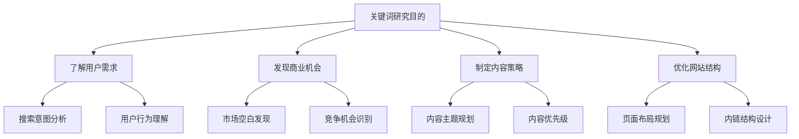
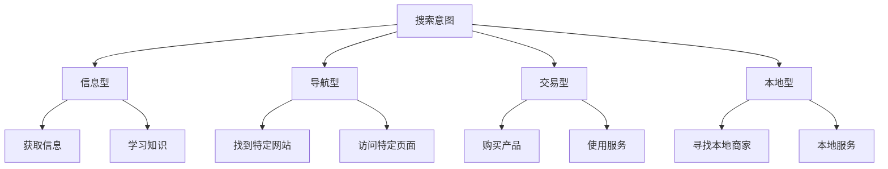
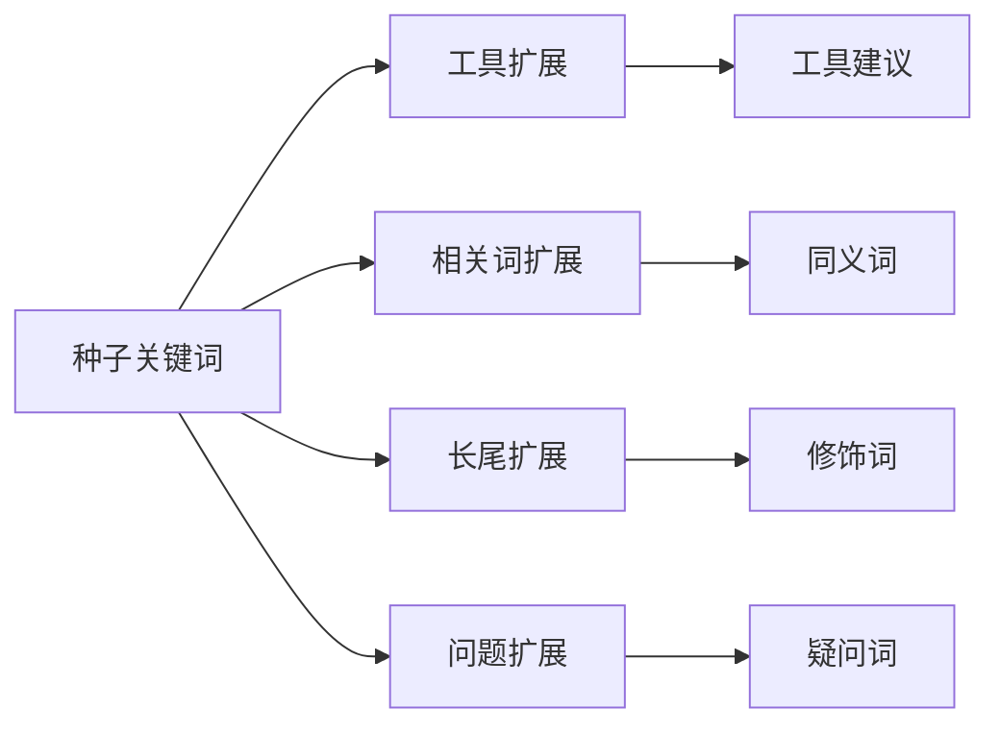
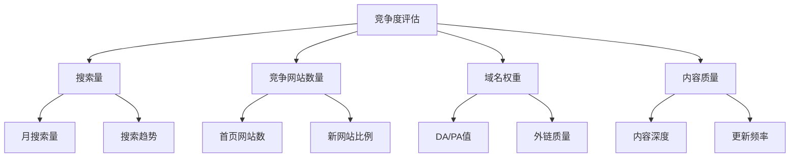
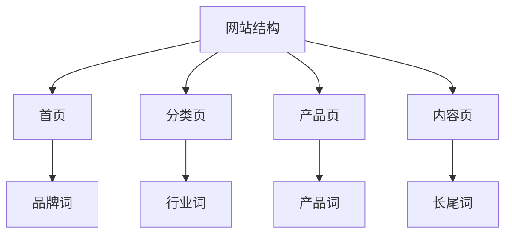

# 关键词研究基础

## 🎯 学习目标
- 掌握关键词研究的基本方法
- 理解不同类型关键词的特点
- 学会关键词竞争度分析
- 建立关键词策略框架

## 🔍 关键词研究概述

### 关键词定义
**关键词**：用户在搜索引擎中输入的搜索词，是连接用户需求与网站内容的桥梁。

### 研究目的

## 📊 关键词分类体系

### 按搜索量分类
| 类型 | 搜索量 | 特征 | 优化难度 |
|------|--------|------|----------|
| 头部关键词 | 高（>10,000/月） | 竞争激烈 | 高 |
| 腰部关键词 | 中（1,000-10,000/月） | 平衡竞争 | 中 |
| 长尾关键词 | 低（<1,000/月） | 竞争较小 | 低 |

### 按搜索意图分类

### 按商业价值分类
| 类型 | 商业价值 | 转化潜力 | 优化策略 |
|------|----------|----------|----------|
| 品牌词 | 高 | 高 | 品牌保护 |
| 产品词 | 高 | 高 | 产品优化 |
| 行业词 | 中 | 中 | 内容建设 |
| 通用词 | 低 | 低 | 流量获取 |

## 🔧 关键词研究工具

### Google工具套件
**Google Keyword Planner**
- 功能：搜索量、竞争度、建议
- 优势：官方数据、免费使用
- 劣势：数据范围有限

**Google Trends**
- 功能：趋势分析、季节性
- 优势：趋势预测、地域分析
- 劣势：相对数据

**Google Search Console**
- 功能：实际搜索数据
- 优势：真实数据、网站特定
- 劣势：历史数据有限

### 第三方工具
| 工具 | 主要功能 | 优势 | 价格 |
|------|----------|------|------|
| SEMrush | 关键词研究、竞争分析 | 功能全面 | 付费 |
| Ahrefs | 关键词难度、外链分析 | 数据准确 | 付费 |
| Ubersuggest | 关键词建议、内容分析 | 性价比高 | 免费+付费 |
| Answer The Public | 问题型关键词 | 独特视角 | 免费 |

## 📈 关键词研究流程

### 第一步：种子关键词收集
**方法**：
1. **头脑风暴**：基于业务和产品
2. **竞争对手分析**：分析竞品关键词
3. **用户调研**：了解用户语言
4. **行业报告**：参考行业数据

**种子关键词示例**：
- 核心业务词
- 产品名称
- 服务类型
- 行业术语

### 第二步：关键词扩展

**扩展方法**：
- **工具建议**：使用关键词工具
- **相关搜索**：Google相关搜索
- **长尾组合**：添加修饰词
- **问题形式**：疑问句关键词

### 第三步：数据收集
**关键指标**：
| 指标 | 说明 | 重要性 |
|------|------|--------|
| 搜索量 | 月搜索次数 | 高 |
| 竞争度 | 优化难度 | 高 |
| CPC | 点击成本 | 中 |
| 趋势 | 搜索趋势 | 中 |

### 第四步：筛选分析
**筛选标准**：
1. **相关性**：与业务高度相关
2. **搜索量**：有足够的搜索量
3. **竞争度**：在可接受范围内
4. **商业价值**：有转化潜力

## 🎯 关键词竞争度分析

### 竞争度评估维度

### 竞争度等级
| 等级 | 特征 | 策略建议 |
|------|------|----------|
| 低竞争 | 搜索量<1000，竞争网站少 | 优先优化 |
| 中竞争 | 搜索量1000-10000，竞争适中 | 逐步优化 |
| 高竞争 | 搜索量>10000，竞争激烈 | 长期规划 |

### 竞争分析方法
1. **SERP分析**：分析搜索结果页
2. **工具评估**：使用SEO工具
3. **内容分析**：评估内容质量
4. **外链分析**：分析外链情况

## 📝 关键词布局策略

### 页面布局原则
**主关键词**：
- 位置：标题、H1、URL
- 密度：2-3%
- 分布：自然分布

**长尾关键词**：
- 位置：H2、H3、正文
- 密度：1-2%
- 分布：相关段落

### 网站结构布局

### 内容布局策略
1. **主题集群**：围绕核心主题
2. **关键词层次**：主词+长尾词
3. **内容深度**：满足用户需求
4. **更新频率**：保持内容新鲜

## 📊 关键词效果监控

### 监控指标
| 指标 | 说明 | 监控频率 |
|------|------|----------|
| 排名位置 | 关键词排名 | 每周 |
| 搜索量 | 实际搜索量 | 每月 |
| 点击率 | CTR表现 | 每周 |
| 转化率 | 商业转化 | 每月 |

### 优化调整
**排名下降**：
- 分析竞争对手
- 检查内容质量
- 优化技术指标

**搜索量变化**：
- 分析趋势原因
- 调整内容策略
- 扩展相关关键词

## 🎯 关键词策略制定

### 短期策略（1-3个月）
- **长尾关键词**：快速获得排名
- **本地关键词**：本地化优化
- **问题型关键词**：问答内容

### 中期策略（3-6个月）
- **腰部关键词**：中等竞争词
- **产品关键词**：产品页优化
- **行业关键词**：内容建设

### 长期策略（6-12个月）
- **头部关键词**：核心业务词
- **品牌关键词**：品牌建设
- **权威关键词**：行业地位

## 📚 学习路径

### 基础掌握
1. [[02-长尾关键词策略]] - 学习长尾词优化
2. [[03-关键词竞争分析]] - 掌握竞争分析
3. [[04-关键词布局策略]] - 学习布局方法

### 深入应用
1. [[01-内容策略规划]] - 基于关键词的内容策略
2. [[01-网站结构优化]] - 关键词导向的网站结构
3. [[01-竞争分析]] - 基于关键词的竞争分析

## 📖 相关链接
- [[02-长尾关键词策略]] - 学习长尾词优化
- [[03-关键词竞争分析]] - 掌握竞争分析方法
- [[04-关键词布局策略]] - 学习关键词布局
- [[05-语义关键词]] - 理解语义相关性
