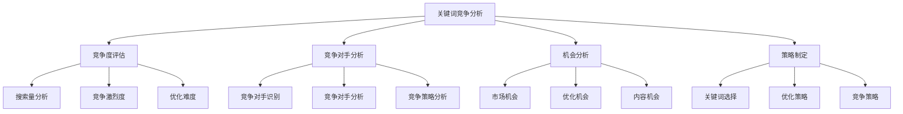
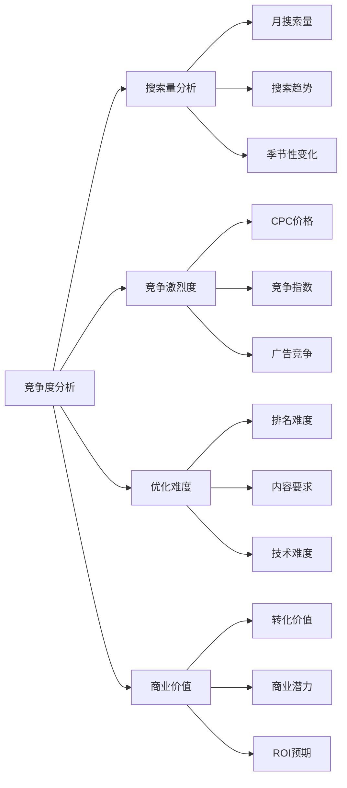
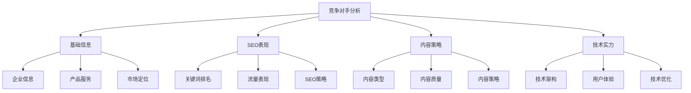
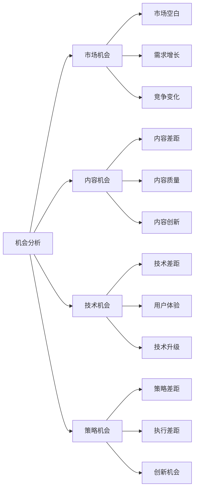
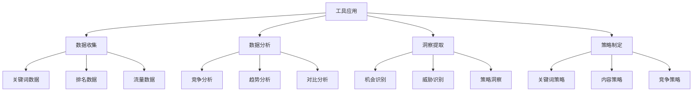
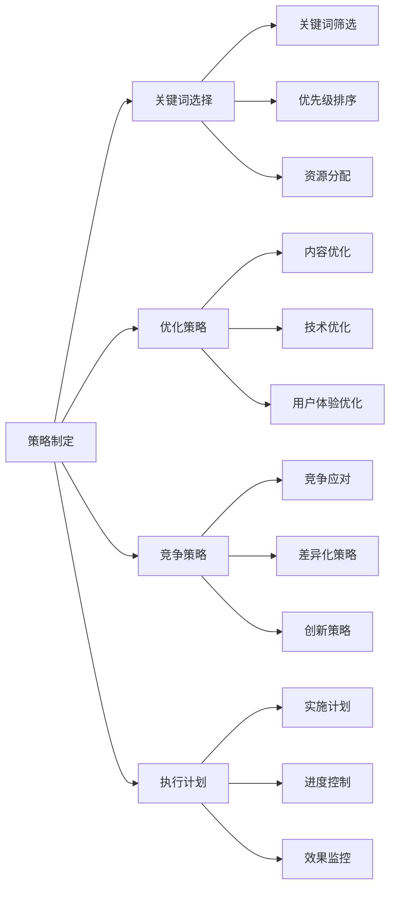
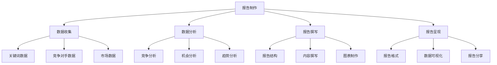
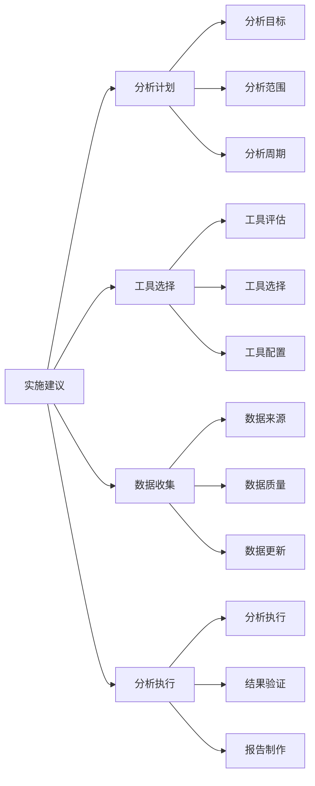

# 关键词竞争分析

## 🎯 学习目标
- 深入理解关键词竞争分析的重要性和方法
- 掌握关键词竞争度评估和竞争对手分析
- 学会基于竞争分析制定关键词策略
- 建立关键词竞争分析认知框架

## 🏆 关键词竞争分析概述

### 核心概念
**关键词竞争分析**：分析关键词的竞争激烈程度、竞争对手情况、优化难度和机会评估

### 竞争分析价值
| 分析价值 | 具体表现 | 应用场景 | 决策支持 |
|----------|----------|----------|----------|
| **策略制定** | 基于竞争情况制定策略 | 关键词选择、优化策略 | 资源分配决策 |
| **风险评估** | 评估优化风险和难度 | 项目规划、预算制定 | 风险控制决策 |
| **机会识别** | 识别市场机会和空白 | 内容策略、市场进入 | 机会把握决策 |
| **竞争应对** | 制定竞争应对策略 | 竞争策略、差异化 | 竞争策略决策 |

## 📊 关键词竞争度评估

### 1. 竞争度指标
| 指标类型 | 具体指标 | 评估方法 | 影响程度 |
|----------|----------|----------|----------|
| **搜索量** | 月搜索量、搜索趋势 | 关键词工具分析 | 高 |
| **竞争激烈度** | CPC、竞争指数 | 广告竞争分析 | 高 |
| **优化难度** | 排名难度、内容要求 | 技术分析 | 中 |
| **商业价值** | 转化价值、商业潜力 | 商业分析 | 高 |

### 2. 竞争度分析

### 3. 竞争度评估方法
- **定量分析**：基于数据的竞争度评估
- **定性分析**：基于经验的竞争度判断
- **对比分析**：与同类关键词对比分析
- **趋势分析**：竞争度变化趋势分析

## 🔍 竞争对手分析

### 1. 竞争对手识别
| 识别维度 | 识别方法 | 分析重点 | 应用价值 |
|----------|----------|----------|----------|
| **直接竞争对手** | 同行业、同产品 | 产品、服务、定位 | 直接竞争分析 |
| **间接竞争对手** | 相关行业、替代品 | 用户需求、解决方案 | 间接竞争分析 |
| **潜在竞争对手** | 新兴企业、跨界企业 | 发展趋势、威胁评估 | 威胁预警分析 |
| **标杆竞争对手** | 行业领先者 | 最佳实践、学习对象 | 学习借鉴分析 |

### 2. 竞争对手分析框架

### 3. 竞争对手分析方法
- **排名分析**：分析竞争对手关键词排名
- **流量分析**：分析竞争对手流量来源
- **内容分析**：分析竞争对手内容策略
- **技术分析**：分析竞争对手技术实现

## 📈 竞争机会分析

### 1. 机会识别
| 机会类型 | 识别方法 | 机会特征 | 利用策略 |
|----------|----------|----------|----------|
| **市场空白** | 关键词分析、内容分析 | 竞争度低、搜索量存在 | 快速进入、抢占先机 |
| **内容差距** | 内容对比分析 | 内容质量低、覆盖不全 | 内容优化、质量提升 |
| **技术差距** | 技术分析、用户体验分析 | 技术落后、体验差 | 技术升级、体验优化 |
| **策略差距** | 策略分析、执行分析 | 策略不当、执行不力 | 策略优化、执行改进 |

### 2. 机会分析

### 3. 机会评估
- **机会大小**：评估机会的规模和潜力
- **机会难度**：评估利用机会的难度
- **机会成本**：评估利用机会的成本
- **机会风险**：评估利用机会的风险

## 🛠️ 竞争分析工具

### 1. 分析工具
| 工具类型 | 工具名称 | 功能特点 | 应用场景 |
|----------|----------|----------|----------|
| **关键词工具** | SEMrush、Ahrefs | 关键词分析、竞争分析 | 关键词竞争分析 |
| **流量分析** | SimilarWeb、Alexa | 网站流量分析 | 竞争对手流量分析 |
| **排名监控** | Rank Tracker、Serpstat | 排名监控、竞争分析 | 排名竞争分析 |
| **内容分析** | BuzzSumo、ContentKing | 内容分析、竞争分析 | 内容竞争分析 |

### 2. 工具应用

### 3. 工具使用技巧
- **多工具结合**：使用多种工具综合分析
- **数据验证**：通过多个数据源验证结果
- **定期更新**：定期更新竞争分析数据
- **深度分析**：深入分析竞争数据和趋势

## 🎯 基于竞争分析的关键词策略

### 1. 关键词选择策略
| 策略类型 | 选择标准 | 实施方法 | 预期效果 |
|----------|----------|----------|----------|
| **蓝海策略** | 竞争度低、搜索量适中 | 选择竞争度低的关键词 | 快速排名、低成本 |
| **红海策略** | 竞争度高、搜索量大 | 选择高价值关键词 | 高流量、高转化 |
| **长尾策略** | 长尾关键词、精准匹配 | 选择长尾关键词 | 精准流量、高转化 |
| **差异化策略** | 差异化关键词、独特定位 | 选择差异化关键词 | 独特优势、竞争壁垒 |

### 2. 策略制定

### 3. 策略实施
- **关键词筛选**：基于竞争分析筛选关键词
- **优先级排序**：基于竞争度和价值排序
- **资源分配**：基于竞争分析分配资源
- **策略执行**：执行基于竞争分析制定的策略

## 📊 竞争分析报告

### 1. 报告结构
| 报告部分 | 内容要点 | 分析深度 | 应用价值 |
|----------|----------|----------|----------|
| **执行摘要** | 关键发现、主要结论 | 高度概括 | 快速了解 |
| **竞争概况** | 竞争环境、竞争格局 | 宏观分析 | 环境理解 |
| **竞争对手分析** | 主要竞争对手、优劣势 | 详细分析 | 竞争策略 |
| **机会分析** | 市场机会、优化机会 | 深度分析 | 机会把握 |
| **策略建议** | 关键词策略、优化建议 | 具体建议 | 策略制定 |

### 2. 报告制作

### 3. 报告应用
- **决策支持**：为关键词策略决策提供支持
- **团队沟通**：与团队分享竞争分析结果
- **客户汇报**：向客户汇报竞争分析结果
- **持续优化**：基于报告结果持续优化策略

## 🎯 竞争分析实践建议

### 1. 分析建议
- **定期分析**：定期进行竞争分析
- **深度分析**：深入分析竞争对手
- **数据驱动**：基于数据进行分析
- **持续监控**：持续监控竞争变化

### 2. 实施建议

### 3. 最佳实践
- **系统性分析**：系统性地进行竞争分析
- **多维度分析**：从多个维度分析竞争情况
- **数据验证**：验证分析结果的准确性
- **策略应用**：将分析结果应用到策略制定

## 📚 学习路径

### 基础理解
1. [[01-关键词研究基础]] - 关键词研究基础
2. [[02-长尾关键词策略]] - 长尾关键词策略
3. [[04-关键词布局策略]] - 关键词布局策略

### 深入应用
1. [[02-理解层-核心机制#2.4-内容SEO]] - 内容SEO
2. [[03-应用层-实践技能#3.3-竞争分析]] - 竞争分析
3. [[04-精通层-高级策略#4.1-企业级SEO策略]] - 企业级策略

### 实战练习
1. [[03-应用层-实践技能#3.1-SEO工具精通]] - 工具应用
2. [[05-实战案例与模板#5.1-成功案例分析]] - 案例分析
3. [[06-工具与资源#6.1-SEO工具大全]] - 工具资源

## 📖 相关链接
- [[01-关键词研究基础]] - 关键词研究基础
- [[02-长尾关键词策略]] - 长尾关键词策略
- [[04-关键词布局策略]] - 关键词布局策略
- [[02-理解层-核心机制#2.4-内容SEO]] - 内容SEO
- [[03-应用层-实践技能]] - 实践技能
- [[04-精通层-高级策略]] - 高级策略
