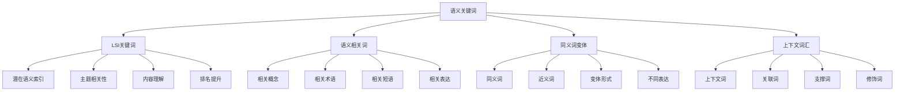
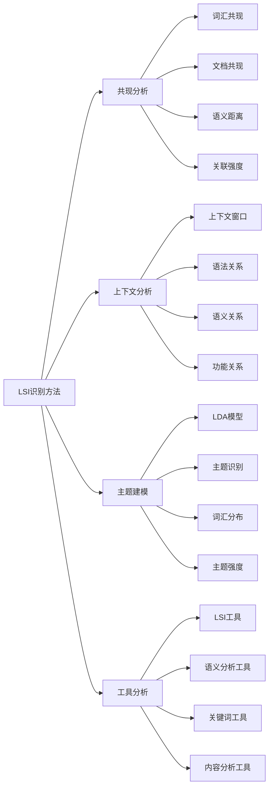
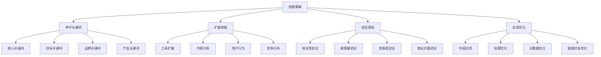
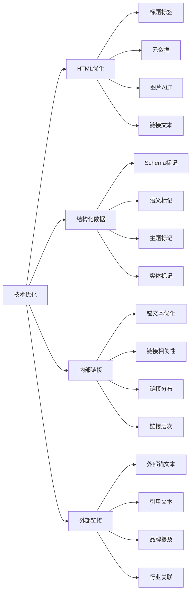
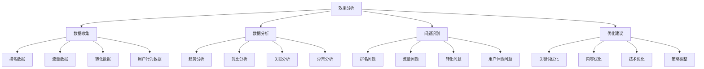
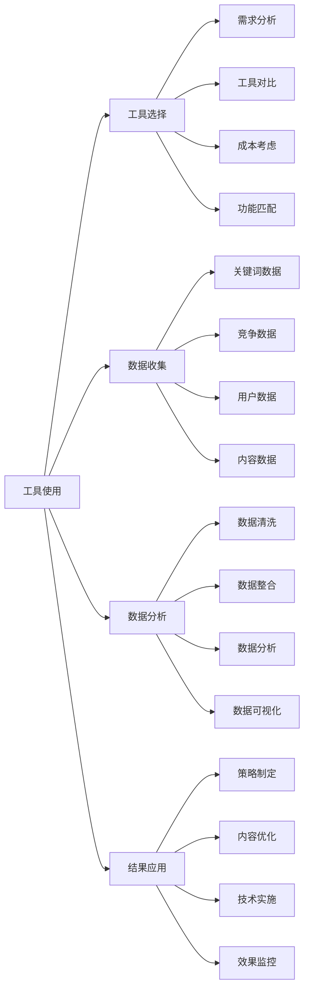
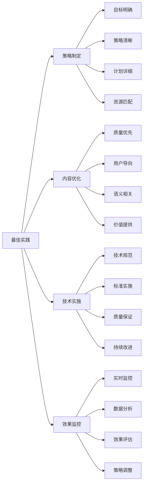

# 语义关键词

## 🎯 学习目标
- 深入理解语义关键词的概念和重要性
- 掌握LSI关键词与语义相关性的分析方法
- 学会语义关键词的挖掘和优化策略
- 建立语义关键词优化认知框架

## 🧠 语义关键词概述

### 核心概念
**语义关键词**：与目标关键词在语义上相关、能够帮助搜索引擎理解内容主题的词汇和短语

### 语义关键词重要性
| 重要性维度 | 具体表现 | 影响程度 | 优化价值 |
|------------|----------|----------|----------|
| **内容理解** | 帮助搜索引擎理解内容主题 | 高 | 内容相关性提升 |
| **排名提升** | 提升关键词排名效果 | 高 | 排名稳定性提升 |
| **用户体验** | 提供更丰富的内容体验 | 中 | 用户满意度提升 |
| **竞争优势** | 在语义搜索中获得优势 | 中 | 竞争优势建立 |

## 🔍 LSI关键词详解

### 1. LSI关键词概念
| 概念维度 | 具体内容 | 技术原理 | SEO效果 |
|----------|----------|----------|---------|
| **潜在语义索引** | 通过数学方法分析词汇关系 | 矩阵分解、降维分析 | 内容主题理解 |
| **语义相关性** | 词汇在语义上的关联程度 | 共现分析、上下文分析 | 内容相关性提升 |
| **主题建模** | 识别文档的主题结构 | 概率主题模型 | 内容分类优化 |
| **词汇聚类** | 将相关词汇进行分组 | 聚类算法、相似度计算 | 关键词组织优化 |

### 2. LSI关键词识别方法

### 3. LSI关键词应用
- **内容优化**：在内容中自然使用LSI关键词
- **关键词扩展**：基于LSI关键词扩展关键词列表
- **内容主题**：确保内容主题的一致性和相关性
- **竞争分析**：分析竞争对手的LSI关键词使用

## 📊 语义关键词挖掘

### 1. 挖掘方法
| 挖掘方法 | 方法描述 | 适用场景 | 效果评估 |
|----------|----------|----------|----------|
| **工具挖掘** | 使用专业工具挖掘 | 大规模关键词研究 | 效率高、覆盖面广 |
| **手动分析** | 人工分析相关内容 | 深度分析、精准挖掘 | 质量高、针对性强 |
| **竞品分析** | 分析竞争对手内容 | 竞争策略制定 | 竞争性强、实用性好 |
| **用户行为** | 分析用户搜索行为 | 用户需求理解 | 用户导向、转化率高 |

### 2. 挖掘策略

### 3. 挖掘工具
- **Google工具**：Google Keyword Planner、Google Trends
- **第三方工具**：SEMrush、Ahrefs、Moz
- **语义分析工具**：LSI Graph、Text Optimizer
- **内容分析工具**：BuzzSumo、ContentKing

## 🎯 语义关键词优化策略

### 1. 内容优化策略
| 优化维度 | 优化方法 | 实施技巧 | 预期效果 |
|----------|----------|----------|----------|
| **自然融入** | 在内容中自然使用语义关键词 | 语义相关、上下文自然 | 内容相关性提升 |
| **密度控制** | 合理控制语义关键词密度 | 1-3%密度、分布均匀 | 避免关键词堆砌 |
| **位置优化** | 在重要位置使用语义关键词 | 标题、开头、结尾 | 关键词权重提升 |
| **变体使用** | 使用不同的语义关键词变体 | 同义词、近义词、变体 | 内容丰富度提升 |

### 2. 技术优化策略

### 3. 用户体验优化
- **内容相关性**：确保内容与用户搜索意图相关
- **信息完整性**：提供完整、准确的信息
- **可读性**：保持内容的可读性和流畅性
- **价值提供**：为用户提供实际价值

## 📈 语义关键词效果分析

### 1. 分析指标
| 指标类型 | 具体指标 | 分析方法 | 优化方向 |
|----------|----------|----------|----------|
| **排名指标** | 目标关键词排名 | 排名监控工具 | 关键词优化 |
| **流量指标** | 相关关键词流量 | 流量分析工具 | 内容优化 |
| **转化指标** | 语义关键词转化率 | 转化跟踪分析 | 用户体验优化 |
| **相关性指标** | 内容相关性评分 | 内容分析工具 | 内容质量提升 |

### 2. 效果分析

### 3. 持续优化
- **定期分析**：定期分析语义关键词效果
- **策略调整**：根据分析结果调整优化策略
- **内容更新**：持续更新和优化内容
- **技术改进**：不断改进技术实现

## 🛠️ 语义关键词工具

### 1. 专业工具
| 工具类型 | 工具名称 | 功能特点 | 应用场景 |
|----------|----------|----------|----------|
| **LSI工具** | LSI Graph | LSI关键词挖掘 | 语义关键词研究 |
| **语义分析** | Text Optimizer | 语义内容分析 | 内容优化 |
| **关键词工具** | SEMrush、Ahrefs | 关键词研究 | 关键词策略 |
| **内容分析** | BuzzSumo | 内容主题分析 | 内容策略 |

### 2. 工具使用策略

### 3. 工具组合使用
- **多工具结合**：结合多个工具的优势
- **数据交叉验证**：使用不同工具验证数据
- **功能互补**：选择功能互补的工具
- **成本效益**：考虑工具的成本效益

## 🎯 语义关键词最佳实践

### 1. 优化原则
| 优化原则 | 具体内容 | 实施要点 | 注意事项 |
|----------|----------|----------|----------|
| **自然性** | 自然使用语义关键词 | 上下文自然、语义相关 | 避免关键词堆砌 |
| **相关性** | 确保关键词相关性 | 主题相关、内容相关 | 避免无关关键词 |
| **平衡性** | 平衡关键词使用 | 主次分明、分布合理 | 避免过度优化 |
| **持续性** | 持续优化关键词 | 定期分析、持续改进 | 避免一劳永逸 |

### 2. 最佳实践

### 3. 实施建议
- **从核心开始**：从核心语义关键词开始优化
- **逐步扩展**：逐步扩展到更多语义关键词
- **质量优先**：优先保证内容质量
- **持续优化**：持续优化和改进

## 📚 学习路径

### 基础理解
1. [[01-关键词研究基础]] - 关键词研究基础
2. [[02-长尾关键词策略]] - 长尾关键词策略
3. [[03-关键词竞争分析]] - 关键词竞争分析
4. [[04-关键词布局策略]] - 关键词布局策略

### 深入应用
1. [[02-理解层-核心机制#2.3-技术SEO]] - 技术SEO
2. [[02-理解层-核心机制#2.4-内容SEO]] - 内容SEO
3. [[03-应用层-实践技能#3.1-SEO工具精通]] - 工具应用

### 实战练习
1. [[03-应用层-实践技能#3.2-网站审计]] - 网站审计
2. [[05-实战案例与模板#5.1-成功案例分析]] - 案例分析
3. [[06-工具与资源#6.1-SEO工具大全]] - 工具资源

## 📖 相关链接
- [[01-关键词研究基础]] - 关键词研究基础
- [[02-长尾关键词策略]] - 长尾关键词策略
- [[03-关键词竞争分析]] - 关键词竞争分析
- [[04-关键词布局策略]] - 关键词布局策略
- [[02-理解层-核心机制#2.3-技术SEO]] - 技术SEO
- [[02-理解层-核心机制#2.4-内容SEO]] - 内容SEO
