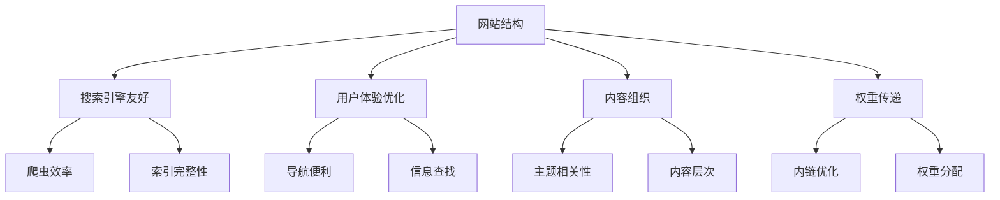
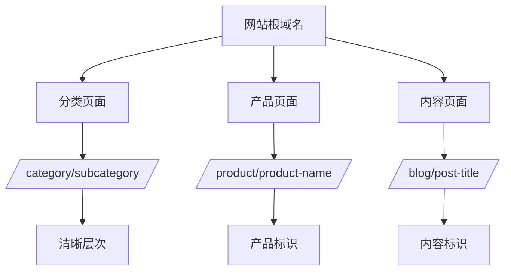
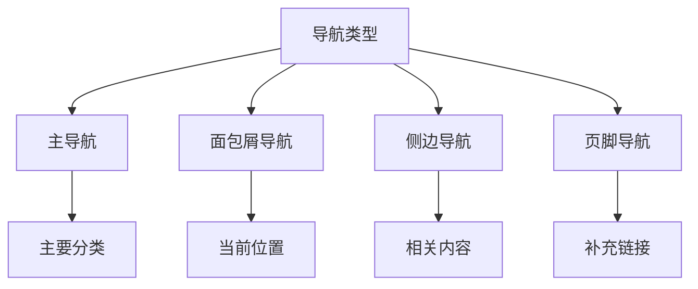
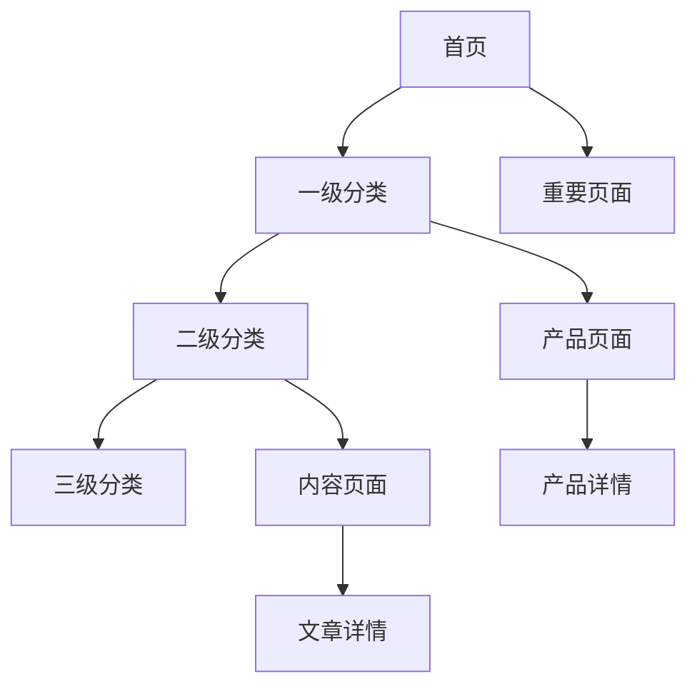
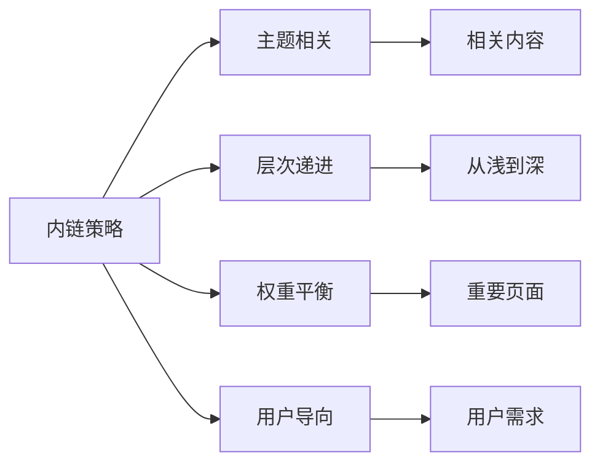

# 网站结构优化

## 🎯 学习目标
- 理解网站结构对SEO的重要性
- 掌握URL结构设计原则
- 学会导航结构优化方法
- 建立技术SEO基础认知

## 🏗️ 网站结构概述

### 结构定义
**网站结构**：网站内容的组织方式，包括页面层次、导航系统、URL结构等，影响搜索引擎爬取和用户访问体验。

### SEO重要性


## 🔗 URL结构优化

### URL设计原则
**简洁性**：
- 避免过长URL
- 使用描述性词汇
- 避免特殊字符

**层次性**：
- 体现内容层次
- 便于理解结构
- 支持扩展

**一致性**：
- 统一命名规范
- 保持格式一致
- 避免重复结构

### URL结构示例


### URL优化技巧
| 要素 | 优化方法 | 示例 |
|------|----------|------|
| 关键词 | 包含目标关键词 | /seo-tools/ |
| 层次 | 体现内容层次 | /blog/seo/technical-seo/ |
| 长度 | 控制在合理范围 | 50-60字符 |
| 特殊字符 | 避免使用 | 使用连字符- |

## 🧭 导航结构优化

### 导航设计原则
**清晰性**：
- 导航标签明确
- 层次结构清晰
- 用户易于理解

**一致性**：
- 全站导航统一
- 位置固定不变
- 样式保持一致

**完整性**：
- 覆盖主要页面
- 重要内容可达
- 避免孤立页面

### 导航类型


### 导航优化策略
1. **关键词优化**：导航标签包含关键词
2. **用户导向**：以用户需求为中心
3. **移动友好**：适配移动设备
4. **加载速度**：优化导航性能

## 📁 网站层次结构

### 层次设计原则
**扁平化**：
- 减少点击深度
- 提高访问效率
- 便于搜索引擎爬取

**逻辑性**：
- 符合用户思维
- 内容分类合理
- 关系清晰明确

**扩展性**：
- 支持内容增长
- 便于结构调整
- 适应业务发展

### 理想层次结构


### 层次优化建议
| 层次 | 建议深度 | 优化重点 |
|------|----------|----------|
| 首页 | 0级 | 核心关键词 |
| 分类页 | 1-2级 | 分类关键词 |
| 产品页 | 2-3级 | 产品关键词 |
| 内容页 | 3-4级 | 长尾关键词 |

## 🔗 内链结构优化

### 内链作用
**权重传递**：
- 传递页面权重
- 提升重要页面
- 平衡权重分配

**用户体验**：
- 引导用户浏览
- 提供相关内容
- 改善访问体验

**爬虫引导**：
- 帮助爬虫发现页面
- 提高爬取效率
- 确保内容索引

### 内链策略


### 内链优化技巧
1. **锚文本优化**：使用描述性锚文本
2. **链接位置**：在相关内容中放置
3. **链接数量**：控制页面内链数量
4. **链接质量**：确保链接页面质量

## 📱 移动端结构优化

### 移动优先设计
**响应式设计**：
- 适配不同屏幕
- 保持内容一致
- 优化加载速度

**触摸友好**：
- 按钮大小合适
- 间距充足
- 操作便捷

**性能优化**：
- 减少加载时间
- 优化图片大小
- 压缩资源文件

### 移动端结构特点
| 特点 | 桌面端 | 移动端 |
|------|--------|--------|
| 导航 | 水平导航 | 汉堡菜单 |
| 布局 | 多栏布局 | 单栏布局 |
| 交互 | 鼠标悬停 | 触摸操作 |
| 内容 | 完整展示 | 精简展示 |

## 🎯 技术实现

### HTML结构优化
**语义化标签**：
```html
<header>网站头部</header>
<nav>导航菜单</nav>
<main>主要内容</main>
<aside>侧边栏</aside>
<footer>网站底部</footer>
```

**标题层次**：
```html
<h1>页面主标题</h1>
<h2>主要章节</h2>
<h3>子章节</h3>
<h4>详细内容</h4>
```

### CSS优化
**布局优化**：
- 使用Flexbox/Grid
- 避免表格布局
- 优化CSS加载

**性能优化**：
- 压缩CSS文件
- 使用CSS预处理器
- 避免内联样式

### JavaScript优化
**渐进增强**：
- 基础功能可用
- JavaScript增强
- 优雅降级

**性能考虑**：
- 延迟加载
- 异步加载
- 代码压缩

## 📊 结构评估指标

### 技术指标
| 指标 | 评估标准 | 优化目标 |
|------|----------|----------|
| 页面深度 | ≤4级 | 减少点击深度 |
| URL长度 | ≤60字符 | 保持简洁 |
| 内链密度 | 2-5个/页 | 合理分布 |
| 孤立页面 | ≤5% | 减少孤立页面 |

### 用户体验指标
| 指标 | 评估标准 | 优化目标 |
|------|----------|----------|
| 导航清晰度 | 用户测试 | 易于理解 |
| 查找效率 | 任务完成时间 | 快速找到 |
| 移动友好 | 响应式测试 | 完美适配 |
| 加载速度 | Core Web Vitals | 快速加载 |

## 🔧 优化工具

### 分析工具
**Google Search Console**：
- 网站结构分析
- 爬取错误检测
- 索引状态监控

**Google Analytics**：
- 用户行为分析
- 页面访问统计
- 转化路径分析

**第三方工具**：
- Screaming Frog：网站结构分析
- Sitebulb：技术SEO审计
- DeepCrawl：大规模网站分析

### 优化建议
1. **定期审计**：每月检查网站结构
2. **用户测试**：进行可用性测试
3. **数据分析**：分析用户行为数据
4. **持续优化**：根据数据调整结构

## 📚 学习路径

### 基础掌握
1. [[02-页面速度优化]] - 学习性能优化
2. [[03-移动端适配]] - 掌握移动优化
3. [[04-结构化数据]] - 学习数据标记

### 深入应用
1. [[01-SEO审计清单]] - 学习网站审计
2. [[01-技术问题诊断]] - 掌握问题诊断
3. [[01-用户体验指标]] - 学习体验优化

## 📖 相关链接
- [[02-页面速度优化]] - 学习性能优化
- [[03-移动端适配]] - 掌握移动端优化
- [[04-结构化数据]] - 学习结构化标记
- [[05-网站安全]] - 了解安全优化
