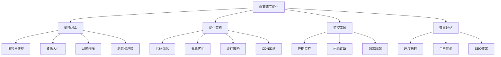
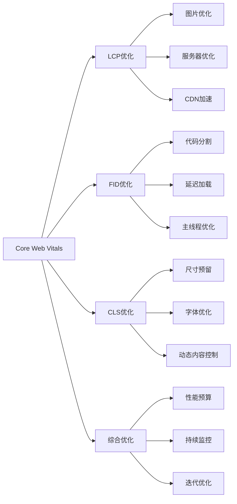
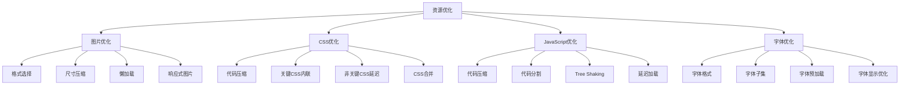
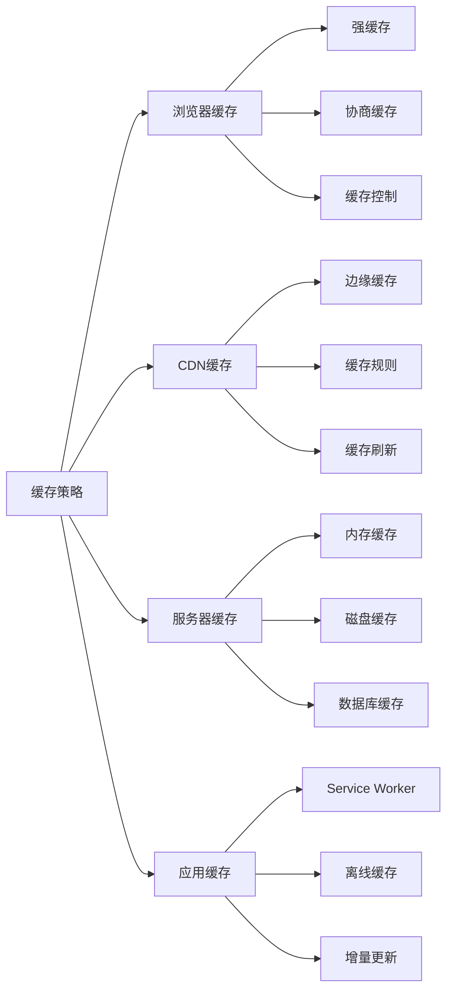
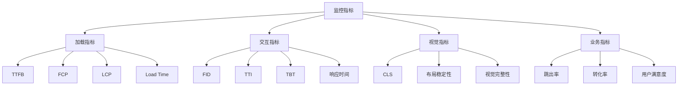
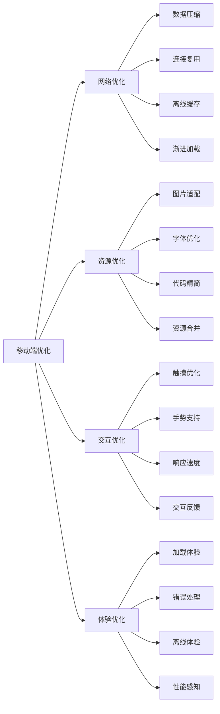
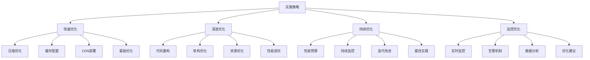

# 页面速度优化

## 🎯 学习目标
- 深入理解页面速度对SEO和用户体验的重要性
- 掌握页面速度优化的核心技术和策略
- 学会使用工具分析和优化页面性能
- 建立页面速度优化认知框架

## ⚡ 页面速度优化概述

### 核心概念
**页面速度优化**：通过技术手段提升网页加载速度，改善用户体验和搜索引擎排名

### 页面速度重要性
| 重要性维度 | 具体表现 | 影响程度 | 优化价值 |
|------------|----------|----------|----------|
| **SEO排名** | 搜索引擎排名因素 | 高 | 排名提升 |
| **用户体验** | 用户满意度和留存 | 高 | 用户体验改善 |
| **转化率** | 页面转化率影响 | 高 | 转化率提升 |
| **跳出率** | 用户跳出率控制 | 中 | 用户粘性提升 |

## 📊 Core Web Vitals详解

### 1. LCP (Largest Contentful Paint)
| 指标说明 | 测量内容 | 优化目标 | 影响因素 |
|----------|----------|----------|----------|
| **最大内容绘制** | 页面最大内容元素渲染时间 | <2.5秒 | 图片、视频、文本块 |
| **测量方法** | 从页面开始加载到最大内容元素渲染完成 | 优秀：<2.5s | 服务器响应、资源加载 |
| **优化重点** | 优化最大内容元素加载速度 | 良好：2.5-4.0s | 网络传输、资源大小 |

### 2. FID (First Input Delay)
| 指标说明 | 测量内容 | 优化目标 | 影响因素 |
|----------|----------|----------|----------|
| **首次输入延迟** | 用户首次交互到浏览器响应时间 | <100毫秒 | JavaScript执行、主线程阻塞 |
| **测量方法** | 从用户首次交互到浏览器开始处理 | 优秀：<100ms | 长任务、第三方脚本 |
| **优化重点** | 减少主线程阻塞时间 | 良好：100-300ms | 代码分割、延迟加载 |

### 3. CLS (Cumulative Layout Shift)
| 指标说明 | 测量内容 | 优化目标 | 影响因素 |
|----------|----------|----------|----------|
| **累积布局偏移** | 页面布局意外偏移程度 | <0.1 | 图片、字体、广告加载 |
| **测量方法** | 计算所有意外布局偏移的累积分数 | 优秀：<0.1 | 动态内容、异步加载 |
| **优化重点** | 防止布局意外偏移 | 良好：0.1-0.25 | 尺寸预留、字体优化 |

### 4. Core Web Vitals优化策略

## 🛠️ 页面速度优化技术

### 1. 服务器端优化
| 优化技术 | 技术原理 | 实施方法 | 效果预期 |
|----------|----------|----------|----------|
| **HTTP/2** | 多路复用、头部压缩 | 服务器配置升级 | 传输效率提升30-50% |
| **Gzip压缩** | 文本资源压缩 | 服务器压缩配置 | 文件大小减少60-80% |
| **Brotli压缩** | 更高效的压缩算法 | 服务器压缩配置 | 比Gzip提升15-25% |
| **服务器缓存** | 静态资源缓存 | 缓存策略配置 | 重复访问速度提升90% |

### 2. 资源优化

### 3. 代码优化技术
| 优化类型 | 优化方法 | 技术实现 | 性能提升 |
|----------|----------|----------|----------|
| **HTML优化** | 语义化标签、减少嵌套 | 代码重构、结构优化 | 解析速度提升20-30% |
| **CSS优化** | 关键路径优化、选择器优化 | 内联关键CSS、延迟非关键CSS | 渲染速度提升40-60% |
| **JavaScript优化** | 代码分割、懒加载 | Webpack、动态导入 | 交互响应提升50-70% |
| **图片优化** | WebP格式、懒加载 | 格式转换、Intersection Observer | 加载速度提升60-80% |

## 🚀 高级优化策略

### 1. 预加载策略
| 预加载类型 | 使用场景 | 实施方法 | 效果评估 |
|------------|----------|----------|----------|
| **DNS预解析** | 外部域名访问 | `<link rel="dns-prefetch">` | DNS查询时间减少 |
| **预连接** | 重要第三方资源 | `<link rel="preconnect">` | 连接建立时间减少 |
| **预加载** | 关键资源 | `<link rel="preload">` | 关键资源优先加载 |
| **预获取** | 可能需要的资源 | `<link rel="prefetch">` | 后续页面加载加速 |

### 2. 缓存策略

### 3. CDN优化
| CDN功能 | 优化效果 | 实施要点 | 成本考虑 |
|---------|----------|----------|----------|
| **全球分发** | 就近访问、延迟降低 | 节点分布、路由优化 | 节点成本、带宽成本 |
| **智能缓存** | 静态资源加速 | 缓存策略、失效机制 | 存储成本、更新成本 |
| **压缩传输** | 传输效率提升 | 压缩算法、传输优化 | 计算成本、带宽节省 |
| **安全防护** | DDoS防护、SSL加速 | 安全策略、证书管理 | 安全成本、性能提升 |

## 📈 性能监控与分析

### 1. 监控工具
| 工具类型 | 工具名称 | 功能特点 | 应用场景 |
|----------|----------|----------|----------|
| **实时监控** | Google PageSpeed Insights | Core Web Vitals、优化建议 | 页面性能分析 |
| **持续监控** | WebPageTest | 详细性能分析、视频录制 | 深度性能诊断 |
| **用户体验** | Google Analytics | 真实用户数据、性能指标 | 用户体验分析 |
| **开发工具** | Chrome DevTools | 本地调试、性能分析 | 开发阶段优化 |

### 2. 监控指标

### 3. 性能预算
| 预算类型 | 预算标准 | 监控方法 | 应对策略 |
|----------|----------|----------|----------|
| **文件大小** | JS<200KB, CSS<100KB | 构建时检查 | 代码分割、压缩优化 |
| **加载时间** | LCP<2.5s, FID<100ms | 持续监控 | 性能优化、资源优化 |
| **请求数量** | 总请求<50个 | 网络分析 | 资源合并、缓存优化 |
| **Core Web Vitals** | 全部指标达标 | 实时监控 | 针对性优化 |

## 🎯 移动端速度优化

### 1. 移动端特点
| 特点维度 | 具体表现 | 优化挑战 | 解决方案 |
|----------|----------|----------|----------|
| **网络环境** | 网络不稳定、带宽有限 | 加载失败、速度慢 | 离线缓存、渐进加载 |
| **设备性能** | CPU、内存、存储限制 | 渲染慢、卡顿 | 代码优化、资源压缩 |
| **电池续航** | 电量消耗敏感 | 性能与续航平衡 | 智能加载、节能优化 |
| **屏幕尺寸** | 小屏幕、触摸操作 | 布局适配、交互优化 | 响应式设计、触摸优化 |

### 2. 移动端优化策略

### 3. AMP优化
| AMP特性 | 优化效果 | 实施方法 | 适用场景 |
|---------|----------|----------|----------|
| **HTML限制** | 减少解析时间 | 使用AMP HTML | 内容页面、新闻页面 |
| **CSS限制** | 减少渲染阻塞 | 内联CSS、尺寸限制 | 静态内容页面 |
| **JavaScript限制** | 减少执行时间 | 异步加载、功能限制 | 展示型页面 |
| **缓存加速** | 全球CDN加速 | AMP Cache | 高频访问页面 |

## 🔧 优化实施流程

### 1. 优化流程
| 流程阶段 | 主要任务 | 实施方法 | 预期效果 |
|----------|----------|----------|----------|
| **现状分析** | 性能基线测量 | 工具分析、数据收集 | 问题识别、优化方向 |
| **问题诊断** | 性能瓶颈分析 | 深度分析、根因识别 | 优化重点、策略制定 |
| **优化实施** | 技术优化实施 | 代码优化、配置调整 | 性能提升、指标改善 |
| **效果验证** | 优化效果验证 | 对比测试、持续监控 | 效果确认、持续改进 |

### 2. 实施策略

### 3. 团队协作
- **开发团队**：代码优化、架构改进
- **运维团队**：服务器优化、CDN配置
- **设计团队**：资源优化、用户体验
- **测试团队**：性能测试、效果验证

## 📚 学习路径

### 基础理解
1. [[01-网站结构优化]] - 网站结构优化
2. [[03-移动端适配]] - 移动端适配
3. [[04-结构化数据]] - 结构化数据

### 深入应用
1. [[02-理解层-核心机制#2.1-Google算法深度解析]] - 算法理解
2. [[03-应用层-实践技能#3.1-SEO工具精通]] - 工具应用
3. [[04-精通层-高级策略#4.5-SEO自动化与AI]] - 自动化优化

### 实战练习
1. [[03-应用层-实践技能#3.2-网站审计]] - 网站审计
2. [[05-实战案例与模板#5.1-成功案例分析]] - 案例分析
3. [[06-工具与资源#6.1-SEO工具大全]] - 工具资源

## 📖 相关链接
- [[01-网站结构优化]] - 网站结构优化
- [[03-移动端适配]] - 移动端适配
- [[04-结构化数据]] - 结构化数据
- [[02-理解层-核心机制#2.1-Google算法深度解析]] - 算法理解
- [[03-应用层-实践技能]] - 实践技能
- [[04-精通层-高级策略]] - 高级策略
