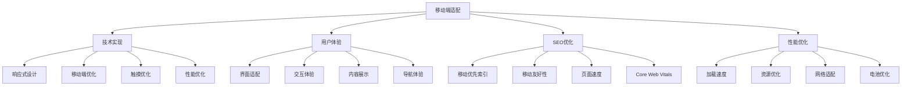
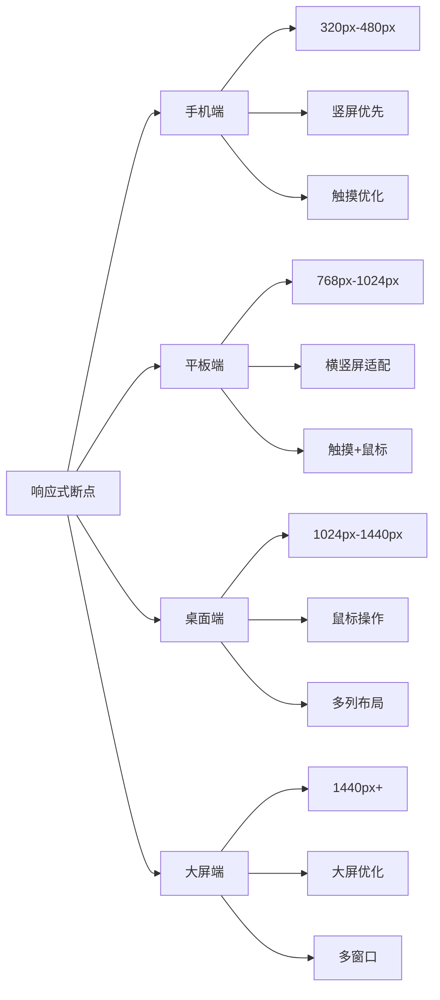
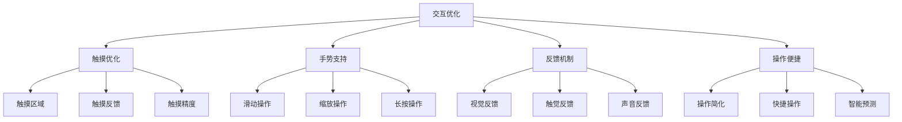
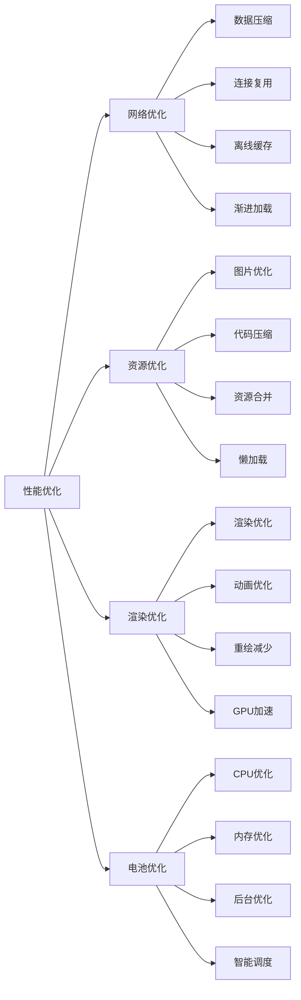
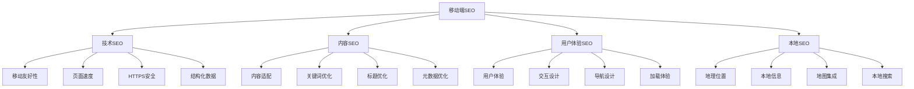
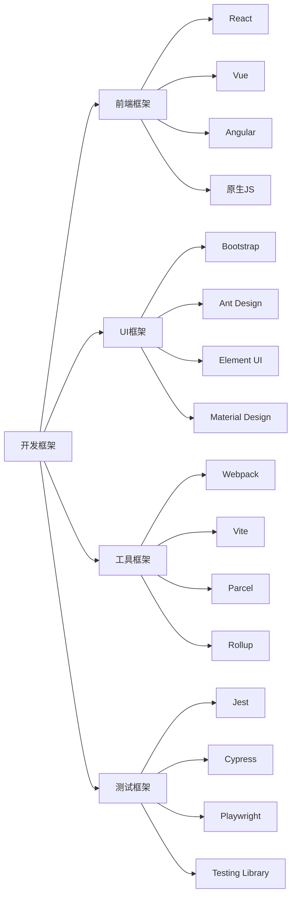
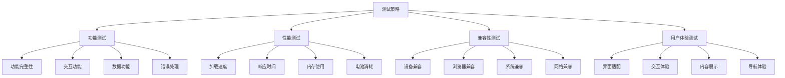
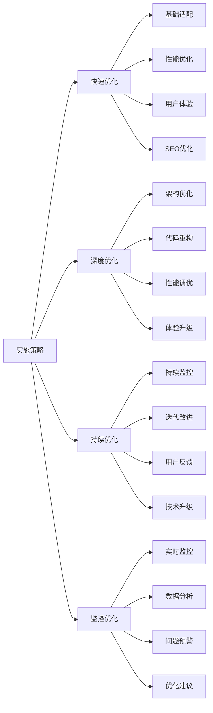

# 移动端适配

## 🎯 学习目标
- 深入理解移动端适配对SEO的重要性
- 掌握响应式设计和移动友好的实现方法
- 学会移动端用户体验优化策略
- 建立移动端SEO优化认知框架

## 📱 移动端适配概述

### 核心概念
**移动端适配**：确保网站在移动设备上提供良好的用户体验和搜索引擎优化效果

### 移动端重要性
| 重要性维度 | 具体表现 | 影响程度 | 优化价值 |
|------------|----------|----------|----------|
| **用户占比** | 移动端用户超过60% | 极高 | 用户覆盖扩大 |
| **搜索行为** | 移动搜索占比持续增长 | 高 | 搜索流量获取 |
| **Google算法** | 移动优先索引 | 高 | 排名影响 |
| **用户体验** | 移动端用户体验要求 | 高 | 用户满意度提升 |

## 🔄 响应式设计

### 1. 响应式设计原理
| 设计要素 | 技术实现 | 适配效果 | 优化重点 |
|----------|----------|----------|----------|
| **弹性布局** | CSS Grid、Flexbox | 自适应布局 | 布局灵活性 |
| **媒体查询** | @media queries | 断点适配 | 设备适配 |
| **弹性图片** | max-width: 100% | 图片自适应 | 图片优化 |
| **弹性字体** | rem、em单位 | 字体缩放 | 可读性优化 |

### 2. 响应式断点

### 3. 响应式实现
- **移动优先**：从移动端开始设计
- **渐进增强**：逐步增强桌面端功能
- **断点设计**：合理设置响应式断点
- **内容优先**：确保内容在所有设备上可读

## 📱 移动端优化策略

### 1. 界面优化
| 优化维度 | 优化内容 | 实施方法 | 效果评估 |
|----------|----------|----------|----------|
| **触摸目标** | 按钮、链接大小 | 最小44px触摸区域 | 触摸准确率提升 |
| **导航设计** | 移动端导航 | 汉堡菜单、底部导航 | 导航效率提升 |
| **内容布局** | 单列布局、垂直滚动 | 简化布局、优化间距 | 阅读体验改善 |
| **字体优化** | 字体大小、行高 | 16px+字体、1.5行高 | 可读性提升 |

### 2. 交互优化

### 3. 内容优化
- **内容精简**：移动端内容更加精简
- **重点突出**：突出核心内容和功能
- **快速加载**：优化移动端加载速度
- **离线支持**：提供离线浏览功能

## ⚡ 移动端性能优化

### 1. 性能特点
| 性能维度 | 移动端特点 | 优化挑战 | 解决方案 |
|----------|------------|----------|----------|
| **网络环境** | 不稳定、带宽有限 | 加载失败、速度慢 | 数据压缩、离线缓存 |
| **设备性能** | CPU、内存限制 | 渲染慢、卡顿 | 代码优化、资源压缩 |
| **电池续航** | 电量消耗敏感 | 性能与续航平衡 | 智能加载、节能优化 |
| **存储空间** | 存储空间有限 | 缓存管理、存储优化 | 智能缓存、存储清理 |

### 2. 性能优化策略

### 3. 移动端Core Web Vitals
| 指标 | 移动端标准 | 优化重点 | 实施方法 |
|------|------------|----------|----------|
| **LCP** | <2.5秒 | 关键资源优化 | 图片优化、CDN加速 |
| **FID** | <100毫秒 | 交互响应优化 | 代码分割、延迟加载 |
| **CLS** | <0.1 | 布局稳定性 | 尺寸预留、字体优化 |

## 🔍 移动端SEO优化

### 1. 移动优先索引
| 优化要素 | 具体要求 | 实施方法 | SEO效果 |
|----------|----------|----------|----------|
| **移动友好性** | 通过移动友好性测试 | 响应式设计、触摸优化 | 排名提升 |
| **页面速度** | 移动端加载速度优化 | 性能优化、资源压缩 | 用户体验改善 |
| **内容一致性** | 移动端与桌面端内容一致 | 统一内容、URL结构 | 避免重复内容 |
| **结构化数据** | 移动端结构化数据支持 | Schema标记、移动适配 | 富媒体展示 |

### 2. 移动端SEO策略

### 3. 移动端关键词策略
- **语音搜索**：优化语音搜索关键词
- **本地搜索**：优化本地搜索关键词
- **长尾关键词**：移动端长尾词优化
- **问题型关键词**：优化问题型搜索

## 🛠️ 移动端开发技术

### 1. 技术选择
| 技术方案 | 技术特点 | 适用场景 | 优缺点 |
|----------|----------|----------|--------|
| **响应式设计** | 一套代码适配多端 | 内容型网站 | 优点：维护简单；缺点：性能一般 |
| **移动端专用** | 独立移动端版本 | 功能型应用 | 优点：性能好；缺点：维护复杂 |
| **混合开发** | 原生+Web混合 | 复杂应用 | 优点：功能丰富；缺点：开发复杂 |
| **PWA** | 渐进式Web应用 | 应用型网站 | 优点：体验好；缺点：兼容性 |

### 2. 开发框架

### 3. 开发最佳实践
- **移动优先**：从移动端开始设计
- **性能优先**：优先考虑性能优化
- **用户体验**：注重用户体验设计
- **测试驱动**：移动端测试驱动开发

## 📊 移动端测试与监控

### 1. 测试工具
| 工具类型 | 工具名称 | 功能特点 | 应用场景 |
|----------|----------|----------|----------|
| **设备测试** | Chrome DevTools | 设备模拟、性能分析 | 开发阶段测试 |
| **真实设备** | BrowserStack | 真实设备测试 | 兼容性测试 |
| **性能测试** | Lighthouse | 性能分析、优化建议 | 性能优化 |
| **用户体验** | Google Analytics | 用户行为分析 | 用户体验分析 |

### 2. 测试策略

### 3. 监控指标
- **性能指标**：加载速度、响应时间
- **用户体验指标**：跳出率、停留时间
- **技术指标**：错误率、兼容性
- **业务指标**：转化率、用户满意度

## 🎯 移动端优化实施

### 1. 实施流程
| 实施阶段 | 主要任务 | 实施方法 | 预期效果 |
|----------|----------|----------|----------|
| **现状分析** | 移动端现状评估 | 工具分析、用户调研 | 问题识别、优化方向 |
| **策略制定** | 移动端优化策略 | 技术选型、方案设计 | 优化方案、实施计划 |
| **开发实施** | 移动端开发实施 | 代码开发、测试验证 | 功能实现、性能提升 |
| **上线监控** | 上线后监控优化 | 数据监控、持续优化 | 效果确认、持续改进 |

### 2. 实施策略

### 3. 团队协作
- **产品团队**：需求分析、用户体验
- **设计团队**：界面设计、交互设计
- **开发团队**：技术实现、性能优化
- **测试团队**：质量保证、兼容性测试

## 📚 学习路径

### 基础理解
1. [[01-网站结构优化]] - 网站结构优化
2. [[02-页面速度优化]] - 页面速度优化
3. [[04-结构化数据]] - 结构化数据

### 深入应用
1. [[02-理解层-核心机制#2.1-Google算法深度解析]] - 算法理解
2. [[03-应用层-实践技能#3.1-SEO工具精通]] - 工具应用
3. [[04-精通层-高级策略#4.3-本地SEO]] - 本地SEO

### 实战练习
1. [[03-应用层-实践技能#3.2-网站审计]] - 网站审计
2. [[05-实战案例与模板#5.1-成功案例分析]] - 案例分析
3. [[06-工具与资源#6.1-SEO工具大全]] - 工具资源

## 📖 相关链接
- [[01-网站结构优化]] - 网站结构优化
- [[02-页面速度优化]] - 页面速度优化
- [[04-结构化数据]] - 结构化数据
- [[02-理解层-核心机制#2.1-Google算法深度解析]] - 算法理解
- [[03-应用层-实践技能]] - 实践技能
- [[04-精通层-高级策略]] - 高级策略
