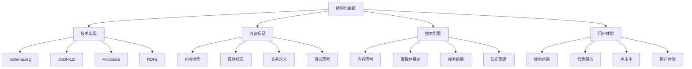
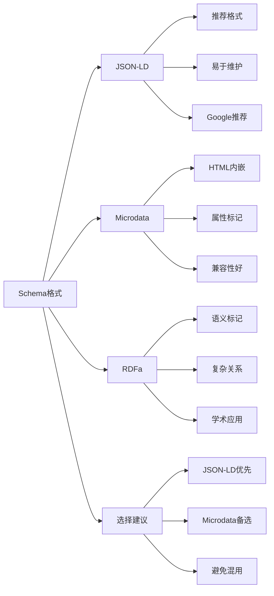
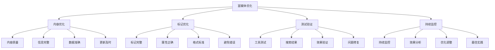
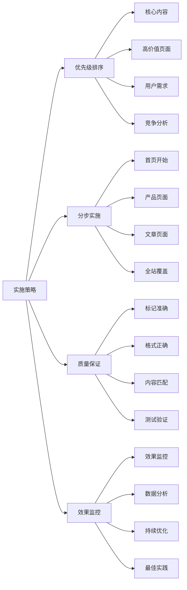
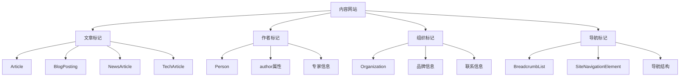
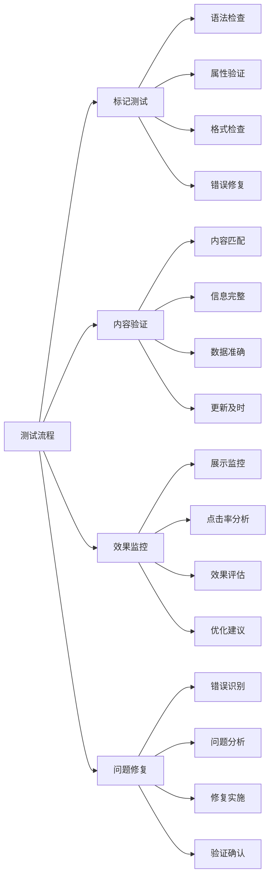
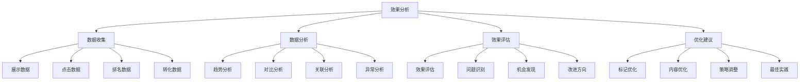
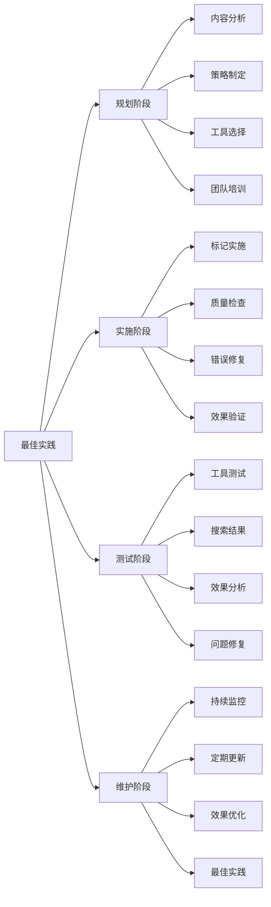

# 结构化数据

## 🎯 学习目标
- 深入理解结构化数据对SEO的重要性和作用
- 掌握Schema标记和富媒体搜索的实现方法
- 学会不同类型结构化数据的应用策略
- 建立结构化数据优化认知框架

## 📊 结构化数据概述

### 核心概念
**结构化数据**：使用标准化格式标记网页内容，帮助搜索引擎更好地理解和展示网页信息



### 结构化数据重要性
| 重要性维度 | 具体表现 | 影响程度 | 优化价值 |
|------------|----------|----------|----------|
| **搜索展示** | 富媒体搜索结果 | 高 | 点击率提升 |
| **内容理解** | 搜索引擎内容理解 | 高 | 排名提升 |
| **知识图谱** | 知识图谱构建 | 中 | 权威性建立 |
| **用户体验** | 搜索结果体验改善 | 高 | 用户满意度 |

## 🏷️ Schema标记详解

### 1. Schema.org标准
| Schema类型 | 适用内容 | 标记属性 | SEO效果 |
|------------|----------|----------|---------|
| **Article** | 文章、博客 | headline、author、datePublished | 文章富媒体 |
| **Product** | 产品信息 | name、price、description | 产品富媒体 |
| **Organization** | 企业信息 | name、logo、contactPoint | 企业信息展示 |
| **LocalBusiness** | 本地商家 | address、phone、openingHours | 本地搜索优化 |
| **Event** | 事件信息 | name、startDate、location | 事件富媒体 |
| **Recipe** | 食谱内容 | name、ingredients、instructions | 食谱富媒体 |

### 2. Schema标记格式


### 3. JSON-LD实现示例
```json
{
  "@context": "https://schema.org",
  "@type": "Article",
  "headline": "SEO优化最佳实践",
  "author": {
    "@type": "Person",
    "name": "SEO专家"
  },
  "datePublished": "2024-01-01",
  "dateModified": "2024-01-01",
  "description": "详细介绍SEO优化的最佳实践方法",
  "image": "https://example.com/seo-image.jpg",
  "publisher": {
    "@type": "Organization",
    "name": "SEO学习网站",
    "logo": {
      "@type": "ImageObject",
      "url": "https://example.com/logo.jpg"
    }
  }
}
```

## 🎨 富媒体搜索结果

### 1. 富媒体类型
| 富媒体类型 | 展示效果 | 实现方法 | 点击率提升 |
|------------|----------|----------|------------|
| **Rich Snippets** | 星级评分、价格、图片 | Schema标记 | 20-30% |
| **Knowledge Panel** | 知识面板、企业信息 | Organization标记 | 15-25% |
| **Featured Snippets** | 精选摘要、问答 | FAQ、HowTo标记 | 30-40% |
| **Carousel** | 轮播展示、产品列表 | ItemList标记 | 25-35% |
| **Breadcrumbs** | 面包屑导航 | BreadcrumbList标记 | 10-15% |

### 2. 富媒体优化策略


### 3. 富媒体效果评估
- **点击率提升**：富媒体搜索结果的点击率
- **展示频率**：富媒体展示的频率
- **用户行为**：用户对富媒体的交互行为
- **转化效果**：富媒体带来的转化效果

## 🛠️ 结构化数据实施

### 1. 实施流程
| 实施阶段 | 主要任务 | 实施方法 | 预期效果 |
|----------|----------|----------|----------|
| **内容分析** | 分析网站内容类型 | 内容审计、分类整理 | 内容类型识别 |
| **Schema选择** | 选择合适的Schema类型 | Schema.org参考、最佳实践 | 标记方案确定 |
| **标记实施** | 实施结构化数据标记 | JSON-LD、工具辅助 | 标记完成 |
| **测试验证** | 测试标记正确性 | Google工具、搜索结果 | 标记验证 |

### 2. 实施策略


### 3. 实施工具
- **Google结构化数据测试工具**：测试标记正确性
- **Google Search Console**：监控富媒体展示
- **Schema.org验证器**：验证Schema标记
- **第三方工具**：辅助标记生成和验证

## 📈 不同类型内容标记

### 1. 电商网站标记
| 标记类型 | 适用页面 | 关键属性 | SEO效果 |
|----------|----------|----------|---------|
| **Product** | 产品页面 | name、price、availability | 产品富媒体 |
| **Offer** | 价格信息 | price、priceCurrency、validFrom | 价格展示 |
| **Review** | 用户评价 | ratingValue、reviewCount | 评分展示 |
| **BreadcrumbList** | 导航路径 | itemListElement | 面包屑导航 |

### 2. 内容网站标记


### 3. 本地商家标记
| 标记类型 | 适用场景 | 关键属性 | 本地SEO效果 |
|----------|----------|----------|-------------|
| **LocalBusiness** | 本地商家 | address、phone、openingHours | 本地搜索优化 |
| **Restaurant** | 餐厅 | servesCuisine、priceRange | 餐厅富媒体 |
| **Store** | 商店 | openingHours、paymentAccepted | 商店信息展示 |
| **Service** | 服务商 | serviceArea、hasOfferCatalog | 服务范围展示 |

## 🔍 结构化数据测试与验证

### 1. 测试工具
| 工具类型 | 工具名称 | 功能特点 | 应用场景 |
|----------|----------|----------|----------|
| **Google工具** | Rich Results Test | 富媒体测试、预览 | 标记验证 |
| **Google工具** | Search Console | 富媒体监控、错误报告 | 效果监控 |
| **第三方工具** | Schema Markup Validator | Schema验证、错误检查 | 标记验证 |
| **开发工具** | 浏览器开发者工具 | 代码检查、调试 | 开发调试 |

### 2. 测试流程


### 3. 常见错误与修复
| 错误类型 | 错误表现 | 修复方法 | 预防措施 |
|----------|----------|----------|----------|
| **语法错误** | JSON格式错误 | 语法检查、格式修正 | 工具验证 |
| **属性错误** | 属性值不匹配 | 内容检查、属性修正 | 内容审核 |
| **重复标记** | 同一内容重复标记 | 标记清理、避免重复 | 标记规划 |
| **缺失属性** | 必需属性缺失 | 属性补充、信息完善 | 检查清单 |

## 📊 结构化数据效果分析

### 1. 效果指标
| 指标类型 | 具体指标 | 分析方法 | 优化方向 |
|----------|----------|----------|----------|
| **展示指标** | 富媒体展示次数 | Search Console分析 | 标记覆盖率 |
| **点击指标** | 富媒体点击率 | 点击率对比分析 | 内容优化 |
| **排名指标** | 关键词排名变化 | 排名监控分析 | 标记优化 |
| **转化指标** | 转化率变化 | 转化跟踪分析 | 用户体验优化 |

### 2. 效果分析


### 3. ROI分析
- **实施成本**：结构化数据实施成本
- **维护成本**：结构化数据维护成本
- **收益分析**：结构化数据带来的收益
- **ROI计算**：投资回报率分析

## 🎯 结构化数据最佳实践

### 1. 实施原则
| 实施原则 | 具体内容 | 实施要点 | 注意事项 |
|----------|----------|----------|----------|
| **准确性原则** | 标记内容准确 | 内容匹配、信息真实 | 避免虚假信息 |
| **完整性原则** | 标记信息完整 | 必需属性、相关信息 | 避免信息缺失 |
| **一致性原则** | 标记格式一致 | 统一格式、标准实施 | 避免格式混乱 |
| **持续性原则** | 持续维护更新 | 定期检查、及时更新 | 避免过期信息 |

### 2. 最佳实践


### 3. 实施建议
- **从简单开始**：从简单的标记类型开始
- **逐步扩展**：逐步扩展到更多内容类型
- **质量优先**：优先保证标记质量
- **持续优化**：持续优化和改进

## 📚 学习路径

### 基础理解
1. [[01-网站结构优化]] - 网站结构优化
2. [[02-页面速度优化]] - 页面速度优化
3. [[03-移动端适配]] - 移动端适配

### 深入应用
1. [[02-理解层-核心机制#2.1-Google算法深度解析]] - 算法理解
2. [[03-应用层-实践技能#3.1-SEO工具精通]] - 工具应用
3. [[04-精通层-高级策略#4.1-企业级SEO策略]] - 企业级策略

### 实战练习
1. [[03-应用层-实践技能#3.2-网站审计]] - 网站审计
2. [[05-实战案例与模板#5.1-成功案例分析]] - 案例分析
3. [[06-工具与资源#6.1-SEO工具大全]] - 工具资源

## 📖 相关链接
- [[01-网站结构优化]] - 网站结构优化
- [[02-页面速度优化]] - 页面速度优化
- [[03-移动端适配]] - 移动端适配
- [[02-理解层-核心机制#2.1-Google算法深度解析]] - 算法理解
- [[03-应用层-实践技能]] - 实践技能
- [[04-精通层-高级策略]] - 高级策略
