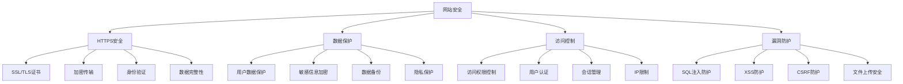
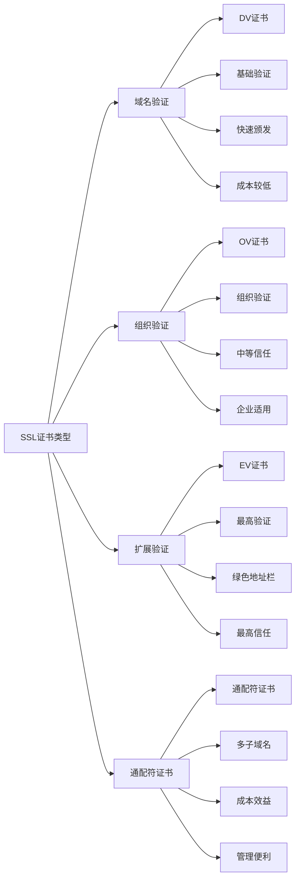
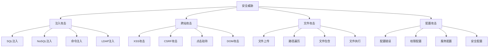
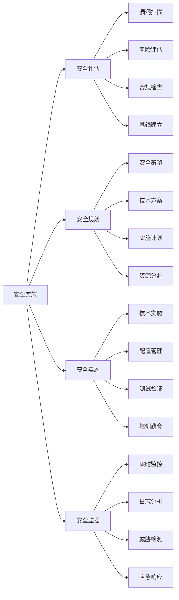
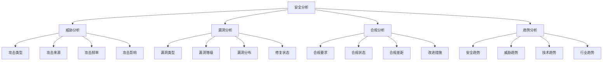
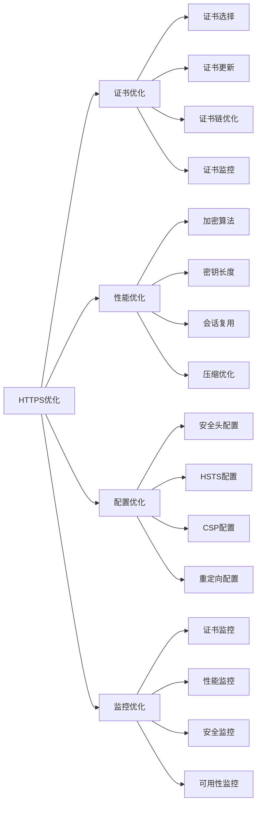
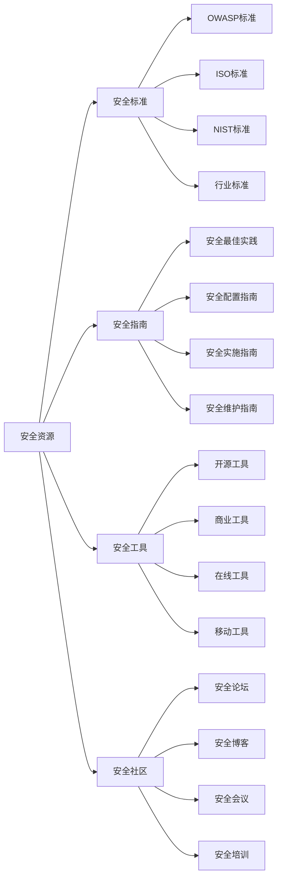
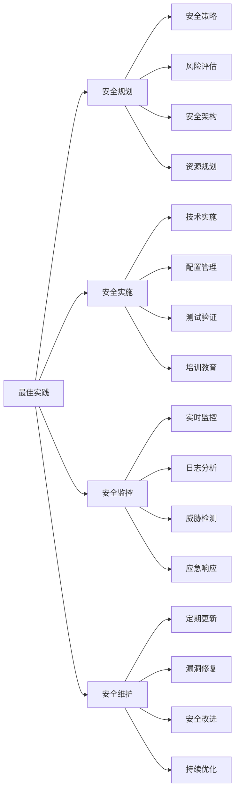

# 网站安全

## 🎯 学习目标
- 深入理解网站安全对SEO的重要性和影响
- 掌握HTTPS与安全证书的实施和管理
- 学会网站安全漏洞的识别和修复
- 建立网站安全优化认知框架

## 🔒 网站安全概述

### 核心概念
**网站安全**：通过技术手段保护网站免受各种安全威胁，确保网站和用户数据的安全

### 网站安全重要性
| 重要性维度 | 具体表现 | 影响程度 | 优化价值 |
|------------|----------|----------|----------|
| **SEO排名** | HTTPS是Google排名因素 | 高 | 排名提升 |
| **用户信任** | 安全网站提升用户信任 | 高 | 用户转化率提升 |
| **数据保护** | 保护用户和网站数据 | 极高 | 法律合规、品牌保护 |
| **搜索引擎** | 搜索引擎偏好安全网站 | 高 | 爬虫访问、索引优化 |

## 🔐 HTTPS与SSL证书

### 1. HTTPS基础概念
| 概念维度 | 具体内容 | 技术原理 | SEO效果 |
|----------|----------|----------|---------|
| **HTTPS协议** | 超文本传输安全协议 | SSL/TLS加密传输 | 排名信号提升 |
| **SSL证书** | 安全套接层证书 | 公钥加密、数字签名 | 用户信任提升 |
| **TLS协议** | 传输层安全协议 | 加密算法、密钥交换 | 数据传输安全 |
| **证书验证** | 证书颁发机构验证 | CA验证、证书链 | 身份认证保证 |

### 2. SSL证书类型

### 3. HTTPS实施步骤
- **证书申请**：选择合适的SSL证书
- **证书安装**：在服务器上安装证书
- **配置重定向**：设置HTTP到HTTPS重定向
- **测试验证**：验证HTTPS正常工作

## 🛡️ 网站安全威胁

### 1. 常见安全威胁
| 威胁类型 | 威胁描述 | 影响程度 | 防护措施 |
|----------|----------|----------|----------|
| **SQL注入** | 通过SQL注入攻击数据库 | 高 | 参数化查询、输入验证 |
| **XSS攻击** | 跨站脚本攻击 | 中 | 输出编码、CSP策略 |
| **CSRF攻击** | 跨站请求伪造 | 中 | CSRF令牌、同源检查 |
| **文件上传** | 恶意文件上传 | 高 | 文件类型检查、病毒扫描 |

### 2. 安全威胁分析

### 3. 威胁防护策略
- **输入验证**：对所有用户输入进行验证
- **输出编码**：对输出内容进行编码
- **访问控制**：实施严格的访问控制
- **安全配置**：保持安全配置更新

## 🔧 网站安全实施

### 1. 安全配置
| 配置类型 | 配置内容 | 实施方法 | 安全效果 |
|----------|----------|----------|----------|
| **HTTPS配置** | SSL/TLS配置 | 服务器配置 | 传输安全 |
| **安全头** | HTTP安全头 | 服务器配置 | 浏览器安全 |
| **访问控制** | 权限控制 | 应用配置 | 访问安全 |
| **日志监控** | 安全日志 | 监控配置 | 威胁检测 |

### 2. 安全实施流程

### 3. 安全工具
- **漏洞扫描**：Nessus、OpenVAS
- **安全监控**：OSSEC、Snort
- **证书管理**：Let's Encrypt、Certbot
- **安全测试**：OWASP ZAP、Burp Suite

## 📊 安全监控与分析

### 1. 监控指标
| 指标类型 | 具体指标 | 监控方法 | 优化方向 |
|----------|----------|----------|----------|
| **安全指标** | 漏洞数量、威胁检测 | 安全工具监控 | 安全防护优化 |
| **性能指标** | HTTPS性能、证书状态 | 性能监控工具 | 性能优化 |
| **合规指标** | 合规检查、审计结果 | 合规工具 | 合规性提升 |
| **用户指标** | 用户信任度、转化率 | 用户行为分析 | 用户体验优化 |

### 2. 安全分析

### 3. 安全报告
- **安全状态报告**：定期安全状态报告
- **威胁分析报告**：威胁分析和应对报告
- **合规检查报告**：合规性检查报告
- **安全改进报告**：安全改进建议报告

## 🎯 HTTPS SEO优化

### 1. HTTPS迁移策略
| 迁移步骤 | 具体内容 | 实施方法 | SEO效果 |
|----------|----------|----------|---------|
| **证书部署** | SSL证书安装配置 | 服务器配置 | 安全信号提升 |
| **重定向设置** | HTTP到HTTPS重定向 | 301重定向 | 权重传递 |
| **内部链接** | 更新内部链接为HTTPS | 链接更新 | 避免混合内容 |
| **外部链接** | 更新外部链接引用 | 链接建设 | 链接价值保持 |

### 2. HTTPS优化策略

### 3. 混合内容处理
- **识别混合内容**：识别HTTP和HTTPS混合内容
- **修复混合内容**：将所有资源更新为HTTPS
- **测试验证**：验证HTTPS正常工作
- **监控维护**：持续监控HTTPS状态

## 🛠️ 安全工具与资源

### 1. 安全工具
| 工具类型 | 工具名称 | 功能特点 | 应用场景 |
|----------|----------|----------|----------|
| **漏洞扫描** | Nessus、OpenVAS | 漏洞检测、风险评估 | 安全评估 |
| **安全监控** | OSSEC、Snort | 实时监控、威胁检测 | 安全监控 |
| **证书管理** | Let's Encrypt、Certbot | 免费证书、自动更新 | 证书管理 |
| **安全测试** | OWASP ZAP、Burp Suite | 安全测试、漏洞发现 | 安全测试 |

### 2. 安全资源

### 3. 安全培训
- **安全意识培训**：提升团队安全意识
- **技术培训**：安全技术实施培训
- **应急响应培训**：安全事件应急响应
- **合规培训**：安全合规要求培训

## 🎯 网站安全最佳实践

### 1. 安全原则
| 安全原则 | 具体内容 | 实施要点 | 注意事项 |
|----------|----------|----------|----------|
| **深度防御** | 多层安全防护 | 网络、应用、数据层防护 | 避免单点故障 |
| **最小权限** | 最小权限原则 | 用户权限最小化 | 避免权限滥用 |
| **安全默认** | 安全默认配置 | 默认安全配置 | 避免配置错误 |
| **持续监控** | 持续安全监控 | 实时监控、及时响应 | 避免安全盲区 |

### 2. 最佳实践

### 3. 实施建议
- **从基础开始**：从基础安全措施开始
- **逐步完善**：逐步完善安全体系
- **安全优先**：优先保证网站安全
- **持续改进**：持续改进安全措施

## 📚 学习路径

### 基础理解
1. [[01-网站结构优化]] - 网站结构优化
2. [[02-页面速度优化]] - 页面速度优化
3. [[03-移动端适配]] - 移动端适配
4. [[04-结构化数据]] - 结构化数据

### 深入应用
1. [[02-理解层-核心机制#2.1-Google算法深度解析]] - 算法理解
2. [[03-应用层-实践技能#3.1-SEO工具精通]] - 工具应用
3. [[04-精通层-高级策略#4.1-企业级SEO策略]] - 企业级策略

### 实战练习
1. [[03-应用层-实践技能#3.2-网站审计]] - 网站审计
2. [[05-实战案例与模板#5.1-成功案例分析]] - 案例分析
3. [[06-工具与资源#6.1-SEO工具大全]] - 工具资源

## 📖 相关链接
- [[01-网站结构优化]] - 网站结构优化
- [[02-页面速度优化]] - 页面速度优化
- [[03-移动端适配]] - 移动端适配
- [[04-结构化数据]] - 结构化数据
- [[02-理解层-核心机制#2.1-Google算法深度解析]] - 算法理解
- [[03-应用层-实践技能]] - 实践技能
- [[04-精通层-高级策略]] - 高级策略
