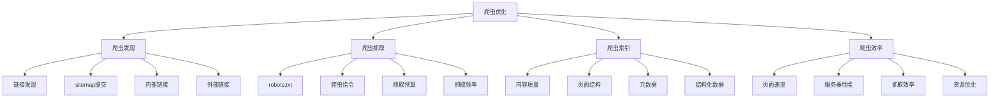
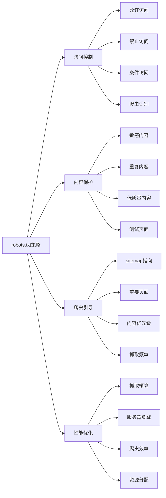
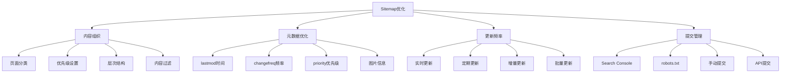
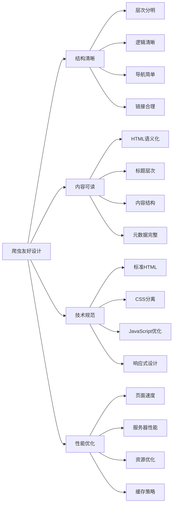
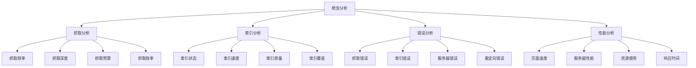
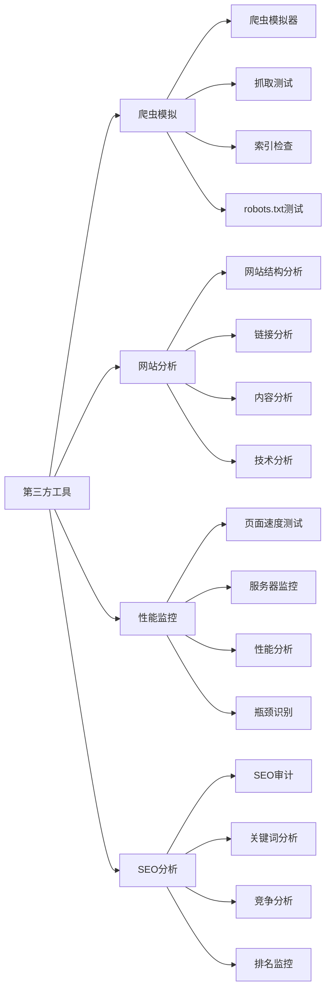
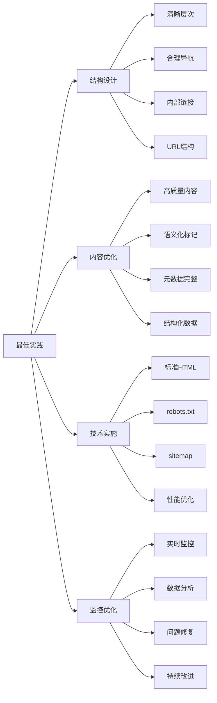

# 爬虫优化

## 🎯 学习目标
- 深入理解搜索引擎爬虫的工作原理和优化方法
- 掌握robots.txt与sitemap的配置和管理
- 学会爬虫友好的网站结构设计
- 建立爬虫优化认知框架

## 🕷️ 爬虫优化概述

### 核心概念
**爬虫优化**：通过技术手段优化网站结构，帮助搜索引擎爬虫更好地发现、抓取和索引网站内容

### 爬虫优化重要性
| 重要性维度 | 具体表现 | 影响程度 | 优化价值 |
|------------|----------|----------|----------|
| **索引效率** | 影响页面被索引的速度 | 高 | 内容发现速度提升 |
| **抓取预算** | 影响爬虫抓取资源分配 | 高 | 抓取效率提升 |
| **内容发现** | 影响新内容的发现速度 | 中 | 内容覆盖度提升 |
| **排名影响** | 影响搜索引擎排名 | 中 | 排名稳定性提升 |

## 📋 robots.txt配置

### 1. robots.txt基础
| 配置要素 | 具体内容 | 配置方法 | SEO效果 |
|----------|----------|----------|---------|
| **User-agent** | 指定爬虫类型 | User-agent: * | 控制爬虫访问 |
| **Disallow** | 禁止访问路径 | Disallow: /admin/ | 保护敏感内容 |
| **Allow** | 允许访问路径 | Allow: /public/ | 开放特定内容 |
| **Sitemap** | 站点地图位置 | Sitemap: URL | 帮助爬虫发现内容 |

### 2. robots.txt配置策略

### 3. robots.txt最佳实践
- **位置正确**：放在网站根目录
- **语法正确**：使用正确的robots.txt语法
- **测试验证**：使用工具测试robots.txt
- **定期更新**：根据网站变化更新配置

## 🗺️ Sitemap优化

### 1. Sitemap类型
| Sitemap类型 | 适用场景 | 文件格式 | 优化重点 |
|-------------|----------|----------|----------|
| **XML Sitemap** | 标准网站地图 | XML格式 | 页面发现、优先级 |
| **图片Sitemap** | 图片网站 | XML格式 | 图片索引、ALT文本 |
| **视频Sitemap** | 视频网站 | XML格式 | 视频内容、元数据 |
| **新闻Sitemap** | 新闻网站 | XML格式 | 新闻时效性、更新频率 |

### 2. Sitemap优化策略

### 3. Sitemap实施要点
- **完整性**：包含所有重要页面
- **准确性**：确保URL和元数据准确
- **及时性**：及时更新sitemap内容
- **有效性**：确保sitemap格式正确

## 🔍 爬虫友好设计

### 1. 网站结构优化
| 结构要素 | 优化内容 | 实施方法 | 爬虫效果 |
|----------|----------|----------|----------|
| **URL结构** | 简洁、语义化URL | 短URL、关键词包含 | 爬虫理解度提升 |
| **导航结构** | 清晰的导航层次 | 面包屑、内部链接 | 页面发现效率提升 |
| **内容结构** | 结构化内容布局 | HTML语义化、标题层次 | 内容理解度提升 |
| **链接结构** | 合理的链接分布 | 内部链接、锚文本 | 页面权重传递 |

### 2. 爬虫友好设计原则

### 3. 技术实现要点
- **HTML语义化**：使用语义化HTML标签
- **标题层次**：保持清晰的标题层次结构
- **内部链接**：建立合理的内部链接结构
- **页面速度**：优化页面加载速度

## 📊 爬虫监控与分析

### 1. 监控指标
| 指标类型 | 具体指标 | 监控方法 | 优化方向 |
|----------|----------|----------|----------|
| **抓取指标** | 抓取次数、抓取频率 | Search Console | 抓取效率优化 |
| **索引指标** | 索引页面数、索引率 | Search Console | 索引效率提升 |
| **错误指标** | 抓取错误、索引错误 | Search Console | 错误修复 |
| **性能指标** | 页面速度、服务器响应 | 性能监控工具 | 性能优化 |

### 2. 爬虫分析

### 3. 分析工具
- **Google Search Console**：官方爬虫数据
- **服务器日志分析**：爬虫访问日志
- **第三方工具**：爬虫监控工具
- **自定义监控**：爬虫行为监控

## 🛠️ 爬虫优化工具

### 1. 官方工具
| 工具类型 | 工具名称 | 功能特点 | 应用场景 |
|----------|----------|----------|----------|
| **Search Console** | Google Search Console | 爬虫数据、索引状态 | 爬虫监控 |
| **robots.txt测试** | robots.txt测试工具 | robots.txt验证 | 配置验证 |
| **Sitemap测试** | Sitemap测试工具 | sitemap验证 | 格式验证 |
| **页面速度** | PageSpeed Insights | 页面性能分析 | 性能优化 |

### 2. 第三方工具

### 3. 工具使用策略
- **多工具结合**：结合多个工具的优势
- **数据交叉验证**：使用不同工具验证数据
- **定期监控**：定期使用工具监控
- **问题诊断**：使用工具诊断问题

## 🎯 爬虫优化最佳实践

### 1. 优化原则
| 优化原则 | 具体内容 | 实施要点 | 注意事项 |
|----------|----------|----------|----------|
| **爬虫友好** | 设计爬虫友好的网站结构 | 清晰结构、标准HTML | 避免复杂结构 |
| **内容优先** | 优先保证内容质量 | 高质量内容、用户价值 | 避免低质内容 |
| **技术规范** | 遵循技术标准和规范 | 标准HTML、语义化 | 避免技术错误 |
| **持续优化** | 持续优化和改进 | 定期监控、持续改进 | 避免一劳永逸 |

### 2. 最佳实践

### 3. 实施建议
- **从基础开始**：从基础爬虫优化开始
- **逐步完善**：逐步完善爬虫优化
- **质量优先**：优先保证内容质量
- **持续优化**：持续优化和改进

## 📚 学习路径

### 基础理解
1. [[01-网站结构优化]] - 网站结构优化
2. [[02-页面速度优化]] - 页面速度优化
3. [[03-移动端适配]] - 移动端适配
4. [[04-结构化数据]] - 结构化数据
5. [[05-网站安全]] - 网站安全

### 深入应用
1. [[02-理解层-核心机制#2.1-Google算法深度解析]] - 算法理解
2. [[03-应用层-实践技能#3.1-SEO工具精通]] - 工具应用
3. [[04-精通层-高级策略#4.1-企业级SEO策略]] - 企业级策略

### 实战练习
1. [[03-应用层-实践技能#3.2-网站审计]] - 网站审计
2. [[05-实战案例与模板#5.1-成功案例分析]] - 案例分析
3. [[06-工具与资源#6.1-SEO工具大全]] - 工具资源

## 📖 相关链接
- [[01-网站结构优化]] - 网站结构优化
- [[02-页面速度优化]] - 页面速度优化
- [[03-移动端适配]] - 移动端适配
- [[04-结构化数据]] - 结构化数据
- [[05-网站安全]] - 网站安全
- [[02-理解层-核心机制#2.1-Google算法深度解析]] - 算法理解
- [[03-应用层-实践技能]] - 实践技能
- [[04-精通层-高级策略]] - 高级策略
