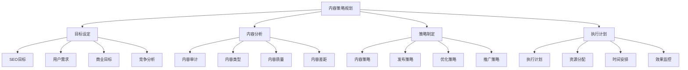
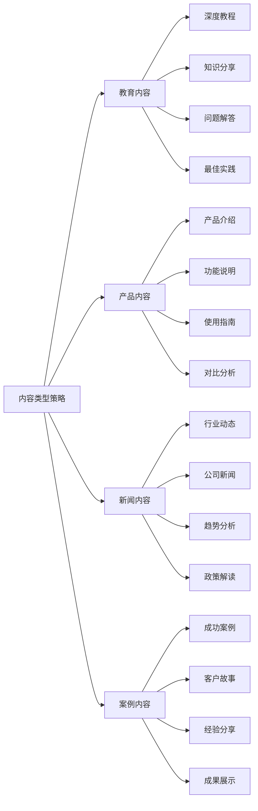
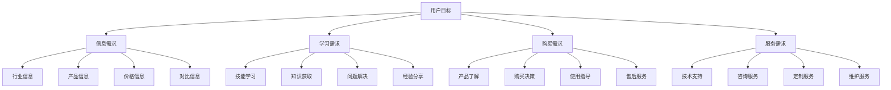
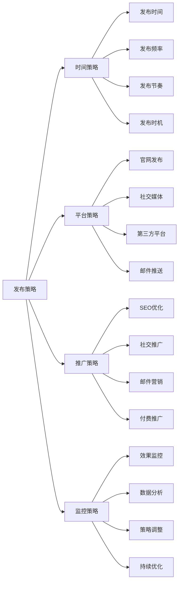
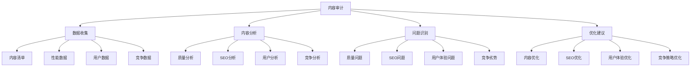
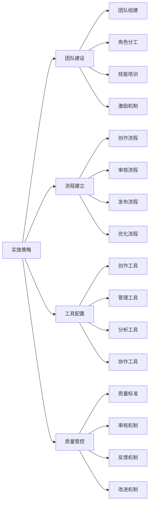
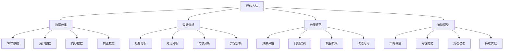
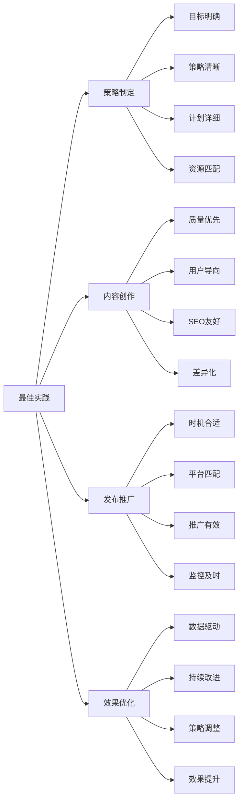

# 内容策略规划

## 🎯 学习目标
- 深入理解内容策略规划的重要性和方法
- 掌握内容类型分析和发布计划制定
- 学会内容策略与SEO目标的结合
- 建立内容策略规划认知框架

## 📝 内容策略规划概述

### 核心概念
**内容策略规划**：基于SEO目标和用户需求，制定系统性的内容创作、发布和优化策略

### 内容策略重要性
| 重要性维度 | 具体表现 | 影响程度 | 优化价值 |
|------------|----------|----------|----------|
| **SEO效果** | 内容质量影响排名 | 高 | 排名提升 |
| **用户体验** | 内容价值影响体验 | 高 | 用户满意度 |
| **品牌建设** | 内容塑造品牌形象 | 中 | 品牌权威性 |
| **商业转化** | 内容驱动商业转化 | 高 | 转化率提升 |

## 📊 内容类型分析

### 1. 内容类型分类
| 内容类型 | 特点描述 | SEO价值 | 适用场景 |
|----------|----------|---------|----------|
| **教育内容** | 知识分享、教程指南 | 高 | 建立权威、长尾关键词 |
| **产品内容** | 产品介绍、功能说明 | 高 | 产品推广、转化优化 |
| **新闻内容** | 行业动态、公司新闻 | 中 | 时效性、品牌曝光 |
| **案例内容** | 成功案例、客户故事 | 中 | 社会证明、信任建立 |
| **互动内容** | 问答、评论、讨论 | 低 | 用户参与、社区建设 |

### 2. 内容类型策略

### 3. 内容类型选择
- **目标导向**：根据SEO目标选择内容类型
- **用户需求**：根据用户需求选择内容类型
- **资源匹配**：根据资源能力选择内容类型
- **竞争分析**：根据竞争情况选择内容类型

## 🎯 内容目标设定

### 1. SEO目标
| 目标类型 | 具体目标 | 内容策略 | 预期效果 |
|----------|----------|----------|----------|
| **关键词排名** | 目标关键词排名提升 | 关键词优化内容 | 排名提升 |
| **流量增长** | 有机流量增长 | 高质量内容创作 | 流量增长 |
| **转化提升** | 转化率提升 | 转化导向内容 | 转化率提升 |
| **品牌建设** | 品牌权威性建立 | 专业内容创作 | 品牌影响力 |

### 2. 用户目标

### 3. 商业目标
- **销售目标**：通过内容促进销售
- **品牌目标**：通过内容建设品牌
- **客户目标**：通过内容获取客户
- **市场目标**：通过内容拓展市场

## 📅 内容发布计划

### 1. 发布频率
| 内容类型 | 建议频率 | 发布策略 | 资源需求 |
|----------|----------|----------|----------|
| **博客文章** | 每周2-3篇 | 定期发布、质量优先 | 中等 |
| **产品内容** | 按需发布 | 产品更新、功能发布 | 低 |
| **新闻内容** | 每日1-2篇 | 时效性、快速发布 | 高 |
| **案例内容** | 每月2-3篇 | 深度创作、质量优先 | 高 |

### 2. 发布策略

### 3. 发布计划制定
- **内容规划**：提前规划内容主题
- **时间安排**：合理安排发布时间
- **资源分配**：合理分配创作资源
- **效果预期**：设定预期效果目标

## 🔍 内容审计分析

### 1. 内容审计维度
| 审计维度 | 审计内容 | 分析方法 | 优化方向 |
|----------|----------|----------|----------|
| **内容质量** | 内容深度、准确性 | 内容分析、专家评估 | 质量提升 |
| **SEO表现** | 排名、流量、转化 | 数据分析、工具监控 | SEO优化 |
| **用户反馈** | 评论、分享、互动 | 用户行为分析 | 用户体验优化 |
| **竞争对比** | 与竞争对手对比 | 竞争分析、基准对比 | 差异化策略 |

### 2. 内容审计流程

### 3. 内容审计工具
- **内容分析工具**：内容质量分析工具
- **SEO工具**：SEO表现分析工具
- **用户分析工具**：用户行为分析工具
- **竞争分析工具**：竞争对手分析工具

## 📈 内容策略实施

### 1. 实施阶段
| 实施阶段 | 主要任务 | 实施方法 | 预期效果 |
|----------|----------|----------|----------|
| **准备阶段** | 策略制定、资源准备 | 团队组建、工具配置 | 基础准备完成 |
| **实施阶段** | 内容创作、发布执行 | 内容创作、发布管理 | 内容策略执行 |
| **优化阶段** | 效果监控、策略调整 | 数据分析、策略优化 | 效果持续改善 |
| **成熟阶段** | 策略完善、规模化 | 流程标准化、规模化 | 策略成熟稳定 |

### 2. 实施策略

### 3. 实施要点
- **团队协作**：建立高效的团队协作机制
- **流程标准化**：建立标准化的内容流程
- **质量保证**：建立内容质量保证机制
- **持续优化**：建立持续优化改进机制

## 📊 内容效果评估

### 1. 评估指标
| 指标类型 | 具体指标 | 评估方法 | 优化方向 |
|----------|----------|----------|----------|
| **SEO指标** | 排名、流量、转化 | 工具监控、数据分析 | SEO优化 |
| **用户指标** | 停留时间、跳出率 | 用户行为分析 | 用户体验优化 |
| **内容指标** | 阅读量、分享量 | 内容分析、社交监控 | 内容质量提升 |
| **商业指标** | 转化率、ROI | 商业数据分析 | 商业价值提升 |

### 2. 评估方法

### 3. 评估周期
- **日常监控**：每日监控关键指标
- **周度分析**：每周分析内容效果
- **月度评估**：每月评估整体效果
- **季度调整**：每季度调整内容策略

## 🎯 内容策略最佳实践

### 1. 策略原则
| 策略原则 | 具体内容 | 实施要点 | 注意事项 |
|----------|----------|----------|----------|
| **用户导向** | 以用户需求为导向 | 用户研究、需求分析 | 避免自嗨内容 |
| **价值优先** | 优先提供价值内容 | 内容价值、用户价值 | 避免低质内容 |
| **持续优化** | 持续优化改进 | 数据分析、策略调整 | 避免一成不变 |
| **数据驱动** | 基于数据做决策 | 数据收集、分析应用 | 避免主观判断 |

### 2. 最佳实践

### 3. 实施建议
- **从简单开始**：从简单的内容类型开始
- **逐步完善**：逐步完善内容策略
- **质量优先**：优先保证内容质量
- **持续优化**：持续优化和改进

## 📚 学习路径

### 基础理解
1. [[02-标题标签优化]] - 标题标签优化
2. [[03-内容质量评估]] - 内容质量评估
3. [[04-内容更新策略]] - 内容更新策略

### 深入应用
1. [[02-理解层-核心机制#2.2-关键词策略]] - 关键词策略
2. [[03-应用层-实践技能#3.1-SEO工具精通]] - 工具应用
3. [[04-精通层-高级策略#4.1-企业级SEO策略]] - 企业级策略

### 实战练习
1. [[03-应用层-实践技能#3.2-网站审计]] - 网站审计
2. [[05-实战案例与模板#5.1-成功案例分析]] - 案例分析
3. [[06-工具与资源#6.1-SEO工具大全]] - 工具资源

## 📖 相关链接
- [[02-标题标签优化]] - 标题标签优化
- [[03-内容质量评估]] - 内容质量评估
- [[04-内容更新策略]] - 内容更新策略
- [[02-理解层-核心机制#2.2-关键词策略]] - 关键词策略
- [[03-应用层-实践技能]] - 实践技能
- [[04-精通层-高级策略]] - 高级策略
