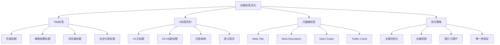
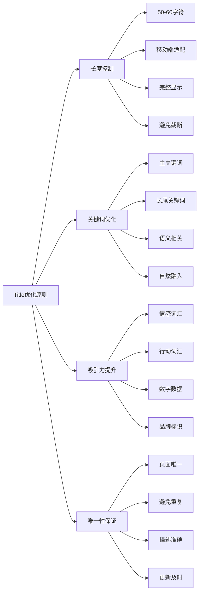
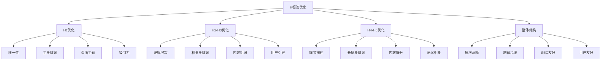
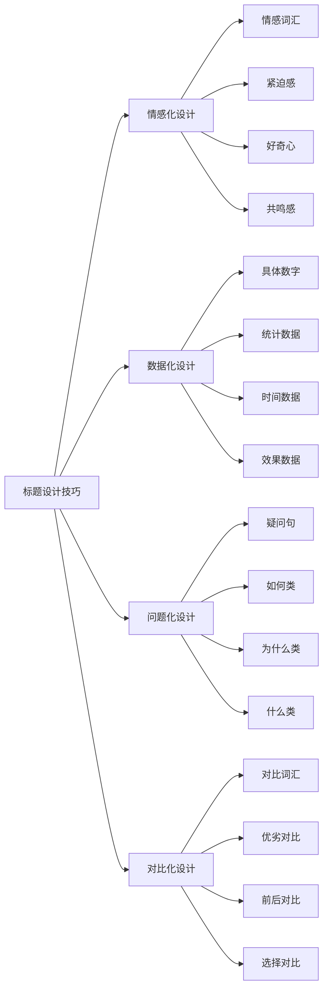
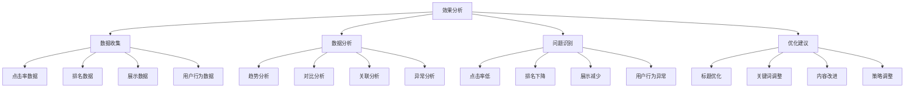
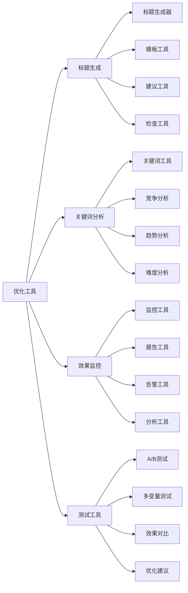
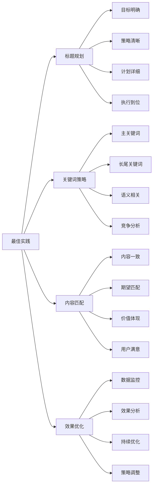

# 标题标签优化

## 🎯 学习目标
- 深入理解标题标签对SEO的重要性和作用
- 掌握Title标签和H1-H6标签的优化方法
- 学会标题标签与关键词策略的结合
- 建立标题标签优化认知框架

## 🏷️ 标题标签概述

### 核心概念
**标题标签优化**：通过优化HTML标题标签，提升页面在搜索引擎中的表现和用户体验



### 标题标签重要性
| 重要性维度 | 具体表现 | 影响程度 | 优化价值 |
|------------|----------|----------|----------|
| **SEO排名** | 搜索引擎排名重要因素 | 高 | 排名提升 |
| **点击率** | 影响搜索结果点击率 | 高 | 流量提升 |
| **用户体验** | 影响页面可读性和导航 | 中 | 用户体验改善 |
| **内容结构** | 影响内容层次和结构 | 中 | 内容组织优化 |

## 📝 Title标签优化

### 1. Title标签作用
| 作用维度 | 具体作用 | 实现方法 | SEO效果 |
|----------|----------|----------|---------|
| **搜索结果** | 搜索结果中的标题 | 关键词优化、吸引力 | 点击率提升 |
| **浏览器标题** | 浏览器标签页标题 | 品牌标识、页面识别 | 用户体验 |
| **社交分享** | 社交媒体分享标题 | 社交优化、吸引力 | 分享率提升 |
| **书签标题** | 用户收藏书签标题 | 简洁明了、易识别 | 用户留存 |

### 2. Title标签优化原则


### 3. Title标签优化技巧
- **关键词前置**：将重要关键词放在标题前部
- **品牌标识**：在标题中包含品牌名称
- **情感词汇**：使用吸引人的情感词汇
- **数字数据**：使用具体数字增加可信度

## 📋 H标签系列优化

### 1. H标签层次结构
| H标签 | 作用层级 | 使用场景 | 优化重点 |
|-------|----------|----------|----------|
| **H1** | 页面主标题 | 页面核心主题 | 主关键词、唯一性 |
| **H2** | 主要章节标题 | 主要内容区块 | 相关关键词、逻辑性 |
| **H3** | 子章节标题 | 内容细分 | 长尾关键词、层次性 |
| **H4-H6** | 更细层级 | 内容细节 | 语义相关、结构清晰 |

### 2. H标签优化策略


### 3. H标签最佳实践
- **层次清晰**：保持清晰的标题层次结构
- **逻辑合理**：标题逻辑符合内容组织
- **关键词分布**：合理分布关键词到各级标题
- **用户友好**：标题对用户有实际指导意义

## 🎨 标题标签设计

### 1. 标题设计原则
| 设计原则 | 具体要求 | 实施方法 | 效果评估 |
|----------|----------|----------|----------|
| **简洁明了** | 标题简洁易懂 | 核心词汇、避免冗余 | 用户理解度 |
| **吸引眼球** | 标题具有吸引力 | 情感词汇、数字数据 | 点击率提升 |
| **信息完整** | 标题信息完整 | 关键信息、核心价值 | 用户期望匹配 |
| **品牌一致** | 品牌风格一致 | 统一风格、品牌标识 | 品牌认知度 |

### 2. 标题设计技巧


### 3. 标题模板
- **问题型**：如何+关键词+效果
- **数字型**：数字+关键词+方法
- **对比型**：A vs B+关键词+分析
- **指南型**：关键词+完整指南+年份

## 🔍 标题标签技术实现

### 1. HTML实现
```html
<!-- Title标签 -->
<title>SEO优化完整指南 - 2024年最新策略 | SEO学习网</title>

<!-- H标签系列 -->
<h1>SEO优化完整指南</h1>
<h2>什么是SEO优化</h2>
<h3>SEO优化的核心要素</h3>
<h4>关键词研究</h4>
<h4>内容优化</h4>
<h4>技术优化</h4>
<h2>SEO优化实施步骤</h2>
<h3>第一步：关键词分析</h3>
<h3>第二步：内容规划</h3>
<h3>第三步：技术实施</h3>
```

### 2. 动态标题实现
```javascript
// 动态Title生成
function generateDynamicTitle(pageType, keyword, brand) {
    const templates = {
        'article': `${keyword} - 完整指南 | ${brand}`,
        'product': `${keyword} - 产品介绍 | ${brand}`,
        'category': `${keyword} - 分类页面 | ${brand}`,
        'home': `${brand} - ${keyword}专业服务`
    };
    return templates[pageType] || `${keyword} | ${brand}`;
}

// H标签动态生成
function generateH1(content, keyword) {
    return `<h1>${content} - ${keyword}完整指南</h1>`;
}
```

### 3. SEO优化实现
- **关键词密度**：合理控制关键词密度
- **语义相关**：使用语义相关词汇
- **长度控制**：控制标题长度在合理范围
- **唯一性检查**：确保标题唯一性

## 📊 标题标签效果分析

### 1. 分析指标
| 指标类型 | 具体指标 | 分析方法 | 优化方向 |
|----------|----------|----------|----------|
| **点击率** | 搜索结果点击率 | 搜索控制台分析 | 标题吸引力优化 |
| **排名** | 关键词排名位置 | 排名监控工具 | 关键词优化 |
| **展示** | 标题展示次数 | 搜索分析数据 | 内容覆盖优化 |
| **用户行为** | 页面停留时间 | 用户行为分析 | 内容质量优化 |

### 2. 效果分析


### 3. A/B测试
- **标题测试**：测试不同标题的效果
- **关键词测试**：测试不同关键词组合
- **长度测试**：测试不同标题长度
- **风格测试**：测试不同标题风格

## 🛠️ 标题标签工具

### 1. 分析工具
| 工具类型 | 工具名称 | 功能特点 | 应用场景 |
|----------|----------|----------|----------|
| **SEO工具** | Google Search Console | 标题效果分析 | 效果监控 |
| **分析工具** | Google Analytics | 用户行为分析 | 用户行为分析 |
| **排名工具** | SEMrush、Ahrefs | 排名监控 | 排名分析 |
| **测试工具** | Google Optimize | A/B测试 | 标题测试 |

### 2. 优化工具


### 3. 工具使用建议
- **多工具结合**：结合多个工具进行分析
- **定期监控**：定期监控标题效果
- **持续优化**：持续优化标题策略
- **数据驱动**：基于数据进行决策

## 🎯 标题标签最佳实践

### 1. 优化原则
| 优化原则 | 具体内容 | 实施要点 | 注意事项 |
|----------|----------|----------|----------|
| **用户导向** | 以用户需求为导向 | 用户研究、需求分析 | 避免自嗨标题 |
| **关键词优化** | 合理使用关键词 | 关键词研究、自然融入 | 避免关键词堆砌 |
| **吸引力** | 标题具有吸引力 | 情感词汇、数字数据 | 避免标题党 |
| **准确性** | 标题准确描述内容 | 内容匹配、期望管理 | 避免误导用户 |

### 2. 最佳实践


### 3. 实施建议
- **从核心开始**：从核心页面标题开始优化
- **逐步扩展**：逐步扩展到全站标题
- **质量优先**：优先保证标题质量
- **持续优化**：持续优化和改进

## 📚 学习路径

### 基础理解
1. [[01-内容策略规划]] - 内容策略规划
2. [[03-内容质量评估]] - 内容质量评估
3. [[04-内容更新策略]] - 内容更新策略

### 深入应用
1. [[02-理解层-核心机制#2.2-关键词策略]] - 关键词策略
2. [[03-应用层-实践技能#3.1-SEO工具精通]] - 工具应用
3. [[04-精通层-高级策略#4.1-企业级SEO策略]] - 企业级策略

### 实战练习
1. [[03-应用层-实践技能#3.2-网站审计]] - 网站审计
2. [[05-实战案例与模板#5.1-成功案例分析]] - 案例分析
3. [[06-工具与资源#6.1-SEO工具大全]] - 工具资源

## 📖 相关链接
- [[01-内容策略规划]] - 内容策略规划
- [[03-内容质量评估]] - 内容质量评估
- [[04-内容更新策略]] - 内容更新策略
- [[02-理解层-核心机制#2.2-关键词策略]] - 关键词策略
- [[03-应用层-实践技能]] - 实践技能
- [[04-精通层-高级策略]] - 高级策略
