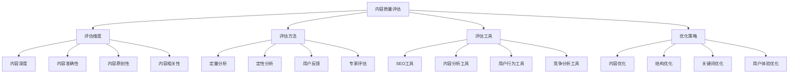
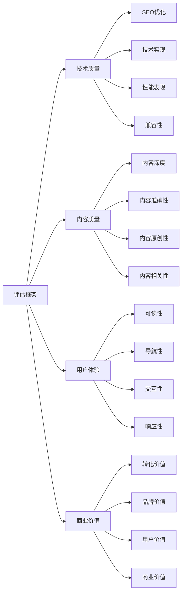
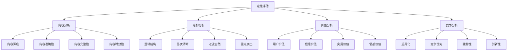
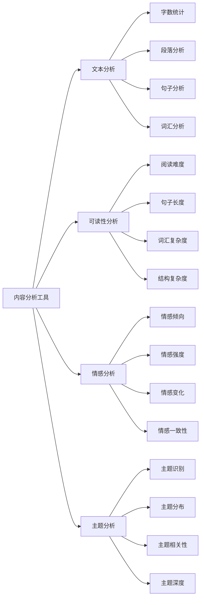
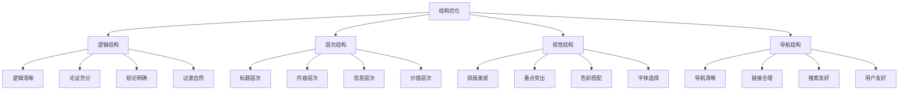
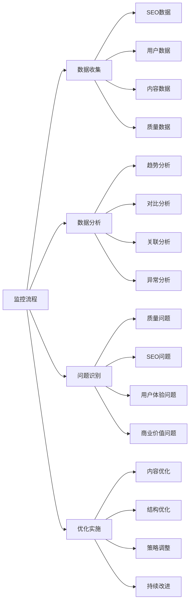
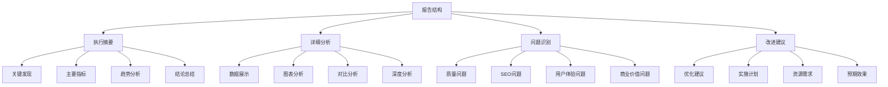
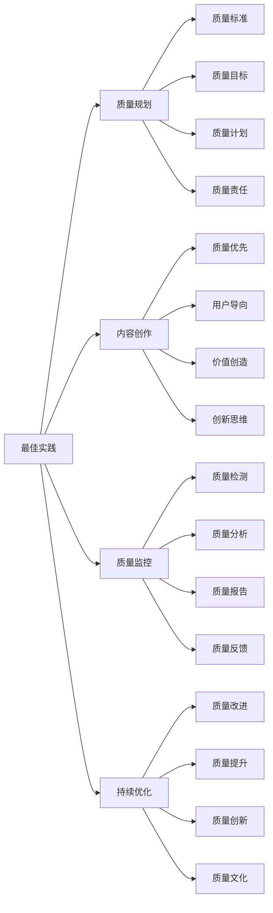

# 内容质量评估

## 🎯 学习目标
- 深入理解内容质量对SEO的重要性和评估标准
- 掌握内容质量评估的方法和工具
- 学会内容质量优化的策略和技巧
- 建立内容质量评估认知框架

## 📊 内容质量评估概述

### 核心概念
**内容质量评估**：通过系统性的方法和标准，评估网页内容的质量水平，为SEO优化提供依据

### 内容质量重要性
| 重要性维度 | 具体表现 | 影响程度 | 优化价值 |
|------------|----------|----------|----------|
| **SEO排名** | 内容质量影响搜索引擎排名 | 高 | 排名提升 |
| **用户体验** | 内容质量影响用户体验 | 高 | 用户满意度 |
| **品牌形象** | 内容质量影响品牌形象 | 中 | 品牌权威性 |
| **商业转化** | 内容质量影响转化率 | 高 | 商业价值提升 |

## 📝 内容质量标准

### 1. Google内容质量标准
| 标准维度 | 具体要求 | 评估方法 | 优化方向 |
|----------|----------|----------|----------|
| **E-A-T** | 专业性、权威性、可信度 | 专家评估、权威性分析 | 提升专业水平 |
| **内容深度** | 内容深度和完整性 | 内容长度、信息密度 | 增加内容深度 |
| **原创性** | 内容原创性和独特性 | 原创性检测、相似度分析 | 提升原创性 |
| **用户价值** | 内容对用户的价值 | 用户行为分析、反馈收集 | 提升用户价值 |

### 2. 内容质量评估框架

### 3. 内容质量评分体系
- **优秀（90-100分）**：内容深度、准确性、原创性都很好
- **良好（80-89分）**：内容质量较好，有改进空间
- **一般（70-79分）**：内容质量一般，需要优化
- **较差（60-69分）**：内容质量较差，需要大幅改进
- **很差（60分以下）**：内容质量很差，需要重新创作

## 🔍 内容质量评估方法

### 1. 定量评估方法
| 评估方法 | 评估内容 | 评估工具 | 评估标准 |
|----------|----------|----------|----------|
| **内容长度** | 文章字数、段落数 | 文本分析工具 | 1000+字为佳 |
| **关键词密度** | 关键词出现频率 | SEO工具 | 1-3%为佳 |
| **可读性** | 阅读难度、句子长度 | 可读性工具 | Flesch-Kincaid指数 |
| **原创性** | 内容原创度 | 原创性检测工具 | 90%+为佳 |

### 2. 定性评估方法

### 3. 用户反馈评估
- **用户评论**：收集用户对内容的评论和反馈
- **用户行为**：分析用户的行为数据
- **用户调研**：通过调研了解用户需求
- **用户测试**：通过测试了解用户体验

## 🛠️ 内容质量评估工具

### 1. SEO工具
| 工具类型 | 工具名称 | 功能特点 | 应用场景 |
|----------|----------|----------|----------|
| **内容分析** | SEMrush Content Audit | 内容质量分析 | 内容审计 |
| **关键词分析** | Ahrefs Content Explorer | 内容关键词分析 | 关键词优化 |
| **竞争分析** | BuzzSumo | 内容竞争分析 | 内容策略 |
| **原创性检测** | Copyscape | 内容原创性检测 | 原创性保证 |

### 2. 内容分析工具

### 3. 用户行为工具
- **Google Analytics**：用户行为分析
- **Hotjar**：用户行为热图
- **Crazy Egg**：用户行为分析
- **UserTesting**：用户体验测试

## 📈 内容质量优化策略

### 1. 内容深度优化
| 优化维度 | 优化方法 | 实施技巧 | 预期效果 |
|----------|----------|----------|----------|
| **信息密度** | 增加有用信息 | 数据支撑、案例丰富 | 内容价值提升 |
| **内容长度** | 适当增加长度 | 详细阐述、深度分析 | 用户满意度提升 |
| **内容完整性** | 内容覆盖全面 | 多角度分析、全面覆盖 | 用户需求满足 |
| **内容更新** | 保持内容新鲜 | 定期更新、时效性 | 内容价值维持 |

### 2. 内容结构优化

### 3. 内容价值优化
- **用户价值**：提升内容对用户的价值
- **信息价值**：增加内容的信息价值
- **实用价值**：提升内容的实用价值
- **情感价值**：增加内容的情感价值

## 🎯 内容质量监控

### 1. 监控指标
| 指标类型 | 具体指标 | 监控方法 | 优化方向 |
|----------|----------|----------|----------|
| **SEO指标** | 排名、流量、转化 | 工具监控 | SEO优化 |
| **用户指标** | 停留时间、跳出率 | 用户行为分析 | 用户体验优化 |
| **内容指标** | 阅读量、分享量 | 内容分析 | 内容质量提升 |
| **质量指标** | 原创性、准确性 | 质量检测 | 内容质量优化 |

### 2. 监控流程

### 3. 监控周期
- **日常监控**：每日监控关键指标
- **周度分析**：每周分析内容质量
- **月度评估**：每月评估整体质量
- **季度调整**：每季度调整优化策略

## 📊 内容质量报告

### 1. 报告内容
| 报告类型 | 报告内容 | 报告频率 | 报告对象 |
|----------|----------|----------|----------|
| **质量报告** | 内容质量评估结果 | 月度 | 内容团队 |
| **SEO报告** | SEO表现分析 | 周度 | SEO团队 |
| **用户报告** | 用户行为分析 | 周度 | 产品团队 |
| **商业报告** | 商业价值分析 | 月度 | 管理层 |

### 2. 报告结构

### 3. 报告建议
- **数据驱动**：基于数据进行报告
- **可视化**：使用图表展示数据
- ** actionable**：提供可执行的建议
- **定期更新**：定期更新报告内容

## 🎯 内容质量最佳实践

### 1. 质量原则
| 质量原则 | 具体内容 | 实施要点 | 注意事项 |
|----------|----------|----------|----------|
| **用户导向** | 以用户需求为导向 | 用户研究、需求分析 | 避免自嗨内容 |
| **价值优先** | 优先提供价值内容 | 内容价值、用户价值 | 避免低质内容 |
| **持续改进** | 持续改进内容质量 | 质量监控、持续优化 | 避免一成不变 |
| **数据驱动** | 基于数据做决策 | 数据收集、分析应用 | 避免主观判断 |

### 2. 最佳实践

### 3. 实施建议
- **从标准开始**：建立内容质量标准
- **逐步完善**：逐步完善质量体系
- **质量优先**：优先保证内容质量
- **持续优化**：持续优化和改进

## 📚 学习路径

### 基础理解
1. [[01-内容策略规划]] - 内容策略规划
2. [[02-标题标签优化]] - 标题标签优化
3. [[04-内容更新策略]] - 内容更新策略

### 深入应用
1. [[02-理解层-核心机制#2.2-关键词策略]] - 关键词策略
2. [[03-应用层-实践技能#3.1-SEO工具精通]] - 工具应用
3. [[04-精通层-高级策略#4.1-企业级SEO策略]] - 企业级策略

### 实战练习
1. [[03-应用层-实践技能#3.2-网站审计]] - 网站审计
2. [[05-实战案例与模板#5.1-成功案例分析]] - 案例分析
3. [[06-工具与资源#6.1-SEO工具大全]] - 工具资源

## 📖 相关链接
- [[01-内容策略规划]] - 内容策略规划
- [[02-标题标签优化]] - 标题标签优化
- [[04-内容更新策略]] - 内容更新策略
- [[02-理解层-核心机制#2.2-关键词策略]] - 关键词策略
- [[03-应用层-实践技能]] - 实践技能
- [[04-精通层-高级策略]] - 高级策略
