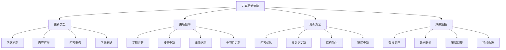
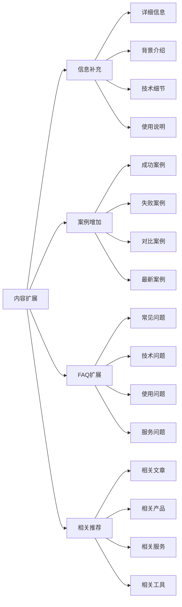
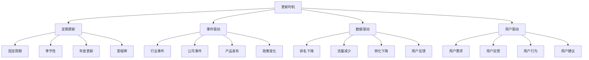
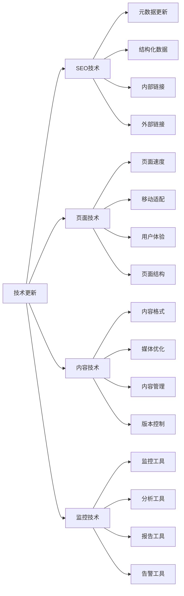
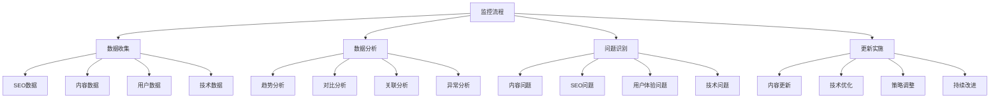
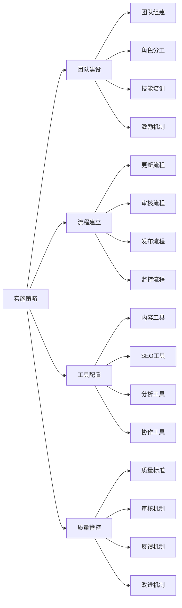
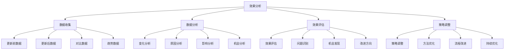
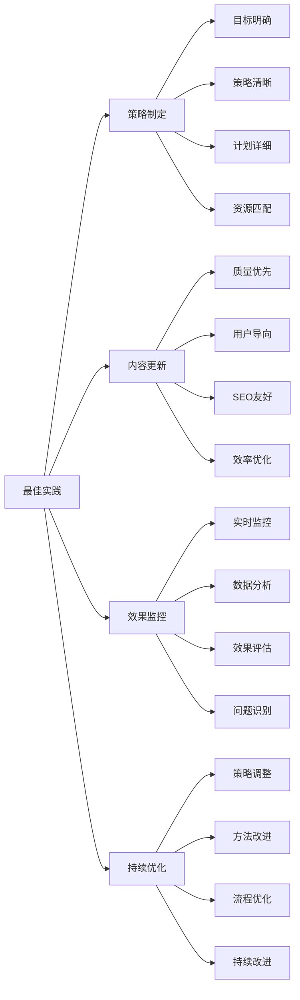

# 内容更新策略

## 🎯 学习目标
- 深入理解内容更新对SEO的重要性和策略
- 掌握内容维护与更新的方法和技巧
- 学会内容更新与SEO效果的结合
- 建立内容更新策略认知框架

## 🔄 内容更新策略概述

### 核心概念
**内容更新策略**：通过系统性的内容维护和更新，保持内容的新鲜度和相关性，提升SEO效果

### 内容更新重要性
| 重要性维度 | 具体表现 | 影响程度 | 优化价值 |
|------------|----------|----------|----------|
| **SEO排名** | 内容新鲜度影响排名 | 高 | 排名维持和提升 |
| **用户体验** | 内容时效性影响体验 | 高 | 用户满意度提升 |
| **搜索引擎** | 搜索引擎偏好新鲜内容 | 高 | 爬虫频率提升 |
| **商业价值** | 内容更新维持商业价值 | 中 | 商业价值维持 |

## 📅 内容更新类型

### 1. 内容刷新
| 刷新类型 | 刷新内容 | 实施方法 | SEO效果 |
|----------|----------|----------|---------|
| **数据更新** | 统计数据、价格信息 | 定期更新数据 | 内容准确性提升 |
| **链接更新** | 内部链接、外部链接 | 检查更新链接 | 链接价值维持 |
| **图片更新** | 产品图片、案例图片 | 更新图片内容 | 视觉体验改善 |
| **联系方式** | 电话、地址、邮箱 | 更新联系信息 | 用户信任度提升 |

### 2. 内容扩展

### 3. 内容重构
- **结构优化**：优化内容结构和层次
- **语言优化**：优化语言表达和可读性
- **关键词优化**：更新和优化关键词
- **用户体验优化**：提升用户体验

## ⏰ 内容更新频率

### 1. 更新频率策略
| 内容类型 | 建议频率 | 更新内容 | 资源需求 |
|----------|----------|----------|----------|
| **新闻内容** | 每日更新 | 最新资讯、动态 | 高 |
| **产品内容** | 按需更新 | 产品信息、价格 | 中 |
| **教程内容** | 月度更新 | 技术更新、案例 | 中 |
| **公司信息** | 季度更新 | 公司动态、成就 | 低 |

### 2. 更新时机

### 3. 更新优先级
- **高优先级**：核心页面、高价值内容
- **中优先级**：重要页面、中等价值内容
- **低优先级**：一般页面、低价值内容
- **删除考虑**：过时内容、低质量内容

## 🛠️ 内容更新方法

### 1. 内容优化更新
| 优化维度 | 优化方法 | 实施技巧 | 预期效果 |
|----------|----------|----------|----------|
| **关键词优化** | 更新关键词策略 | 关键词研究、竞争分析 | 排名提升 |
| **标题优化** | 优化标题标签 | 吸引力提升、关键词优化 | 点击率提升 |
| **内容深度** | 增加内容深度 | 详细信息、案例分析 | 用户满意度提升 |
| **可读性** | 提升内容可读性 | 语言优化、结构优化 | 用户体验改善 |

### 2. 技术更新

### 3. 内容管理更新
- **版本控制**：建立内容版本控制系统
- **审核流程**：建立内容审核和发布流程
- **权限管理**：建立内容编辑权限管理
- **备份恢复**：建立内容备份和恢复机制

## 📊 内容更新监控

### 1. 监控指标
| 指标类型 | 具体指标 | 监控方法 | 优化方向 |
|----------|----------|----------|----------|
| **SEO指标** | 排名、流量、转化 | 工具监控 | SEO优化 |
| **内容指标** | 内容质量、更新频率 | 内容分析 | 内容质量提升 |
| **用户指标** | 用户行为、反馈 | 用户分析 | 用户体验优化 |
| **技术指标** | 页面性能、技术问题 | 技术监控 | 技术优化 |

### 2. 监控流程

### 3. 监控工具
- **SEO工具**：Google Search Console、SEMrush
- **内容工具**：内容管理系统、版本控制
- **用户工具**：Google Analytics、用户反馈系统
- **技术工具**：页面监控、性能分析

## 🎯 内容更新策略实施

### 1. 实施阶段
| 实施阶段 | 主要任务 | 实施方法 | 预期效果 |
|----------|----------|----------|----------|
| **规划阶段** | 制定更新策略 | 策略制定、计划安排 | 更新策略确定 |
| **准备阶段** | 准备更新资源 | 资源准备、工具配置 | 更新准备完成 |
| **实施阶段** | 执行内容更新 | 内容更新、技术优化 | 内容更新完成 |
| **监控阶段** | 监控更新效果 | 效果监控、数据分析 | 效果确认和优化 |

### 2. 实施策略

### 3. 实施要点
- **系统化**：建立系统化的更新流程
- **自动化**：尽可能实现更新自动化
- **质量优先**：优先保证更新质量
- **持续改进**：持续改进更新策略

## 📈 内容更新效果分析

### 1. 效果评估
| 评估维度 | 评估内容 | 评估方法 | 优化方向 |
|----------|----------|----------|----------|
| **SEO效果** | 排名、流量变化 | 对比分析 | SEO策略优化 |
| **内容效果** | 内容质量、用户反馈 | 内容分析 | 内容质量提升 |
| **用户体验** | 用户行为、满意度 | 用户分析 | 用户体验优化 |
| **商业效果** | 转化率、ROI | 商业分析 | 商业价值提升 |

### 2. 效果分析

### 3. ROI分析
- **更新成本**：内容更新的成本分析
- **效果收益**：内容更新带来的收益
- **ROI计算**：投资回报率分析
- **优化建议**：基于ROI的优化建议

## 🎯 内容更新最佳实践

### 1. 更新原则
| 更新原则 | 具体内容 | 实施要点 | 注意事项 |
|----------|----------|----------|----------|
| **用户导向** | 以用户需求为导向 | 用户研究、需求分析 | 避免自嗨更新 |
| **价值优先** | 优先更新有价值内容 | 价值评估、优先级排序 | 避免无效更新 |
| **持续改进** | 持续改进更新策略 | 数据分析、策略调整 | 避免一成不变 |
| **效率优先** | 提高更新效率 | 工具使用、流程优化 | 避免低效更新 |

### 2. 最佳实践

### 3. 实施建议
- **从核心开始**：从核心内容开始更新
- **逐步扩展**：逐步扩展到全站内容
- **质量优先**：优先保证更新质量
- **持续优化**：持续优化更新策略

## 📚 学习路径

### 基础理解
1. [[01-内容策略规划]] - 内容策略规划
2. [[02-标题标签优化]] - 标题标签优化
3. [[03-内容质量评估]] - 内容质量评估

### 深入应用
1. [[02-理解层-核心机制#2.2-关键词策略]] - 关键词策略
2. [[03-应用层-实践技能#3.1-SEO工具精通]] - 工具应用
3. [[04-精通层-高级策略#4.1-企业级SEO策略]] - 企业级策略

### 实战练习
1. [[03-应用层-实践技能#3.2-网站审计]] - 网站审计
2. [[05-实战案例与模板#5.1-成功案例分析]] - 案例分析
3. [[06-工具与资源#6.1-SEO工具大全]] - 工具资源

## 📖 相关链接
- [[01-内容策略规划]] - 内容策略规划
- [[02-标题标签优化]] - 标题标签优化
- [[03-内容质量评估]] - 内容质量评估
- [[02-理解层-核心机制#2.2-关键词策略]] - 关键词策略
- [[03-应用层-实践技能]] - 实践技能
- [[04-精通层-高级策略]] - 高级策略
