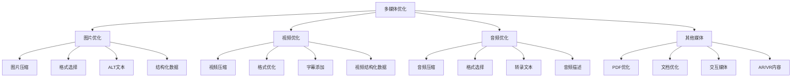
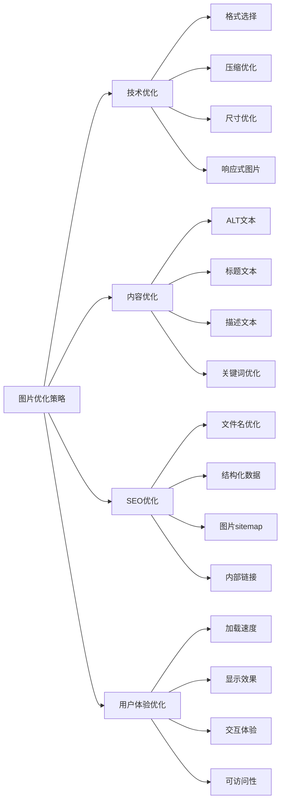
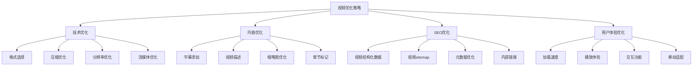
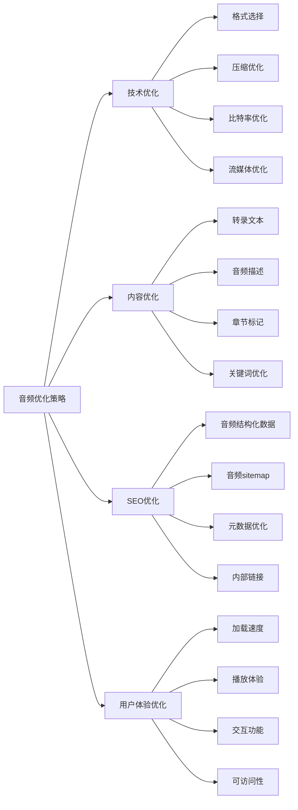
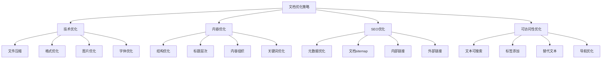
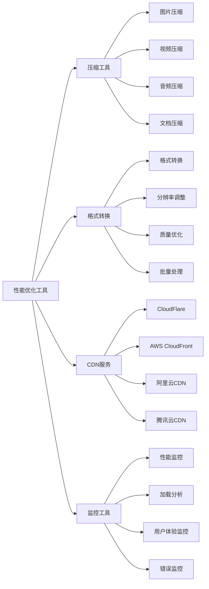
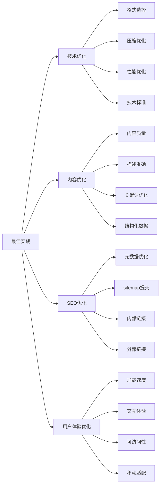

# 多媒体优化

## 🎯 学习目标
- 深入理解多媒体内容对SEO的重要性和优化方法
- 掌握图片与视频SEO的优化策略
- 学会多媒体内容的搜索引擎友好设计
- 建立多媒体优化认知框架

## 🎨 多媒体优化概述

### 核心概念
**多媒体优化**：通过技术手段优化图片、视频、音频等多媒体内容，提升搜索引擎理解和用户体验



### 多媒体优化重要性
| 重要性维度 | 具体表现 | 影响程度 | 优化价值 |
|------------|----------|----------|----------|
| **用户体验** | 多媒体内容提升用户体验 | 高 | 用户满意度提升 |
| **SEO排名** | 多媒体内容影响搜索排名 | 中 | 排名提升 |
| **内容发现** | 多媒体搜索优化 | 中 | 内容发现度提升 |
| **页面性能** | 多媒体优化提升页面速度 | 高 | 性能优化 |

## 🖼️ 图片SEO优化

### 1. 图片优化要素
| 优化要素 | 优化内容 | 实施方法 | SEO效果 |
|----------|----------|----------|---------|
| **文件大小** | 压缩图片文件大小 | 工具压缩、格式选择 | 页面速度提升 |
| **图片格式** | 选择合适的图片格式 | WebP、AVIF、JPEG | 加载速度优化 |
| **ALT文本** | 图片描述文本 | 关键词包含、描述准确 | 可访问性提升 |
| **文件名** | 语义化文件名 | 关键词包含、描述性 | 搜索引擎理解 |

### 2. 图片优化策略


### 3. 图片优化工具
- **压缩工具**：TinyPNG、ImageOptim、Squoosh
- **格式转换**：CloudConvert、Convertio
- **响应式图片**：srcset、picture元素
- **懒加载**：Intersection Observer API

## 🎥 视频SEO优化

### 1. 视频优化要素
| 优化要素 | 优化内容 | 实施方法 | SEO效果 |
|----------|----------|----------|---------|
| **视频压缩** | 压缩视频文件大小 | 编码优化、分辨率调整 | 加载速度提升 |
| **视频格式** | 选择合适的视频格式 | MP4、WebM、HLS | 兼容性优化 |
| **字幕添加** | 为视频添加字幕 | SRT、VTT格式 | 可访问性提升 |
| **视频描述** | 详细的视频描述 | 关键词包含、内容描述 | 搜索引擎理解 |

### 2. 视频优化策略


### 3. 视频优化工具
- **压缩工具**：HandBrake、FFmpeg、CloudConvert
- **字幕工具**：Aegisub、Subtitle Edit
- **缩略图工具**：FFmpeg、在线工具
- **托管平台**：YouTube、Vimeo、自托管

## 🔊 音频SEO优化

### 1. 音频优化要素
| 优化要素 | 优化内容 | 实施方法 | SEO效果 |
|----------|----------|----------|---------|
| **音频压缩** | 压缩音频文件大小 | 编码优化、比特率调整 | 加载速度提升 |
| **音频格式** | 选择合适的音频格式 | MP3、AAC、OGG | 兼容性优化 |
| **转录文本** | 音频内容转录 | 自动转录、人工转录 | 可访问性提升 |
| **音频描述** | 详细的音频描述 | 关键词包含、内容描述 | 搜索引擎理解 |

### 2. 音频优化策略


### 3. 音频优化工具
- **压缩工具**：Audacity、LAME、在线工具
- **转录工具**：Otter.ai、Rev、Trint
- **编辑工具**：Audacity、Adobe Audition
- **托管平台**：SoundCloud、Spotify、自托管

## 📄 文档SEO优化

### 1. 文档优化要素
| 优化要素 | 优化内容 | 实施方法 | SEO效果 |
|----------|----------|----------|---------|
| **PDF优化** | 优化PDF文件大小 | 压缩、图片优化 | 加载速度提升 |
| **文档结构** | 优化文档结构 | 标题层次、目录 | 搜索引擎理解 |
| **元数据** | 添加文档元数据 | 标题、描述、关键词 | SEO优化 |
| **可访问性** | 提升文档可访问性 | 文本可搜索、标签 | 用户体验提升 |

### 2. 文档优化策略


### 3. 文档优化工具
- **PDF工具**：Adobe Acrobat、PDFtk、在线工具
- **压缩工具**：SmallPDF、ILovePDF
- **转换工具**：CloudConvert、Zamzar
- **编辑工具**：Microsoft Word、Google Docs

## 🎯 多媒体结构化数据

### 1. 图片结构化数据
```json
{
  "@context": "https://schema.org",
  "@type": "ImageObject",
  "url": "https://example.com/image.jpg",
  "contentUrl": "https://example.com/image.jpg",
  "description": "图片描述",
  "name": "图片标题",
  "author": {
    "@type": "Person",
    "name": "作者姓名"
  },
  "datePublished": "2024-01-01",
  "width": "800",
  "height": "600"
}
```

### 2. 视频结构化数据
```json
{
  "@context": "https://schema.org",
  "@type": "VideoObject",
  "name": "视频标题",
  "description": "视频描述",
  "thumbnailUrl": "https://example.com/thumbnail.jpg",
  "uploadDate": "2024-01-01",
  "duration": "PT5M30S",
  "contentUrl": "https://example.com/video.mp4",
  "embedUrl": "https://example.com/embed",
  "author": {
    "@type": "Person",
    "name": "作者姓名"
  }
}
```

### 3. 音频结构化数据
```json
{
  "@context": "https://schema.org",
  "@type": "AudioObject",
  "name": "音频标题",
  "description": "音频描述",
  "contentUrl": "https://example.com/audio.mp3",
  "duration": "PT10M",
  "author": {
    "@type": "Person",
    "name": "作者姓名"
  },
  "datePublished": "2024-01-01"
}
```

## 📊 多媒体性能优化

### 1. 性能优化策略
| 优化策略 | 优化内容 | 实施方法 | 性能提升 |
|----------|----------|----------|----------|
| **懒加载** | 延迟加载多媒体内容 | Intersection Observer | 初始加载速度提升 |
| **预加载** | 预加载关键多媒体 | link rel="preload" | 用户体验提升 |
| **CDN加速** | 使用CDN分发多媒体 | 全球CDN节点 | 加载速度提升 |
| **缓存策略** | 优化多媒体缓存 | HTTP缓存头 | 重复访问速度提升 |

### 2. 性能优化工具


### 3. 性能监控
- **Core Web Vitals**：监控多媒体对Core Web Vitals的影响
- **加载时间**：监控多媒体加载时间
- **用户体验**：监控用户交互体验
- **错误率**：监控多媒体加载错误率

## 🛠️ 多媒体优化工具

### 1. 图片优化工具
| 工具类型 | 工具名称 | 功能特点 | 应用场景 |
|----------|----------|----------|----------|
| **在线压缩** | TinyPNG、Squoosh | 在线压缩、格式转换 | 快速优化 |
| **桌面工具** | ImageOptim、RIOT | 批量处理、高级选项 | 专业优化 |
| **命令行** | ImageMagick、FFmpeg | 自动化处理、脚本集成 | 批量处理 |
| **CDN服务** | Cloudinary、ImageKit | 自动优化、动态调整 | 企业级应用 |

### 2. 视频优化工具
| 工具类型 | 工具名称 | 功能特点 | 应用场景 |
|----------|----------|----------|----------|
| **桌面工具** | HandBrake、FFmpeg | 高质量压缩、格式转换 | 专业视频处理 |
| **在线工具** | CloudConvert、Online-Convert | 在线转换、简单易用 | 快速转换 |
| **托管平台** | YouTube、Vimeo | 自动优化、全球分发 | 视频托管 |
| **CDN服务** | JW Player、Video.js | 播放器优化、自适应流 | 视频播放 |

### 3. 音频优化工具
| 工具类型 | 工具名称 | 功能特点 | 应用场景 |
|----------|----------|----------|----------|
| **编辑工具** | Audacity、Adobe Audition | 专业编辑、高质量输出 | 音频制作 |
| **压缩工具** | LAME、在线工具 | 音频压缩、格式转换 | 文件优化 |
| **转录工具** | Otter.ai、Rev | 自动转录、人工转录 | 内容可访问性 |
| **托管平台** | SoundCloud、Spotify | 音频托管、分发 | 音频发布 |

## 🎯 多媒体优化最佳实践

### 1. 优化原则
| 优化原则 | 具体内容 | 实施要点 | 注意事项 |
|----------|----------|----------|----------|
| **质量优先** | 优先保证多媒体质量 | 平衡质量与文件大小 | 避免过度压缩 |
| **用户体验** | 优化用户体验 | 加载速度、交互体验 | 避免影响用户体验 |
| **可访问性** | 提升可访问性 | ALT文本、字幕、转录 | 确保内容可访问 |
| **SEO友好** | 搜索引擎友好 | 结构化数据、元数据 | 提升搜索可见性 |

### 2. 最佳实践


### 3. 实施建议
- **从基础开始**：从基础多媒体优化开始
- **逐步完善**：逐步完善多媒体优化
- **质量优先**：优先保证多媒体质量
- **持续优化**：持续优化和改进

## 📚 学习路径

### 基础理解
1. [[01-内容策略规划]] - 内容策略规划
2. [[02-标题标签优化]] - 标题标签优化
3. [[03-内容质量评估]] - 内容质量评估
4. [[04-内容更新策略]] - 内容更新策略

### 深入应用
1. [[02-理解层-核心机制#2.3-技术SEO]] - 技术SEO
2. [[03-应用层-实践技能#3.1-SEO工具精通]] - 工具应用
3. [[04-精通层-高级策略#4.1-企业级SEO策略]] - 企业级策略

### 实战练习
1. [[03-应用层-实践技能#3.2-网站审计]] - 网站审计
2. [[05-实战案例与模板#5.1-成功案例分析]] - 案例分析
3. [[06-工具与资源#6.1-SEO工具大全]] - 工具资源

## 📖 相关链接
- [[01-内容策略规划]] - 内容策略规划
- [[02-标题标签优化]] - 标题标签优化
- [[03-内容质量评估]] - 内容质量评估
- [[04-内容更新策略]] - 内容更新策略
- [[02-理解层-核心机制#2.3-技术SEO]] - 技术SEO
- [[03-应用层-实践技能]] - 实践技能
- [[04-精通层-高级策略]] - 高级策略
