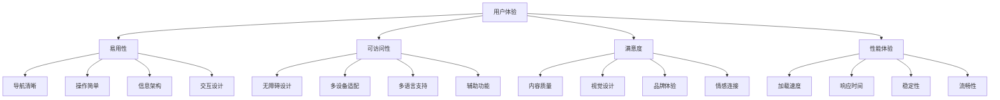
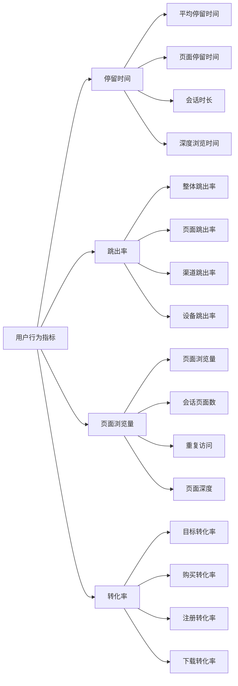
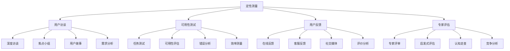
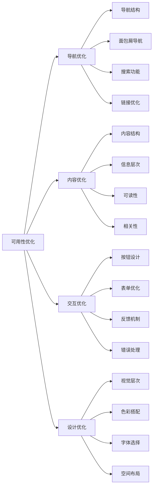
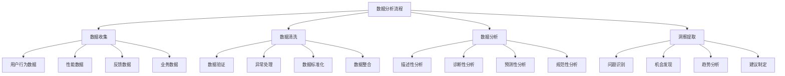
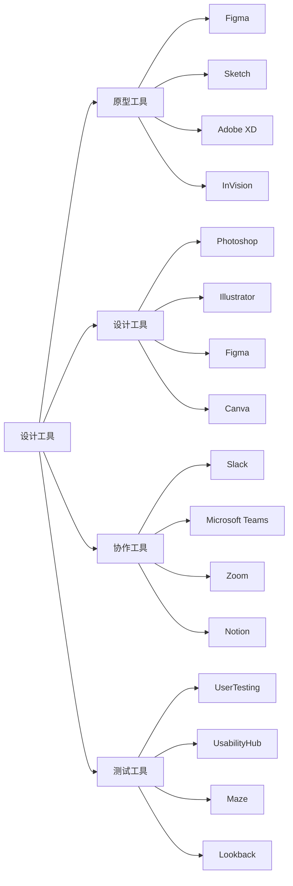
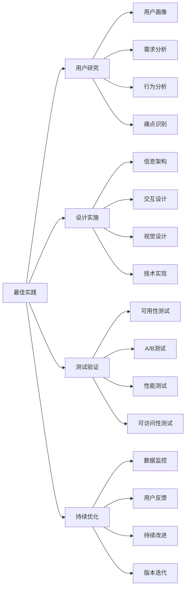

# 用户体验指标

## 🎯 学习目标
- 深入理解用户体验对SEO的重要性和影响
- 掌握核心用户体验指标的测量和分析方法
- 学会用户体验优化的策略和技巧
- 建立用户体验与SEO结合的认知框架

## 👥 用户体验概述

### 核心概念
**用户体验（UX）**：用户在使用产品或服务过程中的整体感受，包括易用性、可访问性、满意度等方面

### 用户体验重要性
| 重要性维度 | 具体表现 | 影响程度 | SEO价值 |
|------------|----------|----------|---------|
| **搜索排名** | 用户体验是Google排名因素 | 高 | 排名提升 |
| **用户行为** | 影响用户停留时间、跳出率 | 高 | 行为信号优化 |
| **转化率** | 直接影响商业转化 | 极高 | 商业价值提升 |
| **品牌形象** | 影响品牌认知和信任 | 中 | 品牌价值提升 |

## 📊 核心用户体验指标

### 1. Core Web Vitals
| 指标名称 | 指标描述 | 测量方法 | 优化目标 |
|----------|----------|----------|----------|
| **LCP** | 最大内容绘制时间 | 页面加载性能 | < 2.5秒 |
| **FID** | 首次输入延迟 | 交互响应性 | < 100毫秒 |
| **CLS** | 累积布局偏移 | 视觉稳定性 | < 0.1 |

### 2. 用户行为指标

### 3. 用户体验指标详解
| 指标类型 | 具体指标 | 测量工具 | 优化方向 |
|----------|----------|----------|----------|
| **性能指标** | 页面速度、响应时间 | PageSpeed Insights、GTmetrix | 技术优化 |
| **可用性指标** | 任务完成率、错误率 | 用户测试、热力图 | 界面优化 |
| **满意度指标** | 用户评分、反馈 | 调查问卷、NPS | 内容优化 |
| **可访问性指标** | 无障碍评分 | WAVE、axe | 可访问性优化 |

## 🔍 用户体验测量方法

### 1. 定量测量
| 测量方法 | 测量内容 | 实施方式 | 数据价值 |
|----------|----------|----------|----------|
| **网站分析** | 用户行为数据 | Google Analytics | 行为模式分析 |
| **性能监控** | 页面性能数据 | 性能监控工具 | 技术问题识别 |
| **A/B测试** | 用户体验对比 | 测试平台 | 优化效果验证 |
| **热力图分析** | 用户点击行为 | Hotjar、Crazy Egg | 交互优化指导 |

### 2. 定性测量

### 3. 测量工具
- **分析工具**：Google Analytics、Adobe Analytics
- **性能工具**：PageSpeed Insights、WebPageTest
- **热力图工具**：Hotjar、Crazy Egg、Mouseflow
- **测试工具**：UserTesting、UsabilityHub

## 🎯 用户体验优化策略

### 1. 性能优化
| 优化维度 | 优化方法 | 实施技巧 | 预期效果 |
|----------|----------|----------|----------|
| **页面速度** | 资源优化、CDN使用 | 图片压缩、代码优化 | 加载时间减少50% |
| **交互响应** | JavaScript优化 | 代码分割、懒加载 | 响应时间减少30% |
| **视觉稳定** | 布局优化 | 尺寸预设、字体优化 | CLS分数提升 |
| **移动体验** | 移动优化 | 响应式设计、触摸优化 | 移动用户体验提升 |

### 2. 可用性优化

### 3. 可访问性优化
- **键盘导航**：支持键盘操作
- **屏幕阅读器**：提供替代文本
- **色彩对比**：确保足够的对比度
- **字体大小**：支持字体缩放

## 📈 用户体验数据分析

### 1. 数据分析框架
| 分析维度 | 分析内容 | 分析方法 | 优化方向 |
|----------|----------|----------|----------|
| **行为分析** | 用户路径、点击行为 | 路径分析、热力图 | 用户流程优化 |
| **性能分析** | 页面性能、加载时间 | 性能监控、瓶颈分析 | 技术性能优化 |
| **转化分析** | 转化路径、转化率 | 漏斗分析、归因分析 | 转化率优化 |
| **满意度分析** | 用户反馈、评分 | 情感分析、趋势分析 | 内容体验优化 |

### 2. 数据分析流程

### 3. 数据可视化
- **仪表板**：实时监控关键指标
- **报告**：定期分析报告
- **图表**：趋势图表、对比图表
- **热力图**：用户行为可视化

## 🛠️ 用户体验优化工具

### 1. 分析工具
| 工具类型 | 工具名称 | 功能特点 | 应用场景 |
|----------|----------|----------|----------|
| **网站分析** | Google Analytics | 用户行为分析 | 行为数据收集 |
| **性能监控** | PageSpeed Insights | 页面性能分析 | 性能优化指导 |
| **热力图** | Hotjar | 用户行为可视化 | 交互优化分析 |
| **A/B测试** | Google Optimize | 用户体验测试 | 优化效果验证 |

### 2. 设计工具

### 3. 工具使用策略
- **工具组合**：结合多个工具的优势
- **数据整合**：整合不同工具的数据
- **工作流优化**：优化工具使用流程
- **持续学习**：持续学习新工具功能

## 🎯 用户体验最佳实践

### 1. 设计原则
| 设计原则 | 具体内容 | 实施要点 | 注意事项 |
|----------|----------|----------|----------|
| **用户中心** | 以用户需求为中心 | 用户研究、需求分析 | 避免主观设计 |
| **简洁明了** | 界面简洁、信息清晰 | 信息架构、视觉层次 | 避免信息过载 |
| **一致性** | 保持设计一致性 | 设计规范、组件库 | 避免混乱体验 |
| **可访问性** | 确保可访问性 | 无障碍设计、包容性 | 避免歧视性设计 |

### 2. 最佳实践

### 3. 实施建议
- **从用户开始**：从用户需求开始设计
- **迭代优化**：持续迭代和优化
- **数据驱动**：基于数据做决策
- **团队协作**：跨团队协作优化

## 📚 学习路径

### 基础理解
1. [[02-理解层-核心机制#2.3-技术SEO]] - 技术SEO
2. [[02-理解层-核心机制#2.4-内容SEO]] - 内容SEO
3. [[01-认知层-基础概念#1.5-SEO心理学]] - SEO心理学

### 深入应用
1. [[03-应用层-实践技能#3.1-SEO工具精通]] - 工具应用
2. [[03-应用层-实践技能#3.2-网站审计]] - 网站审计
3. [[04-精通层-高级策略#4.1-企业级SEO策略]] - 企业级策略

### 实战练习
1. [[05-实战案例与模板#5.1-成功案例分析]] - 案例分析
2. [[06-工具与资源#6.1-SEO工具大全]] - 工具资源
3. [[07-进阶专题#7.2-移动端SEO]] - 移动端SEO

## 📖 相关链接
- [[02-理解层-核心机制#2.3-技术SEO]] - 技术SEO
- [[02-理解层-核心机制#2.4-内容SEO]] - 内容SEO
- [[01-认知层-基础概念#1.5-SEO心理学]] - SEO心理学
- [[03-应用层-实践技能#3.1-SEO工具精通]] - 工具应用
- [[03-应用层-实践技能#3.2-网站审计]] - 网站审计
- [[04-精通层-高级策略]] - 高级策略
