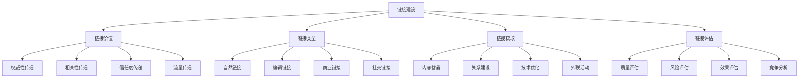
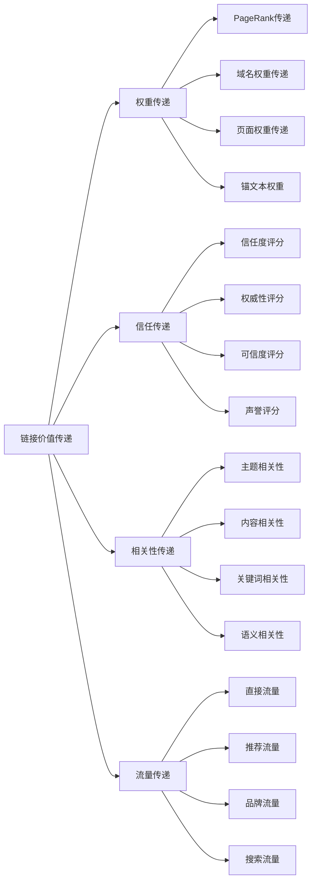
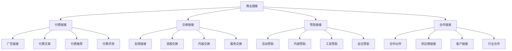
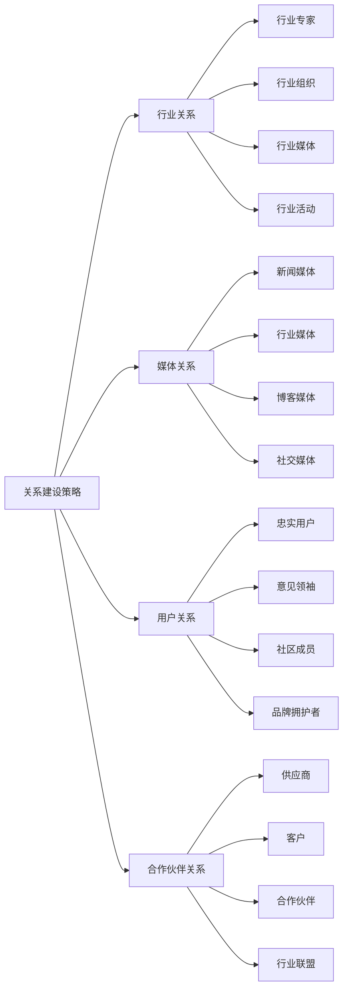
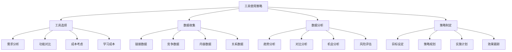
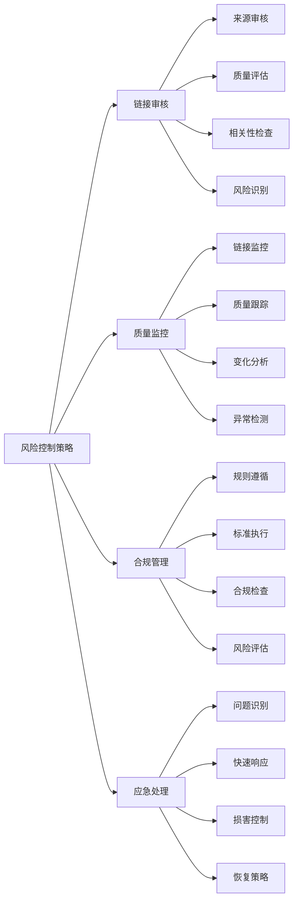
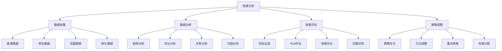
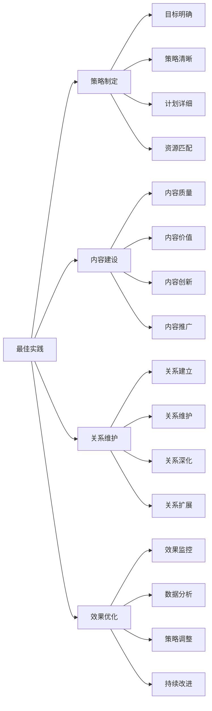

# 链接建设原理

## 🎯 学习目标
- 深入理解链接建设的核心原理和重要性
- 掌握链接价值传递机制和评估方法
- 学会链接建设策略和技巧
- 建立链接建设认知框架

## 🔗 链接建设概述

### 核心概念
**链接建设**：通过获取高质量外部链接来提升网站权威性和搜索排名的SEO策略

### 链接建设重要性
| 重要性维度 | 具体表现 | 影响程度 | SEO价值 |
|------------|----------|----------|---------|
| **排名因素** | 链接是重要排名因素 | 极高 | 排名提升 |
| **权威性** | 提升网站权威性 | 高 | 信任度提升 |
| **流量来源** | 直接流量来源 | 中 | 流量增长 |
| **品牌建设** | 品牌曝光和认知 | 中 | 品牌价值提升 |

## ⚡ 链接价值传递机制

### 1. PageRank算法
| 算法要素 | 具体内容 | 计算原理 | SEO影响 |
|----------|----------|----------|---------|
| **链接数量** | 指向页面的链接数量 | 链接越多，权重越高 | 影响排名基础 |
| **链接质量** | 链接来源页面的质量 | 高质量链接权重更高 | 影响排名质量 |
| **链接相关性** | 链接页面与目标页面相关性 | 相关链接权重更高 | 影响排名精准度 |
| **链接位置** | 链接在页面中的位置 | 正文链接权重更高 | 影响排名效果 |

### 2. 链接价值传递

### 3. 链接价值影响因素
| 影响因素 | 影响程度 | 优化方向 | 实施方法 |
|----------|----------|----------|----------|
| **链接来源权威性** | 极高 | 获取高质量链接 | 内容质量提升 |
| **链接相关性** | 高 | 提升链接相关性 | 主题匹配优化 |
| **链接位置** | 中 | 优化链接位置 | 内容布局优化 |
| **锚文本** | 中 | 优化锚文本 | 关键词优化 |

## 🎯 链接类型分析

### 1. 自然链接
| 链接类型 | 特征描述 | 获取方法 | SEO价值 |
|----------|----------|----------|---------|
| **编辑链接** | 编辑主动添加的链接 | 高质量内容创作 | 极高 |
| **引用链接** | 内容引用产生的链接 | 权威内容发布 | 高 |
| **资源链接** | 资源推荐产生的链接 | 有用资源提供 | 中 |
| **新闻链接** | 新闻报道产生的链接 | 新闻价值内容 | 高 |

### 2. 商业链接

### 3. 链接质量评估
- **权威性**：链接来源网站的权威性
- **相关性**：链接页面与目标页面的相关性
- **信任度**：链接来源网站的可信度
- **流量价值**：链接带来的流量价值

## 🚀 链接获取策略

### 1. 内容营销策略
| 策略类型 | 具体方法 | 实施技巧 | 预期效果 |
|----------|----------|----------|----------|
| **原创内容** | 创作高质量原创内容 | 深度研究、独特观点 | 自然链接获取 |
| **数据研究** | 发布行业数据报告 | 数据可视化、洞察分析 | 权威链接获取 |
| **工具开发** | 开发实用工具 | 免费使用、价值提供 | 工具推荐链接 |
| **资源整理** | 整理行业资源 | 全面性、实用性 | 资源推荐链接 |

### 2. 关系建设策略

### 3. 外联活动策略
- **邮件外联**：个性化邮件联系
- **社交媒体**：社交媒体互动
- **线下活动**：行业会议和活动
- **合作项目**：共同项目合作

## 📊 链接建设工具

### 1. 链接分析工具
| 工具类型 | 工具名称 | 功能特点 | 应用场景 |
|----------|----------|----------|----------|
| **链接分析** | Ahrefs、SEMrush | 链接数据、竞争分析 | 链接策略制定 |
| **链接监控** | Monitor Backlinks | 链接监控、变化跟踪 | 链接效果监控 |
| **链接建设** | BuzzStream | 外联管理、关系维护 | 外联活动管理 |
| **内容营销** | BuzzSumo | 内容分析、影响者发现 | 内容策略制定 |

### 2. 工具使用策略

### 3. 工具组合使用
- **多工具结合**：结合多个工具的优势
- **数据交叉验证**：使用不同工具验证数据
- **功能互补**：选择功能互补的工具
- **成本效益**：考虑工具的成本效益

## ⚠️ 链接建设风险控制

### 1. 常见风险
| 风险类型 | 风险描述 | 影响程度 | 预防措施 |
|----------|----------|----------|----------|
| **垃圾链接** | 低质量、无关链接 | 高 | 链接质量审核 |
| **过度优化** | 锚文本过度优化 | 中 | 自然化优化 |
| **付费链接** | 违反搜索引擎规则 | 极高 | 避免付费链接 |
| **链接农场** | 大量低质量链接 | 高 | 避免链接农场 |

### 2. 风险控制策略

### 3. 合规要求
- **自然性**：保持链接的自然性
- **相关性**：确保链接相关性
- **透明度**：保持链接透明度
- **价值性**：提供实际价值

## 📈 链接建设效果评估

### 1. 评估指标
| 指标类型 | 具体指标 | 测量方法 | 优化方向 |
|----------|----------|----------|----------|
| **数量指标** | 链接数量、增长率 | 工具监控 | 链接数量增长 |
| **质量指标** | 链接质量、权威性 | 质量评估 | 链接质量提升 |
| **排名指标** | 关键词排名变化 | 排名监控 | 排名提升 |
| **流量指标** | 推荐流量、转化率 | 流量分析 | 流量质量提升 |

### 2. 效果分析

### 3. 持续优化
- **定期评估**：定期评估链接建设效果
- **策略调整**：根据效果调整策略
- **方法改进**：持续改进方法
- **目标更新**：根据进展更新目标

## 🎯 链接建设最佳实践

### 1. 建设原则
| 建设原则 | 具体内容 | 实施要点 | 注意事项 |
|----------|----------|----------|----------|
| **质量优先** | 优先获取高质量链接 | 内容质量、关系建设 | 避免数量优先 |
| **自然性** | 保持链接的自然性 | 自然获取、自然分布 | 避免过度优化 |
| **相关性** | 确保链接相关性 | 主题匹配、内容相关 | 避免无关链接 |
| **持续性** | 持续链接建设 | 长期策略、持续执行 | 避免短期行为 |

### 2. 最佳实践

### 3. 实施建议
- **从内容开始**：从高质量内容开始
- **建立关系**：建立行业关系网络
- **持续执行**：持续执行链接建设
- **效果跟踪**：跟踪链接建设效果

## 📚 学习路径

### 基础理解
1. [[02-理解层-核心机制#2.1-Google算法深度解析]] - 算法理解
2. [[02-理解层-核心机制#2.4-内容SEO]] - 内容SEO
3. [[02-理解层-核心机制#2.5-用户体验]] - 用户体验

### 深入应用
1. [[03-应用层-实践技能#3.1-SEO工具精通]] - 工具应用
2. [[03-应用层-实践技能#3.3-竞争分析]] - 竞争分析
3. [[04-精通层-高级策略#4.1-企业级SEO策略]] - 企业级策略

### 实战练习
1. [[05-实战案例与模板#5.1-成功案例分析]] - 案例分析
2. [[06-工具与资源#6.1-SEO工具大全]] - 工具资源
3. [[07-进阶专题#7.1-SEO与AI]] - SEO与AI

## 📖 相关链接
- [[02-理解层-核心机制#2.1-Google算法深度解析]] - 算法理解
- [[02-理解层-核心机制#2.4-内容SEO]] - 内容SEO
- [[02-理解层-核心机制#2.5-用户体验]] - 用户体验
- [[03-应用层-实践技能#3.1-SEO工具精通]] - 工具应用
- [[03-应用层-实践技能#3.3-竞争分析]] - 竞争分析
- [[04-精通层-高级策略]] - 高级策略
