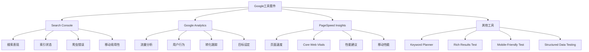
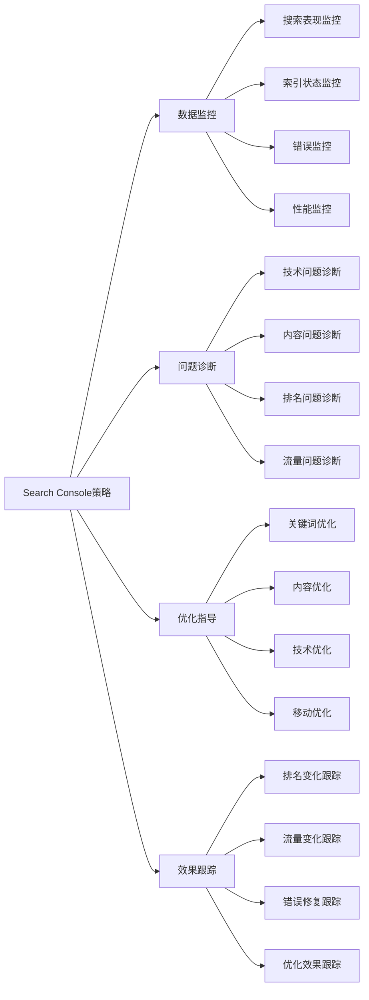
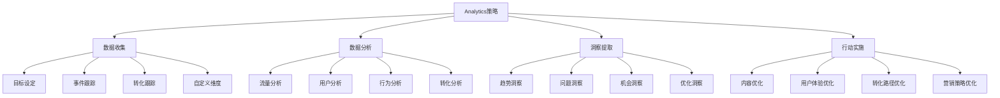
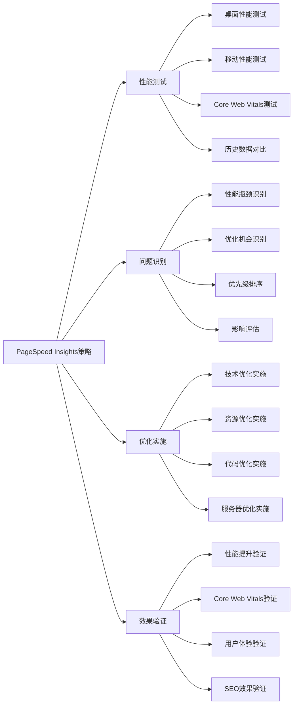
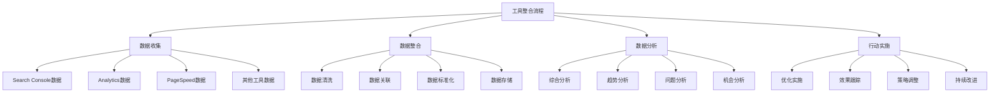
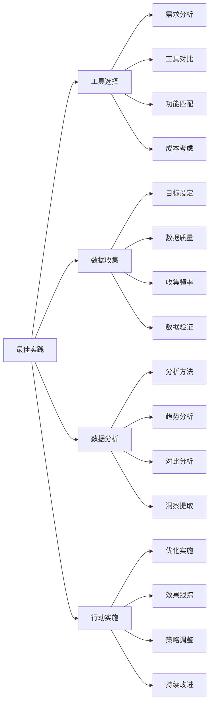

# Google工具套件

## 🎯 学习目标
- 深入理解Google官方SEO工具的功能和应用
- 掌握Search Console与Analytics的使用方法
- 学会利用Google工具进行SEO分析和优化
- 建立Google工具套件应用认知框架

## 🔧 Google工具套件概述

### 核心概念
**Google工具套件**：Google提供的官方SEO和网站分析工具集合，包括Search Console、Analytics、PageSpeed Insights等

### Google工具重要性
| 重要性维度 | 具体表现 | 影响程度 | 优化价值 |
|------------|----------|----------|----------|
| **官方数据** | 提供官方SEO数据 | 极高 | 数据准确性保证 |
| **免费使用** | 完全免费的工具 | 高 | 成本效益最大化 |
| **数据整合** | 工具间数据整合 | 高 | 分析效率提升 |
| **持续更新** | 持续功能更新 | 中 | 功能不断完善 |

## 🔍 Google Search Console

### 1. Search Console核心功能
| 功能模块 | 功能描述 | 应用场景 | SEO价值 |
|----------|----------|----------|---------|
| **搜索表现** | 搜索查询和点击数据 | 关键词分析、排名监控 | 搜索优化指导 |
| **索引状态** | 页面索引和覆盖情况 | 内容发现、索引优化 | 内容可见性提升 |
| **爬虫错误** | 爬虫访问错误报告 | 技术问题诊断 | 技术SEO优化 |
| **移动易用性** | 移动端用户体验 | 移动SEO优化 | 移动排名提升 |

### 2. Search Console使用策略

### 3. Search Console最佳实践
- **定期检查**：定期检查Search Console数据
- **问题优先**：优先处理错误和问题
- **数据对比**：对比不同时期的数据变化
- **行动导向**：基于数据采取具体行动

## 📊 Google Analytics

### 1. Analytics核心功能
| 功能模块 | 功能描述 | 应用场景 | SEO价值 |
|----------|----------|----------|---------|
| **流量分析** | 网站流量来源分析 | 流量来源优化 | 流量质量提升 |
| **用户行为** | 用户行为路径分析 | 用户体验优化 | 用户满意度提升 |
| **转化跟踪** | 目标转化跟踪 | 转化率优化 | 商业价值提升 |
| **实时数据** | 实时流量监控 | 实时优化 | 即时响应能力 |

### 2. Analytics使用策略

### 3. Analytics最佳实践
- **目标设定**：设定明确的分析目标
- **数据质量**：确保数据收集质量
- **定期分析**：定期分析数据趋势
- **行动导向**：基于数据采取行动

## ⚡ PageSpeed Insights

### 1. PageSpeed Insights功能
| 功能模块 | 功能描述 | 应用场景 | SEO价值 |
|----------|----------|----------|---------|
| **页面速度** | 页面加载速度分析 | 性能优化 | Core Web Vitals提升 |
| **Core Web Vitals** | 核心网页指标分析 | 用户体验优化 | 排名因素优化 |
| **性能建议** | 性能优化建议 | 技术优化 | 性能提升指导 |
| **移动性能** | 移动端性能分析 | 移动优化 | 移动排名提升 |

### 2. PageSpeed Insights使用策略

### 3. PageSpeed Insights最佳实践
- **定期测试**：定期测试页面性能
- **多设备测试**：测试不同设备性能
- **优化实施**：根据建议实施优化
- **效果跟踪**：跟踪优化效果

## 🛠️ 其他Google工具

### 1. Keyword Planner
| 功能特点 | 应用场景 | 使用技巧 | SEO价值 |
|----------|----------|----------|---------|
| **关键词研究** | 关键词发现和分析 | 搜索量、竞争度分析 | 关键词策略制定 |
| **搜索量数据** | 关键词搜索量 | 关键词价值评估 | 关键词优先级排序 |
| **竞争分析** | 关键词竞争情况 | 竞争度评估 | 关键词选择优化 |
| **趋势分析** | 关键词趋势变化 | 趋势预测 | 关键词策略调整 |

### 2. Rich Results Test
| 功能特点 | 应用场景 | 使用技巧 | SEO价值 |
|----------|----------|----------|---------|
| **结构化数据测试** | 结构化数据验证 | 格式验证、错误检查 | 富媒体结果优化 |
| **预览功能** | 搜索结果预览 | 效果预览 | 用户体验优化 |
| **错误诊断** | 结构化数据错误 | 问题识别、修复指导 | 技术问题解决 |
| **多格式支持** | 多种结构化数据格式 | 格式选择、转换 | 兼容性优化 |

### 3. Mobile-Friendly Test
| 功能特点 | 应用场景 | 使用技巧 | SEO价值 |
|----------|----------|----------|---------|
| **移动友好性测试** | 移动端兼容性检查 | 移动适配验证 | 移动排名优化 |
| **问题识别** | 移动端问题识别 | 问题诊断、修复指导 | 移动用户体验提升 |
| **建议提供** | 移动优化建议 | 优化方向指导 | 移动SEO优化 |
| **实时测试** | 实时移动测试 | 即时结果反馈 | 快速问题解决 |

## 📈 工具整合使用

### 1. 工具整合策略
| 整合方式 | 整合内容 | 实施方法 | 整合价值 |
|----------|----------|----------|----------|
| **数据整合** | 多工具数据整合 | 数据关联、综合分析 | 全面分析能力提升 |
| **工作流整合** | 工具间工作流整合 | 流程优化、效率提升 | 工作效率提升 |
| **报告整合** | 多工具报告整合 | 统一报告、综合展示 | 决策支持能力提升 |
| **自动化整合** | 工具间自动化整合 | 自动化流程、减少人工 | 运营效率提升 |

### 2. 工具整合流程

### 3. 整合最佳实践
- **统一目标**：设定统一的优化目标
- **数据质量**：确保数据质量和准确性
- **定期整合**：定期进行数据整合分析
- **行动导向**：基于整合数据采取行动

## 🎯 Google工具最佳实践

### 1. 使用原则
| 使用原则 | 具体内容 | 实施要点 | 注意事项 |
|----------|----------|----------|----------|
| **数据驱动** | 基于数据做决策 | 数据收集、分析、行动 | 避免主观判断 |
| **持续监控** | 持续监控关键指标 | 定期检查、及时响应 | 避免数据滞后 |
| **问题优先** | 优先处理问题 | 问题识别、优先级排序 | 避免问题积累 |
| **行动导向** | 基于数据采取行动 | 具体行动、效果跟踪 | 避免只分析不行动 |

### 2. 最佳实践

### 3. 实施建议
- **从基础开始**：从基础工具使用开始
- **逐步深入**：逐步深入使用高级功能
- **数据优先**：优先关注数据质量
- **持续学习**：持续学习新功能

## 📚 学习路径

### 基础理解
1. [[02-理解层-核心机制#2.1-Google算法深度解析]] - 算法理解
2. [[02-理解层-核心机制#2.3-技术SEO]] - 技术SEO
3. [[02-理解层-核心机制#2.4-内容SEO]] - 内容SEO

### 深入应用
1. [[03-应用层-实践技能#3.2-网站审计]] - 网站审计
2. [[03-应用层-实践技能#3.3-竞争分析]] - 竞争分析
3. [[04-精通层-高级策略#4.1-企业级SEO策略]] - 企业级策略

### 实战练习
1. [[05-实战案例与模板#5.1-成功案例分析]] - 案例分析
2. [[06-工具与资源#6.1-SEO工具大全]] - 工具资源
3. [[06-工具与资源#6.2-学习资源]] - 学习资源

## 📖 相关链接
- [[02-理解层-核心机制#2.1-Google算法深度解析]] - 算法理解
- [[02-理解层-核心机制#2.3-技术SEO]] - 技术SEO
- [[02-理解层-核心机制#2.4-内容SEO]] - 内容SEO
- [[03-应用层-实践技能#3.2-网站审计]] - 网站审计
- [[03-应用层-实践技能#3.3-竞争分析]] - 竞争分析
- [[04-精通层-高级策略]] - 高级策略
