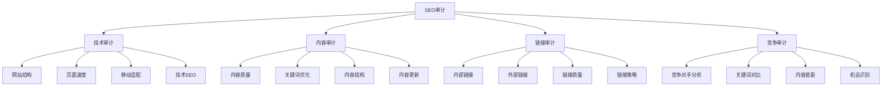
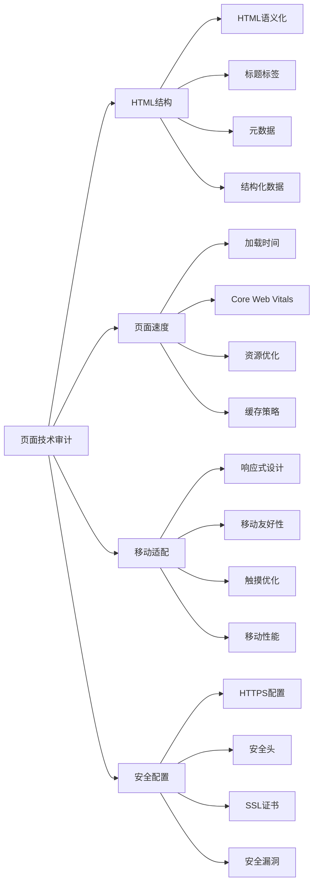
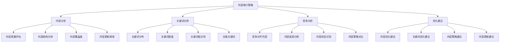
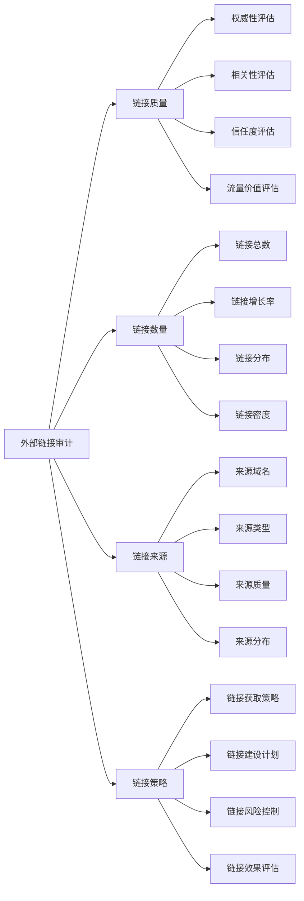
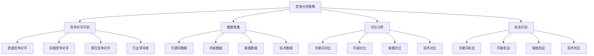
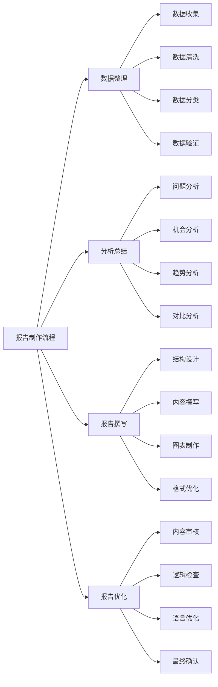
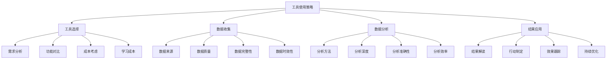
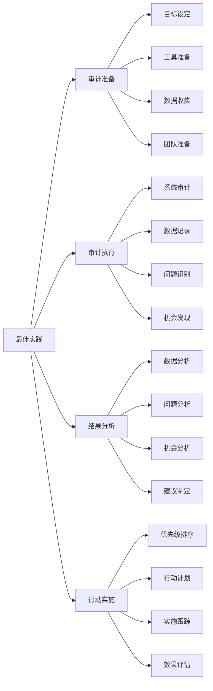

# SEO审计清单

## 🎯 学习目标
- 掌握全面SEO审计的方法和流程
- 学会使用SEO审计清单进行系统性检查
- 了解SEO审计工具的使用技巧
- 建立SEO审计认知框架

## 📋 SEO审计概述

### 核心概念
**SEO审计**：对网站进行全面的SEO分析和评估，识别问题、机会和优化建议的系统性过程

### SEO审计重要性
| 重要性维度 | 具体表现 | 影响程度 | 审计价值 |
|------------|----------|----------|----------|
| **问题识别** | 发现SEO问题和缺陷 | 极高 | 问题解决指导 |
| **机会发现** | 发现优化机会 | 高 | 策略制定依据 |
| **基准建立** | 建立SEO基准 | 中 | 效果评估基础 |
| **持续改进** | 支持持续优化 | 高 | 优化方向指导 |

## 🔍 技术SEO审计

### 1. 网站结构审计
| 审计项目 | 检查内容 | 评估标准 | 优化建议 |
|----------|----------|----------|----------|
| **URL结构** | URL语义化、长度、层次 | 简洁、语义化、层次清晰 | URL优化、重定向处理 |
| **导航结构** | 主导航、面包屑、内部链接 | 清晰、完整、用户友好 | 导航优化、链接建设 |
| **网站地图** | XML sitemap、HTML sitemap | 完整、准确、及时更新 | sitemap优化、提交 |
| **robots.txt** | 爬虫指令、禁止访问 | 正确、完整、有效 | robots.txt优化 |

### 2. 页面技术审计

### 3. 技术审计工具
- **网站分析**：Google Search Console、Screaming Frog
- **性能测试**：PageSpeed Insights、GTmetrix
- **移动测试**：Mobile-Friendly Test、BrowserStack
- **安全测试**：SSL Labs、Security Headers

## 📝 内容SEO审计

### 1. 内容质量审计
| 审计维度 | 检查内容 | 评估标准 | 优化方向 |
|----------|----------|----------|----------|
| **内容质量** | 原创性、深度、价值 | 高质量、原创、有价值 | 内容质量提升 |
| **内容结构** | 标题层次、段落结构 | 清晰、逻辑、易读 | 内容结构优化 |
| **关键词优化** | 关键词密度、分布 | 自然、相关、适度 | 关键词优化 |
| **内容更新** | 更新频率、时效性 | 定期、及时、相关 | 内容更新策略 |

### 2. 内容审计策略

### 3. 内容审计工具
- **内容分析**：SEMrush、Ahrefs Content Explorer
- **关键词分析**：Google Keyword Planner、Ubersuggest
- **竞争分析**：BuzzSumo、SimilarWeb
- **内容优化**：Yoast SEO、RankMath

## 🔗 链接审计

### 1. 内部链接审计
| 审计项目 | 检查内容 | 评估标准 | 优化建议 |
|----------|----------|----------|----------|
| **链接结构** | 内部链接分布、层次 | 合理、完整、平衡 | 链接结构优化 |
| **锚文本** | 锚文本分布、关键词 | 自然、相关、多样化 | 锚文本优化 |
| **链接质量** | 链接相关性、价值 | 相关、有价值、自然 | 链接质量提升 |
| **链接数量** | 内部链接数量、密度 | 适度、平衡、自然 | 链接数量优化 |

### 2. 外部链接审计

### 3. 链接审计工具
- **链接分析**：Ahrefs、SEMrush、Moz
- **链接监控**：Monitor Backlinks、LinkResearchTools
- **链接建设**：BuzzStream、Pitchbox
- **链接检查**：Link Checker、Broken Link Checker

## 🏆 竞争分析审计

### 1. 竞争对手分析
| 分析维度 | 分析内容 | 分析方法 | 分析价值 |
|----------|----------|----------|----------|
| **关键词分析** | 竞争对手关键词策略 | 关键词对比、差距分析 | 关键词机会识别 |
| **内容分析** | 竞争对手内容策略 | 内容对比、质量分析 | 内容策略制定 |
| **链接分析** | 竞争对手链接策略 | 链接对比、来源分析 | 链接建设指导 |
| **技术分析** | 竞争对手技术实现 | 技术对比、性能分析 | 技术优化方向 |

### 2. 竞争分析策略

### 3. 竞争分析工具
- **关键词分析**：SEMrush、Ahrefs、SpyFu
- **内容分析**：BuzzSumo、ContentKing
- **链接分析**：Ahrefs、Majestic
- **流量分析**：SimilarWeb、Alexa

## 📊 审计报告制作

### 1. 报告结构
| 报告部分 | 内容描述 | 制作要点 | 报告价值 |
|----------|----------|----------|----------|
| **执行摘要** | 审计结果概述 | 简洁、重点突出 | 快速了解问题 |
| **问题分析** | 详细问题分析 | 具体、可操作 | 问题解决指导 |
| **机会识别** | 优化机会识别 | 优先级排序 | 策略制定依据 |
| **行动计划** | 具体行动计划 | 时间表、责任人 | 实施指导 |

### 2. 报告制作流程

### 3. 报告工具
- **数据分析**：Excel、Google Sheets
- **图表制作**：Tableau、Power BI
- **报告设计**：Canva、Adobe InDesign
- **协作工具**：Google Docs、Notion

## 🛠️ SEO审计工具

### 1. 综合审计工具
| 工具类型 | 工具名称 | 功能特点 | 适用场景 |
|----------|----------|----------|----------|
| **综合审计** | SEMrush、Ahrefs | 全面SEO分析 | 综合审计 |
| **技术审计** | Screaming Frog、Sitebulb | 技术SEO分析 | 技术审计 |
| **内容审计** | ContentKing、Botify | 内容SEO分析 | 内容审计 |
| **性能审计** | PageSpeed Insights、GTmetrix | 性能分析 | 性能审计 |

### 2. 工具使用策略

### 3. 工具组合使用
- **多工具结合**：结合多个工具的优势
- **数据交叉验证**：使用不同工具验证数据
- **功能互补**：选择功能互补的工具
- **成本效益**：考虑工具的成本效益

## 🎯 SEO审计最佳实践

### 1. 审计原则
| 审计原则 | 具体内容 | 实施要点 | 注意事项 |
|----------|----------|----------|----------|
| **全面性** | 全面覆盖SEO要素 | 系统性、完整性 | 避免遗漏重要项目 |
| **客观性** | 客观分析数据 | 数据驱动、事实导向 | 避免主观判断 |
| **可操作性** | 提供可操作建议 | 具体、明确、可行 | 避免空泛建议 |
| **持续性** | 持续审计优化 | 定期、系统、持续 | 避免一次性审计 |

### 2. 最佳实践

### 3. 实施建议
- **系统化审计**：建立系统化的审计流程
- **工具熟练**：熟练掌握审计工具使用
- **数据驱动**：基于数据进行分析和决策
- **持续改进**：持续改进审计方法和流程

## 📚 学习路径

### 基础理解
1. [[02-理解层-核心机制#2.3-技术SEO]] - 技术SEO
2. [[02-理解层-核心机制#2.4-内容SEO]] - 内容SEO
3. [[02-理解层-核心机制#2.6-链接建设]] - 链接建设

### 深入应用
1. [[03-应用层-实践技能#3.1-SEO工具精通]] - 工具应用
2. [[03-应用层-实践技能#3.3-竞争分析]] - 竞争分析
3. [[04-精通层-高级策略#4.1-企业级SEO策略]] - 企业级策略

### 实战练习
1. [[05-实战案例与模板#5.1-成功案例分析]] - 案例分析
2. [[06-工具与资源#6.1-SEO工具大全]] - 工具资源
3. [[07-进阶专题#7.1-SEO与AI]] - SEO与AI

## 📖 相关链接
- [[02-理解层-核心机制#2.3-技术SEO]] - 技术SEO
- [[02-理解层-核心机制#2.4-内容SEO]] - 内容SEO
- [[02-理解层-核心机制#2.6-链接建设]] - 链接建设
- [[03-应用层-实践技能#3.1-SEO工具精通]] - 工具应用
- [[03-应用层-实践技能#3.3-竞争分析]] - 竞争分析
- [[04-精通层-高级策略]] - 高级策略
