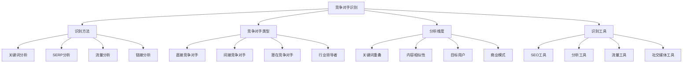
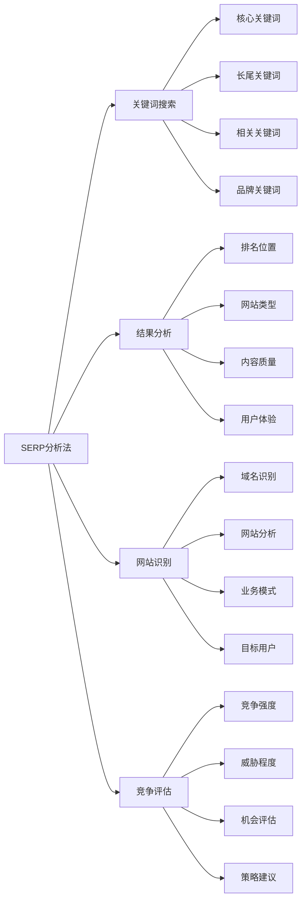
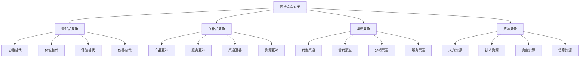
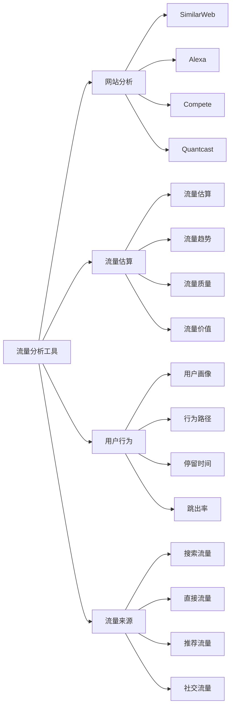
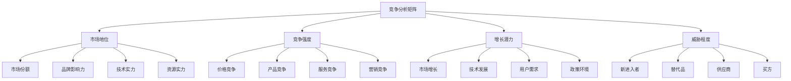
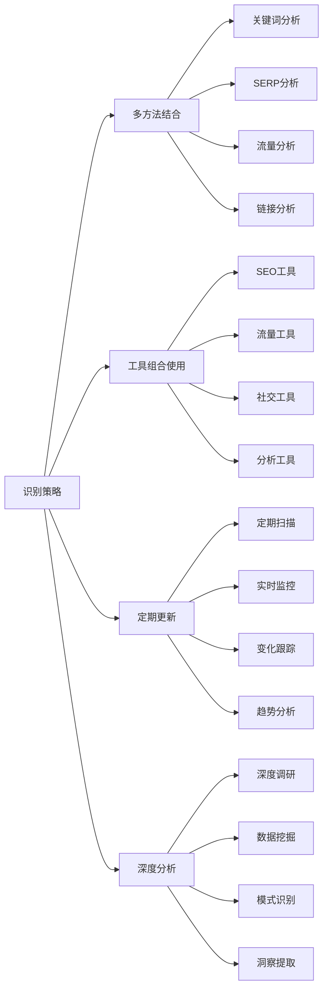

# 竞争对手识别

## 🎯 学习目标
- 掌握竞争对手识别的多种方法和技巧
- 学会使用工具进行竞争对手发现和分析
- 了解不同类型竞争对手的特点和影响
- 建立竞争对手识别和分类的认知框架

## 🔍 竞争对手识别概述

### 核心概念
**竞争对手识别**：通过多种方法和工具发现和分析在搜索引擎中与目标网站竞争排名的其他网站

### 竞争对手识别重要性
| 重要性维度 | 具体表现 | 影响程度 | 分析价值 |
|------------|----------|----------|----------|
| **策略制定** | 了解竞争格局 | 极高 | 策略制定依据 |
| **机会发现** | 发现市场机会 | 高 | 机会识别指导 |
| **威胁识别** | 识别竞争威胁 | 高 | 风险预警 |
| **基准建立** | 建立竞争基准 | 中 | 效果评估基础 |

## 🎯 竞争对手识别方法

### 1. 关键词分析法
| 分析方法 | 具体步骤 | 识别效果 | 适用场景 |
|----------|----------|----------|----------|
| **核心关键词** | 分析核心关键词排名 | 高 | 主要竞争对手 |
| **长尾关键词** | 分析长尾关键词排名 | 中 | 细分竞争对手 |
| **相关关键词** | 分析相关关键词排名 | 中 | 潜在竞争对手 |
| **品牌关键词** | 分析品牌关键词排名 | 低 | 品牌竞争对手 |

### 2. SERP分析法

### 3. 流量分析法
- **流量来源分析**：分析竞争对手的流量来源
- **流量质量分析**：分析竞争对手的流量质量
- **流量趋势分析**：分析竞争对手的流量趋势
- **流量地域分析**：分析竞争对手的流量地域分布

### 4. 链接分析法
- **链接来源分析**：分析竞争对手的链接来源
- **链接质量分析**：分析竞争对手的链接质量
- **链接策略分析**：分析竞争对手的链接策略
- **链接增长分析**：分析竞争对手的链接增长

## 🏢 竞争对手类型分析

### 1. 直接竞争对手
| 特征维度 | 具体表现 | 竞争强度 | 应对策略 |
|----------|----------|----------|----------|
| **业务模式** | 相同的业务模式 | 极高 | 差异化竞争 |
| **目标用户** | 相同的目标用户 | 极高 | 用户细分 |
| **产品服务** | 相似的产品服务 | 高 | 产品创新 |
| **市场定位** | 相似的市场定位 | 高 | 定位差异化 |

### 2. 间接竞争对手

### 3. 潜在竞争对手
- **新进入者**：可能进入市场的新企业
- **技术变革者**：可能改变行业的技术创新
- **跨界竞争者**：其他行业的跨界竞争者
- **平台竞争者**：大型平台的竞争威胁

### 4. 行业领导者
- **市场份额**：在行业中占据主导地位
- **品牌影响力**：具有强大的品牌影响力
- **技术领先**：在技术上处于领先地位
- **资源丰富**：拥有丰富的资源

## 🛠️ 竞争对手识别工具

### 1. SEO工具
| 工具类型 | 工具名称 | 功能特点 | 应用场景 |
|----------|----------|----------|----------|
| **综合分析** | SEMrush、Ahrefs | 全面竞争分析 | 主要竞争对手识别 |
| **关键词分析** | Google Keyword Planner | 关键词竞争分析 | 关键词竞争对手 |
| **排名监控** | Rank Tracker、SERPWatcher | 排名监控分析 | 排名竞争对手 |
| **内容分析** | BuzzSumo、ContentKing | 内容竞争分析 | 内容竞争对手 |

### 2. 流量分析工具

### 3. 社交媒体工具
- **社交媒体监控**：监控竞争对手的社交媒体活动
- **社交媒体分析**：分析竞争对手的社交媒体表现
- **社交媒体工具**：Hootsuite、Sprout Social
- **社交媒体指标**：粉丝数量、互动率、影响力

### 4. 其他分析工具
- **财务分析**：分析竞争对手的财务状况
- **专利分析**：分析竞争对手的专利情况
- **招聘分析**：分析竞争对手的招聘情况
- **新闻监控**：监控竞争对手的新闻动态

## 📊 竞争对手分析框架

### 1. SWOT分析框架
| 分析维度 | 分析内容 | 分析方法 | 分析价值 |
|----------|----------|----------|----------|
| **优势(Strengths)** | 竞争对手的优势 | 对比分析 | 学习借鉴 |
| **劣势(Weaknesses)** | 竞争对手的劣势 | 差距分析 | 机会识别 |
| **机会(Opportunities)** | 市场机会 | 趋势分析 | 策略制定 |
| **威胁(Threats)** | 竞争威胁 | 风险评估 | 风险控制 |

### 2. 竞争分析矩阵

### 3. 竞争分析流程
- **数据收集**：收集竞争对手的相关数据
- **数据分析**：分析竞争对手的优劣势
- **对比分析**：与自身进行对比分析
- **策略制定**：制定相应的竞争策略

## 🎯 竞争对手识别最佳实践

### 1. 识别原则
| 识别原则 | 具体内容 | 实施要点 | 注意事项 |
|----------|----------|----------|----------|
| **全面性** | 全面识别各类竞争对手 | 多维度、多角度 | 避免遗漏重要竞争对手 |
| **准确性** | 准确识别竞争对手 | 数据验证、交叉验证 | 避免误判 |
| **及时性** | 及时更新竞争对手信息 | 定期更新、实时监控 | 避免信息过时 |
| **系统性** | 系统性分析竞争对手 | 结构化、标准化 | 避免分析不系统 |

### 2. 识别策略

### 3. 实施建议
- **建立体系**：建立竞争对手识别体系
- **工具熟练**：熟练掌握各种识别工具
- **数据驱动**：基于数据进行竞争对手识别
- **持续优化**：持续优化识别方法和流程

## 📚 学习路径

### 基础理解
1. [[02-理解层-核心机制#2.2-关键词策略]] - 关键词策略
2. [[02-理解层-核心机制#2.6-链接建设]] - 链接建设
3. [[03-应用层-实践技能#3.1-SEO工具精通]] - 工具应用

### 深入应用
1. [[03-应用层-实践技能#3.3-竞争分析#02-竞争分析框架]] - 分析框架
2. [[03-应用层-实践技能#3.3-竞争分析#03-关键词竞争分析]] - 关键词竞争
3. [[03-应用层-实践技能#3.3-竞争分析#04-内容差距分析]] - 内容差距

### 实战练习
1. [[05-实战案例与模板#5.1-成功案例分析]] - 案例分析
2. [[06-工具与资源#6.1-SEO工具大全]] - 工具资源
3. [[04-精通层-高级策略#4.1-企业级SEO策略]] - 企业级策略

## 📖 相关链接
- [[02-理解层-核心机制#2.2-关键词策略]] - 关键词策略
- [[02-理解层-核心机制#2.6-链接建设]] - 链接建设
- [[03-应用层-实践技能#3.1-SEO工具精通]] - 工具应用
- [[03-应用层-实践技能#3.3-竞争分析#02-竞争分析框架]] - 分析框架
- [[03-应用层-实践技能#3.3-竞争分析#03-关键词竞争分析]] - 关键词竞争
- [[03-应用层-实践技能#3.3-竞争分析#04-内容差距分析]] - 内容差距
