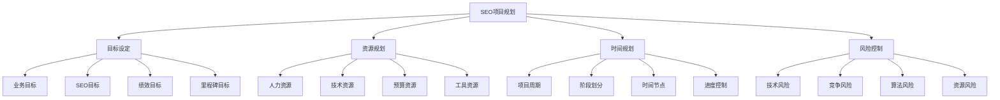
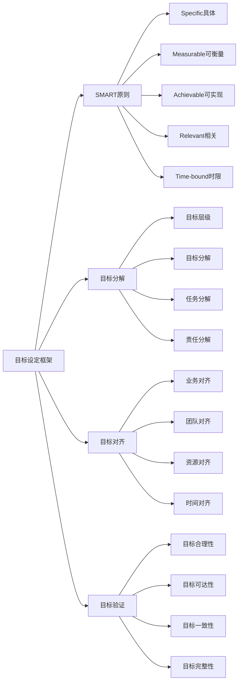
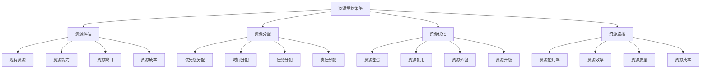
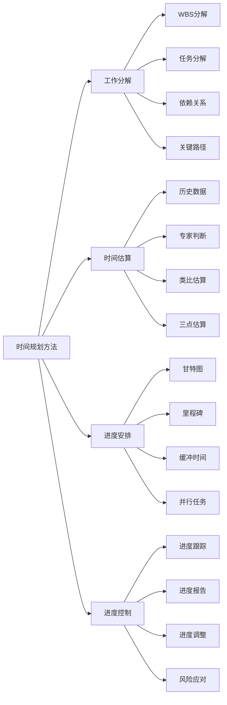
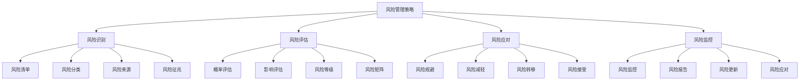
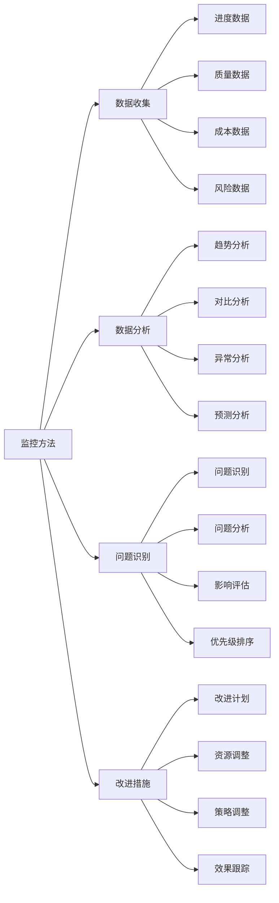
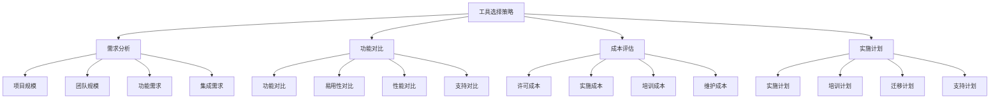
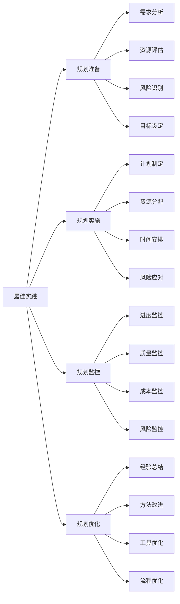

# SEO项目规划

## 🎯 学习目标
- 掌握SEO项目规划的核心要素和方法
- 学会设定合理的SEO项目目标和时间规划
- 了解SEO项目管理的工具和技巧
- 建立SEO项目规划的认知框架

## 📋 SEO项目规划概述

### 核心概念
**SEO项目规划**：对SEO项目进行全面规划，包括目标设定、资源分配、时间安排、风险控制等要素的系统性管理过程

### SEO项目规划重要性
| 重要性维度 | 具体表现 | 影响程度 | 规划价值 |
|------------|----------|----------|----------|
| **目标明确** | 明确项目目标和方向 | 极高 | 项目成功基础 |
| **资源优化** | 合理配置和利用资源 | 高 | 效率最大化 |
| **风险控制** | 识别和控制项目风险 | 高 | 项目稳定性 |
| **进度管理** | 有效控制项目进度 | 中 | 按时交付 |

## 🎯 项目目标设定

### 1. 目标层次结构
| 目标层次 | 目标类型 | 设定方法 | 评估标准 |
|----------|----------|----------|----------|
| **战略目标** | 长期业务目标 | 业务战略分析 | 业务价值 |
| **战术目标** | 中期SEO目标 | SEO策略制定 | SEO效果 |
| **操作目标** | 短期执行目标 | 具体任务分解 | 执行效率 |
| **绩效目标** | 量化绩效指标 | KPI设定 | 绩效评估 |

### 2. 目标设定框架

### 3. 目标设定方法
- **业务目标分析**：分析业务需求和目标
- **竞争分析**：分析竞争对手和目标
- **资源评估**：评估可用资源和能力
- **目标协商**：与相关方协商确定目标

## 📊 资源规划

### 1. 人力资源规划
| 角色类型 | 技能要求 | 工作内容 | 时间分配 |
|----------|----------|----------|----------|
| **SEO经理** | 项目管理、SEO策略 | 项目规划、团队管理 | 40% |
| **SEO专员** | SEO技能、执行能力 | 具体SEO任务执行 | 80% |
| **内容专员** | 内容创作、编辑 | 内容策略、内容创作 | 60% |
| **技术专员** | 技术SEO、开发 | 技术优化、问题解决 | 50% |

### 2. 资源规划策略

### 3. 预算规划
- **人力成本**：人员工资和福利
- **工具成本**：SEO工具和软件
- **技术成本**：技术开发和维护
- **营销成本**：内容营销和推广

## ⏰ 时间规划

### 1. 项目周期规划
| 项目阶段 | 时间周期 | 主要任务 | 关键里程碑 |
|----------|----------|----------|------------|
| **准备阶段** | 2-4周 | 项目规划、资源准备 | 项目启动 |
| **分析阶段** | 2-3周 | 现状分析、问题识别 | 分析报告 |
| **实施阶段** | 8-12周 | SEO优化实施 | 阶段性成果 |
| **监控阶段** | 持续进行 | 效果监控、优化调整 | 持续改进 |

### 2. 时间规划方法

### 3. 时间管理工具
- **甘特图**：可视化项目进度
- **里程碑**：关键时间节点
- **关键路径**：项目关键路径分析
- **进度报告**：定期进度报告

## ⚠️ 风险控制

### 1. 风险识别
| 风险类型 | 风险描述 | 影响程度 | 应对策略 |
|----------|----------|----------|----------|
| **技术风险** | 技术实现困难 | 高 | 技术预研、备选方案 |
| **竞争风险** | 竞争加剧 | 中 | 竞争分析、差异化策略 |
| **算法风险** | 搜索引擎算法更新 | 高 | 算法监控、策略调整 |
| **资源风险** | 资源不足或流失 | 中 | 资源备份、团队建设 |

### 2. 风险管理策略

### 3. 风险应对措施
- **预防措施**：提前预防风险发生
- **应急计划**：风险发生时的应急措施
- **备选方案**：主要方案的备选方案
- **风险转移**：通过保险等方式转移风险

## 📈 项目监控

### 1. 监控指标
| 指标类型 | 具体指标 | 监控频率 | 监控工具 |
|----------|----------|----------|----------|
| **进度指标** | 任务完成率、里程碑达成 | 周度 | 项目管理工具 |
| **质量指标** | 工作质量、交付质量 | 周度 | 质量检查 |
| **成本指标** | 预算使用率、成本控制 | 月度 | 财务系统 |
| **风险指标** | 风险状态、风险影响 | 周度 | 风险管理工具 |

### 2. 监控方法

### 3. 报告机制
- **日报**：日常进度和问题报告
- **周报**：周度进度和总结报告
- **月报**：月度项目状态报告
- **里程碑报告**：关键里程碑报告

## 🛠️ 项目管理工具

### 1. 规划工具
| 工具类型 | 工具名称 | 功能特点 | 应用场景 |
|----------|----------|----------|----------|
| **项目管理** | Microsoft Project | 项目规划、进度管理 | 大型项目 |
| **协作工具** | Asana、Trello | 任务管理、团队协作 | 中小型项目 |
| **文档工具** | Confluence、Notion | 文档管理、知识共享 | 文档管理 |
| **沟通工具** | Slack、Microsoft Teams | 团队沟通、信息共享 | 团队沟通 |

### 2. 工具选择策略

### 3. 工具使用最佳实践
- **工具标准化**：建立工具使用标准
- **培训支持**：提供工具使用培训
- **持续优化**：持续优化工具使用
- **数据整合**：整合不同工具的数据

## 🎯 项目规划最佳实践

### 1. 规划原则
| 规划原则 | 具体内容 | 实施要点 | 注意事项 |
|----------|----------|----------|----------|
| **目标导向** | 以目标为导向规划 | 目标明确、可衡量 | 避免目标模糊 |
| **资源优化** | 优化资源配置 | 合理分配、高效利用 | 避免资源浪费 |
| **风险控制** | 控制项目风险 | 风险识别、应对措施 | 避免风险失控 |
| **持续改进** | 持续改进规划 | 经验总结、方法优化 | 避免固步自封 |

### 2. 最佳实践

### 3. 实施建议
- **充分准备**：充分准备项目规划
- **团队参与**：让团队参与规划过程
- **灵活调整**：根据情况灵活调整规划
- **持续学习**：持续学习项目管理方法

## 📚 学习路径

### 基础理解
1. [[02-理解层-核心机制#2.1-Google算法深度解析]] - 算法理解
2. [[03-应用层-实践技能#3.1-SEO工具精通]] - 工具应用
3. [[03-应用层-实践技能#3.2-网站审计]] - 网站审计

### 深入应用
1. [[03-应用层-实践技能#3.4-项目管理#02-SEO团队协作]] - 团队协作
2. [[03-应用层-实践技能#3.4-项目管理#03-SEO预算管理]] - 预算管理
3. [[03-应用层-实践技能#3.4-项目管理#04-SEO进度跟踪]] - 进度跟踪

### 实战练习
1. [[05-实战案例与模板#5.1-成功案例分析]] - 案例分析
2. [[04-精通层-高级策略#4.1-企业级SEO策略]] - 企业级策略
3. [[06-工具与资源#6.1-SEO工具大全]] - 工具资源

## 📖 相关链接
- [[02-理解层-核心机制#2.1-Google算法深度解析]] - 算法理解
- [[03-应用层-实践技能#3.1-SEO工具精通]] - 工具应用
- [[03-应用层-实践技能#3.2-网站审计]] - 网站审计
- [[03-应用层-实践技能#3.4-项目管理#02-SEO团队协作]] - 团队协作
- [[03-应用层-实践技能#3.4-项目管理#03-SEO预算管理]] - 预算管理
- [[03-应用层-实践技能#3.4-项目管理#04-SEO进度跟踪]] - 进度跟踪
