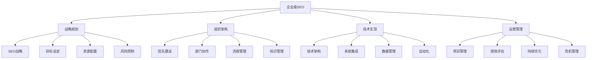
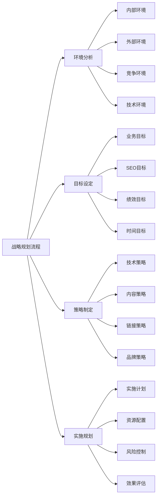
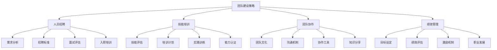
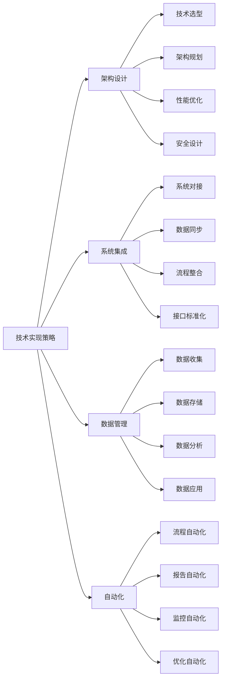
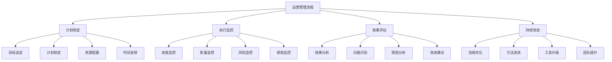
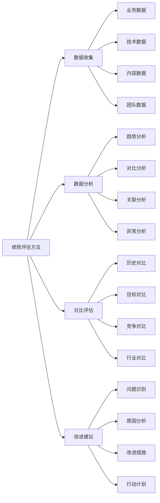
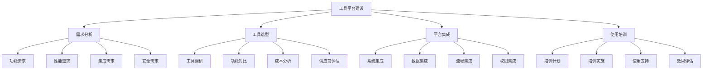
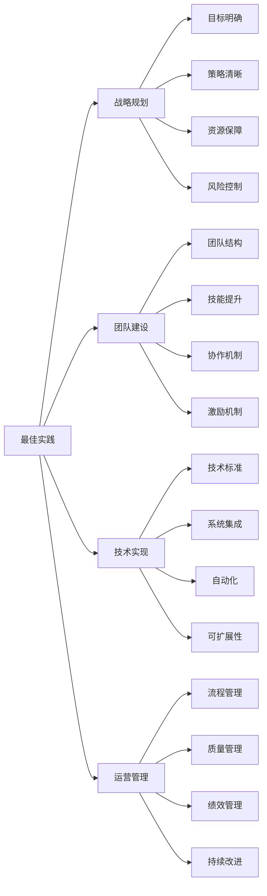

# 企业级SEO策略

## 🎯 学习目标
- 深入理解企业级SEO的特点和挑战
- 掌握大型企业SEO策略制定和实施方法
- 学会企业级SEO团队建设和管理
- 建立企业级SEO认知框架

## 🏢 企业级SEO概述

### 核心概念
**企业级SEO**：针对大型企业、复杂网站结构的SEO策略，需要考虑多部门协作、大规模内容管理、复杂技术架构等因素

### 企业级SEO特点
| 特点维度 | 具体表现 | 挑战程度 | 解决方案 |
|----------|----------|----------|----------|
| **规模复杂性** | 大规模网站、多品牌 | 高 | 分层管理、模块化 |
| **组织复杂性** | 多部门、多团队协作 | 高 | 流程标准化、沟通机制 |
| **技术复杂性** | 复杂技术架构、系统集成 | 极高 | 技术标准化、自动化 |
| **管理复杂性** | 多层级管理、绩效评估 | 中 | 管理体系、KPI体系 |

## 📊 企业级SEO战略规划

### 1. 战略制定框架
| 战略要素 | 具体内容 | 制定方法 | 实施要点 |
|----------|----------|----------|----------|
| **愿景目标** | SEO长期愿景和目标 | SWOT分析、目标设定 | 明确、可衡量、可实现 |
| **市场定位** | 目标市场、竞争定位 | 市场分析、竞争分析 | 差异化、优势突出 |
| **资源配置** | 人力、技术、预算资源 | 资源评估、分配策略 | 合理、高效、可持续 |
| **实施路径** | 分阶段实施计划 | 里程碑规划、时间表 | 清晰、可执行、可调整 |

### 2. 战略规划流程

### 3. 战略实施要点
- **分阶段实施**：分阶段、分模块实施
- **资源保障**：确保资源投入和配置
- **风险控制**：识别和控制实施风险
- **效果监控**：持续监控和调整

## 👥 企业级SEO团队建设

### 1. 团队组织架构
| 团队层级 | 角色职责 | 技能要求 | 管理重点 |
|----------|----------|----------|----------|
| **战略层** | SEO总监、策略制定 | 战略思维、管理能力 | 战略规划、团队管理 |
| **管理层** | SEO经理、项目管理 | 项目管理、沟通协调 | 项目执行、团队协调 |
| **执行层** | SEO专员、技术实施 | 专业技能、执行能力 | 任务执行、技能提升 |
| **支持层** | 数据分析、内容创作 | 专业支持、协作能力 | 专业支持、质量保证 |

### 2. 团队建设策略

### 3. 团队管理要点
- **明确职责**：明确各层级职责和权限
- **技能提升**：持续提升团队技能水平
- **协作效率**：提升团队协作效率
- **激励机制**：建立有效的激励机制

## 🔧 企业级技术架构

### 1. 技术架构设计
| 架构层次 | 技术组件 | 功能特点 | 实施要点 |
|----------|----------|----------|----------|
| **基础设施** | 服务器、CDN、数据库 | 稳定性、可扩展性 | 高可用、高性能 |
| **应用层** | CMS、SEO工具、分析工具 | 功能完整、易用性 | 集成性、可维护性 |
| **数据层** | 数据仓库、分析平台 | 数据完整性、实时性 | 数据质量、数据安全 |
| **接口层** | API、第三方集成 | 标准化、兼容性 | 接口规范、文档完善 |

### 2. 技术实现策略

### 3. 技术实施要点
- **标准化**：建立技术标准和规范
- **集成性**：确保系统间良好集成
- **可扩展性**：支持业务规模扩展
- **可维护性**：便于系统维护和升级

## 📈 企业级SEO运营管理

### 1. 运营管理体系
| 管理维度 | 管理内容 | 管理方法 | 管理效果 |
|----------|----------|----------|----------|
| **项目管理** | 项目规划、执行、监控 | 项目管理工具、流程 | 项目成功率提升 |
| **质量管理** | 内容质量、技术质量 | 质量标准、检查机制 | 质量水平提升 |
| **绩效管理** | 个人绩效、团队绩效 | KPI体系、评估机制 | 绩效水平提升 |
| **风险管理** | 技术风险、业务风险 | 风险识别、控制措施 | 风险控制能力提升 |

### 2. 运营管理流程

### 3. 运营管理工具
- **项目管理**：Jira、Asana、Trello
- **协作沟通**：Slack、Microsoft Teams
- **文档管理**：Confluence、Notion
- **数据分析**：Tableau、Power BI

## 📊 企业级SEO绩效评估

### 1. 绩效评估体系
| 评估维度 | 评估指标 | 评估方法 | 评估周期 |
|----------|----------|----------|----------|
| **业务指标** | 流量、转化、收入 | 数据分析、对比分析 | 月度、季度 |
| **技术指标** | 页面速度、技术SEO | 技术测试、监控数据 | 周度、月度 |
| **内容指标** | 内容质量、更新频率 | 内容审核、用户反馈 | 月度、季度 |
| **团队指标** | 工作效率、技能水平 | 绩效评估、技能测试 | 季度、年度 |

### 2. 绩效评估方法

### 3. 绩效改进策略
- **目标导向**：以目标为导向进行改进
- **数据驱动**：基于数据分析进行改进
- **持续优化**：持续优化和改进
- **团队协作**：团队协作共同改进

## 🛠️ 企业级SEO工具平台

### 1. 工具平台架构
| 平台层次 | 工具类型 | 功能特点 | 集成要求 |
|----------|----------|----------|----------|
| **数据层** | 数据收集、存储工具 | 数据完整性、实时性 | 数据标准化、接口统一 |
| **分析层** | 数据分析、报告工具 | 分析深度、可视化 | 分析标准化、报告模板 |
| **执行层** | SEO执行、优化工具 | 功能完整、易用性 | 工作流集成、权限管理 |
| **管理层** | 项目管理、协作工具 | 管理效率、协作性 | 流程集成、权限控制 |

### 2. 工具平台建设

### 3. 工具平台管理
- **统一管理**：统一管理所有工具
- **权限控制**：严格控制使用权限
- **数据安全**：确保数据安全
- **持续优化**：持续优化平台功能

## 🎯 企业级SEO最佳实践

### 1. 管理原则
| 管理原则 | 具体内容 | 实施要点 | 注意事项 |
|----------|----------|----------|----------|
| **战略导向** | 以战略为导向 | 目标明确、策略清晰 | 避免战术思维 |
| **系统思维** | 系统性思考和管理 | 整体规划、协调统一 | 避免局部优化 |
| **数据驱动** | 基于数据做决策 | 数据收集、分析应用 | 避免主观判断 |
| **持续改进** | 持续优化和改进 | 定期评估、持续优化 | 避免停滞不前 |

### 2. 最佳实践

### 3. 实施建议
- **顶层设计**：从顶层开始设计
- **分步实施**：分步骤、分阶段实施
- **资源保障**：确保资源投入
- **持续优化**：持续优化和改进

## 📚 学习路径

### 基础理解
1. [[02-理解层-核心机制#2.1-Google算法深度解析]] - 算法理解
2. [[03-应用层-实践技能#3.1-SEO工具精通]] - 工具应用
3. [[03-应用层-实践技能#3.2-网站审计]] - 网站审计

### 深入应用
1. [[04-精通层-高级策略#4.2-国际SEO与文化因素]] - 国际SEO
2. [[04-精通层-高级策略#4.3-本地SEO]] - 本地SEO
3. [[04-精通层-高级策略#4.4-电商SEO]] - 电商SEO

### 实战练习
1. [[05-实战案例与模板#5.1-成功案例分析]] - 案例分析
2. [[06-工具与资源#6.1-SEO工具大全]] - 工具资源
3. [[07-进阶专题#7.1-SEO与AI]] - SEO与AI

## 📖 相关链接
- [[02-理解层-核心机制#2.1-Google算法深度解析]] - 算法理解
- [[03-应用层-实践技能#3.1-SEO工具精通]] - 工具应用
- [[03-应用层-实践技能#3.2-网站审计]] - 网站审计
- [[04-精通层-高级策略#4.2-国际SEO与文化因素]] - 国际SEO
- [[04-精通层-高级策略#4.3-本地SEO]] - 本地SEO
- [[04-精通层-高级策略#4.4-电商SEO]] - 电商SEO
