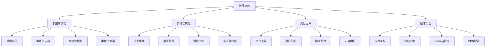
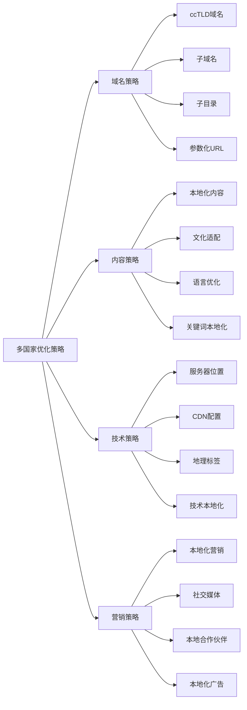
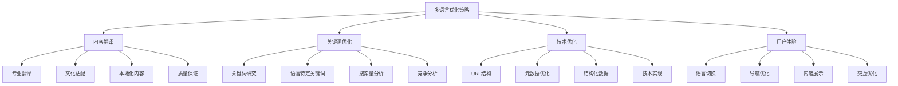
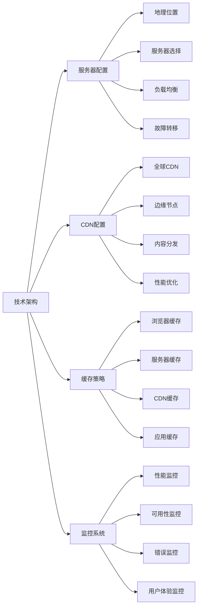
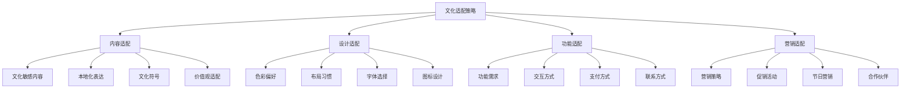
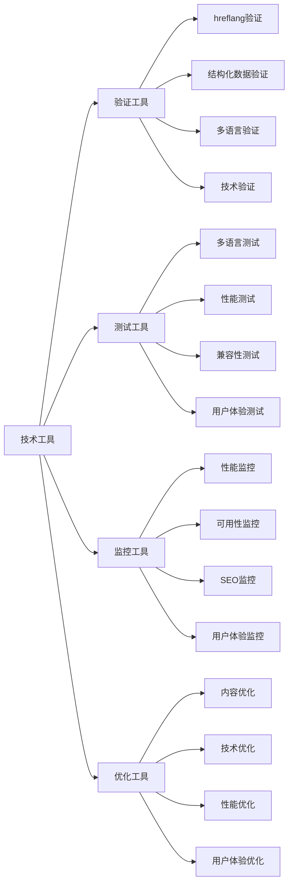
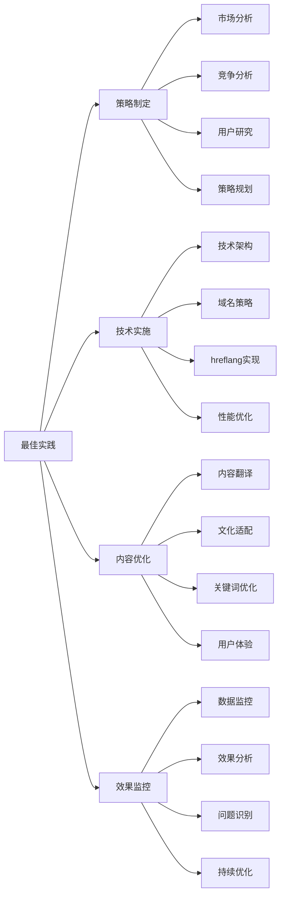

# 国际SEO基础

## 🎯 学习目标
- 深入理解国际SEO的核心概念和重要性
- 掌握多国家、多语言SEO优化的策略和方法
- 学会处理国际SEO中的技术挑战和文化因素
- 建立国际SEO的认知框架

## 🌍 国际SEO概述

### 核心概念
**国际SEO**：针对不同国家、语言和文化背景的搜索引擎优化策略，旨在在全球范围内提升网站的搜索可见性

### 国际SEO重要性
| 重要性维度 | 具体表现 | 影响程度 | SEO价值 |
|------------|----------|----------|---------|
| **市场扩展** | 进入国际市场 | 极高 | 业务增长 |
| **用户覆盖** | 覆盖全球用户 | 高 | 用户获取 |
| **竞争优势** | 国际竞争优势 | 高 | 竞争地位 |
| **品牌建设** | 全球品牌建设 | 中 | 品牌价值 |

## 🗺️ 多国家SEO策略

### 1. 地理定位策略
| 定位策略 | 实施方法 | 技术实现 | 适用场景 |
|----------|----------|----------|----------|
| **国家定位** | 针对特定国家优化 | ccTLD、地理标签 | 明确目标国家 |
| **地区定位** | 针对特定地区优化 | 地区关键词、本地化 | 区域市场 |
| **全球定位** | 面向全球市场 | 通用域名、多语言 | 全球业务 |
| **本地定位** | 针对本地市场 | 本地SEO、本地化 | 本地服务 |

### 2. 多国家优化策略

### 3. 国家特定优化
- **搜索引擎偏好**：了解不同国家的搜索引擎偏好
- **搜索习惯**：分析不同国家的搜索习惯
- **文化因素**：考虑文化因素对搜索的影响
- **法律法规**：遵守不同国家的法律法规

## 🗣️ 多语言SEO策略

### 1. 语言版本策略
| 语言策略 | 实施方法 | 技术要求 | 优化效果 |
|----------|----------|----------|----------|
| **完全翻译** | 完整翻译所有内容 | 高质量翻译 | 最佳用户体验 |
| **部分翻译** | 翻译核心内容 | 选择性翻译 | 平衡成本效果 |
| **机器翻译** | 使用机器翻译 | 自动化翻译 | 快速部署 |
| **混合策略** | 人工+机器翻译 | 混合翻译 | 成本效益平衡 |

### 2. 多语言优化策略

### 3. 语言特定优化
- **语言SEO**：针对不同语言的SEO优化
- **关键词本地化**：关键词的本地化研究
- **内容本地化**：内容的本地化适配
- **用户体验本地化**：用户体验的本地化优化

## 🏗️ 技术实现方案

### 1. 域名策略
| 域名策略 | 实施方法 | 优缺点 | 适用场景 |
|----------|----------|--------|----------|
| **ccTLD** | 使用国家顶级域名 | 强地理信号，成本高 | 明确目标国家 |
| **子域名** | 使用子域名结构 | 灵活，管理复杂 | 多国家业务 |
| **子目录** | 使用子目录结构 | 简单，SEO信号弱 | 资源有限 |
| **参数化** | 使用URL参数 | 简单，SEO效果差 | 临时方案 |

### 2. 技术架构

### 3. hreflang标签
- **标签作用**：告诉搜索引擎页面的语言和地理定位
- **标签实现**：HTML标签、HTTP头、XML sitemap
- **标签验证**：使用工具验证hreflang标签
- **常见错误**：避免hreflang标签的常见错误

## 🌐 文化因素考虑

### 1. 文化差异分析
| 文化维度 | 具体表现 | SEO影响 | 优化策略 |
|----------|----------|----------|----------|
| **语言习惯** | 不同语言表达习惯 | 关键词选择 | 本地化关键词 |
| **搜索行为** | 不同搜索行为模式 | 内容策略 | 行为导向内容 |
| **内容偏好** | 不同内容偏好 | 内容类型 | 偏好导向内容 |
| **用户界面** | 不同UI/UX偏好 | 用户体验 | 界面本地化 |

### 2. 文化适配策略

### 3. 本地化实施
- **市场研究**：深入了解目标市场
- **用户调研**：进行用户调研和测试
- **文化咨询**：寻求文化专家建议
- **持续优化**：持续优化本地化效果

## 📊 国际SEO工具

### 1. 分析工具
| 工具类型 | 工具名称 | 功能特点 | 应用场景 |
|----------|----------|----------|----------|
| **多语言分析** | Google Analytics | 多语言网站分析 | 流量分析 |
| **关键词工具** | Google Keyword Planner | 多语言关键词研究 | 关键词研究 |
| **竞争分析** | SEMrush、Ahrefs | 国际竞争分析 | 竞争分析 |
| **翻译工具** | Google Translate | 内容翻译 | 内容翻译 |

### 2. 技术工具

### 3. 工具使用策略
- **工具组合**：组合使用多种工具
- **数据整合**：整合不同工具的数据
- **自动化**：使用工具实现自动化
- **持续监控**：持续监控和优化

## 🎯 国际SEO最佳实践

### 1. 实施原则
| 实施原则 | 具体内容 | 实施要点 | 注意事项 |
|----------|----------|----------|----------|
| **本地化优先** | 优先考虑本地化 | 深度本地化 | 避免简单翻译 |
| **技术标准** | 遵循技术标准 | 标准化实施 | 避免技术错误 |
| **用户体验** | 优化用户体验 | 用户中心设计 | 避免技术导向 |
| **持续优化** | 持续优化改进 | 数据驱动优化 | 避免一次性优化 |

### 2. 最佳实践

### 3. 实施建议
- **分阶段实施**：分阶段实施国际SEO
- **资源保障**：确保足够的资源投入
- **专业团队**：建立专业的国际SEO团队
- **持续学习**：持续学习国际SEO最佳实践

## 📚 学习路径

### 基础理解
1. [[02-理解层-核心机制#2.3-技术SEO]] - 技术SEO
2. [[02-理解层-核心机制#2.4-内容SEO]] - 内容SEO
3. [[01-认知层-基础概念#1.4-行业趋势]] - 行业趋势

### 深入应用
1. [[04-精通层-高级策略#4.2-国际SEO与文化因素#02-hreflang标签]] - hreflang标签
2. [[04-精通层-高级策略#4.2-国际SEO与文化因素#03-国际域名策略]] - 域名策略
3. [[04-精通层-高级策略#4.2-国际SEO与文化因素#04-国际内容策略]] - 内容策略

### 实战练习
1. [[05-实战案例与模板#5.1-成功案例分析]] - 案例分析
2. [[06-工具与资源#6.1-SEO工具大全]] - 工具资源
3. [[04-精通层-高级策略#4.1-企业级SEO策略]] - 企业级策略

## 📖 相关链接
- [[02-理解层-核心机制#2.3-技术SEO]] - 技术SEO
- [[02-理解层-核心机制#2.4-内容SEO]] - 内容SEO
- [[01-认知层-基础概念#1.4-行业趋势]] - 行业趋势
- [[04-精通层-高级策略#4.2-国际SEO与文化因素#02-hreflang标签]] - hreflang标签
- [[04-精通层-高级策略#4.2-国际SEO与文化因素#03-国际域名策略]] - 域名策略
- [[04-精通层-高级策略#4.2-国际SEO与文化因素#04-国际内容策略]] - 内容策略
