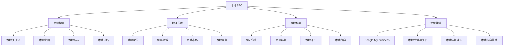
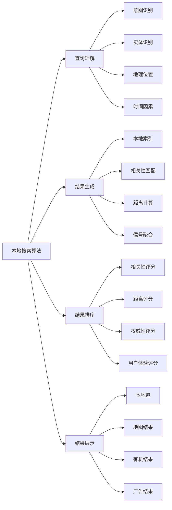
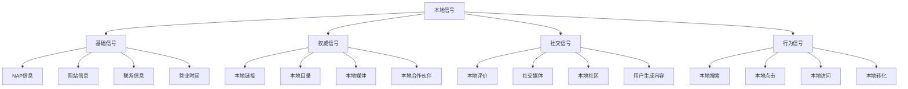
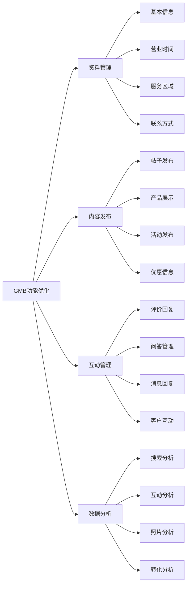
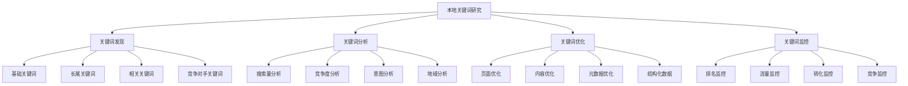
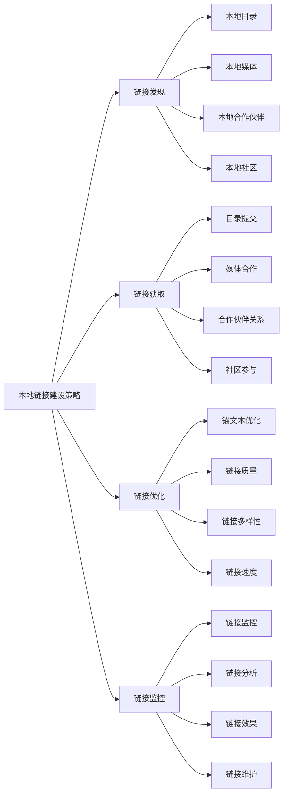
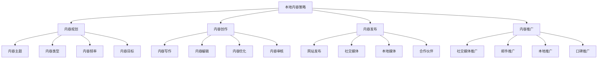
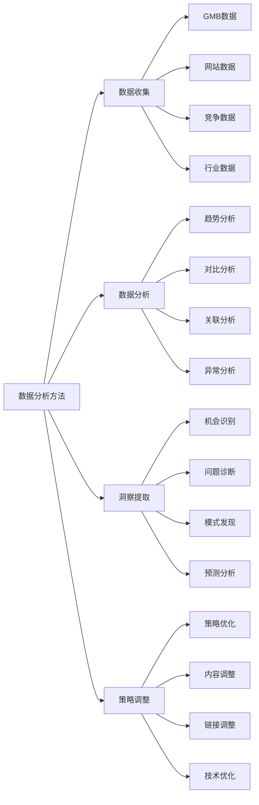
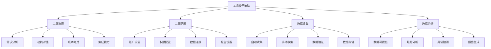
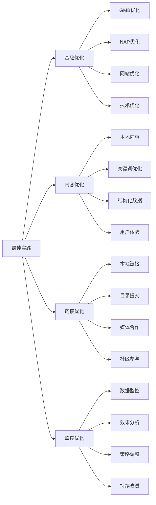

# 本地SEO基础

## 🎯 学习目标
- 深入理解本地SEO的核心概念和重要性
- 掌握本地搜索优化的原理和方法
- 学会本地SEO的关键策略和技巧
- 建立本地SEO的认知框架

## 🏪 本地SEO概述

### 核心概念
**本地SEO**：针对本地搜索的搜索引擎优化策略，旨在提升网站在本地搜索结果中的排名和可见性

### 本地SEO重要性
| 重要性维度 | 具体表现 | 影响程度 | SEO价值 |
|------------|----------|----------|---------|
| **本地可见性** | 提升本地搜索可见性 | 极高 | 本地流量获取 |
| **竞争优势** | 本地市场竞争优势 | 高 | 竞争地位提升 |
| **转化率** | 本地搜索转化率高 | 高 | 商业价值实现 |
| **品牌建设** | 本地品牌建设 | 中 | 品牌影响力 |

## 🔍 本地搜索原理

### 1. 本地搜索机制
| 搜索要素 | 具体内容 | 影响权重 | 优化策略 |
|----------|----------|----------|----------|
| **相关性** | 内容与搜索查询的相关性 | 高 | 内容优化 |
| **距离** | 用户与商家的距离 | 高 | 地理位置优化 |
| **权威性** | 本地权威性和信任度 | 高 | 本地信号建设 |
| **评价** | 用户评价和评分 | 中 | 评价管理 |

### 2. 本地搜索算法

### 3. 本地搜索特点
- **地理位置敏感**：搜索结果基于用户地理位置
- **意图明确**：本地搜索通常有明确的商业意图
- **即时性**：用户需要即时获得本地信息
- **移动优先**：本地搜索主要在移动设备上进行

## 📍 本地信号要素

### 1. NAP信息
| NAP要素 | 具体内容 | 重要性 | 优化要点 |
|---------|----------|--------|----------|
| **Name** | 商家名称 | 极高 | 名称一致性 |
| **Address** | 商家地址 | 极高 | 地址准确性 |
| **Phone** | 商家电话 | 高 | 电话号码一致性 |

### 2. 本地信号类型

### 3. 本地信号优化
- **一致性**：确保NAP信息在所有平台一致
- **完整性**：提供完整的商家信息
- **准确性**：确保信息的准确性
- **时效性**：保持信息的时效性

## 🗺️ Google My Business优化

### 1. GMB资料优化
| 优化要素 | 具体内容 | 优化方法 | 优化效果 |
|----------|----------|----------|----------|
| **基本信息** | 名称、地址、电话 | 完整准确填写 | 基础可见性 |
| **分类** | 业务分类 | 选择准确分类 | 相关性提升 |
| **描述** | 商家描述 | 详细描述服务 | 用户理解 |
| **照片** | 商家照片 | 高质量照片 | 用户吸引 |

### 2. GMB功能优化

### 3. GMB最佳实践
- **定期更新**：定期更新商家信息
- **积极互动**：积极回复评价和问题
- **内容发布**：定期发布相关内容
- **数据分析**：分析GMB数据优化策略

## 🔑 本地关键词策略

### 1. 本地关键词类型
| 关键词类型 | 具体示例 | 搜索意图 | 优化策略 |
|------------|----------|----------|----------|
| **服务+地点** | "北京SEO服务" | 寻找本地服务 | 服务页面优化 |
| **产品+地点** | "上海咖啡店" | 寻找本地产品 | 产品页面优化 |
| **品牌+地点** | "麦当劳北京" | 寻找特定品牌 | 品牌页面优化 |
| **问题+地点** | "北京哪里修车" | 解决本地问题 | FAQ页面优化 |

### 2. 本地关键词研究

### 3. 本地关键词优化
- **页面优化**：在页面中自然使用本地关键词
- **标题优化**：在标题中包含本地关键词
- **内容优化**：在内容中融入本地关键词
- **元数据优化**：在元数据中使用本地关键词

## 🔗 本地链接建设

### 1. 本地链接类型
| 链接类型 | 具体来源 | 链接价值 | 获取难度 |
|----------|----------|----------|----------|
| **本地目录** | 黄页、行业目录 | 高 | 低 |
| **本地媒体** | 本地新闻、博客 | 高 | 中 |
| **本地合作伙伴** | 供应商、客户 | 中 | 中 |
| **本地社区** | 商会、协会 | 中 | 低 |

### 2. 本地链接建设策略

### 3. 本地链接建设方法
- **目录提交**：提交到相关本地目录
- **媒体合作**：与本地媒体建立合作关系
- **社区参与**：参与本地社区活动
- **合作伙伴**：与本地企业建立合作关系

## 📝 本地内容营销

### 1. 本地内容类型
| 内容类型 | 具体内容 | 内容价值 | 创作难度 |
|----------|----------|----------|----------|
| **本地新闻** | 本地事件、新闻 | 高 | 中 |
| **本地指南** | 本地生活指南 | 高 | 中 |
| **本地活动** | 本地活动信息 | 中 | 低 |
| **本地故事** | 本地人文故事 | 中 | 高 |

### 2. 本地内容策略

### 3. 本地内容优化
- **本地化**：内容要体现本地特色
- **相关性**：内容要与业务相关
- **价值性**：内容要对用户有价值
- **时效性**：内容要保持时效性

## 📊 本地SEO数据分析

### 1. 关键指标
| 指标类型 | 具体指标 | 测量方法 | 优化方向 |
|----------|----------|----------|----------|
| **可见性指标** | 本地排名、本地包展示 | GMB分析 | 排名优化 |
| **流量指标** | 本地搜索流量 | Google Analytics | 流量增长 |
| **转化指标** | 本地转化率 | 转化跟踪 | 转化优化 |
| **评价指标** | 评价数量、评分 | GMB分析 | 评价管理 |

### 2. 数据分析方法

### 3. 分析工具
- **Google My Business**：本地搜索分析
- **Google Analytics**：网站流量分析
- **Google Search Console**：搜索表现分析
- **本地SEO工具**：专门的本地SEO分析工具

## 🛠️ 本地SEO工具

### 1. 基础工具
| 工具类型 | 工具名称 | 功能特点 | 应用场景 |
|----------|----------|----------|----------|
| **GMB管理** | Google My Business | GMB资料管理 | GMB优化 |
| **本地分析** | Google Analytics | 本地流量分析 | 数据分析 |
| **关键词工具** | Google Keyword Planner | 本地关键词研究 | 关键词优化 |
| **竞争分析** | BrightLocal | 本地竞争分析 | 竞争分析 |

### 2. 工具使用策略

### 3. 工具组合使用
- **GMB + Analytics**：本地搜索和流量分析
- **关键词工具 + 竞争工具**：关键词和竞争分析
- **本地目录 + 评价工具**：本地信号管理
- **内容工具 + 社交工具**：本地内容营销

## 🎯 本地SEO最佳实践

### 1. 优化原则
| 优化原则 | 具体内容 | 实施要点 | 注意事项 |
|----------|----------|----------|----------|
| **本地化** | 深度本地化 | 本地特色、本地文化 | 避免泛化 |
| **一致性** | 信息一致性 | NAP一致、品牌一致 | 避免信息冲突 |
| **用户体验** | 优化用户体验 | 易用性、响应性 | 避免复杂化 |
| **持续优化** | 持续优化改进 | 数据驱动、迭代优化 | 避免一次性优化 |

### 2. 最佳实践

### 3. 实施建议
- **从基础开始**：从GMB和NAP优化开始
- **内容优先**：重视本地内容创作
- **链接建设**：积极建设本地链接
- **持续监控**：持续监控和优化

## 📚 学习路径

### 基础理解
1. [[02-理解层-核心机制#2.2-关键词策略]] - 关键词策略
2. [[02-理解层-核心机制#2.6-链接建设]] - 链接建设
3. [[02-理解层-核心机制#2.4-内容SEO]] - 内容SEO

### 深入应用
1. [[04-精通层-高级策略#4.3-本地SEO#02-Google My Business]] - GMB优化
2. [[04-精通层-高级策略#4.3-本地SEO#03-本地关键词策略]] - 关键词策略
3. [[04-精通层-高级策略#4.3-本地SEO#04-本地链接建设]] - 链接建设

### 实战练习
1. [[05-实战案例与模板#5.1-成功案例分析]] - 案例分析
2. [[06-工具与资源#6.1-SEO工具大全]] - 工具资源
3. [[03-应用层-实践技能#3.3-竞争分析]] - 竞争分析

## 📖 相关链接
- [[02-理解层-核心机制#2.2-关键词策略]] - 关键词策略
- [[02-理解层-核心机制#2.6-链接建设]] - 链接建设
- [[02-理解层-核心机制#2.4-内容SEO]] - 内容SEO
- [[04-精通层-高级策略#4.3-本地SEO#02-Google My Business]] - GMB优化
- [[04-精通层-高级策略#4.3-本地SEO#03-本地关键词策略]] - 关键词策略
- [[04-精通层-高级策略#4.3-本地SEO#04-本地链接建设]] - 链接建设
