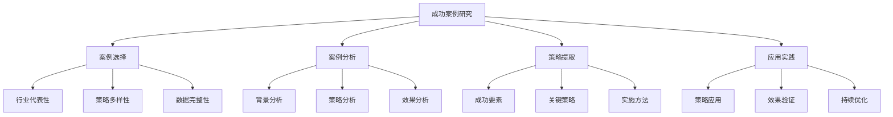
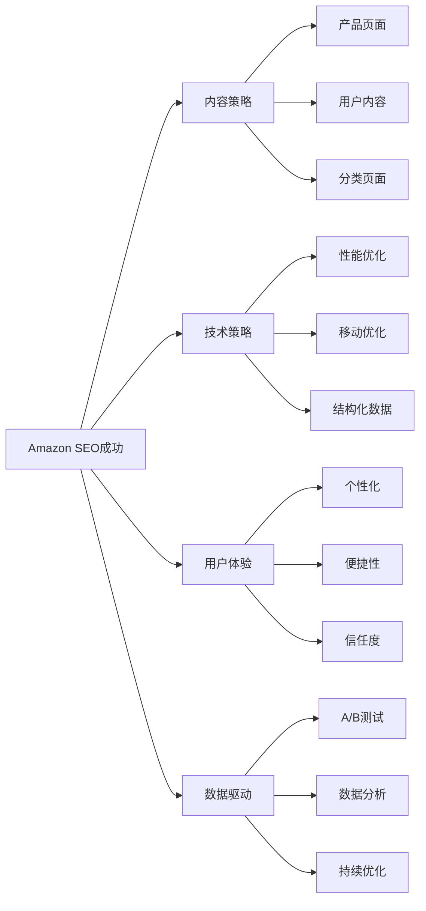
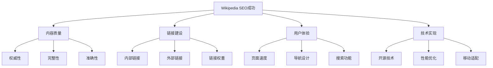
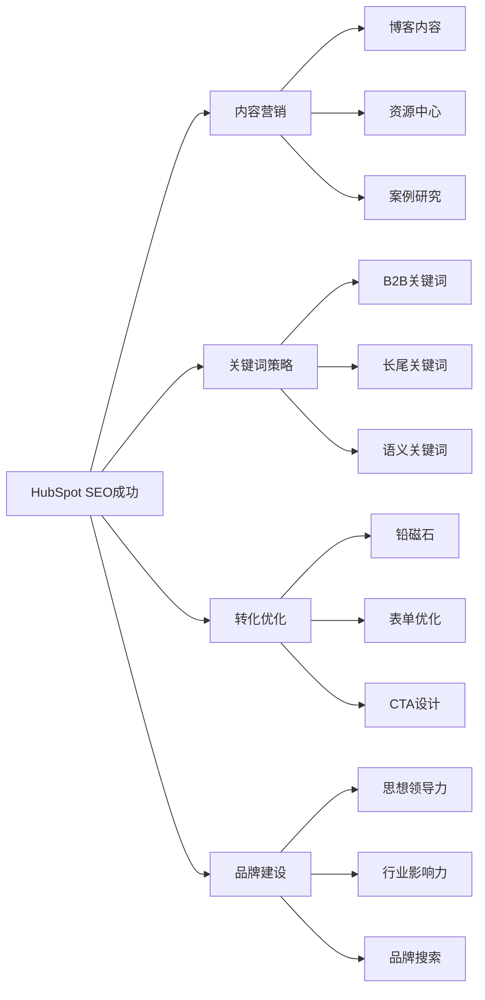
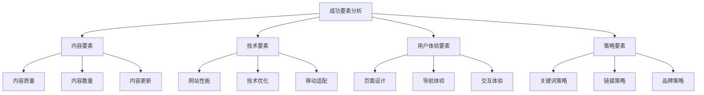
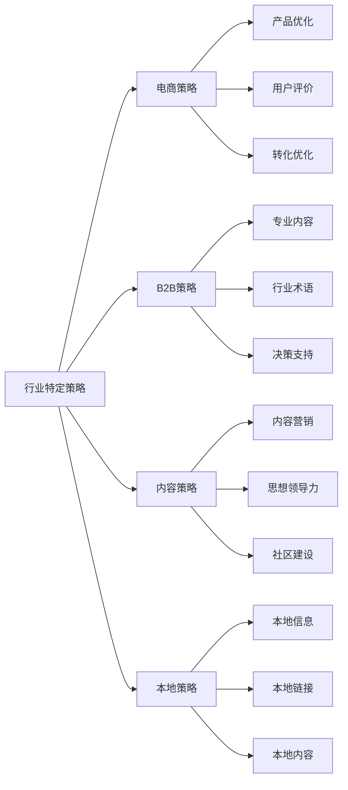
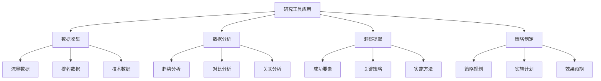
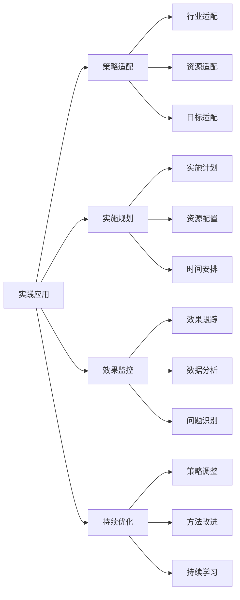

# 成功案例研究

## 🎯 学习目标
- 深入理解知名网站SEO成功案例
- 掌握成功案例的分析方法和框架
- 学会从成功案例中提取可复制的策略
- 建立SEO成功案例研究认知框架

## 🌟 成功案例研究概述

### 核心概念
**SEO成功案例**：通过系统性的SEO策略实现显著排名提升、流量增长和商业价值提升的典型案例

### 成功案例研究价值
| 研究价值 | 具体表现 | 学习收获 | 应用场景 |
|----------|----------|----------|----------|
| **策略学习** | 学习成功策略 | 策略思路和方法 | 策略制定参考 |
| **经验借鉴** | 借鉴成功经验 | 避免常见错误 | 实践指导 |
| **趋势洞察** | 洞察行业趋势 | 趋势把握能力 | 趋势预测 |
| **创新启发** | 启发创新思路 | 创新思维培养 | 策略创新 |

## 🏆 全球知名SEO成功案例

### 1. Amazon - 电商SEO标杆
| 成功要素 | 具体策略 | 实施方法 | 效果表现 |
|----------|----------|----------|----------|
| **产品页面优化** | 长尾关键词布局 | 产品标题、描述优化 | 数百万产品页面排名 |
| **用户生成内容** | 用户评价系统 | 评价、问答、图片 | 丰富内容生态 |
| **技术SEO** | 网站性能优化 | CDN、缓存、压缩 | 极速加载体验 |
| **用户体验** | 个性化推荐 | AI算法、用户行为 | 高转化率 |

#### Amazon SEO成功分析

### 2. Wikipedia - 内容SEO典范
| 成功要素 | 具体策略 | 实施方法 | 效果表现 |
|----------|----------|----------|----------|
| **权威内容** | 高质量百科内容 | 专业编辑、事实核查 | 极高权威性 |
| **内部链接** | 完善的链接体系 | 相关词条链接 | 强大的链接权重 |
| **长尾关键词** | 覆盖大量长尾词 | 自然关键词布局 | 海量长尾流量 |
| **用户体验** | 简洁清晰的界面 | 快速加载、易导航 | 高用户满意度 |

#### Wikipedia SEO成功分析

### 3. HubSpot - B2B内容营销SEO
| 成功要素 | 具体策略 | 实施方法 | 效果表现 |
|----------|----------|----------|----------|
| **内容营销** | 高质量博客内容 | 专业作者、深度内容 | 大量有机流量 |
| **关键词策略** | B2B关键词布局 | 行业术语、专业词汇 | 精准目标客户 |
| **铅磁石** | 免费资源提供 | 白皮书、模板、工具 | 高转化率 |
| **品牌建设** | 行业权威地位 | 思想领导力、专业形象 | 品牌搜索增长 |

#### HubSpot SEO成功分析

## 📊 成功案例分析方法

### 1. 案例分析框架
| 分析维度 | 分析内容 | 分析方法 | 分析价值 |
|----------|----------|----------|----------|
| **背景分析** | 行业背景、竞争环境 | 市场研究、竞争分析 | 理解成功背景 |
| **策略分析** | SEO策略、实施方法 | 策略拆解、方法分析 | 学习策略思路 |
| **效果分析** | 排名提升、流量增长 | 数据对比、效果评估 | 验证策略效果 |
| **要素提取** | 成功要素、关键因素 | 要素识别、重要性排序 | 提取成功要素 |

### 2. 成功要素分析

### 3. 分析方法应用
- **定量分析**：数据驱动的效果分析
- **定性分析**：策略思路的深度分析
- **对比分析**：与竞争对手的对比分析
- **趋势分析**：成功策略的趋势分析

## 🎯 成功案例策略提取

### 1. 通用成功策略
| 策略类型 | 核心要素 | 实施要点 | 适用场景 |
|----------|----------|----------|----------|
| **内容为王** | 高质量内容 | 原创性、价值性、更新性 | 所有行业 |
| **用户体验** | 优秀用户体验 | 速度、易用性、美观性 | 所有网站 |
| **技术优化** | 技术SEO优化 | 性能、移动、结构化数据 | 技术型网站 |
| **品牌建设** | 品牌权威性 | 专业形象、行业影响力 | 品牌型网站 |

### 2. 行业特定策略

### 3. 策略应用原则
- **适配性原则**：根据自身情况适配策略
- **系统性原则**：系统性地实施策略
- **持续性原则**：持续性地优化策略
- **创新性原则**：在基础上创新策略

## 🛠️ 成功案例研究工具

### 1. 分析工具
| 工具类型 | 工具名称 | 功能特点 | 应用场景 |
|----------|----------|----------|----------|
| **流量分析** | SimilarWeb | 网站流量分析 | 流量趋势分析 |
| **关键词分析** | SEMrush | 关键词排名分析 | 关键词策略分析 |
| **技术分析** | GTmetrix | 网站性能分析 | 技术优化分析 |
| **竞争分析** | Ahrefs | 竞争对手分析 | 竞争策略分析 |

### 2. 研究工具应用

### 3. 工具使用最佳实践
- **多工具结合**：使用多种工具综合分析
- **数据验证**：通过多个数据源验证结果
- **持续监控**：持续监控案例变化
- **深度分析**：深入分析成功原因

## 📈 成功案例应用实践

### 1. 案例学习流程
| 学习阶段 | 学习内容 | 学习方法 | 学习目标 |
|----------|----------|----------|----------|
| **案例选择** | 选择相关案例 | 行业匹配、策略相关 | 找到学习目标 |
| **深度分析** | 分析成功要素 | 多维度分析 | 理解成功原因 |
| **策略提取** | 提取可复制策略 | 策略拆解、要素提取 | 获得可操作策略 |
| **实践应用** | 应用到自身项目 | 策略适配、实施优化 | 实现成功复制 |

### 2. 实践应用策略

### 3. 应用实践要点
- **选择性学习**：选择适合的策略学习
- **渐进实施**：渐进式地实施策略
- **效果验证**：验证策略实施效果
- **持续改进**：基于效果持续改进

## 🎯 成功案例研究实践

### 1. 短期实践（1-3个月）
- **案例收集**：收集相关成功案例
- **初步分析**：进行初步案例分析
- **策略识别**：识别关键成功策略
- **快速应用**：快速应用关键策略

### 2. 中期实践（3-6个月）
- **深度研究**：深入研究成功案例
- **策略制定**：制定基于案例的策略
- **系统实施**：系统性地实施策略
- **效果评估**：评估策略实施效果

### 3. 长期实践（6-12个月）
- **案例库建设**：建设成功案例库
- **方法论形成**：形成案例研究方法论
- **策略创新**：基于案例创新策略
- **知识分享**：分享案例研究经验

## 📚 学习路径

### 基础理解
1. [[02-小企业SEO案例]] - 小企业案例
2. [[03-大企业SEO案例]] - 大企业案例
3. [[04-行业案例对比]] - 行业对比

### 深入应用
1. [[02-理解层-核心机制]] - 核心机制理解
2. [[03-应用层-实践技能]] - 实践技能
3. [[04-精通层-高级策略]] - 高级策略

### 实战练习
1. [[03-应用层-实践技能#3.1-SEO工具精通]] - 工具应用
2. [[05-实战案例与模板#5.2-失败案例研究]] - 失败案例
3. [[06-工具与资源#6.1-SEO工具大全]] - 工具资源

## 📖 相关链接
- [[02-小企业SEO案例]] - 小企业案例
- [[03-大企业SEO案例]] - 大企业案例
- [[04-行业案例对比]] - 行业对比
- [[02-理解层-核心机制]] - 核心机制理解
- [[03-应用层-实践技能]] - 实践技能
- [[04-精通层-高级策略]] - 高级策略
