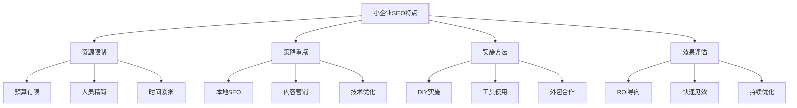
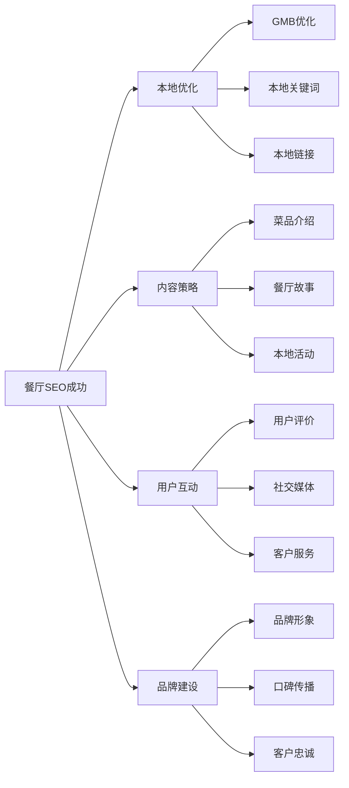
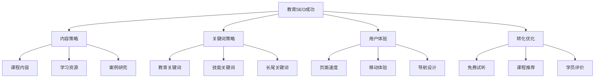
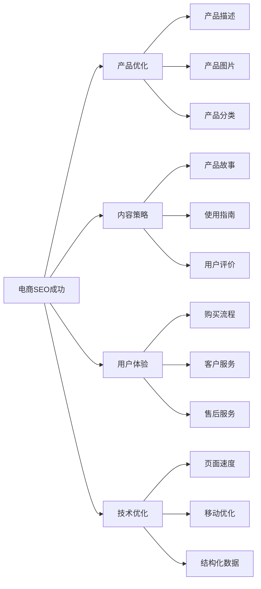
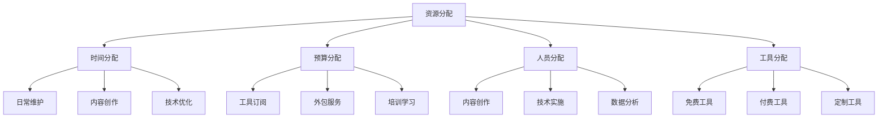
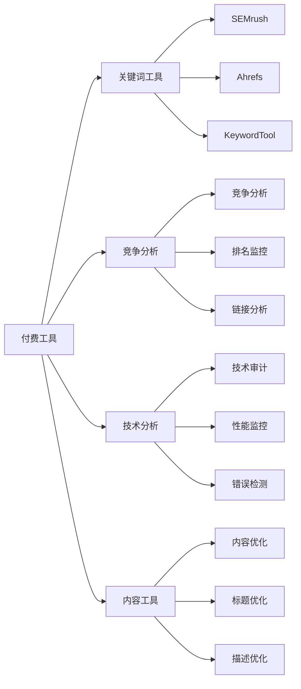
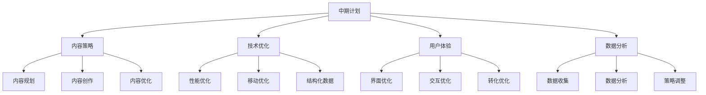
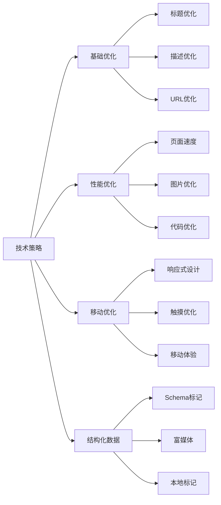
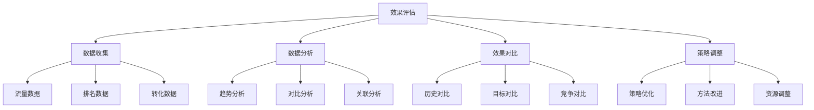
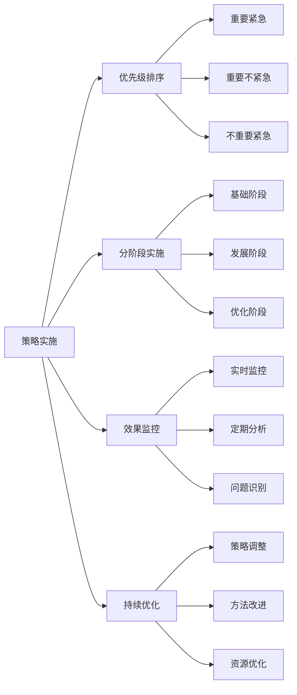

# 小企业SEO案例

## 🎯 学习目标
- 深入理解小企业SEO成功案例
- 掌握小企业SEO策略和实施方法
- 学会小企业资源限制下的SEO优化
- 建立小企业SEO实践认知框架

## 🏪 小企业SEO特点分析

### 核心特征
**小企业SEO**：资源有限、团队精简、预算紧张情况下的SEO策略和实践

### 小企业SEO挑战
| 挑战类型 | 具体表现 | 影响程度 | 应对策略 |
|----------|----------|----------|----------|
| **资源限制** | 预算、人员、时间有限 | 高 | 优先级排序、效率优化 |
| **技术门槛** | 技术能力不足 | 中 | 工具使用、外包合作 |
| **竞争激烈** | 与大企业竞争 | 高 | 差异化策略、本地化 |
| **效果周期** | SEO效果周期长 | 中 | 短期策略结合、耐心坚持 |

## 🏆 小企业SEO成功案例

### 1. 本地餐厅 - 本地SEO成功案例
| 成功要素 | 具体策略 | 实施方法 | 效果表现 |
|----------|----------|----------|----------|
| **Google My Business** | 完善商家信息 | 地址、电话、营业时间 | 本地搜索排名第一 |
| **用户评价** | 积极管理评价 | 回复评价、鼓励评价 | 4.8分高评分 |
| **本地内容** | 本地化内容创作 | 本地新闻、活动、故事 | 本地关键词排名 |
| **社交媒体** | 社交媒体营销 | 微信、微博、抖音 | 品牌知名度提升 |

#### 本地餐厅SEO成功分析

### 2. 在线教育 - 内容营销SEO案例
| 成功要素 | 具体策略 | 实施方法 | 效果表现 |
|----------|----------|----------|----------|
| **教育内容** | 高质量课程内容 | 视频教程、文章、案例 | 大量有机流量 |
| **长尾关键词** | 教育相关长尾词 | 课程名称、技能关键词 | 精准目标用户 |
| **用户生成内容** | 学员评价和分享 | 学习心得、成果展示 | 社会证明效应 |
| **技术优化** | 网站性能优化 | 快速加载、移动适配 | 良好用户体验 |

#### 在线教育SEO成功分析

### 3. 电商小店 - 产品SEO案例
| 成功要素 | 具体策略 | 实施方法 | 效果表现 |
|----------|----------|----------|----------|
| **产品页面** | 详细产品描述 | 产品特性、使用场景 | 产品关键词排名 |
| **用户评价** | 真实用户评价 | 购买评价、使用反馈 | 信任度提升 |
| **图片优化** | 高质量产品图片 | Alt标签、图片压缩 | 视觉搜索优化 |
| **技术SEO** | 基础技术优化 | 页面速度、结构化数据 | 搜索引擎友好 |

#### 电商小店SEO成功分析

## 📊 小企业SEO策略框架

### 1. 优先级策略
| 优先级 | 策略类型 | 实施难度 | 预期效果 | 资源需求 |
|--------|----------|----------|----------|----------|
| **高优先级** | 本地SEO、基础技术优化 | 低 | 高 | 低 |
| **中优先级** | 内容营销、关键词优化 | 中 | 中 | 中 |
| **低优先级** | 高级技术、复杂策略 | 高 | 中 | 高 |

### 2. 资源分配策略

### 3. 实施策略
- **渐进实施**：分阶段实施SEO策略
- **重点突破**：集中资源突破重点领域
- **效果导向**：以效果为导向调整策略
- **持续优化**：持续优化和改进

## 🛠️ 小企业SEO工具选择

### 1. 免费工具
| 工具类型 | 工具名称 | 功能特点 | 适用场景 |
|----------|----------|----------|----------|
| **关键词研究** | Google Keyword Planner | 关键词搜索量、竞争度 | 关键词研究 |
| **网站分析** | Google Analytics | 流量分析、用户行为 | 数据分析 |
| **搜索监控** | Google Search Console | 搜索表现、索引状态 | 搜索监控 |
| **技术分析** | Google PageSpeed Insights | 页面速度分析 | 性能优化 |

### 2. 付费工具

### 3. 工具选择策略
- **免费优先**：优先使用免费工具
- **按需付费**：根据需求选择付费工具
- **工具组合**：组合使用多种工具
- **成本效益**：考虑工具的成本效益

## 📈 小企业SEO实施计划

### 1. 短期计划（1-3个月）
| 时间节点 | 主要任务 | 预期效果 | 资源需求 |
|----------|----------|----------|----------|
| **第1个月** | 基础技术优化、GMB设置 | 基础排名提升 | 低 |
| **第2个月** | 内容创作、关键词优化 | 内容排名提升 | 中 |
| **第3个月** | 用户体验优化、数据分析 | 整体效果提升 | 中 |

### 2. 中期计划（3-6个月）

### 3. 长期计划（6-12个月）
- **品牌建设**：建立品牌权威性
- **内容生态**：建设完整内容生态
- **技术升级**：升级技术实现
- **持续优化**：建立持续优化机制

## 🎯 小企业SEO最佳实践

### 1. 内容策略
| 策略类型 | 实施要点 | 效果评估 | 注意事项 |
|----------|----------|----------|----------|
| **本地内容** | 本地新闻、活动、故事 | 本地关键词排名 | 保持本地相关性 |
| **用户内容** | 用户评价、分享、UGC | 用户参与度 | 鼓励用户参与 |
| **专业内容** | 专业知识、经验分享 | 权威性建立 | 保持专业性 |
| **更新内容** | 定期更新、新鲜内容 | 搜索引擎友好 | 保持更新频率 |

### 2. 技术策略

### 3. 用户体验策略
- **页面速度**：优化页面加载速度
- **移动体验**：优化移动端用户体验
- **导航设计**：设计清晰的导航结构
- **转化优化**：优化转化路径和转化率

## 📊 小企业SEO效果评估

### 1. 关键指标
| 指标类型 | 具体指标 | 评估方法 | 目标设定 |
|----------|----------|----------|----------|
| **流量指标** | 有机流量、关键词排名 | Analytics、Search Console | 流量增长20% |
| **转化指标** | 转化率、转化数量 | 转化跟踪、目标设置 | 转化率提升15% |
| **品牌指标** | 品牌搜索、直接访问 | 品牌监控、直接流量 | 品牌认知提升 |
| **技术指标** | 页面速度、移动友好 | 技术工具、性能监控 | 技术指标达标 |

### 2. 评估方法

### 3. 评估周期
- **日常监控**：每日监控关键指标
- **周度分析**：每周分析数据趋势
- **月度评估**：每月评估整体效果
- **季度调整**：每季度调整策略

## 🎯 小企业SEO实践建议

### 1. 资源管理
- **预算控制**：合理控制SEO预算
- **时间管理**：高效利用有限时间
- **人员配置**：合理配置人员资源
- **工具选择**：选择性价比高的工具

### 2. 策略实施

### 3. 风险控制
- **技术风险**：避免过度技术化
- **内容风险**：确保内容质量
- **竞争风险**：差异化竞争策略
- **时间风险**：合理预期效果周期

## 📚 学习路径

### 基础理解
1. [[01-成功案例研究]] - 成功案例研究
2. [[03-大企业SEO案例]] - 大企业案例
3. [[04-行业案例对比]] - 行业对比

### 深入应用
1. [[02-理解层-核心机制#2.3-技术SEO]] - 技术SEO
2. [[04-精通层-高级策略#4.3-本地SEO]] - 本地SEO
3. [[03-应用层-实践技能#3.1-SEO工具精通]] - 工具应用

### 实战练习
1. [[03-应用层-实践技能#3.2-网站审计]] - 网站审计
2. [[05-实战案例与模板#5.2-失败案例研究]] - 失败案例
3. [[06-工具与资源#6.1-SEO工具大全]] - 工具资源

## 📖 相关链接
- [[01-成功案例研究]] - 成功案例研究
- [[03-大企业SEO案例]] - 大企业案例
- [[04-行业案例对比]] - 行业对比
- [[02-理解层-核心机制]] - 核心机制理解
- [[03-应用层-实践技能]] - 实践技能
- [[04-精通层-高级策略]] - 高级策略
