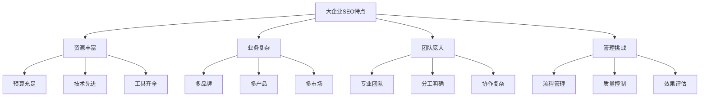
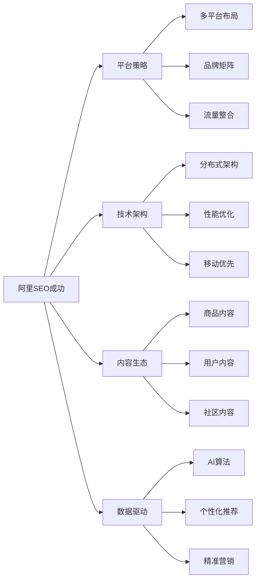
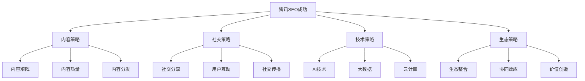
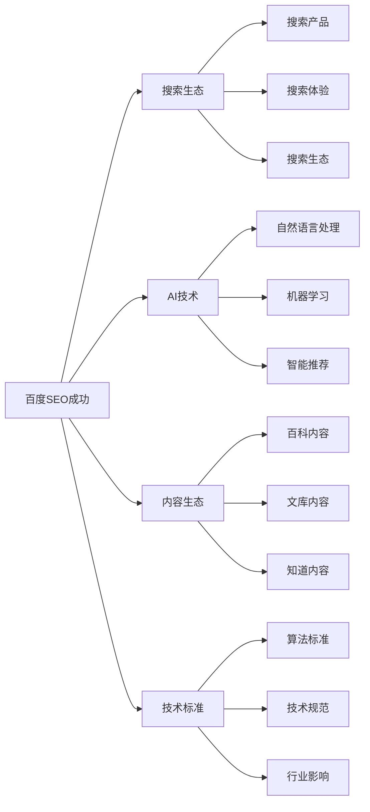
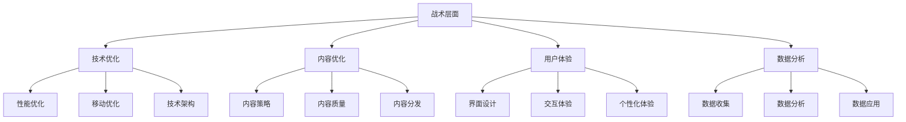
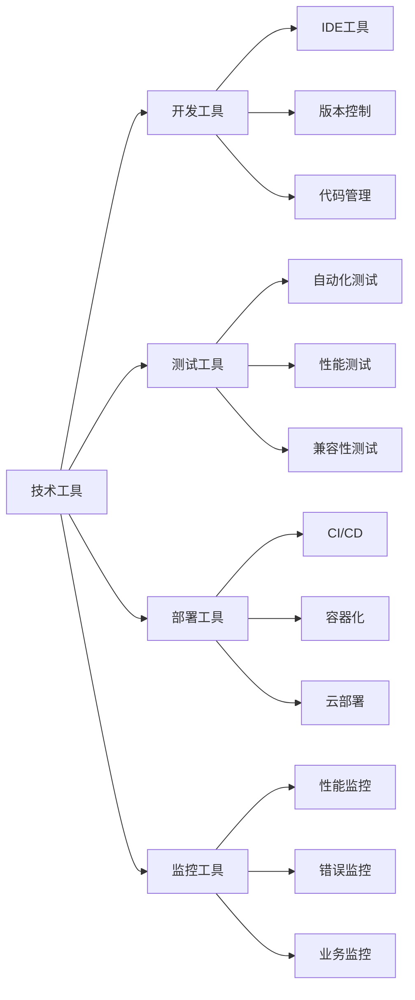
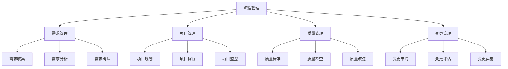
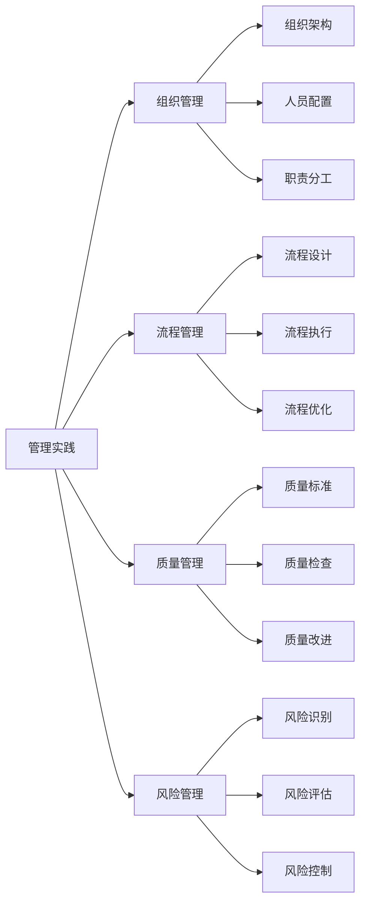
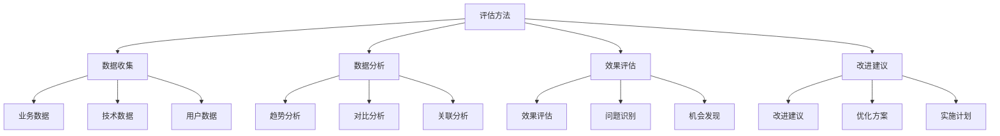
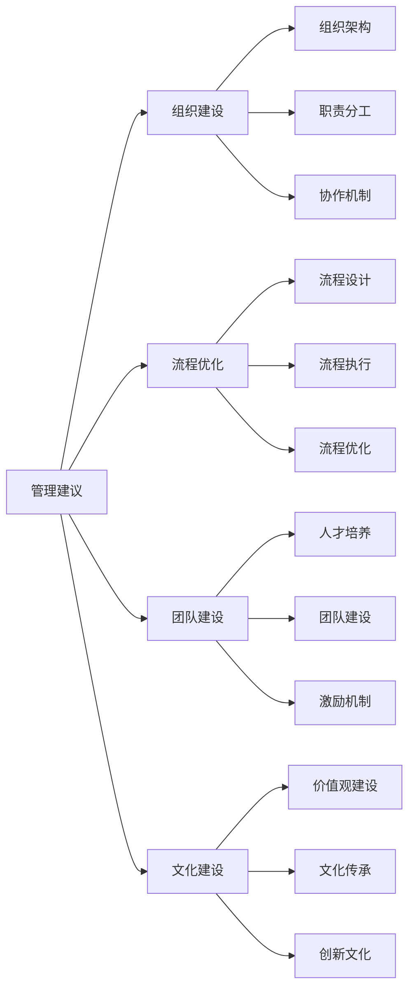

# 大企业SEO案例

## 🎯 学习目标
- 深入理解大企业SEO成功案例
- 掌握大企业SEO策略和实施方法
- 学会大企业复杂环境下的SEO管理
- 建立大企业SEO实践认知框架

## 🏢 大企业SEO特点分析

### 核心特征
**大企业SEO**：资源丰富、团队庞大、业务复杂情况下的SEO策略和管理

### 大企业SEO挑战
| 挑战类型 | 具体表现 | 影响程度 | 应对策略 |
|----------|----------|----------|----------|
| **组织复杂性** | 多部门协作、流程复杂 | 高 | 流程优化、协作机制 |
| **技术复杂性** | 系统集成、数据管理 | 高 | 技术架构、数据治理 |
| **竞争激烈** | 行业竞争、品牌竞争 | 高 | 差异化策略、创新突破 |
| **效果评估** | 多维度评估、ROI计算 | 中 | 指标体系、评估方法 |

## 🏆 大企业SEO成功案例

### 1. 阿里巴巴 - 电商平台SEO
| 成功要素 | 具体策略 | 实施方法 | 效果表现 |
|----------|----------|----------|----------|
| **平台生态** | 多平台SEO策略 | 淘宝、天猫、1688 | 全平台流量增长 |
| **技术架构** | 大规模技术优化 | CDN、分布式架构 | 极速用户体验 |
| **内容生态** | 丰富内容体系 | 商品、评价、社区 | 海量内容流量 |
| **数据驱动** | 大数据分析 | AI算法、个性化 | 精准用户匹配 |

#### 阿里巴巴SEO成功分析

### 2. 腾讯 - 内容生态SEO
| 成功要素 | 具体策略 | 实施方法 | 效果表现 |
|----------|----------|----------|----------|
| **内容矩阵** | 多平台内容策略 | 微信、QQ、腾讯新闻 | 内容生态优势 |
| **社交SEO** | 社交化SEO策略 | 社交分享、用户互动 | 社交流量增长 |
| **技术创新** | 前沿技术应用 | AI、大数据、云计算 | 技术领先优势 |
| **生态整合** | 全生态整合 | 内容、社交、商业 | 生态协同效应 |

#### 腾讯SEO成功分析

### 3. 百度 - 搜索引擎SEO
| 成功要素 | 具体策略 | 实施方法 | 效果表现 |
|----------|----------|----------|----------|
| **搜索生态** | 搜索生态建设 | 百度搜索、百度知道 | 搜索生态优势 |
| **AI技术** | 人工智能应用 | 自然语言处理、机器学习 | 搜索体验提升 |
| **内容生态** | 内容生态建设 | 百度百科、百度文库 | 内容权威性 |
| **技术标准** | 技术标准制定 | 搜索算法、技术规范 | 行业影响力 |

#### 百度SEO成功分析

## 📊 大企业SEO策略框架

### 1. 战略层面
| 战略类型 | 核心要素 | 实施重点 | 预期效果 |
|----------|----------|----------|----------|
| **品牌战略** | 品牌建设、品牌搜索 | 品牌权威性、品牌影响力 | 品牌价值提升 |
| **技术战略** | 技术领先、技术标准 | 技术创新、技术架构 | 技术竞争优势 |
| **内容战略** | 内容生态、内容质量 | 内容矩阵、内容分发 | 内容影响力 |
| **数据战略** | 数据驱动、数据智能 | 数据分析、数据应用 | 数据价值实现 |

### 2. 战术层面

### 3. 执行层面
- **项目管理**：大型SEO项目管理
- **团队协作**：跨部门协作机制
- **质量控制**：SEO质量管控体系
- **效果评估**：多维度效果评估

## 🛠️ 大企业SEO管理工具

### 1. 企业级工具
| 工具类型 | 工具名称 | 功能特点 | 应用场景 |
|----------|----------|----------|----------|
| **企业分析** | Adobe Analytics | 企业级数据分析 | 大数据分析 |
| **项目管理** | Jira、Asana | 项目管理工具 | 大型项目管理 |
| **协作工具** | Slack、Teams | 团队协作工具 | 跨部门协作 |
| **监控工具** | New Relic、Datadog | 企业级监控 | 系统监控 |

### 2. 技术工具

### 3. 管理工具
- **项目管理**：大型项目管理工具
- **团队协作**：跨部门协作工具
- **质量控制**：质量管控工具
- **效果评估**：效果评估工具

## 📈 大企业SEO实施管理

### 1. 组织架构
| 组织层级 | 职责范围 | 人员配置 | 协作关系 |
|----------|----------|----------|----------|
| **战略层** | SEO战略制定 | 高级管理层 | 跨部门协调 |
| **管理层** | SEO项目管理 | 项目经理 | 团队管理 |
| **执行层** | SEO具体实施 | 专业团队 | 技术实施 |
| **支持层** | SEO支持服务 | 支持团队 | 技术支持 |

### 2. 流程管理

### 3. 协作机制
- **跨部门协作**：建立跨部门协作机制
- **信息共享**：建立信息共享平台
- **决策机制**：建立快速决策机制
- **反馈机制**：建立反馈改进机制

## 🎯 大企业SEO最佳实践

### 1. 战略实践
| 实践类型 | 实施要点 | 效果评估 | 注意事项 |
|----------|----------|----------|----------|
| **品牌建设** | 品牌权威性、品牌影响力 | 品牌搜索、品牌价值 | 保持品牌一致性 |
| **技术领先** | 技术创新、技术标准 | 技术优势、技术影响 | 持续技术投入 |
| **内容生态** | 内容矩阵、内容质量 | 内容影响力、内容价值 | 保持内容质量 |
| **数据驱动** | 数据分析、数据应用 | 数据价值、决策支持 | 数据质量保证 |

### 2. 管理实践

### 3. 技术实践
- **技术架构**：建立可扩展的技术架构
- **技术标准**：制定统一的技术标准
- **技术监控**：建立完善的技术监控体系
- **技术优化**：持续进行技术优化

## 📊 大企业SEO效果评估

### 1. 评估体系
| 评估维度 | 评估指标 | 评估方法 | 评估周期 |
|----------|----------|----------|----------|
| **业务指标** | 流量、转化、收入 | 业务数据分析 | 月度评估 |
| **技术指标** | 性能、可用性、安全性 | 技术监控数据 | 实时监控 |
| **品牌指标** | 品牌搜索、品牌价值 | 品牌监测数据 | 季度评估 |
| **竞争指标** | 市场份额、竞争地位 | 竞争分析数据 | 季度评估 |

### 2. 评估方法

### 3. 评估应用
- **决策支持**：为战略决策提供数据支持
- **绩效管理**：用于团队绩效管理
- **持续改进**：支持持续改进和优化
- **风险控制**：识别和控制风险

## 🎯 大企业SEO实践建议

### 1. 战略建议
- **长期规划**：制定长期SEO战略规划
- **资源投入**：持续投入SEO资源
- **技术创新**：保持技术创新和领先
- **生态建设**：建设完整的SEO生态

### 2. 管理建议

### 3. 技术建议
- **技术架构**：建立可扩展的技术架构
- **技术标准**：制定统一的技术标准
- **技术监控**：建立完善的技术监控体系
- **技术优化**：持续进行技术优化

## 📚 学习路径

### 基础理解
1. [[01-成功案例研究]] - 成功案例研究
2. [[02-小企业SEO案例]] - 小企业案例
3. [[04-行业案例对比]] - 行业对比

### 深入应用
1. [[02-理解层-核心机制]] - 核心机制理解
2. [[03-应用层-实践技能]] - 实践技能
3. [[04-精通层-高级策略]] - 高级策略

### 实战练习
1. [[03-应用层-实践技能#3.1-SEO工具精通]] - 工具应用
2. [[05-实战案例与模板#5.2-失败案例研究]] - 失败案例
3. [[06-工具与资源#6.1-SEO工具大全]] - 工具资源

## 📖 相关链接
- [[01-成功案例研究]] - 成功案例研究
- [[02-小企业SEO案例]] - 小企业案例
- [[04-行业案例对比]] - 行业对比
- [[02-理解层-核心机制]] - 核心机制理解
- [[03-应用层-实践技能]] - 实践技能
- [[04-精通层-高级策略]] - 高级策略
