# 行业案例对比

## 🎯 学习目标
- 深入理解不同行业SEO策略差异
- 掌握行业特定SEO策略制定方法
- 学会跨行业SEO策略借鉴和应用
- 建立行业SEO对比分析认知框架

## 🏭 行业SEO特点分析

### 核心概念
**行业SEO对比**：分析不同行业在SEO策略、实施方法、效果评估等方面的差异和特点

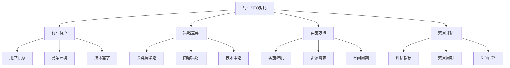

### 行业分类维度
| 分类维度 | 分类标准 | 代表行业 | SEO特点 |
|----------|----------|----------|---------|
| **商业模式** | B2B、B2C、C2C | 制造业、电商、平台 | 策略重点不同 |
| **产品类型** | 实物、服务、内容 | 零售、咨询、媒体 | 优化方法不同 |
| **用户决策** | 简单、复杂、长期 | 快消、汽车、教育 | 转化路径不同 |
| **竞争程度** | 低、中、高 | 传统、新兴、红海 | 竞争策略不同 |

## 📊 主要行业SEO对比

### 1. 电商行业 vs 制造业
| 对比维度 | 电商行业 | 制造业 | 差异分析 |
|----------|----------|--------|----------|
| **关键词策略** | 产品关键词、长尾词 | 技术关键词、B2B词 | 目标用户不同 |
| **内容策略** | 产品描述、用户评价 | 技术文档、案例研究 | 内容类型不同 |
| **技术需求** | 高并发、移动优先 | 技术文档、结构化数据 | 技术重点不同 |
| **转化路径** | 直接购买、快速决策 | 询盘、长期跟进 | 转化周期不同 |

#### 电商行业SEO特点
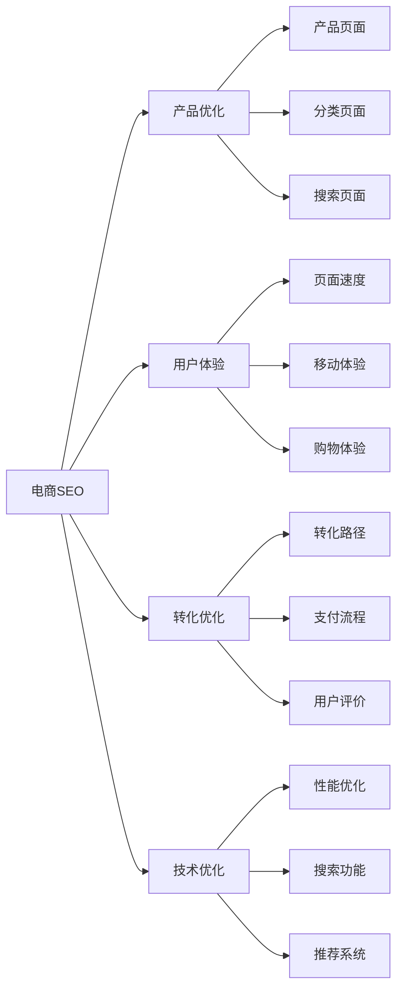

#### 制造业SEO特点
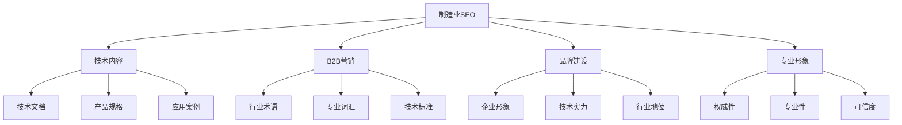

### 2. 教育行业 vs 医疗行业
| 对比维度 | 教育行业 | 医疗行业 | 差异分析 |
|----------|----------|----------|----------|
| **内容策略** | 教育内容、学习资源 | 医疗信息、健康知识 | 内容专业性不同 |
| **信任建设** | 教学质量、学员评价 | 医疗资质、专家权威 | 信任要素不同 |
| **合规要求** | 教育资质、内容审核 | 医疗法规、信息准确性 | 合规标准不同 |
| **用户需求** | 学习需求、技能提升 | 健康需求、医疗咨询 | 需求类型不同 |

#### 教育行业SEO特点
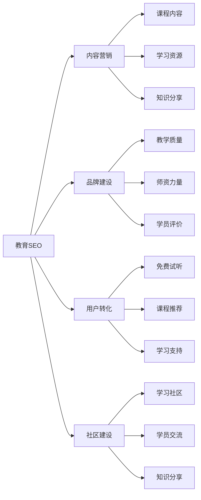

#### 医疗行业SEO特点
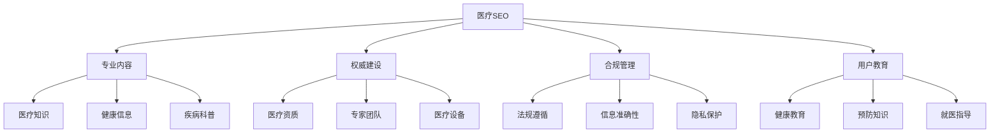

### 3. 金融行业 vs 房地产行业
| 对比维度 | 金融行业 | 房地产行业 | 差异分析 |
|----------|----------|------------|----------|
| **信任要求** | 极高信任度、安全性 | 高信任度、专业性 | 信任标准不同 |
| **决策周期** | 长期决策、风险评估 | 长期决策、价值评估 | 决策因素不同 |
| **内容策略** | 金融知识、投资指导 | 房产信息、市场分析 | 内容重点不同 |
| **转化路径** | 咨询、开户、投资 | 看房、签约、购买 | 转化流程不同 |

#### 金融行业SEO特点
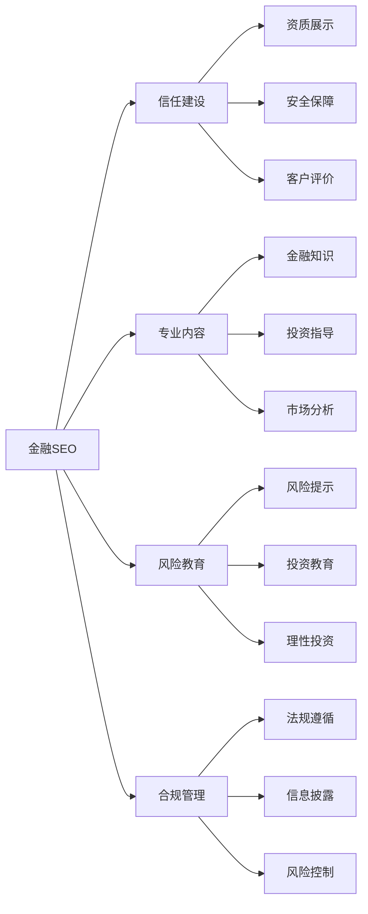

#### 房地产行业SEO特点
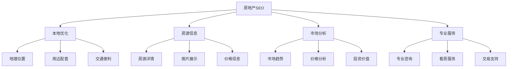

## 🎯 行业SEO策略对比

### 1. 关键词策略对比
| 行业类型 | 主要关键词类型 | 关键词特点 | 优化重点 |
|----------|----------------|------------|----------|
| **电商** | 产品词、品牌词 | 高搜索量、竞争激烈 | 长尾词、产品词 |
| **B2B** | 行业词、技术词 | 专业性强、搜索量中等 | 行业术语、技术词汇 |
| **本地服务** | 本地词、服务词 | 地域性强、竞争相对较小 | 本地关键词、服务词 |
| **内容媒体** | 话题词、热点词 | 时效性强、搜索波动大 | 热点话题、长尾内容 |

### 2. 内容策略对比
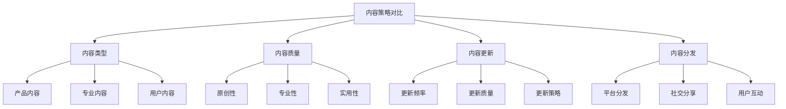

### 3. 技术策略对比
| 技术要素 | 电商行业 | B2B行业 | 本地服务 | 内容媒体 |
|----------|----------|---------|----------|----------|
| **页面速度** | 极高要求 | 高要求 | 中等要求 | 高要求 |
| **移动优化** | 极高要求 | 高要求 | 高要求 | 高要求 |
| **结构化数据** | 产品数据 | 企业数据 | 本地数据 | 文章数据 |
| **用户体验** | 购物体验 | 专业体验 | 服务体验 | 阅读体验 |

## 📈 行业SEO效果评估对比

### 1. 评估指标对比
| 行业类型 | 主要指标 | 次要指标 | 特殊指标 |
|----------|----------|----------|----------|
| **电商** | 转化率、订单量 | 流量、排名 | 客单价、复购率 |
| **B2B** | 询盘量、转化率 | 流量、排名 | 客户质量、成交周期 |
| **本地服务** | 电话咨询、到店量 | 流量、排名 | 服务半径、客户满意度 |
| **内容媒体** | 阅读量、分享量 | 流量、排名 | 用户粘性、内容传播 |

### 2. 效果周期对比
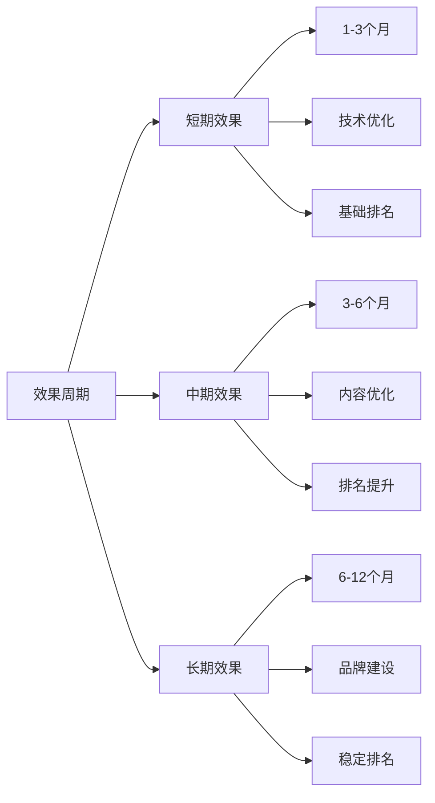

### 3. ROI计算对比
| 行业类型 | ROI计算方式 | 主要收益 | 主要成本 |
|----------|--------------|----------|----------|
| **电商** | 销售额/SEO成本 | 直接销售 | 技术、内容、推广 |
| **B2B** | 客户价值/SEO成本 | 客户获取 | 内容、技术、人力 |
| **本地服务** | 服务收入/SEO成本 | 服务销售 | 本地优化、内容 |
| **内容媒体** | 广告收入/SEO成本 | 广告收入 | 内容创作、技术 |

## 🛠️ 跨行业SEO策略借鉴

### 1. 策略借鉴原则
| 借鉴原则 | 具体内容 | 应用方法 | 注意事项 |
|----------|----------|----------|----------|
| **适配性原则** | 根据行业特点适配 | 策略调整、方法改进 | 避免生搬硬套 |
| **创新性原则** | 在借鉴基础上创新 | 策略创新、方法创新 | 保持创新思维 |
| **系统性原则** | 系统性借鉴策略 | 整体策略、系统实施 | 避免碎片化 |
| **效果性原则** | 以效果为导向 | 效果验证、持续优化 | 关注实际效果 |

### 2. 策略借鉴方法
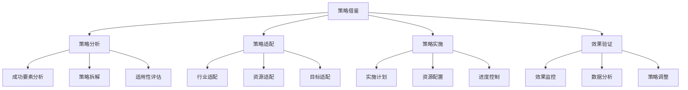

### 3. 借鉴应用策略
- **选择性借鉴**：选择适合的策略借鉴
- **创新性应用**：在借鉴基础上创新
- **系统性实施**：系统性地实施策略
- **效果性验证**：验证策略实施效果

## 🎯 行业SEO实践建议

### 1. 行业分析建议
- **深度分析**：深入分析行业特点
- **竞争分析**：分析行业竞争环境
- **用户分析**：分析行业用户行为
- **趋势分析**：分析行业发展趋势

### 2. 策略制定建议
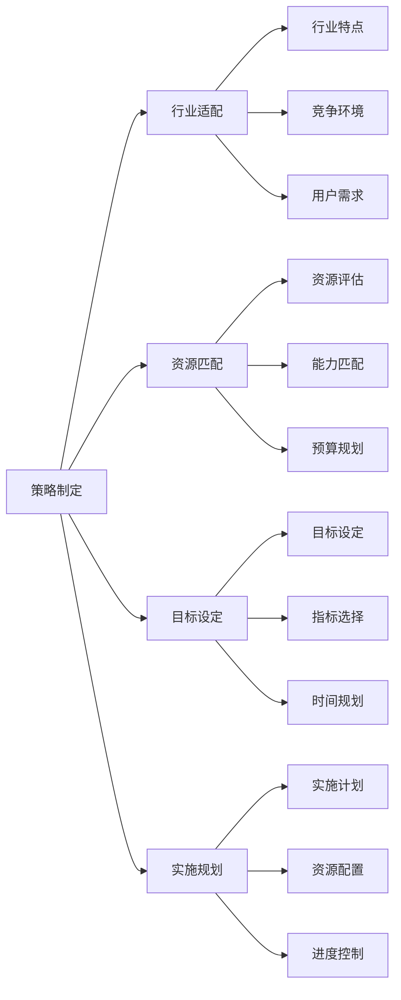

### 3. 实施建议
- **渐进实施**：渐进式实施策略
- **重点突破**：重点突破关键领域
- **持续优化**：持续优化和改进
- **效果验证**：验证策略实施效果

## 📚 学习路径

### 基础理解
1. [[01-成功案例研究]] - 成功案例研究
2. [[02-小企业SEO案例]] - 小企业案例
3. [[03-大企业SEO案例]] - 大企业案例

### 深入应用
1. [[02-理解层-核心机制]] - 核心机制理解
2. [[03-应用层-实践技能]] - 实践技能
3. [[04-精通层-高级策略]] - 高级策略

### 实战练习
1. [[03-应用层-实践技能#3.1-SEO工具精通]] - 工具应用
2. [[05-实战案例与模板#5.2-失败案例研究]] - 失败案例
3. [[06-工具与资源#6.1-SEO工具大全]] - 工具资源

## 📖 相关链接
- [[01-成功案例研究]] - 成功案例研究
- [[02-小企业SEO案例]] - 小企业案例
- [[03-大企业SEO案例]] - 大企业案例
- [[02-理解层-核心机制]] - 核心机制理解
- [[03-应用层-实践技能]] - 实践技能
- [[04-精通层-高级策略]] - 高级策略
