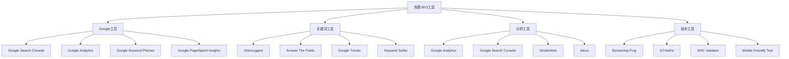
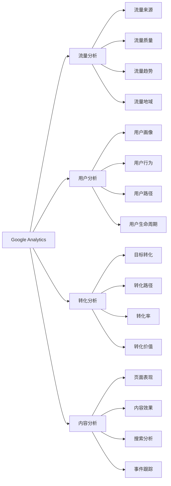
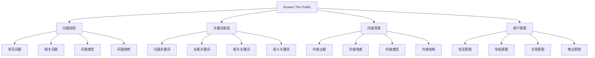
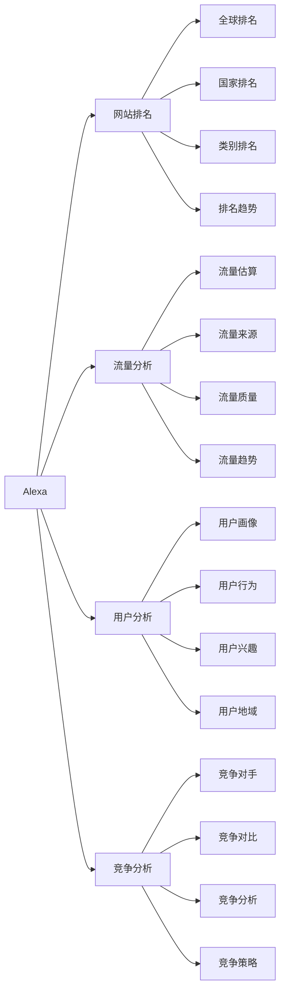
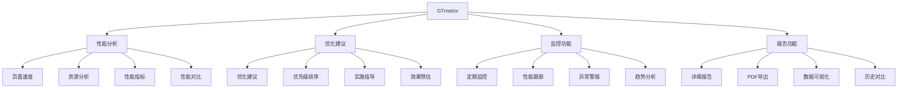
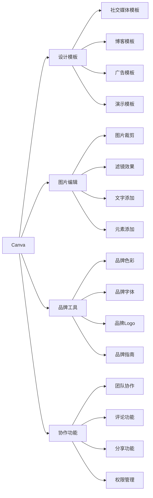
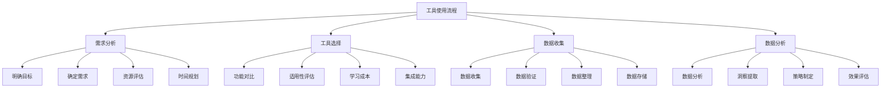
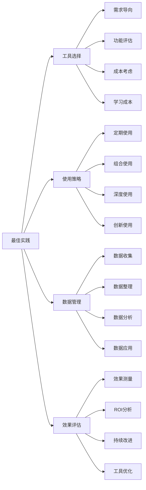

# 免费SEO工具

## 🎯 学习目标
- 了解免费SEO工具的分类和功能特点
- 掌握免费工具的使用方法和技巧
- 学会合理组合使用免费工具
- 建立免费工具使用的认知框架

## 🆓 免费SEO工具概述

### 核心概念
**免费SEO工具**：提供基础SEO功能且无需付费的工具，适合初学者和小型企业使用

### 免费工具特点
| 特点维度 | 具体表现 | 优势 | 限制 |
|----------|----------|------|------|
| **成本** | 完全免费使用 | 无成本负担 | 功能有限 |
| **功能** | 基础功能完整 | 满足基本需求 | 高级功能缺失 |
| **数据** | 基础数据提供 | 数据准确可靠 | 数据深度有限 |
| **更新** | 定期更新 | 保持最新 | 更新频率较低 |

## 🔍 Google官方免费工具

### 1. Google Search Console
| 功能模块 | 具体功能 | 使用价值 | 应用场景 |
|----------|----------|----------|----------|
| **搜索表现** | 搜索查询、点击率 | 了解搜索表现 | 搜索优化 |
| **索引状态** | 索引页面、错误 | 监控索引状态 | 技术SEO |
| **移动易用性** | 移动友好性检查 | 移动优化 | 移动SEO |
| **结构化数据** | 结构化数据状态 | 富媒体优化 | 结构化数据 |

### 2. Google Analytics

### 3. Google Keyword Planner
- **关键词研究**：发现新关键词
- **搜索量数据**：了解关键词搜索量
- **竞争分析**：分析关键词竞争程度
- **广告建议**：获取广告建议

### 4. Google PageSpeed Insights
- **性能分析**：分析页面加载性能
- **Core Web Vitals**：监控核心网页指标
- **优化建议**：提供性能优化建议
- **移动优化**：移动端性能分析

## 🔑 免费关键词工具

### 1. Ubersuggest
| 功能特点 | 具体内容 | 使用技巧 | 优化效果 |
|----------|----------|----------|----------|
| **关键词研究** | 关键词建议、搜索量 | 长尾关键词发现 | 关键词策略制定 |
| **竞争分析** | 竞争对手关键词 | 竞争关键词分析 | 竞争策略制定 |
| **内容建议** | 内容主题建议 | 内容策略制定 | 内容优化 |
| **SEO分析** | 网站SEO分析 | 技术问题识别 | 技术优化 |

### 2. Answer The Public

### 3. Google Trends
- **趋势分析**：分析关键词搜索趋势
- **地域分析**：了解不同地域的搜索趋势
- **相关查询**：发现相关搜索查询
- **时间分析**：分析时间维度的搜索趋势

### 4. Keyword Surfer
- **搜索量显示**：在搜索结果中显示搜索量
- **相关关键词**：显示相关关键词建议
- **竞争分析**：显示竞争程度
- **SEO建议**：提供SEO优化建议

## 📊 免费分析工具

### 1. SimilarWeb
| 分析维度 | 具体功能 | 数据价值 | 应用场景 |
|----------|----------|----------|----------|
| **流量分析** | 网站流量估算 | 了解竞争对手流量 | 竞争分析 |
| **流量来源** | 流量来源分析 | 了解流量构成 | 流量策略 |
| **用户行为** | 用户行为分析 | 了解用户习惯 | 用户体验优化 |
| **关键词分析** | 关键词排名分析 | 了解关键词表现 | 关键词策略 |

### 2. Alexa

### 3. Google Analytics Intelligence
- **智能洞察**：自动发现数据洞察
- **异常检测**：检测数据异常
- **趋势分析**：分析数据趋势
- **预测分析**：预测未来趋势

### 4. Google Search Console Performance
- **搜索表现**：分析搜索表现数据
- **查询分析**：分析搜索查询
- **页面分析**：分析页面表现
- **设备分析**：分析设备表现

## 🔧 免费技术工具

### 1. Screaming Frog SEO Spider
| 功能模块 | 具体功能 | 使用价值 | 应用场景 |
|----------|----------|----------|----------|
| **网站爬取** | 全面爬取网站 | 了解网站结构 | 网站审计 |
| **技术分析** | 技术问题识别 | 发现技术问题 | 技术SEO |
| **链接分析** | 内部链接分析 | 优化链接结构 | 链接建设 |
| **元数据检查** | 元数据完整性 | 优化元数据 | 页面优化 |

### 2. GTmetrix

### 3. W3C Validator
- **HTML验证**：验证HTML代码
- **CSS验证**：验证CSS代码
- **错误报告**：报告代码错误
- **修复建议**：提供修复建议

### 4. Mobile-Friendly Test
- **移动友好性**：测试移动端友好性
- **响应式设计**：检查响应式设计
- **移动性能**：分析移动端性能
- **优化建议**：提供移动优化建议

## 📝 免费内容工具

### 1. Google Docs
| 功能特点 | 具体内容 | 使用价值 | 应用场景 |
|----------|----------|----------|----------|
| **协作编辑** | 多人协作编辑 | 团队协作 | 内容创作 |
| **版本控制** | 版本历史管理 | 内容管理 | 内容版本控制 |
| **模板功能** | 内容模板 | 提高效率 | 标准化内容 |
| **集成功能** | 与其他工具集成 | 工作流优化 | 内容工作流 |

### 2. Canva

### 3. Grammarly
- **语法检查**：检查语法错误
- **拼写检查**：检查拼写错误
- **写作建议**：提供写作建议
- **风格优化**：优化写作风格

### 4. Hemingway Editor
- **可读性分析**：分析文本可读性
- **写作建议**：提供写作建议
- **简洁性检查**：检查文本简洁性
- **风格优化**：优化写作风格

## 🛠️ 免费工具使用策略

### 1. 工具组合策略
| 组合类型 | 工具组合 | 使用场景 | 优化效果 |
|----------|----------|----------|----------|
| **基础组合** | GSC + GA + GKP | 基础SEO分析 | 全面了解网站表现 |
| **关键词组合** | GKP + Ubersuggest + Trends | 关键词研究 | 深度关键词分析 |
| **技术组合** | Screaming Frog + GTmetrix + W3C | 技术SEO | 全面技术优化 |
| **内容组合** | Answer The Public + Canva + Grammarly | 内容创作 | 高质量内容创作 |

### 2. 工具使用流程

### 3. 工具使用技巧
- **定期使用**：定期使用工具进行分析
- **数据对比**：对比不同工具的数据
- **趋势分析**：分析数据趋势变化
- **持续优化**：基于数据持续优化

## 🎯 免费工具最佳实践

### 1. 使用原则
| 使用原则 | 具体内容 | 实施要点 | 注意事项 |
|----------|----------|----------|----------|
| **功能互补** | 选择功能互补的工具 | 避免功能重复 | 避免工具冗余 |
| **数据验证** | 验证工具数据准确性 | 交叉验证 | 避免数据误导 |
| **持续学习** | 持续学习工具功能 | 功能更新 | 避免功能落后 |
| **成本控制** | 控制工具使用成本 | 免费优先 | 避免过度依赖付费工具 |

### 2. 最佳实践

### 3. 实施建议
- **从基础开始**：从基础工具开始使用
- **逐步深入**：逐步深入使用高级功能
- **工具熟练**：熟练掌握工具使用
- **持续优化**：持续优化工具使用策略

## 📚 学习路径

### 基础理解
1. [[03-应用层-实践技能#3.1-SEO工具精通]] - 工具精通
2. [[02-理解层-核心机制#2.3-技术SEO]] - 技术SEO
3. [[02-理解层-核心机制#2.4-内容SEO]] - 内容SEO

### 深入应用
1. [[06-工具与资源#6.1-SEO工具大全#03-付费SEO工具]] - 付费工具
2. [[06-工具与资源#6.1-SEO工具大全#04-工具选择指南]] - 工具选择
3. [[03-应用层-实践技能#3.2-网站审计]] - 网站审计

### 实战练习
1. [[05-实战案例与模板#5.1-成功案例分析]] - 案例分析
2. [[03-应用层-实践技能#3.3-竞争分析]] - 竞争分析
3. [[04-精通层-高级策略#4.1-企业级SEO策略]] - 企业级策略

## 📖 相关链接
- [[03-应用层-实践技能#3.1-SEO工具精通]] - 工具精通
- [[02-理解层-核心机制#2.3-技术SEO]] - 技术SEO
- [[02-理解层-核心机制#2.4-内容SEO]] - 内容SEO
- [[06-工具与资源#6.1-SEO工具大全#03-付费SEO工具]] - 付费工具
- [[06-工具与资源#6.1-SEO工具大全#04-工具选择指南]] - 工具选择
- [[03-应用层-实践技能#3.2-网站审计]] - 网站审计
