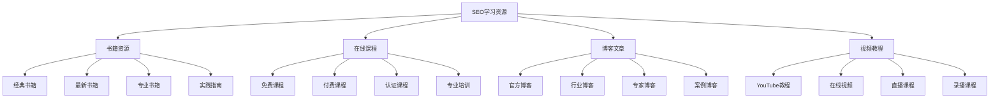
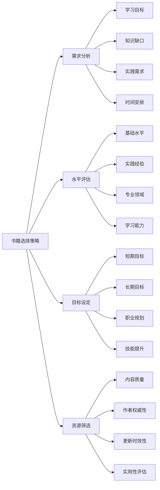
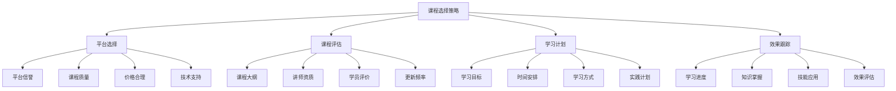
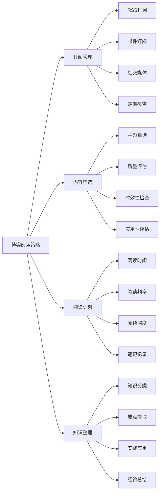
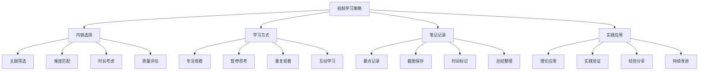
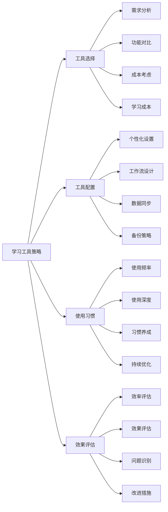
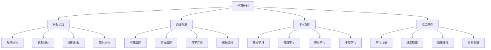
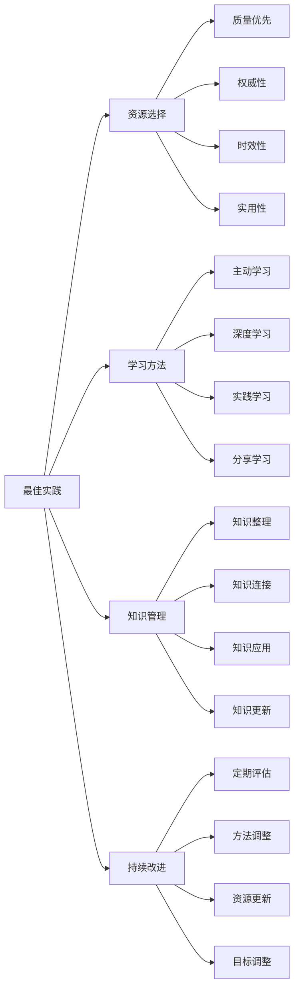

# 学习资源推荐

## 🎯 学习目标
- 了解SEO学习资源的分类和选择标准
- 掌握书籍、课程、博客等学习资源的使用方法
- 学会制定个人SEO学习计划
- 建立持续学习的认知框架

## 📚 学习资源概述

### 核心概念
**SEO学习资源**：帮助SEO从业者提升技能和知识的各种学习材料，包括书籍、课程、博客、视频等

### 学习资源重要性
| 重要性维度 | 具体表现 | 影响程度 | 学习价值 |
|------------|----------|----------|----------|
| **知识更新** | 跟上SEO发展趋势 | 高 | 知识体系更新 |
| **技能提升** | 提升SEO实践技能 | 高 | 实践能力提升 |
| **行业洞察** | 了解行业动态 | 中 | 行业理解深化 |
| **职业发展** | 促进职业发展 | 中 | 职业竞争力提升 |

## 📖 书籍资源推荐

### 1. 经典SEO书籍
| 书籍名称 | 作者 | 主要内容 | 适用人群 | 推荐指数 |
|----------|------|----------|----------|----------|
| **SEO艺术** | Eric Enge等 | SEO基础理论和实践 | 初学者、中级 | ⭐⭐⭐⭐⭐ |
| **SEO实战密码** | 昝辉 | 中文SEO实践指南 | 中文SEO从业者 | ⭐⭐⭐⭐⭐ |
| **Google SEO完全指南** | Google官方 | Google SEO官方指南 | 所有SEO从业者 | ⭐⭐⭐⭐⭐ |
| **SEO技术指南** | 各种技术专家 | 技术SEO深度解析 | 技术SEO从业者 | ⭐⭐⭐⭐ |

### 2. 最新SEO书籍
| 书籍名称 | 出版时间 | 主要内容 | 特色亮点 | 推荐指数 |
|----------|----------|----------|----------|----------|
| **AI时代的SEO** | 2024 | AI对SEO的影响 | 前沿技术应用 | ⭐⭐⭐⭐ |
| **移动SEO优化** | 2024 | 移动端SEO策略 | 移动优先策略 | ⭐⭐⭐⭐ |
| **内容营销SEO** | 2024 | 内容与SEO结合 | 内容策略优化 | ⭐⭐⭐⭐ |
| **本地SEO实战** | 2024 | 本地SEO实践 | 本地化策略 | ⭐⭐⭐⭐ |

### 3. 书籍选择策略

## 🎓 在线课程推荐

### 1. 免费课程资源
| 平台名称 | 课程类型 | 主要内容 | 特色优势 | 推荐指数 |
|----------|----------|----------|----------|----------|
| **Google Digital Garage** | 官方课程 | Google SEO基础 | 官方权威、免费 | ⭐⭐⭐⭐⭐ |
| **Coursera** | 大学课程 | SEO理论与实践 | 学术严谨、系统 | ⭐⭐⭐⭐ |
| **edX** | 在线课程 | 数字营销SEO | 高质量内容 | ⭐⭐⭐⭐ |
| **YouTube** | 视频教程 | 各种SEO主题 | 内容丰富、免费 | ⭐⭐⭐⭐ |

### 2. 付费课程推荐
| 平台名称 | 课程类型 | 价格范围 | 主要内容 | 推荐指数 |
|----------|----------|----------|----------|----------|
| **Udemy** | 实用课程 | $10-200 | SEO实战技能 | ⭐⭐⭐⭐ |
| **LinkedIn Learning** | 专业课程 | $30/月 | 企业级SEO | ⭐⭐⭐⭐ |
| **Skillshare** | 创意课程 | $15/月 | 创意SEO策略 | ⭐⭐⭐ |
| **MasterClass** | 大师课程 | $180/年 | 行业专家分享 | ⭐⭐⭐ |

### 3. 课程选择策略

## 📝 博客资源推荐

### 1. 官方博客
| 博客名称 | 更新频率 | 主要内容 | 特色优势 | 推荐指数 |
|----------|----------|----------|----------|----------|
| **Google Search Central** | 定期 | Google SEO官方指南 | 权威性、准确性 | ⭐⭐⭐⭐⭐ |
| **Bing Webmaster Blog** | 定期 | Bing SEO指南 | 多搜索引擎视角 | ⭐⭐⭐⭐ |
| **Moz Blog** | 频繁 | SEO理论和实践 | 深度分析、专业 | ⭐⭐⭐⭐⭐ |
| **Search Engine Land** | 频繁 | SEO新闻和分析 | 及时性、全面性 | ⭐⭐⭐⭐ |

### 2. 行业专家博客
| 博客名称 | 作者 | 主要内容 | 更新频率 | 推荐指数 |
|----------|------|----------|----------|----------|
| **Search Engine Journal** | 多位专家 | SEO行业动态 | 每日更新 | ⭐⭐⭐⭐ |
| **Ahrefs Blog** | Ahrefs团队 | SEO工具和策略 | 每周更新 | ⭐⭐⭐⭐ |
| **SEMrush Blog** | SEMrush团队 | 数字营销SEO | 每周更新 | ⭐⭐⭐⭐ |
| **Yoast SEO Blog** | Yoast团队 | WordPress SEO | 每周更新 | ⭐⭐⭐⭐ |

### 3. 博客阅读策略

## 🎥 视频教程推荐

### 1. YouTube频道推荐
| 频道名称 | 订阅者数 | 主要内容 | 更新频率 | 推荐指数 |
|----------|----------|----------|----------|----------|
| **Google Webmasters** | 100万+ | Google SEO官方 | 定期 | ⭐⭐⭐⭐⭐ |
| **Moz** | 50万+ | SEO教学和实践 | 每周 | ⭐⭐⭐⭐⭐ |
| **Ahrefs** | 30万+ | SEO工具使用 | 每周 | ⭐⭐⭐⭐ |
| **SEMrush** | 20万+ | 数字营销SEO | 每周 | ⭐⭐⭐⭐ |

### 2. 在线视频平台
| 平台名称 | 内容类型 | 主要特色 | 适用人群 | 推荐指数 |
|----------|----------|----------|----------|----------|
| **YouTube** | 免费视频 | 内容丰富、免费 | 所有学习者 | ⭐⭐⭐⭐⭐ |
| **Vimeo** | 高质量视频 | 专业内容、高质量 | 专业学习者 | ⭐⭐⭐⭐ |
| **Bilibili** | 中文视频 | 中文内容、互动性强 | 中文学习者 | ⭐⭐⭐⭐ |
| **腾讯课堂** | 付费课程 | 系统课程、认证 | 系统学习者 | ⭐⭐⭐ |

### 3. 视频学习策略

## 🛠️ 学习工具推荐

### 1. 笔记工具
| 工具名称 | 主要功能 | 适用场景 | 推荐指数 |
|----------|----------|----------|----------|
| **Obsidian** | 知识管理、链接 | 知识体系构建 | ⭐⭐⭐⭐⭐ |
| **Notion** | 全功能笔记 | 项目管理、笔记 | ⭐⭐⭐⭐ |
| **Evernote** | 传统笔记 | 简单笔记记录 | ⭐⭐⭐ |
| **OneNote** | 微软生态 | 办公环境集成 | ⭐⭐⭐ |

### 2. 学习管理工具
| 工具名称 | 主要功能 | 适用场景 | 推荐指数 |
|----------|----------|----------|----------|
| **Anki** | 间隔重复学习 | 知识记忆强化 | ⭐⭐⭐⭐ |
| **Todoist** | 任务管理 | 学习计划管理 | ⭐⭐⭐⭐ |
| **Trello** | 看板管理 | 学习进度跟踪 | ⭐⭐⭐ |
| **Google Calendar** | 时间管理 | 学习时间安排 | ⭐⭐⭐⭐ |

### 3. 学习工具使用策略

## 📅 学习计划制定

### 1. 学习计划要素
| 计划要素 | 具体内容 | 制定方法 | 实施要点 |
|----------|----------|----------|----------|
| **学习目标** | 明确的学习目标 | SMART原则 | 具体、可衡量 |
| **时间安排** | 学习时间规划 | 时间管理 | 合理、可持续 |
| **资源选择** | 学习资源筛选 | 需求匹配 | 质量、适用性 |
| **进度跟踪** | 学习进度监控 | 定期检查 | 及时调整 |

### 2. 学习计划模板

### 3. 学习计划实施
- **目标明确**：设定明确的学习目标
- **时间合理**：安排合理的学习时间
- **资源优质**：选择优质的学习资源
- **持续跟踪**：持续跟踪学习进度

## 🎯 学习资源最佳实践

### 1. 学习原则
| 学习原则 | 具体内容 | 实施要点 | 注意事项 |
|----------|----------|----------|----------|
| **系统性** | 系统化学习 | 知识体系构建 | 避免碎片化 |
| **实践性** | 理论与实践结合 | 学以致用 | 避免纸上谈兵 |
| **持续性** | 持续学习 | 终身学习 | 避免间断学习 |
| **选择性** | 选择性学习 | 质量优先 | 避免盲目学习 |

### 2. 最佳实践

### 3. 实施建议
- **从基础开始**：从基础资源开始学习
- **逐步深入**：逐步深入专业内容
- **实践结合**：理论与实践相结合
- **持续学习**：保持持续学习习惯

## 📚 学习路径

### 基础理解
1. [[01-认知层-基础概念#1.1-SEO基础]] - SEO基础
2. [[01-认知层-基础概念#1.2-搜索引擎原理]] - 搜索引擎原理
3. [[02-理解层-核心机制#2.1-Google算法深度解析]] - 算法理解

### 深入应用
1. [[02-理解层-核心机制#2.3-技术SEO]] - 技术SEO
2. [[03-应用层-实践技能#3.1-SEO工具精通]] - 工具应用
3. [[04-精通层-高级策略#4.1-企业级SEO策略]] - 企业级策略

### 实战练习
1. [[05-实战案例与模板#5.1-成功案例分析]] - 案例分析
2. [[06-工具与资源#6.1-SEO工具大全]] - 工具资源
3. [[06-工具与资源#6.3-行业报告]] - 行业报告

## 📖 相关链接
- [[01-认知层-基础概念#1.1-SEO基础]] - SEO基础
- [[02-理解层-核心机制#2.1-Google算法深度解析]] - 算法理解
- [[03-应用层-实践技能#3.1-SEO工具精通]] - 工具应用
- [[04-精通层-高级策略]] - 高级策略
- [[05-实战案例与模板]] - 实战案例
- [[06-工具与资源#6.1-SEO工具大全]] - 工具资源
