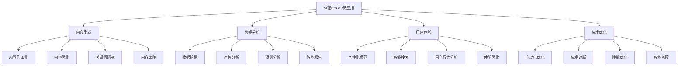
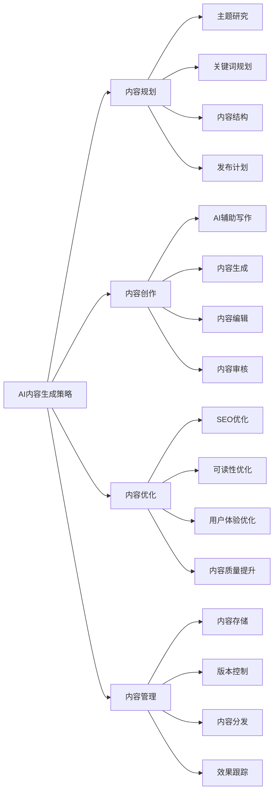
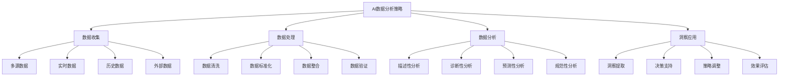
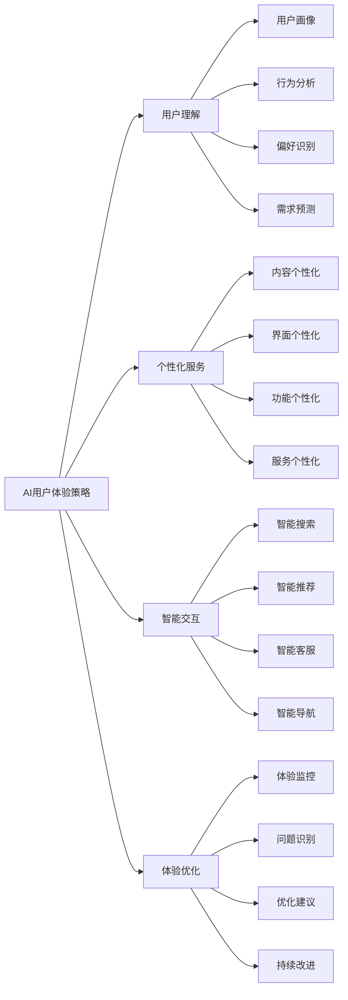
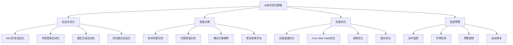
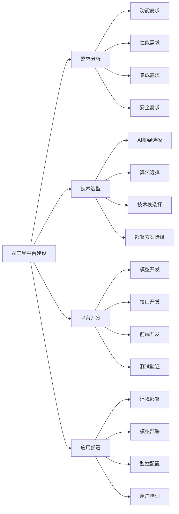
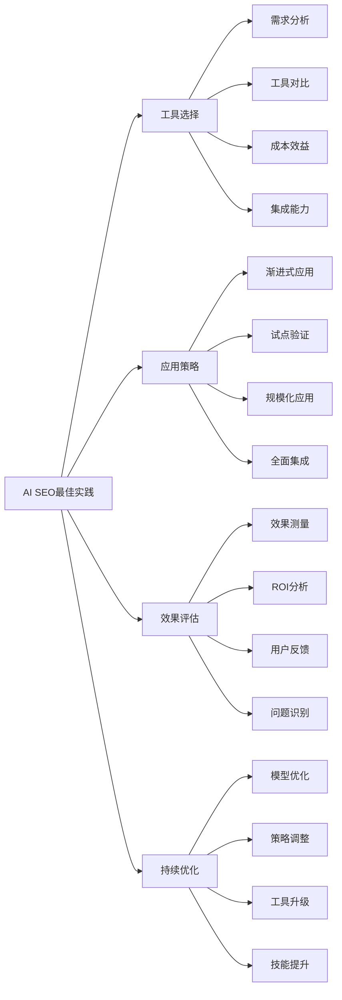

# SEO与AI

## 🎯 学习目标
- 深入理解AI技术在SEO中的应用和发展趋势
- 掌握AI工具在SEO各个领域的应用方法
- 学会利用AI提升SEO工作效率和效果
- 建立AI时代SEO的认知框架

## 🤖 AI与SEO概述

### 核心概念
**AI在SEO中的应用**：利用人工智能技术优化搜索引擎优化策略，提升搜索排名和用户体验

### AI在SEO中的重要性
| 重要性维度 | 具体表现 | 影响程度 | SEO价值 |
|------------|----------|----------|---------|
| **效率提升** | 自动化重复性工作 | 极高 | 工作效率提升 |
| **内容质量** | AI辅助内容创作 | 高 | 内容质量提升 |
| **数据分析** | 智能数据分析 | 高 | 决策准确性提升 |
| **用户体验** | 个性化用户体验 | 中 | 用户满意度提升 |

## 📝 AI内容生成应用

### 1. AI写作工具
| 工具类型 | 工具名称 | 功能特点 | 应用场景 |
|----------|----------|----------|----------|
| **通用写作** | ChatGPT、Claude | 内容生成、优化 | 博客文章、产品描述 |
| **专业写作** | Jasper、Copy.ai | 营销文案、广告文案 | 营销内容、广告文案 |
| **技术写作** | GitHub Copilot | 技术文档、代码注释 | 技术文档、API文档 |
| **多语言** | DeepL、Google Translate | 多语言内容 | 国际化内容 |

### 2. AI内容生成策略

### 3. AI内容生成最佳实践
- **人工审核**：AI生成内容需要人工审核
- **品牌一致性**：保持品牌声音和风格
- **原创性**：确保内容的原创性和价值
- **SEO优化**：结合SEO最佳实践

## 📊 AI数据分析应用

### 1. AI数据分析工具
| 工具类型 | 工具名称 | 功能特点 | 应用场景 |
|----------|----------|----------|----------|
| **数据挖掘** | Tableau、Power BI | 数据可视化、分析 | 数据洞察、报告生成 |
| **预测分析** | Google Analytics Intelligence | 趋势预测、异常检测 | 趋势分析、预警 |
| **自然语言** | MonkeyLearn、Lexalytics | 文本分析、情感分析 | 用户反馈分析 |
| **机器学习** | TensorFlow、Scikit-learn | 模型训练、预测 | 自定义分析模型 |

### 2. AI数据分析策略

### 3. AI数据分析实施
- **数据质量**：确保数据质量和完整性
- **模型选择**：选择合适的数据分析模型
- **结果解释**：正确解释AI分析结果
- **持续优化**：持续优化分析模型

## 🎨 AI用户体验优化

### 1. AI用户体验应用
| 应用领域 | 具体应用 | 技术实现 | 用户体验 |
|----------|----------|----------|----------|
| **个性化推荐** | 内容推荐、产品推荐 | 推荐算法、用户画像 | 个性化体验 |
| **智能搜索** | 语义搜索、语音搜索 | NLP、语音识别 | 搜索体验提升 |
| **聊天机器人** | 客服机器人、助手 | 对话系统、NLP | 交互体验优化 |
| **内容适配** | 动态内容、A/B测试 | 机器学习、优化算法 | 内容体验优化 |

### 2. AI用户体验策略

### 3. AI用户体验实施
- **用户隐私**：保护用户隐私和数据安全
- **透明度**：保持AI决策的透明度
- **可控性**：给用户提供控制选项
- **公平性**：确保AI决策的公平性

## 🔧 AI技术优化应用

### 1. AI技术优化工具
| 工具类型 | 工具名称 | 功能特点 | 应用场景 |
|----------|----------|----------|----------|
| **性能优化** | Google PageSpeed Insights | 性能分析、优化建议 | 页面速度优化 |
| **技术诊断** | Screaming Frog、Sitebulb | 技术问题识别 | 技术SEO优化 |
| **自动化** | Zapier、IFTTT | 工作流自动化 | 重复任务自动化 |
| **监控预警** | Pingdom、UptimeRobot | 实时监控、预警 | 网站监控 |

### 2. AI技术优化策略

### 3. AI技术优化实施
- **自动化程度**：合理设置自动化程度
- **人工干预**：保留必要的人工干预
- **效果监控**：监控AI优化效果
- **持续改进**：持续改进AI模型

## 🛠️ AI SEO工具平台

### 1. AI工具平台架构
| 平台层次 | 工具类型 | 功能特点 | 集成要求 |
|----------|----------|----------|----------|
| **AI引擎** | 机器学习、NLP | 智能分析、决策 | 算法优化、模型训练 |
| **应用层** | SEO工具、分析工具 | 功能完整、易用性 | 接口标准化、数据集成 |
| **数据层** | 数据仓库、数据湖 | 数据完整性、实时性 | 数据质量、数据安全 |
| **接口层** | API、SDK | 标准化、兼容性 | 接口规范、文档完善 |

### 2. AI工具平台建设

### 3. AI工具平台管理
- **模型管理**：管理AI模型的版本和更新
- **数据管理**：管理训练数据和模型数据
- **性能监控**：监控AI模型的性能表现
- **安全控制**：确保AI系统的安全性

## 🎯 AI SEO最佳实践

### 1. AI应用原则
| 应用原则 | 具体内容 | 实施要点 | 注意事项 |
|----------|----------|----------|----------|
| **人机协作** | AI辅助人工决策 | 合理分工、优势互补 | 避免过度依赖AI |
| **数据驱动** | 基于数据训练模型 | 数据质量、模型准确性 | 避免数据偏见 |
| **持续学习** | 持续优化AI模型 | 模型更新、性能提升 | 避免模型过时 |
| **伦理合规** | 遵循AI伦理规范 | 透明度、公平性 | 避免AI滥用 |

### 2. AI SEO最佳实践

### 3. AI SEO实施建议
- **从简单开始**：从简单的AI应用开始
- **逐步深入**：逐步深入AI应用
- **效果验证**：验证AI应用效果
- **持续学习**：持续学习AI技术

## 📚 学习路径

### 基础理解
1. [[01-认知层-基础概念#1.4-行业趋势#02-AI对SEO影响]] - AI对SEO影响
2. [[02-理解层-核心机制#2.1-Google算法深度解析]] - 算法理解
3. [[03-应用层-实践技能#3.1-SEO工具精通]] - 工具应用

### 深入应用
1. [[07-进阶专题#7.1-SEO与AI#02-ChatGPT与SEO]] - ChatGPT应用
2. [[07-进阶专题#7.1-SEO与AI#03-AI内容生成]] - AI内容生成
3. [[07-进阶专题#7.1-SEO与AI#04-AI数据分析]] - AI数据分析

### 实战练习
1. [[05-实战案例与模板#5.1-成功案例分析]] - 案例分析
2. [[06-工具与资源#6.1-SEO工具大全]] - 工具资源
3. [[04-精通层-高级策略#4.1-企业级SEO策略]] - 企业级策略

## 📖 相关链接
- [[01-认知层-基础概念#1.4-行业趋势#02-AI对SEO影响]] - AI对SEO影响
- [[02-理解层-核心机制#2.1-Google算法深度解析]] - 算法理解
- [[03-应用层-实践技能#3.1-SEO工具精通]] - 工具应用
- [[07-进阶专题#7.1-SEO与AI#02-ChatGPT与SEO]] - ChatGPT应用
- [[07-进阶专题#7.1-SEO与AI#03-AI内容生成]] - AI内容生成
- [[07-进阶专题#7.1-SEO与AI#04-AI数据分析]] - AI数据分析
