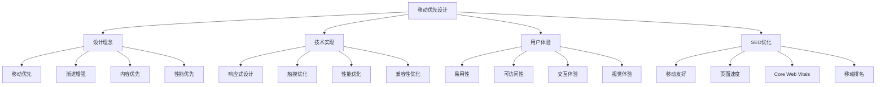
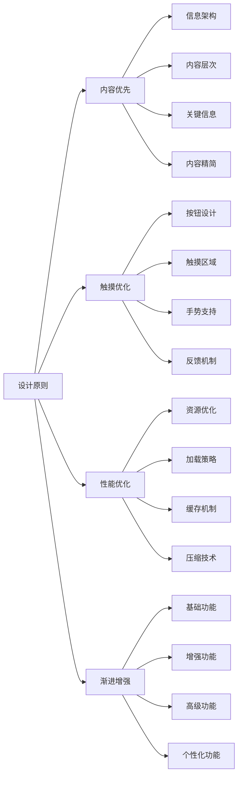
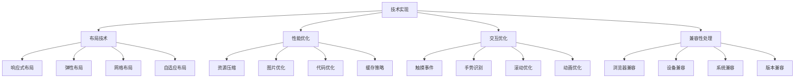
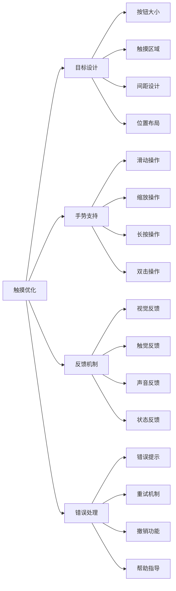
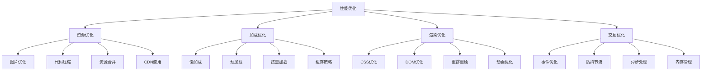
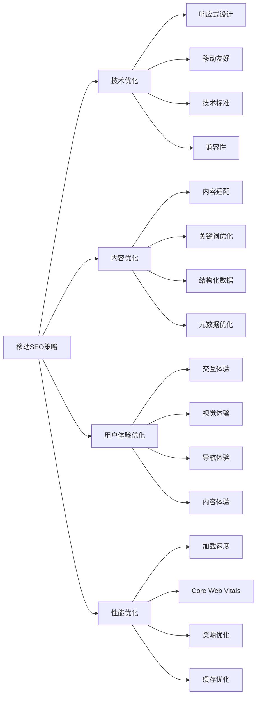
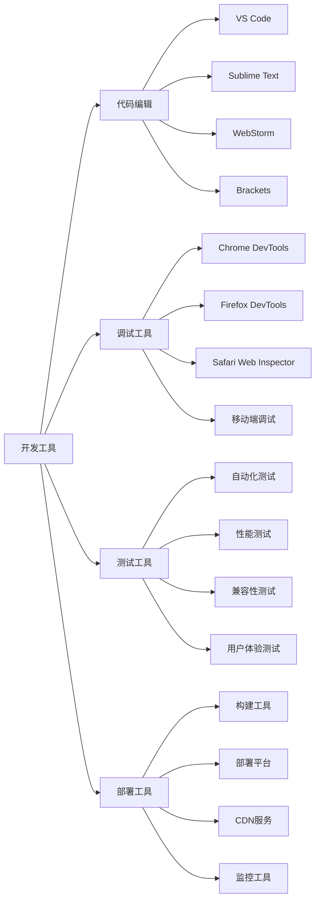
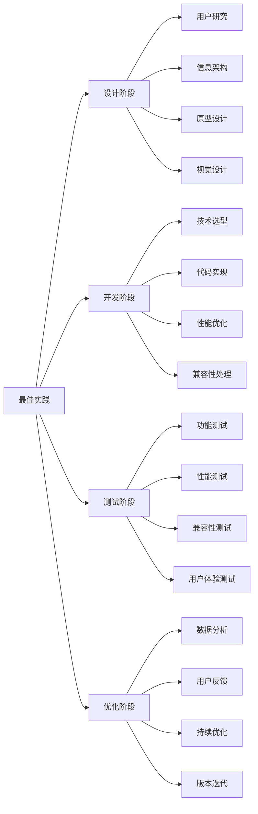

# 移动优先设计

## 🎯 学习目标
- 深入理解移动优先设计的概念和重要性
- 掌握移动优先设计的原则和实施方法
- 学会移动端用户体验优化策略
- 建立移动优先设计认知框架

## 📱 移动优先设计概述

### 核心概念
**移动优先设计**：以移动设备为设计起点，优先考虑移动端用户体验，然后逐步扩展到桌面端的设计理念



### 移动优先重要性
| 重要性维度 | 具体表现 | 影响程度 | SEO价值 |
|------------|----------|----------|---------|
| **用户行为** | 移动端用户占比超过60% | 极高 | 用户体验提升 |
| **搜索趋势** | 移动搜索占比持续增长 | 高 | 搜索可见性提升 |
| **Google算法** | 移动优先索引 | 极高 | 排名影响 |
| **商业价值** | 移动端转化率提升 | 高 | 商业价值提升 |

## 🎨 移动优先设计原则

### 1. 核心设计原则
| 设计原则 | 具体内容 | 实施方法 | 设计效果 |
|----------|----------|----------|----------|
| **内容优先** | 优先展示核心内容 | 信息层次、内容精简 | 用户快速获取信息 |
| **触摸友好** | 适合触摸操作的界面 | 按钮大小、间距设计 | 操作便利性提升 |
| **性能优先** | 优先考虑性能表现 | 资源优化、加载速度 | 用户体验提升 |
| **渐进增强** | 从基础功能开始增强 | 功能分层、体验提升 | 兼容性保证 |

### 2. 设计原则详解


### 3. 设计实施要点
- **屏幕适配**：适配不同屏幕尺寸
- **触摸优化**：优化触摸交互体验
- **性能优化**：确保移动端性能
- **内容优化**：优化移动端内容展示

## 🔧 技术实现方案

### 1. 响应式设计
| 技术方案 | 实现方法 | 技术特点 | 适用场景 |
|----------|----------|----------|----------|
| **CSS媒体查询** | 基于屏幕尺寸适配 | 灵活、可控 | 复杂布局 |
| **弹性布局** | Flexbox、Grid布局 | 自适应、响应式 | 现代浏览器 |
| **流体网格** | 百分比、相对单位 | 简单、兼容性好 | 传统布局 |
| **移动优先CSS** | 移动端样式优先 | 性能优化 | 移动优先策略 |

### 2. 技术实现策略


### 3. 代码实现示例
```css
/* 移动优先CSS */
.container {
  width: 100%;
  padding: 10px;
}

/* 平板适配 */
@media (min-width: 768px) {
  .container {
    max-width: 750px;
    margin: 0 auto;
    padding: 20px;
  }
}

/* 桌面适配 */
@media (min-width: 1024px) {
  .container {
    max-width: 1200px;
    padding: 30px;
  }
}
```

## 👆 触摸交互优化

### 1. 触摸设计规范
| 设计要素 | 规范要求 | 实施标准 | 用户体验 |
|----------|----------|----------|----------|
| **按钮尺寸** | 最小44px×44px | 触摸目标足够大 | 操作准确性提升 |
| **触摸间距** | 最小8px间距 | 避免误触 | 操作便利性提升 |
| **手势支持** | 支持常用手势 | 滑动、缩放、长按 | 交互丰富性提升 |
| **反馈机制** | 即时视觉反馈 | 点击效果、状态变化 | 操作确认性提升 |

### 2. 触摸优化策略


### 3. 触摸优化实施
- **目标大小**：确保触摸目标足够大
- **手势支持**：支持常用触摸手势
- **反馈及时**：提供即时操作反馈
- **错误处理**：优雅处理操作错误

## ⚡ 性能优化策略

### 1. 移动端性能优化
| 优化维度 | 优化方法 | 实施技巧 | 性能提升 |
|----------|----------|----------|----------|
| **资源优化** | 压缩、合并资源 | 图片压缩、代码合并 | 加载时间减少50% |
| **懒加载** | 延迟加载非关键资源 | 图片懒加载、组件懒加载 | 初始加载速度提升 |
| **缓存策略** | 合理使用缓存 | 浏览器缓存、CDN缓存 | 重复访问速度提升 |
| **代码优化** | 优化JavaScript和CSS | 代码分割、Tree Shaking | 执行效率提升 |

### 2. 性能优化实施


### 3. 性能监控
- **Core Web Vitals**：监控移动端Core Web Vitals
- **加载时间**：监控页面加载时间
- **交互响应**：监控用户交互响应时间
- **资源使用**：监控资源使用情况

## 📊 移动端SEO优化

### 1. 移动SEO要素
| SEO要素 | 优化内容 | 实施方法 | SEO效果 |
|----------|----------|----------|---------|
| **移动友好** | 移动端适配优化 | 响应式设计、触摸优化 | 移动排名提升 |
| **页面速度** | 移动端加载速度 | 性能优化、资源优化 | Core Web Vitals提升 |
| **用户体验** | 移动端用户体验 | 交互优化、内容优化 | 用户行为信号优化 |
| **技术实现** | 移动端技术优化 | 代码优化、兼容性优化 | 技术SEO提升 |

### 2. 移动SEO策略


### 3. 移动SEO实施
- **技术标准**：遵循移动端技术标准
- **内容优化**：优化移动端内容展示
- **用户体验**：提升移动端用户体验
- **性能优化**：优化移动端性能表现

## 🛠️ 移动优先设计工具

### 1. 设计工具
| 工具类型 | 工具名称 | 功能特点 | 应用场景 |
|----------|----------|----------|----------|
| **原型设计** | Figma、Sketch | 移动端原型设计 | 设计阶段 |
| **响应式设计** | Adobe XD | 响应式设计工具 | 设计实现 |
| **移动测试** | BrowserStack | 移动端测试 | 测试验证 |
| **性能测试** | PageSpeed Insights | 移动端性能测试 | 性能优化 |

### 2. 开发工具


### 3. 工具使用策略
- **工具选择**：选择适合的工具组合
- **工作流优化**：优化工具使用流程
- **团队协作**：提升团队协作效率
- **持续学习**：持续学习新工具功能

## 🎯 移动优先设计最佳实践

### 1. 设计原则
| 设计原则 | 具体内容 | 实施要点 | 注意事项 |
|----------|----------|----------|----------|
| **移动优先** | 以移动端为设计起点 | 移动端优先设计 | 避免桌面端思维 |
| **内容优先** | 优先展示核心内容 | 信息层次清晰 | 避免信息过载 |
| **性能优先** | 优先考虑性能表现 | 资源优化、加载速度 | 避免性能问题 |
| **用户体验** | 优化移动端用户体验 | 交互优化、视觉优化 | 避免复杂操作 |

### 2. 最佳实践


### 3. 实施建议
- **从移动开始**：从移动端开始设计
- **渐进增强**：逐步增强功能体验
- **性能优先**：优先考虑性能表现
- **用户中心**：以用户需求为中心

## 📚 学习路径

### 基础理解
1. [[01-认知层-基础概念#1.4-行业趋势#03-移动优先索引]] - 移动优先索引
2. [[02-理解层-核心机制#2.3-技术SEO#03-移动端适配]] - 移动端适配
3. [[02-理解层-核心机制#2.5-用户体验]] - 用户体验

### 深入应用
1. [[03-应用层-实践技能#3.1-SEO工具精通]] - 工具应用
2. [[03-应用层-实践技能#3.2-网站审计]] - 网站审计
3. [[04-精通层-高级策略#4.1-企业级SEO策略]] - 企业级策略

### 实战练习
1. [[05-实战案例与模板#5.1-成功案例分析]] - 案例分析
2. [[06-工具与资源#6.1-SEO工具大全]] - 工具资源
3. [[07-进阶专题#7.2-移动端SEO]] - 移动端SEO

## 📖 相关链接
- [[01-认知层-基础概念#1.4-行业趋势#03-移动优先索引]] - 移动优先索引
- [[02-理解层-核心机制#2.3-技术SEO#03-移动端适配]] - 移动端适配
- [[02-理解层-核心机制#2.5-用户体验]] - 用户体验
- [[03-应用层-实践技能#3.1-SEO工具精通]] - 工具应用
- [[03-应用层-实践技能#3.2-网站审计]] - 网站审计
- [[04-精通层-高级策略]] - 高级策略
