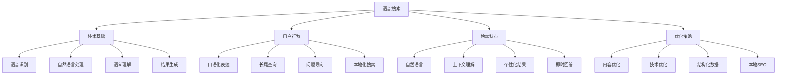
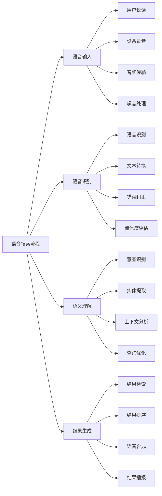
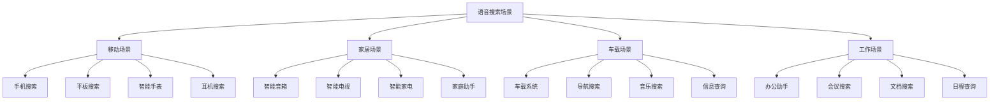
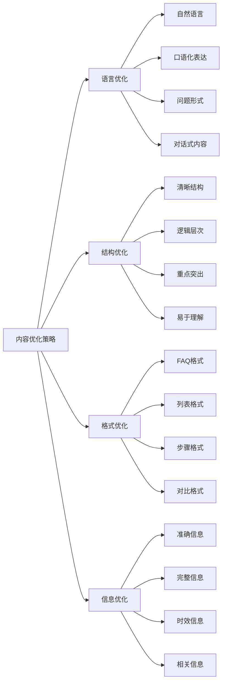
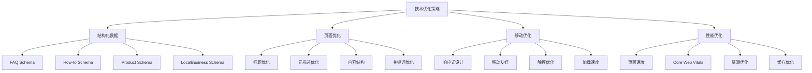
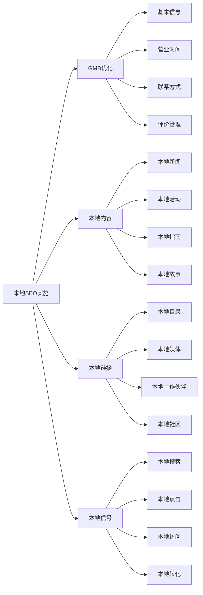
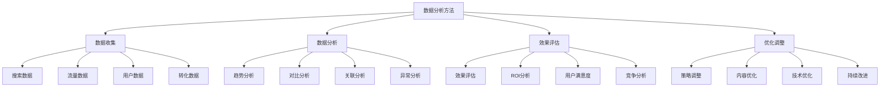
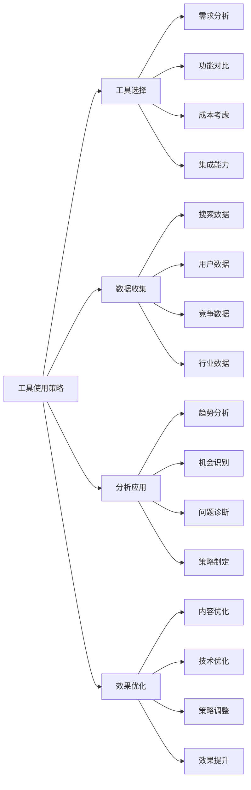
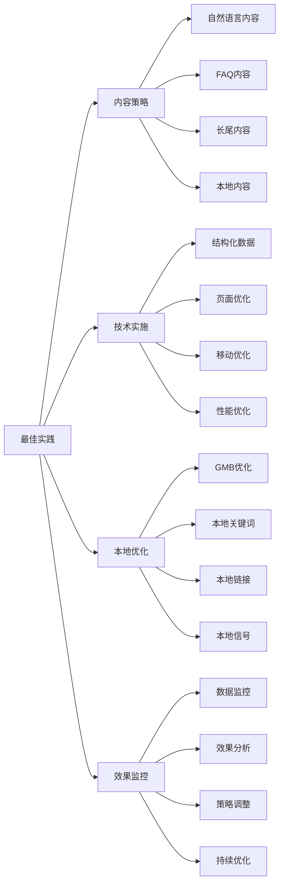

# 语音搜索

## 🎯 学习目标
- 深入理解语音搜索的发展趋势和重要性
- 掌握语音搜索优化的核心策略和方法
- 学会针对语音搜索进行内容和技术优化
- 建立语音搜索SEO的认知框架

## 🎤 语音搜索概述

### 核心概念
**语音搜索**：用户通过语音指令进行搜索，搜索引擎通过语音识别技术理解用户意图并返回相应结果

### 语音搜索重要性
| 重要性维度 | 具体表现 | 影响程度 | SEO价值 |
|------------|----------|----------|---------|
| **用户增长** | 语音搜索用户快速增长 | 极高 | 新流量来源 |
| **搜索行为** | 改变传统搜索行为 | 高 | 搜索优化方向 |
| **技术发展** | AI技术推动发展 | 高 | 技术优化需求 |
| **商业价值** | 语音搜索商业价值 | 中 | 商业机会 |

## 📱 语音搜索技术基础

### 1. 语音识别技术
| 技术组件 | 功能描述 | 技术特点 | 应用场景 |
|----------|----------|----------|----------|
| **语音识别** | 将语音转换为文本 | 高准确率、实时处理 | 语音输入 |
| **自然语言处理** | 理解语言含义 | 语义理解、上下文分析 | 意图识别 |
| **语音合成** | 将文本转换为语音 | 自然语音、个性化 | 语音输出 |
| **机器学习** | 持续学习优化 | 自适应、个性化 | 效果提升 |

### 2. 语音搜索流程

### 3. 主要语音助手
- **Google Assistant**：Google的语音助手
- **Siri**：Apple的语音助手
- **Alexa**：Amazon的语音助手
- **小爱同学**：小米的语音助手

## 🗣️ 语音搜索用户行为

### 1. 搜索行为特点
| 行为特点 | 具体表现 | 优化影响 | 应对策略 |
|----------|----------|----------|----------|
| **口语化** | 使用自然语言表达 | 关键词策略调整 | 自然语言优化 |
| **长尾查询** | 查询更长更具体 | 内容策略调整 | 长尾内容优化 |
| **问题导向** | 以问题形式搜索 | 内容结构调整 | FAQ内容优化 |
| **本地化** | 更多本地搜索 | 本地SEO重要 | 本地化优化 |

### 2. 语音搜索场景

### 3. 搜索意图分析
- **信息查询**：获取特定信息
- **任务执行**：执行特定任务
- **娱乐搜索**：寻找娱乐内容
- **购物搜索**：寻找商品信息

## 📝 语音搜索内容优化

### 1. 内容策略调整
| 优化维度 | 优化方法 | 实施技巧 | 优化效果 |
|----------|----------|----------|----------|
| **自然语言** | 使用自然语言表达 | 口语化写作 | 语音搜索友好 |
| **问题回答** | 直接回答问题 | FAQ格式 | 即时回答 |
| **长尾内容** | 优化长尾关键词 | 详细内容 | 长尾搜索覆盖 |
| **本地内容** | 优化本地信息 | 地理位置 | 本地搜索优化 |

### 2. 内容优化策略

### 3. 内容类型优化
- **FAQ内容**：常见问题解答
- **操作指南**：步骤化操作说明
- **产品介绍**：详细产品信息
- **本地信息**：地理位置相关信息

## 🔧 语音搜索技术优化

### 1. 结构化数据优化
| 数据类型 | 优化方法 | 技术实现 | SEO效果 |
|----------|----------|----------|---------|
| **FAQ** | FAQ结构化数据 | JSON-LD | 语音搜索优化 |
| **How-to** | 操作指南数据 | Schema.org | 步骤化回答 |
| **Product** | 产品信息数据 | 产品Schema | 产品信息优化 |
| **LocalBusiness** | 本地商业数据 | 本地Schema | 本地搜索优化 |

### 2. 技术优化策略

### 3. 技术实施要点
- **Schema标记**：正确实施结构化数据
- **页面速度**：优化页面加载速度
- **移动优化**：确保移动端体验
- **HTTPS**：使用安全连接

## 📍 语音搜索本地SEO

### 1. 本地优化策略
| 优化策略 | 具体方法 | 实施要点 | 优化效果 |
|----------|----------|----------|----------|
| **Google My Business** | 优化GMB资料 | 完整信息 | 本地搜索优化 |
| **本地关键词** | 优化本地关键词 | 地理位置 | 本地排名提升 |
| **本地内容** | 创建本地内容 | 本地信息 | 本地相关性 |
| **本地链接** | 建设本地链接 | 本地权威 | 本地信任度 |

### 2. 本地SEO实施

### 3. 本地优化工具
- **Google My Business**：本地商业资料管理
- **本地目录**：本地商业目录提交
- **本地关键词工具**：本地关键词研究
- **本地分析工具**：本地搜索分析

## 📊 语音搜索数据分析

### 1. 关键指标
| 指标类型 | 具体指标 | 测量方法 | 优化方向 |
|----------|----------|----------|----------|
| **搜索指标** | 语音搜索量、排名 | 搜索分析 | 搜索可见性 |
| **流量指标** | 语音搜索流量 | 流量分析 | 流量增长 |
| **转化指标** | 语音搜索转化 | 转化分析 | 转化优化 |
| **用户体验** | 语音搜索体验 | 用户反馈 | 体验优化 |

### 2. 数据分析方法

### 3. 分析工具
- **Google Analytics**：网站流量分析
- **Google Search Console**：搜索表现分析
- **语音搜索工具**：专门的语音搜索分析工具
- **用户调研**：用户行为调研

## 🛠️ 语音搜索工具

### 1. 优化工具
| 工具类型 | 工具名称 | 功能特点 | 应用场景 |
|----------|----------|----------|----------|
| **关键词工具** | Answer The Public | 问题关键词研究 | 语音搜索关键词 |
| **内容工具** | FAQ生成器 | FAQ内容生成 | FAQ内容优化 |
| **分析工具** | Google Analytics | 语音搜索分析 | 效果分析 |
| **测试工具** | 语音搜索测试 | 语音搜索测试 | 优化验证 |

### 2. 工具使用策略

### 3. 工具组合使用
- **多工具结合**：结合多个工具的优势
- **数据整合**：整合不同工具的数据
- **自动化**：使用工具实现自动化
- **持续监控**：持续监控和优化

## 🎯 语音搜索最佳实践

### 1. 优化原则
| 优化原则 | 具体内容 | 实施要点 | 注意事项 |
|----------|----------|----------|----------|
| **自然语言** | 使用自然语言 | 口语化表达 | 避免关键词堆砌 |
| **问题导向** | 以问题为导向 | 直接回答 | 避免绕弯子 |
| **本地化** | 重视本地优化 | 本地信息 | 避免忽略本地 |
| **用户体验** | 优化用户体验 | 易用性 | 避免复杂化 |

### 2. 最佳实践

### 3. 实施建议
- **从内容开始**：从内容优化开始
- **技术支撑**：确保技术实现
- **本地重视**：重视本地SEO
- **持续优化**：持续优化和改进

## 📚 学习路径

### 基础理解
1. [[01-认知层-基础概念#1.4-行业趋势#04-语音搜索优化]] - 语音搜索趋势
2. [[02-理解层-核心机制#2.4-内容SEO]] - 内容SEO
3. [[02-理解层-核心机制#2.3-技术SEO]] - 技术SEO

### 深入应用
1. [[07-进阶专题#7.3-语音搜索#02-语音搜索关键词]] - 关键词优化
2. [[07-进阶专题#7.3-语音搜索#03-语音搜索内容]] - 内容优化
3. [[07-进阶专题#7.3-语音搜索#04-语音搜索技术]] - 技术优化

### 实战练习
1. [[05-实战案例与模板#5.1-成功案例分析]] - 案例分析
2. [[06-工具与资源#6.1-SEO工具大全]] - 工具资源
3. [[04-精通层-高级策略#4.3-本地SEO]] - 本地SEO

## 📖 相关链接
- [[01-认知层-基础概念#1.4-行业趋势#04-语音搜索优化]] - 语音搜索趋势
- [[02-理解层-核心机制#2.4-内容SEO]] - 内容SEO
- [[02-理解层-核心机制#2.3-技术SEO]] - 技术SEO
- [[07-进阶专题#7.3-语音搜索#02-语音搜索关键词]] - 关键词优化
- [[07-进阶专题#7.3-语音搜索#03-语音搜索内容]] - 内容优化
- [[07-进阶专题#7.3-语音搜索#04-语音搜索技术]] - 技术优化
