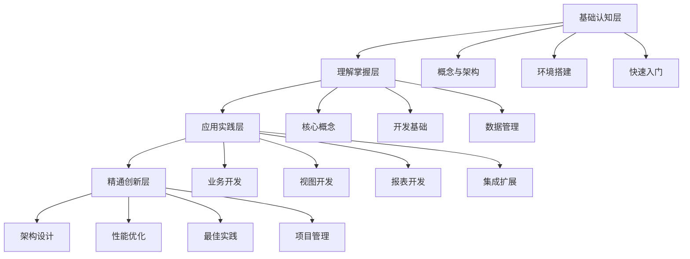

# Odoo开发学习路径规划

## 学习目标
- 掌握Odoo开发核心技能
- 能够独立开发企业级应用
- 具备架构设计和性能优化能力

## 学习路径图

## 学习阶段规划

### 第一阶段：基础认知（2-3周）
- **目标**：建立Odoo整体认知
- **重点**：概念理解、环境搭建、快速上手
- **评估**：能够创建第一个简单模块

### 第二阶段：理解掌握（4-6周）
- **目标**：深入理解核心机制
- **重点**：模型、视图、ORM、数据管理
- **评估**：能够开发完整的业务模块

### 第三阶段：应用实践（6-8周）
- **目标**：掌握实际开发技能
- **重点**：业务逻辑、视图设计、报表开发
- **评估**：完成一个完整的项目案例

### 第四阶段：精通创新（持续学习）
- **目标**：具备架构设计能力
- **重点**：性能优化、最佳实践、项目管理
- **评估**：能够设计企业级解决方案

## 学习建议

### 费曼学习法应用
1. **概念解释**：用简单语言解释每个概念
2. **实例演示**：通过代码示例理解原理
3. **问题解决**：遇到问题主动思考解决
4. **知识传授**：向他人讲解所学知识

### 刻意练习策略
1. **分解练习**：将复杂技能分解为小步骤
2. **重复练习**：反复练习核心技能
3. **反馈改进**：及时获取反馈并改进
4. **挑战提升**：逐步增加练习难度

## 相关链接
- [[技能树总览]] - 查看详细技能要求
- [[进度跟踪表]] - 记录学习进度
- [[知识关联图]] - 理解知识点关系
