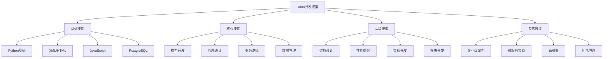

# Odoo开发技能树总览

## 技能树结构

## 技能等级定义

### 基础技能（Level 1-2）
| 技能 | 描述 | 掌握标准 |
|------|------|----------|
| Python基础 | 语法、面向对象、常用库 | 能编写简单脚本和类 |
| XML/HTML | 标记语言、结构理解 | 能读懂和修改XML文件 |
| JavaScript | 基础语法、DOM操作 | 能编写简单前端交互 |
| PostgreSQL | 基础SQL、数据库概念 | 能执行查询和基本操作 |

### 核心技能（Level 3-4）
| 技能 | 描述 | 掌握标准 |
|------|------|----------|
| 模型开发 | ORM、字段定义、关系 | 能创建完整的数据模型 |
| 视图设计 | 表单、列表、看板视图 | 能设计用户友好的界面 |
| 业务逻辑 | 方法编写、工作流 | 能实现复杂业务规则 |
| 数据管理 | 迁移、备份、性能 | 能管理数据生命周期 |

### 高级技能（Level 5-6）
| 技能 | 描述 | 掌握标准 |
|------|------|----------|
| 架构设计 | 模块化、可扩展性 | 能设计可维护的架构 |
| 性能优化 | 查询优化、缓存策略 | 能解决性能瓶颈 |
| 集成开发 | API、第三方系统 | 能集成外部系统 |
| 报表开发 | QWeb、动态报表 | 能开发复杂报表 |

### 专家技能（Level 7-8）
| 技能 | 描述 | 掌握标准 |
|------|------|----------|
| 企业级架构 | 高可用、负载均衡 | 能设计企业级解决方案 |
| 微服务集成 | 服务拆分、通信 | 能设计微服务架构 |
| 云部署 | 容器化、自动化 | 能部署到云平台 |
| 团队管理 | 项目管理、代码审查 | 能领导开发团队 |

## 技能评估方法

### 自评标准
- **Level 1-2**：能理解概念，完成基础操作
- **Level 3-4**：能独立开发，解决常见问题
- **Level 5-6**：能优化性能，设计架构
- **Level 7-8**：能创新方案，指导他人

### 实践项目评估
1. **基础项目**：简单CRUD模块
2. **中级项目**：完整业务模块
3. **高级项目**：多模块集成系统
4. **专家项目**：企业级解决方案

## 学习路径建议

### 快速入门路径（3个月）
1. 基础技能 → 核心技能
2. 重点：模型开发、视图设计
3. 目标：能开发完整模块

### 系统学习路径（6个月）
1. 基础技能 → 核心技能 → 高级技能
2. 重点：全栈开发能力
3. 目标：能独立完成项目

### 专家成长路径（12个月+）
1. 全技能树覆盖
2. 重点：架构设计、团队管理
3. 目标：成为技术专家

## 相关链接
- [[学习路径规划]] - 查看详细学习计划
- [[进度跟踪表]] - 记录技能提升
- [[知识关联图]] - 理解技能关系
