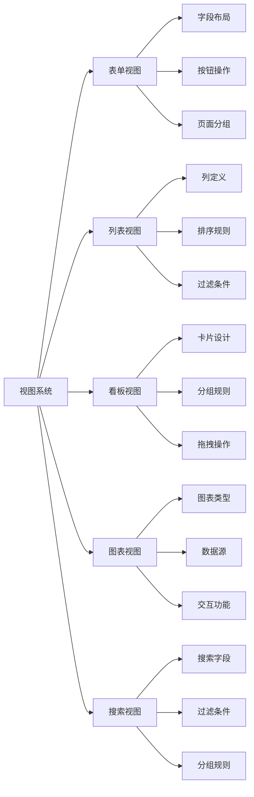
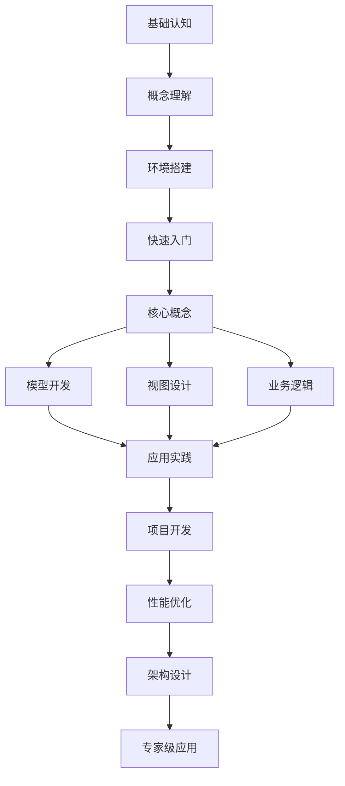
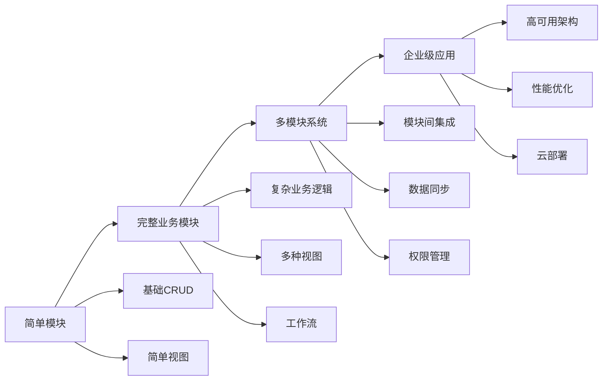

# Odoo开发知识关联图

## 知识体系架构

```mermaid
graph TB
    subgraph "基础认知层"
        A1[Odoo简介与历史]
        A2[技术栈概览]
        A3[MVC架构详解]
        A4[模块化设计理念]
        A5[企业应用特点]
    end
    
    subgraph "理解掌握层"
        B1[模型(Model)详解]
        B2[视图(View)系统]
        B3[控制器(Controller)机制]
        B4[ORM数据访问层]
        B5[字段类型与约束]
        B6[关系字段设计]
    end
    
    subgraph "应用实践层"
        C1[自定义模型开发]
        C2[业务逻辑实现]
        C3[工作流设计]
        C4[表单视图设计]
        C5[列表视图配置]
        C6[看板视图开发]
    end
    
    subgraph "精通创新层"
        D1[企业级架构设计]
        D2[性能优化]
        D3[最佳实践]
        D4[项目管理]
    end
    
    A1 --> B1
    A2 --> B4
    A3 --> B2
    A3 --> B3
    A4 --> B1
    
    B1 --> C1
    B2 --> C4
    B2 --> C5
    B2 --> C6
    B3 --> C2
    B4 --> C1
    B5 --> C1
    B6 --> C1
    
    C1 --> D1
    C2 --> D2
    C3 --> D1
    C4 --> D2
    C5 --> D2
    C6 --> D2
```

## 核心概念关联

### 模型(Model)关联网络
```mermaid
graph LR
    A[模型(Model)] --> B[字段定义]
    A --> C[关系字段]
    A --> D[业务方法]
    A --> E[约束规则]
    
    B --> F[基础字段类型]
    B --> G[计算字段]
    B --> H[存储字段]
    
    C --> I[Many2one]
    C --> J[One2many]
    C --> K[Many2many]
    
    D --> L[CRUD操作]
    D --> M[业务逻辑]
    D --> N[工作流方法]
    
    E --> O[SQL约束]
    E --> P[Python约束]
    E --> Q[唯一性约束]
```

### 视图(View)关联网络


## 学习路径关联

### 基础到高级的关联路径


## 技能关联矩阵

| 技能领域 | 基础技能 | 核心技能 | 高级技能 | 专家技能 |
|----------|----------|----------|----------|----------|
| **模型开发** | Python基础 | ORM理解 | 复杂关系 | 架构设计 |
| **视图设计** | XML基础 | 视图类型 | 自定义组件 | 用户体验 |
| **业务逻辑** | 编程基础 | 方法编写 | 工作流设计 | 业务流程 |
| **数据管理** | 数据库基础 | 数据操作 | 性能优化 | 数据架构 |
| **集成开发** | API概念 | 接口调用 | 系统集成 | 微服务架构 |

## 实践项目关联

### 项目复杂度递进


## 知识检查点

### 基础认知层检查点
- [ ] 理解Odoo的基本概念和架构
- [ ] 掌握技术栈组成
- [ ] 能够搭建开发环境
- [ ] 完成第一个简单模块

### 理解掌握层检查点
- [ ] 深入理解MVC架构
- [ ] 掌握模型、视图、控制器的关系
- [ ] 能够设计数据模型
- [ ] 理解ORM的工作原理

### 应用实践层检查点
- [ ] 能够开发完整的业务模块
- [ ] 掌握各种视图的设计
- [ ] 实现复杂的业务逻辑
- [ ] 完成集成开发

### 精通创新层检查点
- [ ] 设计企业级架构
- [ ] 优化系统性能
- [ ] 制定开发规范
- [ ] 管理大型项目

## 相关链接
- [[学习路径规划]] - 查看学习计划
- [[技能树总览]] - 查看技能要求
- [[进度跟踪表]] - 记录学习进度
