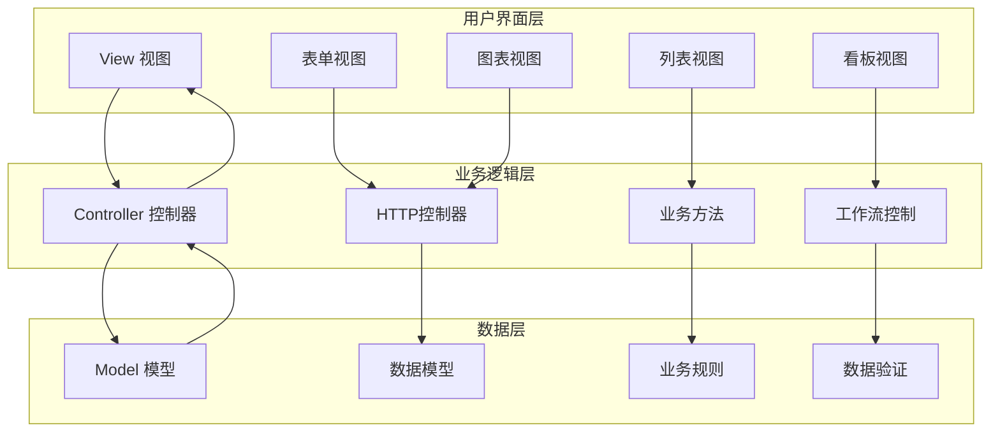
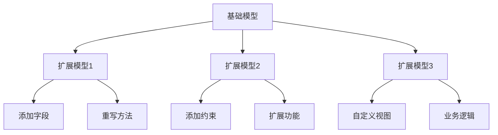
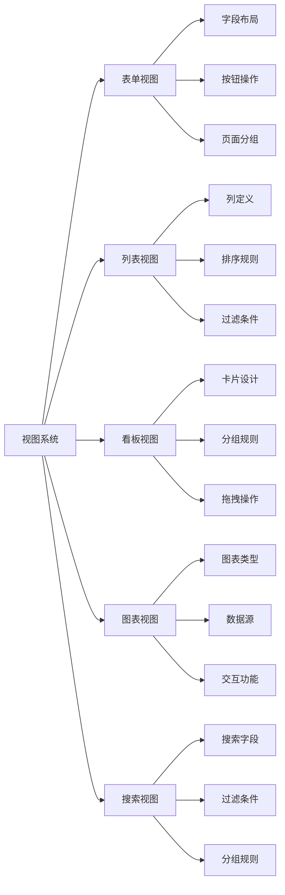
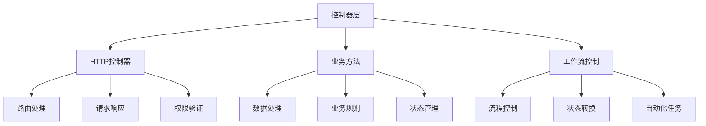
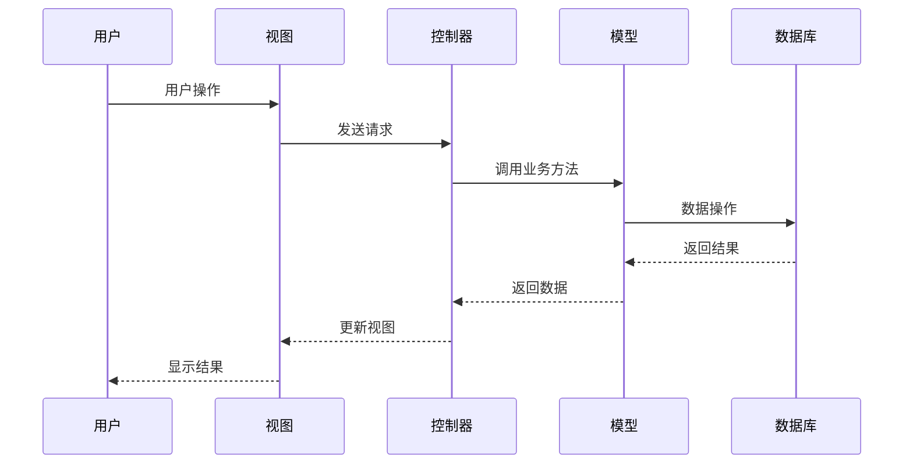

# MVC架构详解

## MVC架构概述

MVC（Model-View-Controller）是Odoo的核心架构模式，将应用程序分为三个主要组件，实现关注点分离。

### MVC架构图


## Model（模型层）

### 模型定义
模型负责数据管理和业务规则，是MVC架构的核心。

```python
# 模型示例
from odoo import models, fields, api

class ResPartner(models.Model):
    _name = 'res.partner'
    _description = 'Partner'
    
    name = fields.Char('Name', required=True)
    email = fields.Char('Email')
    phone = fields.Char('Phone')
    
    @api.model
    def create(self, vals):
        # 业务逻辑
        return super().create(vals)
```

### 模型组件
| 组件 | 作用 | 示例 |
|------|------|------|
| **字段定义** | 数据结构 | `name = fields.Char('Name')` |
| **业务方法** | 业务逻辑 | `@api.model def create(self, vals)` |
| **约束规则** | 数据验证 | `@api.constrains('email')` |
| **计算字段** | 派生数据 | `@api.depends('field1', 'field2')` |
| **关系字段** | 数据关联 | `partner_id = fields.Many2one('res.partner')` |

### 模型继承


## View（视图层）

### 视图类型
视图负责用户界面展示，支持多种视图类型。



### 视图定义示例
```xml
<!-- 表单视图 -->
<record id="view_partner_form" model="ir.ui.view">
    <field name="name">res.partner.form</field>
    <field name="model">res.partner</field>
    <field name="arch" type="xml">
        <form>
            <sheet>
                <group>
                    <field name="name"/>
                    <field name="email"/>
                    <field name="phone"/>
                </group>
            </sheet>
        </form>
    </field>
</record>

<!-- 列表视图 -->
<record id="view_partner_tree" model="ir.ui.view">
    <field name="name">res.partner.tree</field>
    <field name="model">res.partner</field>
    <field name="arch" type="xml">
        <tree>
            <field name="name"/>
            <field name="email"/>
            <field name="phone"/>
        </tree>
    </field>
</record>
```

## Controller（控制器层）

### 控制器类型
控制器处理用户请求和业务逻辑，连接视图和模型。



### 控制器示例
```python
# HTTP控制器
from odoo import http
from odoo.http import request

class PartnerController(http.Controller):
    
    @http.route('/partner/create', type='http', auth='user')
    def create_partner(self, **kwargs):
        # 处理HTTP请求
        partner = request.env['res.partner'].create({
            'name': kwargs.get('name'),
            'email': kwargs.get('email'),
        })
        return request.redirect('/web#id=%s&model=res.partner' % partner.id)

# 业务方法
class ResPartner(models.Model):
    _name = 'res.partner'
    
    @api.model
    def create_customer(self, vals):
        # 业务逻辑处理
        vals['is_company'] = False
        return self.create(vals)
```

## MVC交互流程

### 数据流向


### 典型交互场景
1. **数据创建**：用户填写表单 → 视图验证 → 控制器处理 → 模型保存
2. **数据查询**：用户搜索 → 控制器查询 → 模型检索 → 视图展示
3. **数据更新**：用户修改 → 视图提交 → 控制器验证 → 模型更新
4. **数据删除**：用户删除 → 控制器确认 → 模型删除 → 视图刷新

## 架构优势

### 关注点分离
| 层次 | 职责 | 优势 |
|------|------|------|
| **Model** | 数据管理、业务规则 | 数据一致性、业务逻辑集中 |
| **View** | 用户界面、交互体验 | 界面灵活、用户体验优化 |
| **Controller** | 请求处理、流程控制 | 逻辑清晰、易于维护 |

### 可维护性
- **模块化设计**：各层独立开发
- **代码复用**：模型和视图可复用
- **测试友好**：各层可独立测试
- **扩展性强**：易于添加新功能

## 最佳实践

### 模型设计原则
1. **单一职责**：每个模型专注一个业务领域
2. **数据完整性**：使用约束保证数据质量
3. **业务逻辑封装**：将业务规则封装在模型中
4. **关系设计**：合理设计模型间关系

### 视图设计原则
1. **用户体验优先**：界面简洁、操作直观
2. **响应式设计**：适配不同设备
3. **性能优化**：避免复杂计算
4. **一致性**：保持界面风格统一

### 控制器设计原则
1. **轻量级**：控制器保持简洁
2. **权限控制**：确保数据安全
3. **错误处理**：完善的异常处理
4. **日志记录**：记录关键操作

## 学习建议

### 理解重点
1. **架构思想**：理解MVC的设计理念
2. **数据流向**：掌握各层间的交互
3. **职责划分**：明确各层的职责边界
4. **实践应用**：通过项目理解架构

### 实践建议
- 从简单模型开始学习
- 理解视图与模型的绑定关系
- 掌握控制器的请求处理流程
- 关注架构的扩展性和维护性

## 相关链接
- [[模型(Model)详解]] - 深入学习模型层
- [[视图(View)系统]] - 掌握视图设计
- [[控制器(Controller)机制]] - 理解控制逻辑
- [[模块化设计理念]] - 架构设计思想
