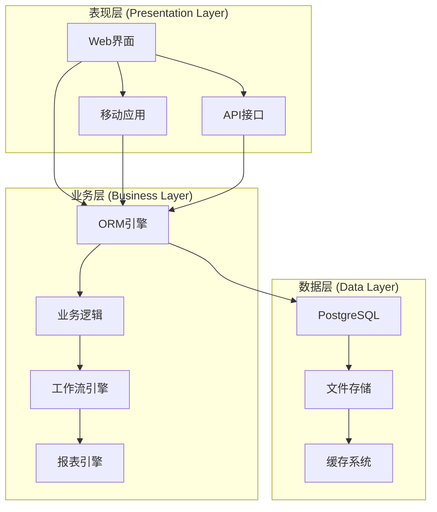
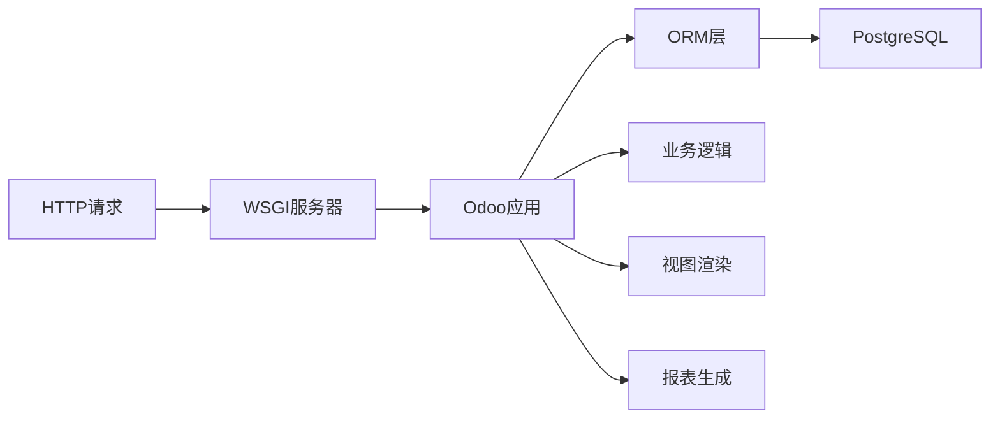
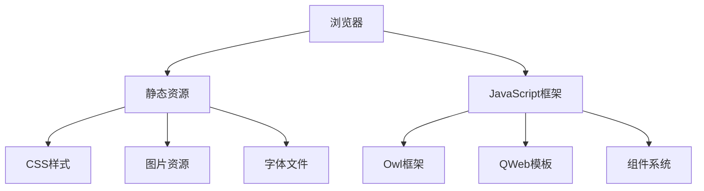
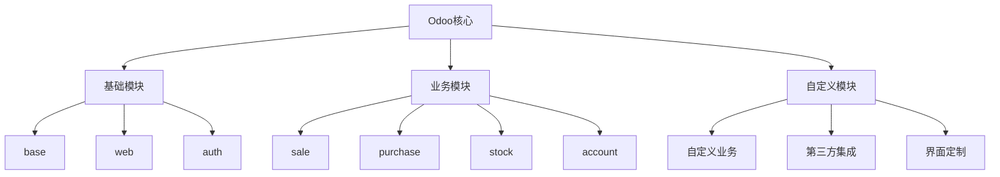
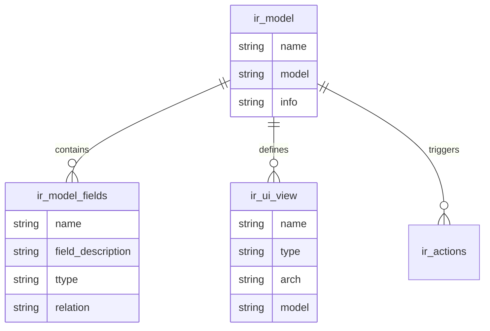
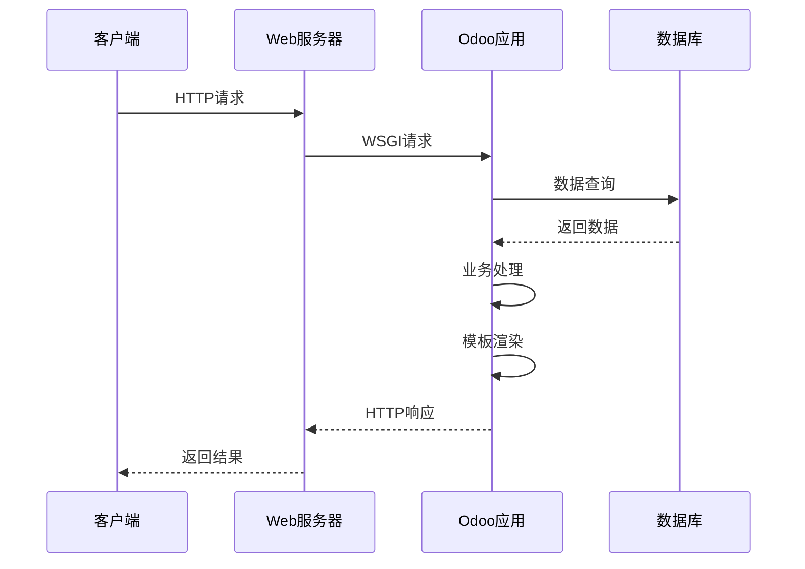
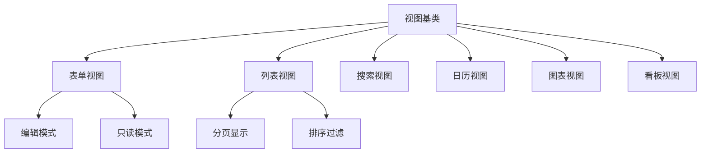
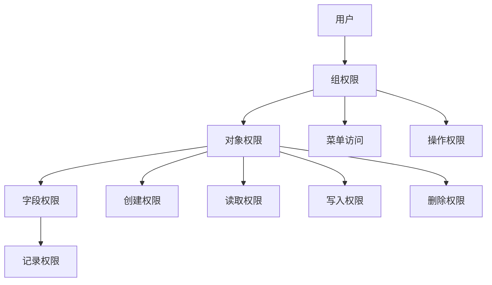
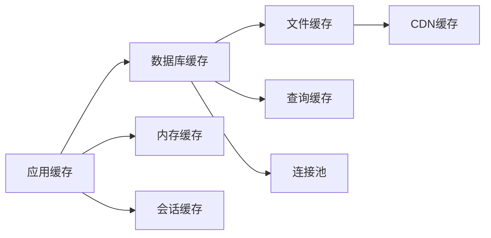

# Odoo架构详解

## 🎯 学习目标
- 理解Odoo的整体架构设计
- 掌握各层级的职责和交互关系
- 了解架构设计的原则和优势

## 🏗️ 整体架构

### 分层架构图

### 核心组件
| 组件 | 职责 | 技术实现 |
|------|------|----------|
| Web框架 | HTTP请求处理 | Werkzeug + WSGI |
| ORM引擎 | 数据访问抽象 | Python ORM |
| 模板引擎 | 视图渲染 | QWeb模板 |
| 工作流引擎 | 业务流程控制 | 状态机模式 |
| 报表引擎 | 报表生成 | QWeb + Wkhtmltopdf |

## 🔧 技术架构

### 后端架构

### 前端架构

## 📦 模块化架构

### 模块层次结构

### 模块依赖关系
- **基础模块**: 提供核心功能，其他模块依赖
- **业务模块**: 实现具体业务功能，可独立安装
- **扩展模块**: 扩展现有模块功能，继承和重写

## 🗄️ 数据架构

### 数据库设计

### 数据访问层
- **ORM抽象**: 屏蔽数据库差异
- **字段类型**: 支持多种数据类型
- **关系映射**: 一对一、一对多、多对多
- **数据验证**: 自动数据完整性检查

## 🔄 请求处理流程

### HTTP请求处理

### 典型请求类型
1. **页面请求**: 返回HTML页面
2. **AJAX请求**: 返回JSON数据
3. **文件下载**: 返回文件流
4. **API调用**: 返回结构化数据

## 🎨 视图架构

### 视图类型层次

### 视图渲染机制
- **QWeb模板**: 基于XML的模板引擎
- **组件系统**: 可复用的UI组件
- **响应式设计**: 适配不同屏幕尺寸
- **主题系统**: 支持界面主题定制

## 🔐 安全架构

### 权限控制体系

### 安全机制
- **用户认证**: 多种认证方式支持
- **权限控制**: 细粒度权限管理
- **数据隔离**: 多公司数据隔离
- **审计日志**: 操作记录和追踪

## ⚡ 性能架构

### 缓存策略

### 性能优化
- **数据库优化**: 索引、查询优化
- **缓存机制**: 多级缓存策略
- **异步处理**: 后台任务处理
- **负载均衡**: 多实例部署

## 🔗 扩展架构

### 插件机制
- **模块继承**: 扩展现有模块
- **钩子函数**: 在关键点插入自定义逻辑
- **事件系统**: 基于事件的松耦合设计
- **API接口**: 标准化接口规范

### 集成方式
- **REST API**: 标准HTTP接口
- **XML-RPC**: 传统RPC接口
- **Webhook**: 事件推送机制
- **消息队列**: 异步消息处理

## 🎓 架构优势

### 技术优势
- **模块化**: 高内聚低耦合
- **可扩展**: 支持水平扩展
- **可维护**: 清晰的代码结构
- **可测试**: 支持单元测试

### 业务优势
- **快速开发**: 丰富的开发框架
- **灵活定制**: 高度可定制化
- **成本效益**: 开源降低成本
- **社区支持**: 活跃的社区生态

## 🔗 相关链接

### 下一步学习
- [[模块化设计理念]] - 深入理解模块化
- [[ORM模型机制]] - 掌握数据访问层
- [[开发环境配置]] - 开始实践开发

### 实践建议
- 搭建开发环境，体验架构
- 创建简单模块，理解模块化
- 分析现有模块，学习设计模式

## 📝 思考题

### 基础理解
1. Odoo的分层架构有什么优势？
2. 模块化设计如何提高开发效率？
3. ORM层的作用是什么？

### 深入思考
1. 如何设计一个可扩展的模块架构？
2. 性能优化应该从哪些方面入手？
3. 安全架构如何保证数据安全？

---

**学习进度**: ✅ 已完成  
**下一步**: [[模块化设计理念]]
