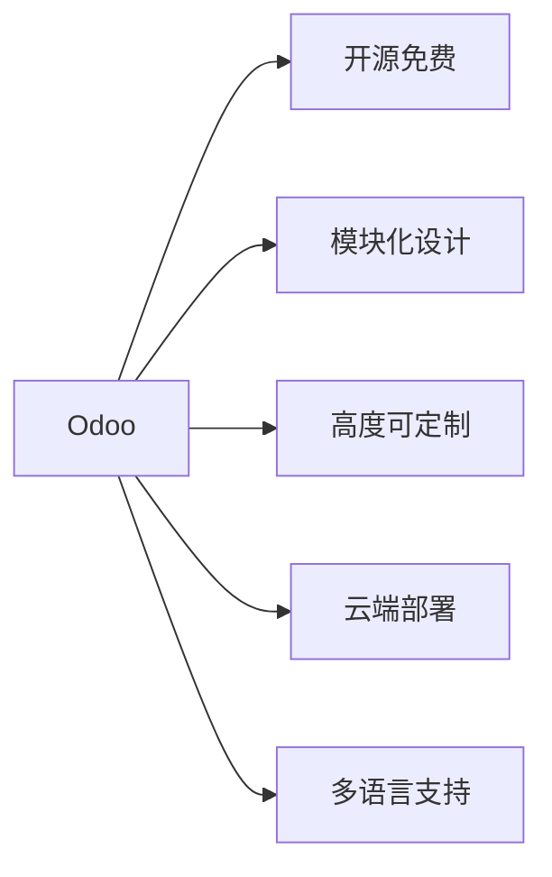
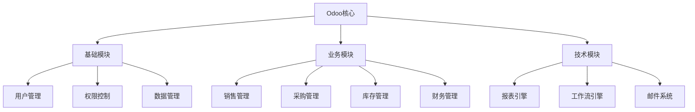

# Odoo概述

## 🎯 学习目标
- 理解Odoo的基本概念和定位
- 了解Odoo的发展历程和特点
- 掌握Odoo的核心价值和应用场景

## 📚 什么是Odoo

### 基本定义
Odoo是一个开源的企业资源规划(ERP)和客户关系管理(CRM)软件套件，采用模块化架构设计，支持高度定制和扩展。

### 核心特点

## 🏢 发展历程

### 历史沿革
| 时间 | 版本 | 重要事件 |
|------|------|----------|
| 2005 | 1.0 | TinyERP诞生 |
| 2008 | 5.0 | 更名为OpenERP |
| 2014 | 8.0 | 更名为Odoo |
| 2015 | 9.0 | 引入新框架 |
| 2017 | 11.0 | 重大架构升级 |
| 2020 | 14.0 | 性能优化 |
| 2023 | 17.0 | 最新版本 |

### 技术演进
- **早期**: 基于GTK的桌面应用
- **中期**: Web化转型，引入ORM
- **现在**: 现代化Web应用，支持移动端

## 🎨 架构特点

### 模块化架构

### 技术栈
- **后端**: Python + PostgreSQL
- **前端**: JavaScript + QWeb模板
- **数据库**: PostgreSQL
- **Web服务器**: Nginx/Apache
- **应用服务器**: Gunicorn/uWSGI

## 💼 应用场景

### 适用企业类型
- 中小企业 (SME)
- 制造业企业
- 贸易公司
- 服务型企业
- 电商企业

### 典型应用
1. **ERP管理**: 销售、采购、库存、财务一体化
2. **CRM系统**: 客户关系管理
3. **项目管理**: 任务分配和进度跟踪
4. **人力资源**: 员工管理和薪资计算
5. **电商平台**: 在线销售和订单管理

## 🔧 版本类型

### Community Edition (社区版)
- **特点**: 完全开源免费
- **功能**: 基础ERP/CRM功能
- **适用**: 中小企业、开发者学习

### Enterprise Edition (企业版)
- **特点**: 商业授权，功能更丰富
- **功能**: 高级报表、移动应用、技术支持
- **适用**: 大型企业、复杂需求

## 🌟 核心优势

### 技术优势
- **开源透明**: 代码完全开放
- **模块化**: 按需安装和定制
- **可扩展**: 支持二次开发
- **跨平台**: 支持多种操作系统

### 商业优势
- **成本效益**: 降低软件采购成本
- **快速部署**: 标准化实施流程
- **社区支持**: 活跃的开发者社区
- **持续更新**: 定期版本发布

## 🎓 学习价值

### 对开发者的价值
- **技术成长**: 学习现代Web开发技术
- **业务理解**: 深入理解企业业务流程
- **项目经验**: 积累大型项目开发经验
- **职业发展**: 提升在ERP领域的竞争力

### 对企业的价值
- **数字化转型**: 实现业务流程数字化
- **效率提升**: 提高业务处理效率
- **成本控制**: 降低IT投入成本
- **竞争优势**: 获得技术竞争优势

## 🔗 相关链接

### 下一步学习
- [[Odoo架构详解]] - 深入了解技术架构
- [[模块化设计理念]] - 理解模块化思想
- [[开发环境配置]] - 开始环境搭建

### 外部资源
- [Odoo官网](https://www.odoo.com)
- [Odoo社区](https://www.odoo.com/community)
- [GitHub仓库](https://github.com/odoo/odoo)

## 📝 思考题

### 基础理解
1. Odoo与传统ERP软件的主要区别是什么？
2. 为什么Odoo采用模块化架构设计？
3. 社区版和企业版的主要差异在哪里？

### 深入思考
1. 如何评估企业是否适合使用Odoo？
2. Odoo的开源模式对行业发展有什么影响？
3. 未来Odoo可能的发展方向是什么？

---

**学习进度**: ✅ 已完成  
**下一步**: [[Odoo架构详解]]

