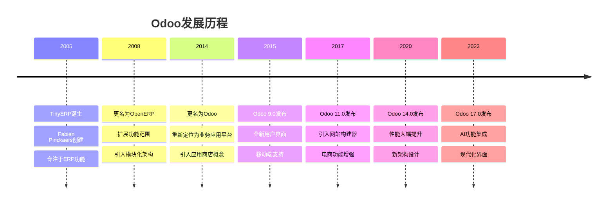
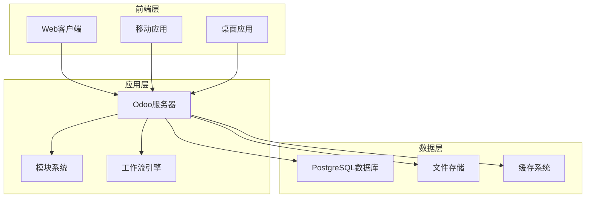
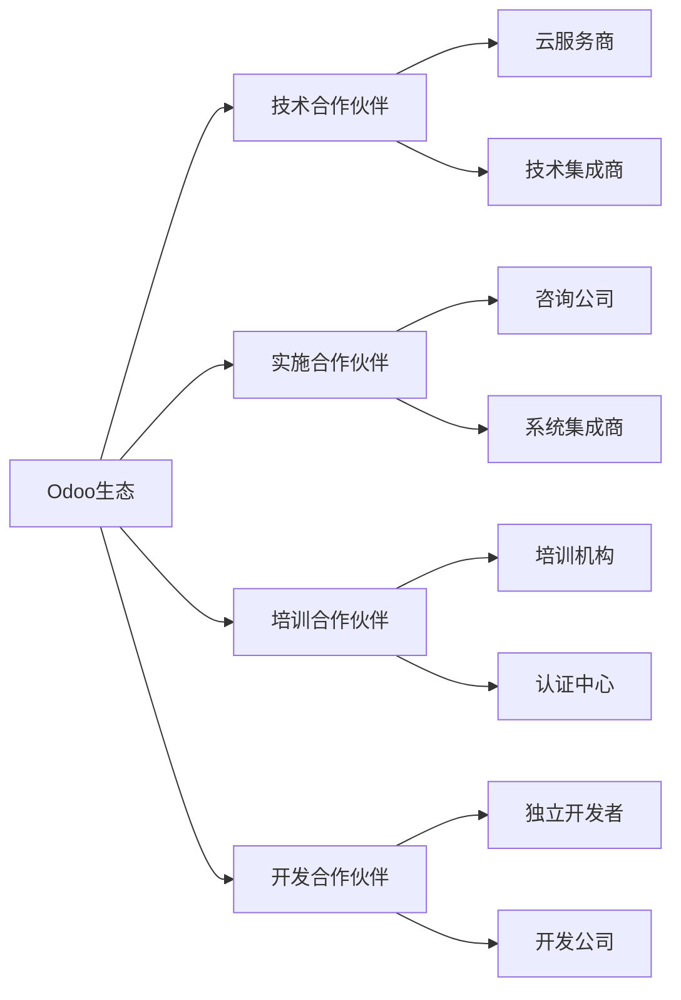

# Odoo简介与历史

## 什么是Odoo？

Odoo是一个开源的企业资源规划(ERP)和客户关系管理(CRM)软件，采用模块化架构设计，支持企业各种业务需求。

### 核心特点
- **开源免费**：社区版完全免费
- **模块化设计**：按需安装功能模块
- **高度可定制**：支持二次开发和扩展
- **多语言支持**：支持40+种语言
- **云端部署**：支持SaaS和本地部署

## 发展历史

### 重要里程碑

### 版本演进特点

| 版本 | 发布时间 | 主要特点 | 技术改进 |
|------|----------|----------|----------|
| 8.0 | 2014 | 模块化架构 | Python 2.7, PostgreSQL |
| 9.0 | 2015 | 新界面设计 | 响应式设计 |
| 10.0 | 2016 | 网站功能 | 多网站支持 |
| 11.0 | 2017 | 电商增强 | 性能优化 |
| 12.0 | 2018 | 会计重构 | 新会计引擎 |
| 13.0 | 2019 | 用户体验 | 界面现代化 |
| 14.0 | 2020 | 性能提升 | 架构优化 |
| 15.0 | 2021 | 移动端 | 原生移动应用 |
| 16.0 | 2022 | 工作流 | 新工作流引擎 |
| 17.0 | 2023 | AI集成 | 智能化功能 |

## 技术架构

### 整体架构图

### 核心技术栈
- **后端**：Python 3.8+
- **数据库**：PostgreSQL 12+
- **前端**：JavaScript, XML, CSS
- **Web框架**：Odoo自研框架
- **ORM**：自研ORM系统
- **模板引擎**：QWeb

## 商业模式

### 双版本策略
| 版本 | 特点 | 目标用户 | 价格 |
|------|------|----------|------|
| **社区版** | 开源免费 | 中小企业、开发者 | 免费 |
| **企业版** | 商业授权 | 大型企业 | 按用户收费 |

### 收入来源
1. **软件授权**：企业版订阅费
2. **云服务**：Odoo.sh平台
3. **实施服务**：咨询和定制开发
4. **培训认证**：官方培训课程
5. **应用商店**：第三方模块销售

## 生态系统

### 社区生态
- **开发者社区**：全球活跃开发者
- **用户社区**：企业用户交流
- **合作伙伴**：实施服务商网络
- **应用商店**：第三方模块市场

### 合作伙伴类型

## 竞争优势

### 技术优势
- **模块化架构**：灵活扩展
- **开源生态**：社区驱动
- **现代化技术**：持续更新
- **云端原生**：支持SaaS部署

### 市场优势
- **成本效益**：开源降低TCO
- **快速实施**：模块化加速部署
- **全球支持**：多语言多地区
- **生态丰富**：大量第三方模块

## 学习建议

### 入门路径
1. **了解概念**：理解ERP和CRM基本概念
2. **安装体验**：下载社区版进行体验
3. **学习架构**：理解模块化设计理念
4. **实践开发**：创建第一个简单模块

### 深入学习
- 研究[[技术栈概览]]了解技术细节
- 学习[[MVC架构详解]]理解设计模式
- 掌握[[模块化设计理念]]提升开发效率

## 相关链接
- [[技术栈概览]] - 了解技术组成
- [[MVC架构详解]] - 理解架构设计
- [[模块化设计理念]] - 掌握设计思想
- [[企业应用特点]] - 了解应用场景
