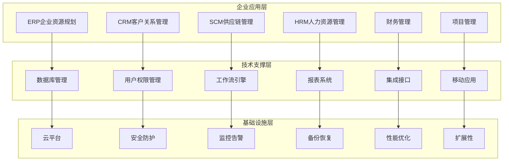
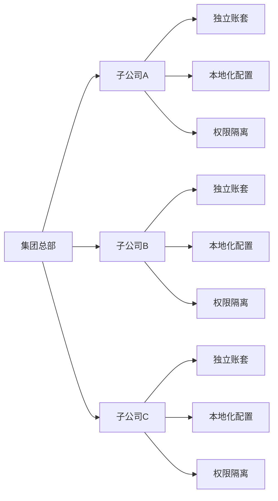
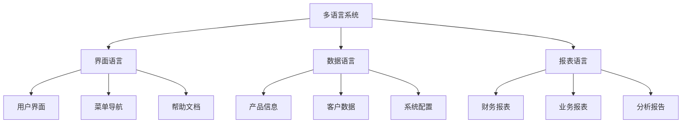
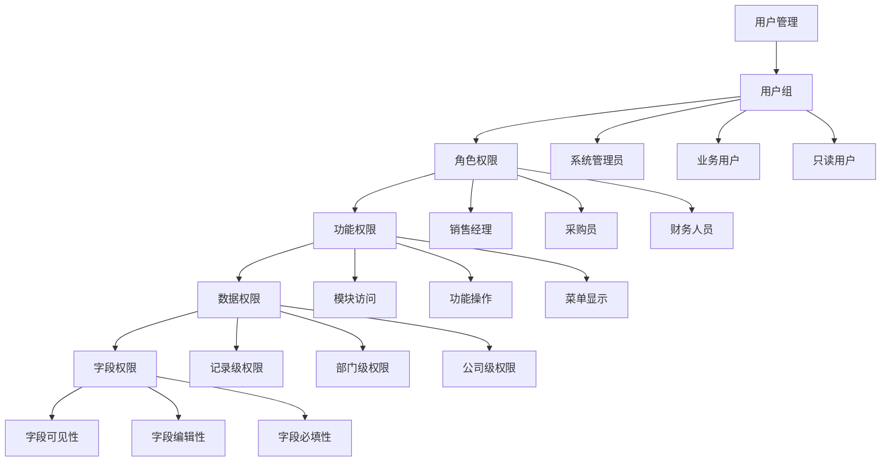
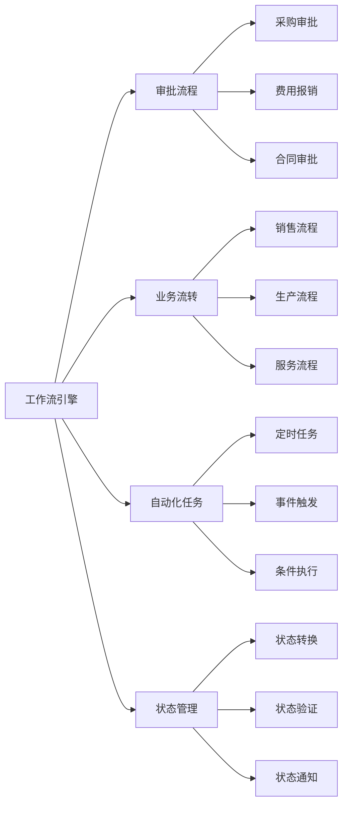
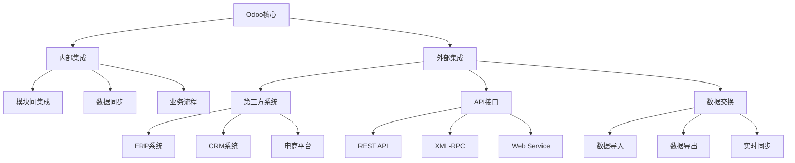
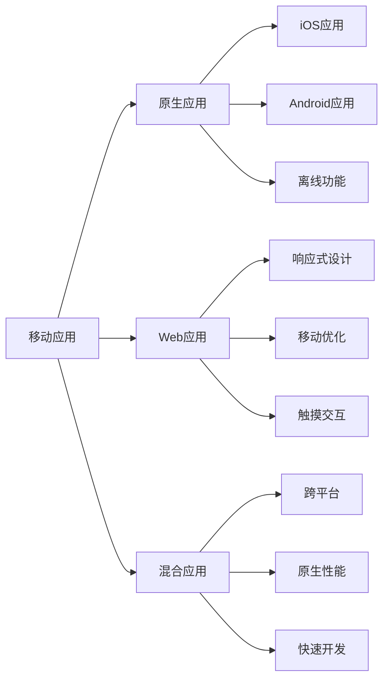
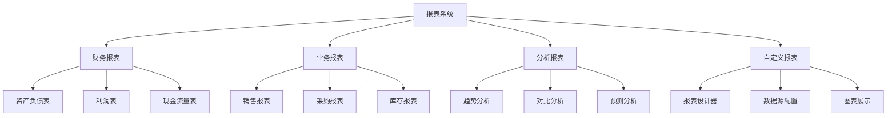

# 企业应用特点

## 企业应用概述

Odoo作为企业级应用平台，具有完整的企业应用特征，支持复杂的企业业务流程和管理需求。

### 企业应用架构图

## 核心业务模块

### ERP功能模块
| 模块 | 功能描述 | 核心特性 |
|------|----------|----------|
| **销售管理** | 销售流程、报价、订单 | 销售漏斗、价格管理、客户分析 |
| **采购管理** | 供应商管理、采购流程 | 供应商评估、采购审批、成本控制 |
| **库存管理** | 仓库管理、库存控制 | 多仓库、批次管理、库存预警 |
| **生产管理** | 生产计划、工艺管理 | MRP、BOM、生产调度 |
| **财务管理** | 会计核算、财务报表 | 多币种、多公司、财务分析 |

### CRM功能模块
| 模块 | 功能描述 | 核心特性 |
|------|----------|----------|
| **客户管理** | 客户信息、关系维护 | 客户分级、360度视图、生命周期 |
| **销售机会** | 销售线索、商机管理 | 销售预测、管道分析、转化率 |
| **营销活动** | 营销策划、活动执行 | 邮件营销、活动跟踪、ROI分析 |
| **服务支持** | 客户服务、问题处理 | 工单管理、SLA、客户满意度 |

## 企业级特性

### 多公司架构

### 多币种支持
| 特性 | 描述 | 应用场景 |
|------|------|----------|
| **多币种记账** | 支持多种货币 | 跨国企业、外贸业务 |
| **汇率管理** | 实时汇率更新 | 财务核算、成本控制 |
| **币种转换** | 自动币种转换 | 报表合并、数据分析 |
| **汇率差异** | 汇率差异处理 | 财务调整、损益分析 |

### 多语言支持

## 权限管理体系

### 权限架构

### 权限控制层次
| 层次 | 控制范围 | 实现方式 |
|------|----------|----------|
| **用户级** | 个人权限 | 用户组分配 |
| **角色级** | 岗位权限 | 角色定义 |
| **功能级** | 模块权限 | 访问控制 |
| **数据级** | 记录权限 | 记录规则 |
| **字段级** | 字段权限 | 字段属性 |

## 工作流引擎

### 工作流类型

### 工作流配置
| 配置项 | 描述 | 示例 |
|--------|------|------|
| **流程定义** | 工作流步骤 | 申请→审批→执行→完成 |
| **条件设置** | 流转条件 | 金额>10000需要经理审批 |
| **角色分配** | 处理人员 | 部门经理、财务总监 |
| **时间控制** | 处理时限 | 24小时内必须处理 |
| **通知机制** | 消息通知 | 邮件、短信、系统消息 |

## 集成能力

### 系统集成架构

### 集成方式
| 集成方式 | 技术实现 | 适用场景 |
|----------|----------|----------|
| **API集成** | REST、XML-RPC | 实时数据交换 |
| **文件集成** | CSV、Excel、XML | 批量数据导入 |
| **数据库集成** | 直接数据库访问 | 高性能数据同步 |
| **消息队列** | RabbitMQ、Redis | 异步数据处理 |
| **Webhook** | HTTP回调 | 事件驱动集成 |

## 移动应用支持

### 移动端特性

### 移动功能模块
| 功能模块 | 描述 | 核心特性 |
|----------|------|----------|
| **销售管理** | 移动销售 | 客户拜访、订单录入、库存查询 |
| **库存管理** | 移动仓库 | 入库出库、库存盘点、条码扫描 |
| **客户服务** | 移动服务 | 工单处理、客户沟通、问题解决 |
| **审批流程** | 移动审批 | 流程审批、状态查看、消息通知 |

## 报表分析系统

### 报表类型

### 分析功能
| 分析类型 | 功能描述 | 应用价值 |
|----------|----------|----------|
| **实时分析** | 实时数据监控 | 及时发现问题 |
| **历史分析** | 历史数据对比 | 趋势预测 |
| **对比分析** | 多维度对比 | 找出差异 |
| **预测分析** | 数据预测 | 决策支持 |

## 学习建议

### 理解重点
1. **企业特性**：理解企业应用的复杂性和多样性
2. **业务流程**：掌握典型的企业业务流程
3. **集成能力**：了解系统集成的重要性和方法
4. **移动应用**：认识移动化对企业应用的影响

### 实践建议
- 了解不同行业的企业应用需求
- 学习企业级系统的设计原则
- 掌握系统集成和扩展的方法
- 关注企业应用的发展趋势

## 相关链接
- [[Odoo简介与历史]] - 了解Odoo发展历程
- [[技术栈概览]] - 掌握技术架构
- [[MVC架构详解]] - 理解架构设计
- [[模块化设计理念]] - 学习设计思想
