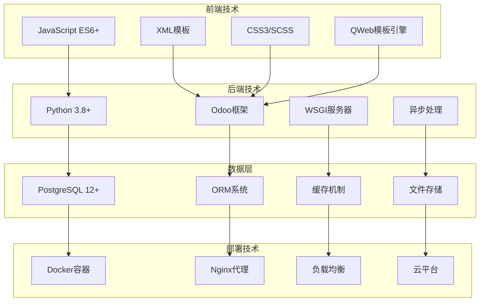
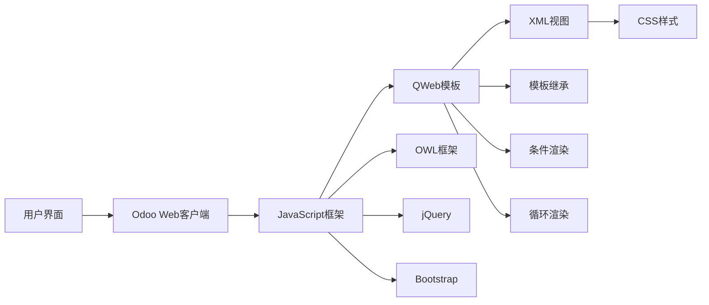
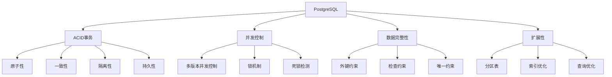
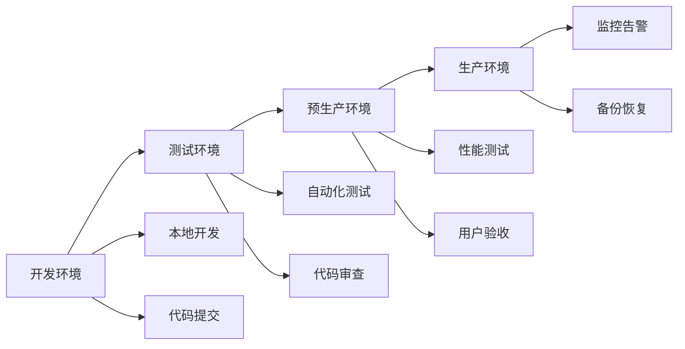
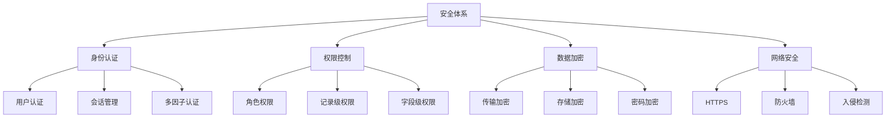

# Odoo技术栈概览

## 技术栈架构

Odoo采用现代化的全栈技术架构，支持企业级应用开发。

### 整体技术栈


## 后端技术栈

### Python生态系统
| 技术 | 版本 | 作用 | 特点 |
|------|------|------|------|
| **Python** | 3.8+ | 核心语言 | 简洁、可读性强 |
| **Odoo框架** | 自研 | Web框架 | MVC架构、ORM集成 |
| **PostgreSQL** | 12+ | 数据库 | 事务支持、扩展性强 |
| **Psycopg2** | 2.8+ | 数据库驱动 | 高性能连接池 |
| **Jinja2** | 3.0+ | 模板引擎 | 安全、灵活 |
| **Pillow** | 8.0+ | 图像处理 | 图片处理、格式转换 |

### 核心Python库
```python
# 主要依赖库
requirements = {
    'werkzeug': '2.0+',      # WSGI工具库
    'lxml': '4.6+',          # XML处理
    'requests': '2.25+',     # HTTP客户端
    'cryptography': '3.4+',  # 加密库
    'babel': '2.9+',         # 国际化
    'reportlab': '3.6+',     # PDF生成
    'openpyxl': '3.0+',      # Excel处理
    'python-dateutil': '2.8+', # 日期处理
}
```

## 前端技术栈

### 前端架构


### 前端技术组件
| 技术 | 版本 | 用途 | 特点 |
|------|------|------|------|
| **OWL** | 1.0+ | 前端框架 | 组件化、响应式 |
| **jQuery** | 3.6+ | DOM操作 | 简化JavaScript |
| **Bootstrap** | 5.0+ | UI框架 | 响应式设计 |
| **Font Awesome** | 6.0+ | 图标库 | 丰富图标集 |
| **Chart.js** | 3.0+ | 图表库 | 数据可视化 |
| **Select2** | 4.0+ | 选择器 | 增强下拉框 |

## 数据库技术

### PostgreSQL特性


### 数据库优化技术
- **索引策略**：B-tree、Hash、GiST索引
- **查询优化**：执行计划分析、统计信息
- **连接池**：pgbouncer连接池管理
- **备份恢复**：pg_dump、WAL归档
- **监控工具**：pg_stat_statements、pgAdmin

## 开发工具链

### 开发环境
| 工具类型 | 推荐工具 | 用途 | 特点 |
|----------|----------|------|------|
| **IDE** | PyCharm, VSCode | 代码编辑 | 智能提示、调试 |
| **版本控制** | Git | 代码管理 | 分布式、分支管理 |
| **包管理** | pip, conda | 依赖管理 | 虚拟环境、版本控制 |
| **测试框架** | pytest, unittest | 单元测试 | 自动化测试 |
| **代码质量** | flake8, black | 代码规范 | 格式化、检查 |
| **API测试** | Postman, curl | 接口测试 | RESTful API测试 |

### 部署工具


## 性能优化技术

### 缓存策略
| 缓存类型 | 技术 | 用途 | 特点 |
|----------|------|------|------|
| **内存缓存** | Redis, Memcached | 会话、数据缓存 | 高速访问 |
| **数据库缓存** | PostgreSQL缓存 | 查询结果缓存 | 减少IO |
| **应用缓存** | Odoo缓存 | 业务数据缓存 | 业务逻辑优化 |
| **CDN缓存** | 静态资源缓存 | 图片、CSS、JS | 全球加速 |

### 性能监控
- **应用监控**：New Relic, DataDog
- **数据库监控**：pg_stat_statements
- **系统监控**：Prometheus, Grafana
- **日志分析**：ELK Stack, Splunk

## 安全技术

### 安全机制


## 学习建议

### 技术学习路径
1. **基础技术**：Python、JavaScript、SQL
2. **框架理解**：Odoo框架、ORM系统
3. **前端开发**：OWL、QWeb、CSS
4. **数据库优化**：PostgreSQL、索引、查询优化
5. **部署运维**：Docker、Nginx、监控

### 实践建议
- 搭建完整的开发环境
- 学习使用开发工具
- 理解技术栈的协作关系
- 关注性能和安全最佳实践

## 相关链接
- [[MVC架构详解]] - 理解架构设计
- [[模块化设计理念]] - 掌握设计思想
- [[企业应用特点]] - 了解应用场景
- [[安装配置指南]] - 环境搭建实践
