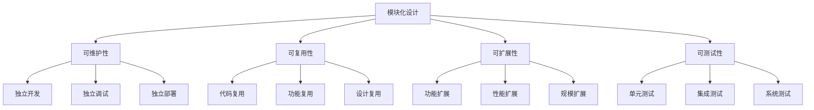
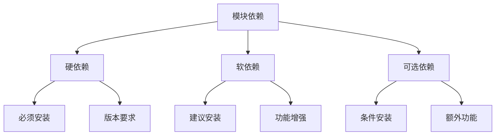
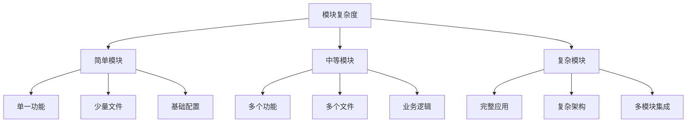
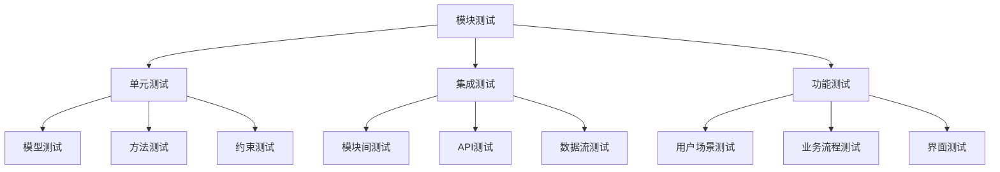

# 模块化设计理念

## 🎯 学习目标
- 理解模块化设计的基本概念和原则
- 掌握Odoo模块的组成结构和设计模式
- 学会如何设计和开发可复用的模块

## 🧩 模块化概念

### 什么是模块化
模块化是一种设计方法，将复杂的系统分解为相对独立、功能单一的模块，通过标准接口进行交互。

### 模块化优势


## 🏗️ Odoo模块结构

### 标准模块目录
```
my_module/
├── __manifest__.py          # 模块清单文件
├── __init__.py              # 模块初始化
├── models/                  # 数据模型
│   ├── __init__.py
│   └── my_model.py
├── views/                   # 视图定义
│   └── my_views.xml
├── security/                # 权限配置
│   └── ir.model.access.csv
├── data/                    # 初始数据
│   └── my_data.xml
├── static/                  # 静态资源
│   ├── description/
│   │   └── icon.png
│   ├── src/
│   │   ├── css/
│   │   ├── js/
│   │   └── xml/
│   └── tests/
├── i18n/                    # 国际化文件
│   └── zh_CN.po
└── README.md                # 模块说明
```

### 模块清单文件
```python
# __manifest__.py
{
    'name': '我的模块',
    'version': '1.0.0',
    'category': 'Tools',
    'summary': '模块功能描述',
    'description': '''
        详细的功能描述
        支持多行文本
    ''',
    'author': '开发者姓名',
    'website': 'https://www.example.com',
    'depends': ['base', 'sale'],  # 依赖模块
    'data': [                     # 数据文件
        'security/ir.model.access.csv',
        'views/my_views.xml',
        'data/my_data.xml',
    ],
    'demo': [                     # 演示数据
        'demo/demo_data.xml',
    ],
    'installable': True,          # 是否可安装
    'auto_install': False,        # 是否自动安装
    'application': False,         # 是否为应用
}
```

## 🔗 模块依赖关系

### 依赖类型


### 依赖声明
```python
# 硬依赖
'depends': ['base', 'sale', 'purchase']

# 软依赖
'depends': ['base']
'post_init_hook': 'post_init_check'

# 可选依赖
'external_dependencies': {
    'python': ['requests', 'pandas'],
    'bin': ['wkhtmltopdf']
}
```

## 🎨 模块设计模式

### 继承模式
```python
# 扩展现有模型
class SaleOrder(models.Model):
    _inherit = 'sale.order'
    
    custom_field = fields.Char('自定义字段')
    
    def custom_method(self):
        # 自定义方法
        pass
```

### 组合模式
```python
# 组合多个功能
class MyModule(models.Model):
    _name = 'my.module'
    _inherit = ['mail.thread', 'mail.activity.mixin']
    
    # 继承邮件功能
    # 继承活动功能
```

### 装饰器模式
```python
# 使用装饰器扩展功能
@api.model
def create(self, vals):
    # 重写创建方法
    result = super().create(vals)
    # 添加自定义逻辑
    return result
```

## 📊 模块分类

### 按功能分类
| 分类 | 说明 | 示例 |
|------|------|------|
| 基础模块 | 提供核心功能 | base, web, mail |
| 业务模块 | 实现业务逻辑 | sale, purchase, stock |
| 技术模块 | 提供技术功能 | report, workflow, auth |
| 集成模块 | 第三方系统集成 | payment, shipping |
| 定制模块 | 企业特定需求 | 自定义业务逻辑 |

### 按复杂度分类


## 🔧 模块开发最佳实践

### 设计原则
1. **单一职责**: 每个模块只负责一个功能领域
2. **开闭原则**: 对扩展开放，对修改关闭
3. **依赖倒置**: 依赖抽象而非具体实现
4. **接口隔离**: 使用多个专门的接口

### 命名规范
```python
# 模块命名
my_module_name        # 小写字母和下划线
my-company-module     # 连字符分隔

# 模型命名
my.model.name         # 点分隔
my_model_name         # 下划线分隔

# 字段命名
field_name            # 小写字母和下划线
related_field_id      # 关联字段以_id结尾
```

### 代码组织
```python
# 模型文件结构
class MyModel(models.Model):
    _name = 'my.model'
    _description = '模型描述'
    
    # 字段定义
    name = fields.Char('名称', required=True)
    
    # 计算方法
    @api.depends('field1', 'field2')
    def _compute_total(self):
        # 计算逻辑
        pass
    
    # 约束方法
    @api.constrains('field1')
    def _check_field1(self):
        # 约束逻辑
        pass
    
    # 业务方法
    def action_do_something(self):
        # 业务逻辑
        pass
```

## 🧪 模块测试

### 测试类型


### 测试示例
```python
# 测试文件
from odoo.tests.common import TransactionCase

class TestMyModel(TransactionCase):
    
    def setUp(self):
        super().setUp()
        self.my_model = self.env['my.model']
    
    def test_create_record(self):
        # 测试创建记录
        record = self.my_model.create({
            'name': '测试记录'
        })
        self.assertEqual(record.name, '测试记录')
    
    def test_compute_method(self):
        # 测试计算方法
        record = self.my_model.create({
            'field1': 10,
            'field2': 20
        })
        self.assertEqual(record.total, 30)
```

## 📦 模块打包发布

### 打包结构
```
my_module-1.0.0/
├── my_module/
│   ├── __manifest__.py
│   ├── __init__.py
│   └── ...
├── setup.py
├── README.md
└── requirements.txt
```

### 发布流程
1. **代码审查**: 检查代码质量和规范
2. **测试验证**: 运行完整测试套件
3. **文档更新**: 更新模块文档
4. **版本标记**: 创建版本标签
5. **打包发布**: 生成发布包

## 🔗 相关链接

### 下一步学习
- [[开发环境配置]] - 开始实践开发
- [[第一个模块开发]] - 创建第一个模块
- [[ORM模型机制]] - 深入理解数据模型

### 实践建议
- 分析现有模块结构
- 创建简单的自定义模块
- 学习模块继承和扩展

## 📝 思考题

### 基础理解
1. 模块化设计的核心原则是什么？
2. Odoo模块的基本结构包含哪些部分？
3. 模块依赖关系如何管理？

### 深入思考
1. 如何设计一个可复用的模块架构？
2. 模块测试应该覆盖哪些方面？
3. 如何平衡模块的独立性和耦合度？

---

**学习进度**: ✅ 已完成  
**下一步**: [[开发环境配置]]

