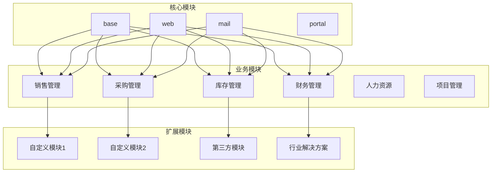
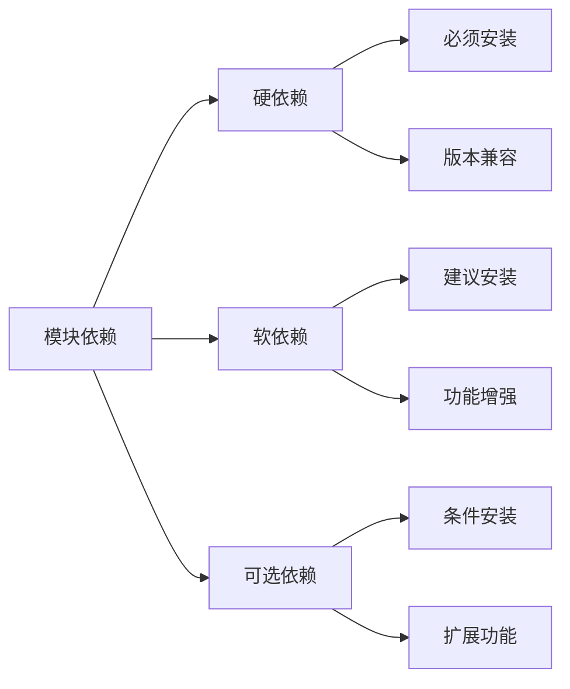
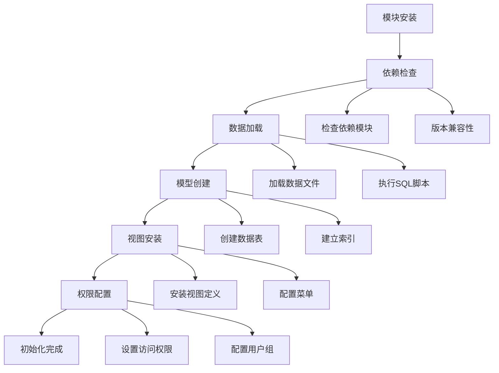
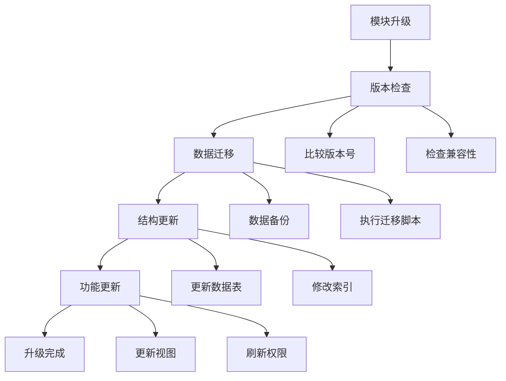
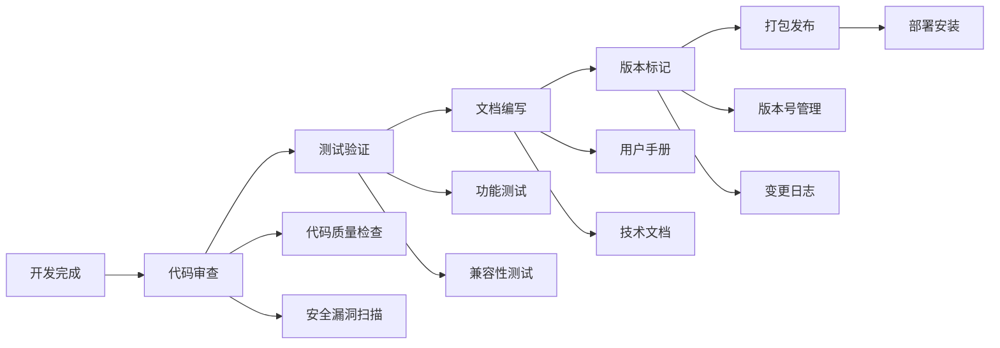

# 模块化设计理念

## 模块化概述

Odoo采用模块化架构设计，将复杂的企业应用分解为独立的功能模块，每个模块专注于特定的业务领域。

### 模块化架构图


## 模块结构

### 标准模块结构
```
my_module/
├── __manifest__.py          # 模块清单文件
├── __init__.py              # 模块初始化
├── models/                  # 数据模型
│   ├── __init__.py
│   └── my_model.py
├── views/                   # 视图定义
│   ├── my_view.xml
│   └── my_menu.xml
├── data/                    # 数据文件
│   ├── my_data.xml
│   └── my_demo.xml
├── security/                # 权限配置
│   ├── ir.model.access.csv
│   └── security.xml
├── static/                  # 静态资源
│   ├── src/css/
│   ├── src/js/
│   └── src/img/
├── reports/                 # 报表模板
│   └── my_report.xml
├── controllers/             # 控制器
│   ├── __init__.py
│   └── main.py
└── i18n/                    # 国际化文件
    ├── zh_CN.po
    └── en_US.po
```

### 模块清单文件
```python
# __manifest__.py
{
    'name': 'My Custom Module',
    'version': '17.0.1.0.0',
    'category': 'Custom',
    'summary': 'My custom business module',
    'description': """
        This module provides custom business functionality
        for specific requirements.
    """,
    'author': 'Your Company',
    'website': 'https://www.yourcompany.com',
    'depends': ['base', 'sale', 'purchase'],
    'data': [
        'security/ir.model.access.csv',
        'views/my_view.xml',
        'data/my_data.xml',
    ],
    'demo': [
        'demo/my_demo.xml',
    ],
    'installable': True,
    'auto_install': False,
    'application': True,
}
```

## 模块依赖关系

### 依赖类型


### 依赖配置
```python
# 硬依赖 - 必须安装
'depends': ['base', 'sale', 'purchase']

# 软依赖 - 建议安装
'recommends': ['website', 'portal']

# 可选依赖 - 条件安装
'external_dependencies': {
    'python': ['requests', 'pandas'],
    'bin': ['wkhtmltopdf']
}
```

## 模块继承机制

### 继承类型
| 继承类型 | 作用 | 示例 |
|----------|------|------|
| **模型继承** | 扩展数据模型 | 添加字段、方法 |
| **视图继承** | 扩展用户界面 | 修改布局、添加按钮 |
| **数据继承** | 扩展基础数据 | 添加菜单、动作 |
| **权限继承** | 扩展访问控制 | 添加用户组、权限 |

### 模型继承示例
```python
# 继承现有模型
class ResPartner(models.Model):
    _inherit = 'res.partner'
    
    # 添加新字段
    custom_field = fields.Char('Custom Field')
    
    # 重写现有方法
    @api.model
    def create(self, vals):
        # 添加自定义逻辑
        result = super().create(vals)
        # 执行额外操作
        return result
    
    # 添加新方法
    def custom_method(self):
        return True
```

### 视图继承示例
```xml
<!-- 继承表单视图 -->
<record id="view_partner_form_inherit" model="ir.ui.view">
    <field name="name">res.partner.form.inherit</field>
    <field name="model">res.partner</field>
    <field name="inherit_id" ref="base.view_partner_form"/>
    <field name="arch" type="xml">
        <field name="email" position="after">
            <field name="custom_field"/>
        </field>
    </field>
</record>
```

## 模块生命周期

### 安装流程


### 升级流程


## 模块开发最佳实践

### 设计原则
1. **单一职责**：每个模块专注一个业务领域
2. **松耦合**：模块间依赖最小化
3. **高内聚**：模块内部功能相关性强
4. **可扩展**：支持功能扩展和定制

### 命名规范
```python
# 模块命名
module_name = 'my_custom_module'  # 小写+下划线

# 模型命名
model_name = 'my.custom.model'    # 点分隔

# 视图命名
view_name = 'my_model_form'       # 模型名_视图类型

# 字段命名
field_name = 'my_custom_field'    # 小写+下划线
```

### 代码组织
```python
# 模型文件组织
class MyModel(models.Model):
    _name = 'my.model'
    _description = 'My Model'
    
    # 字段定义
    name = fields.Char('Name')
    
    # 业务方法
    def business_method(self):
        pass
    
    # 约束方法
    @api.constrains('field')
    def _check_field(self):
        pass
```

## 模块测试

### 测试类型
| 测试类型 | 测试内容 | 工具 |
|----------|----------|------|
| **单元测试** | 模型方法、业务逻辑 | unittest, pytest |
| **集成测试** | 模块间交互 | Odoo测试框架 |
| **功能测试** | 用户操作流程 | Selenium, Odoo测试 |
| **性能测试** | 响应时间、并发 | 性能测试工具 |

### 测试示例
```python
# 单元测试
from odoo.tests.common import TransactionCase

class TestMyModel(TransactionCase):
    
    def setUp(self):
        super().setUp()
        self.model = self.env['my.model']
    
    def test_create_record(self):
        record = self.model.create({
            'name': 'Test Record'
        })
        self.assertEqual(record.name, 'Test Record')
    
    def test_business_method(self):
        record = self.model.create({'name': 'Test'})
        result = record.business_method()
        self.assertTrue(result)
```

## 模块发布

### 发布流程


### 版本管理
```python
# 版本号规范
version = '17.0.1.0.0'
# 格式：主版本.次版本.修订版本.构建版本.发布版本
# 17.0 - Odoo主版本
# 1.0  - 模块主版本
# 0    - 修订版本
# 0    - 构建版本
# 0    - 发布版本
```

## 学习建议

### 理解重点
1. **模块化思想**：理解模块化的设计理念
2. **依赖管理**：掌握模块间的依赖关系
3. **继承机制**：学会使用继承扩展功能
4. **生命周期**：了解模块的安装和升级流程

### 实践建议
- 从简单模块开始练习
- 理解模块间的依赖关系
- 掌握继承和扩展技巧
- 关注模块的可维护性和扩展性

## 相关链接
- [[模块结构规范]] - 详细模块结构
- [[清单文件配置]] - 模块配置详解
- [[模型(Model)详解]] - 模型开发实践
- [[视图(View)系统]] - 视图设计技巧
