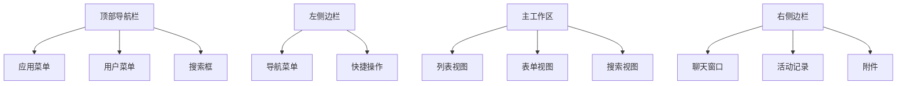
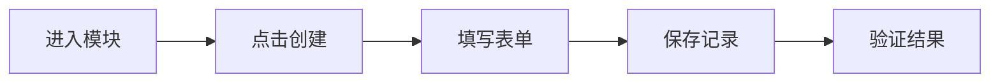
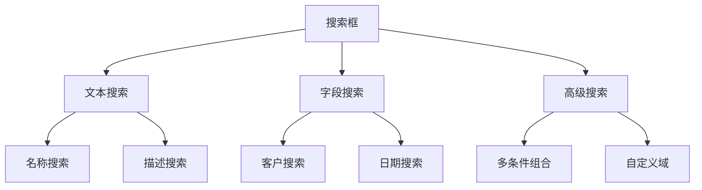
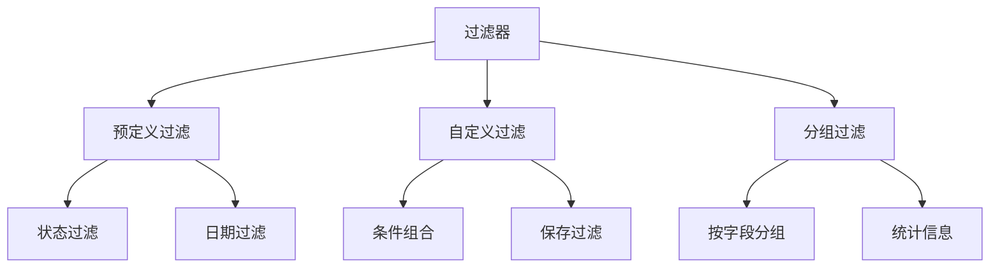
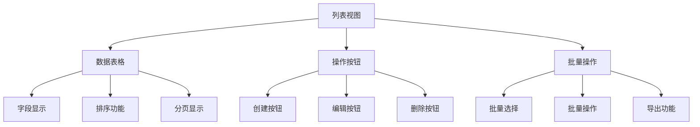
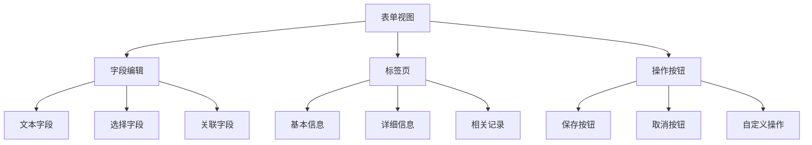
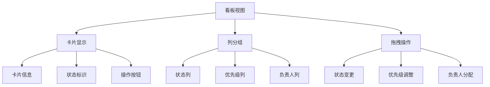
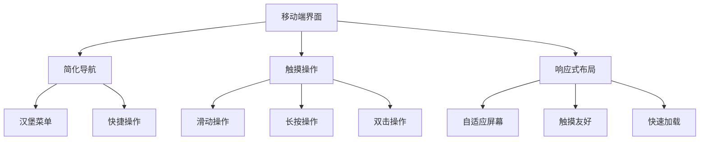
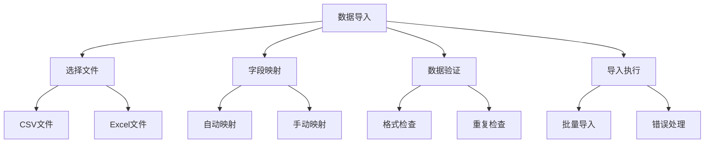

# 基础操作指南

## 🎯 学习目标
- 掌握Odoo的基本操作流程
- 学会使用Odoo的核心功能
- 理解Odoo的用户界面和导航

## 🖥️ 用户界面概览

### 主界面布局

### 界面元素说明
| 元素 | 位置 | 功能 |
|------|------|------|
| 应用菜单 | 顶部 | 切换应用模块 |
| 搜索框 | 顶部 | 全局搜索功能 |
| 导航菜单 | 左侧 | 模块内导航 |
| 主工作区 | 中央 | 数据显示和操作 |
| 聊天窗口 | 右侧 | 内部沟通 |
| 活动记录 | 右侧 | 操作历史 |

## 📋 基本操作流程

### 创建记录

### 操作步骤
1. **进入模块**: 从应用菜单选择目标模块
2. **创建记录**: 点击"创建"按钮
3. **填写信息**: 在表单中填写必要信息
4. **保存记录**: 点击"保存"按钮
5. **验证结果**: 检查记录是否正确创建

### 编辑记录
1. **查找记录**: 使用搜索或过滤功能
2. **打开记录**: 点击记录名称或编辑按钮
3. **修改信息**: 在表单中修改需要的信息
4. **保存更改**: 点击"保存"按钮

### 删除记录
1. **选择记录**: 在列表中选择要删除的记录
2. **确认删除**: 点击删除按钮并确认
3. **验证删除**: 检查记录是否已删除

## 🔍 搜索和过滤

### 搜索功能

### 搜索技巧
- **快速搜索**: 在搜索框中输入关键词
- **字段搜索**: 使用字段名:值格式
- **通配符**: 使用*和?进行模糊匹配
- **引号**: 使用引号进行精确匹配

### 过滤功能

### 过滤操作
1. **选择过滤器**: 从过滤器列表中选择
2. **应用过滤**: 点击过滤器应用条件
3. **组合过滤**: 选择多个过滤器
4. **保存过滤**: 将常用过滤保存为收藏

## 📊 视图类型

### 列表视图

### 表单视图

### 看板视图

## 🎨 自定义视图

### 视图定制
1. **进入设置**: 点击用户菜单 → 设置
2. **视图管理**: 选择"视图管理"
3. **创建视图**: 点击"创建"按钮
4. **配置视图**: 设置视图类型和条件
5. **保存视图**: 保存自定义视图

### 字段显示
1. **选择字段**: 在视图中选择要显示的字段
2. **调整顺序**: 拖拽字段调整显示顺序
3. **设置属性**: 配置字段的显示属性
4. **保存设置**: 保存字段显示配置

## 📱 移动端操作

### 移动端界面

### 移动端功能
- **简化界面**: 针对移动设备优化的界面
- **触摸操作**: 支持触摸手势操作
- **离线功能**: 部分功能支持离线使用
- **推送通知**: 重要事件推送通知

## 🔧 快捷操作

### 键盘快捷键
| 快捷键 | 功能 | 说明 |
|--------|------|------|
| Ctrl+N | 新建记录 | 快速创建新记录 |
| Ctrl+S | 保存记录 | 保存当前记录 |
| Ctrl+F | 搜索 | 打开搜索功能 |
| Ctrl+E | 编辑模式 | 切换编辑模式 |
| Esc | 取消 | 取消当前操作 |
| F5 | 刷新 | 刷新当前页面 |

### 鼠标操作
- **单击**: 选择记录或字段
- **双击**: 打开记录详情
- **右键**: 显示上下文菜单
- **拖拽**: 移动记录或调整布局

## 📈 数据导入导出

### 数据导入

### 数据导出
1. **选择数据**: 在列表中选择要导出的记录
2. **选择格式**: 选择导出格式（CSV、Excel等）
3. **配置选项**: 设置导出选项
4. **执行导出**: 点击导出按钮

## 🔗 相关链接

### 下一步学习
- [[用户权限管理]] - 了解权限控制
- [[工作流配置]] - 学习业务流程
- [[报表生成]] - 掌握报表功能

### 实践建议
- 多练习基本操作
- 熟悉不同视图类型
- 掌握搜索和过滤技巧

## 📝 思考题

### 基础理解
1. Odoo的主要界面元素有哪些？
2. 如何高效地搜索和过滤数据？
3. 不同视图类型的特点是什么？

### 深入思考
1. 如何优化用户操作体验？
2. 移动端和桌面端操作有什么差异？
3. 如何设计用户友好的界面？

---

**学习进度**: ✅ 已完成  
**下一步**: [[用户权限管理]]
