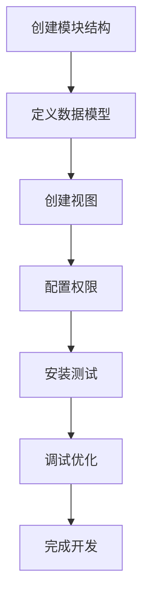

# 第一个模块开发

## 🎯 学习目标
- 掌握Odoo模块开发的基本流程
- 学会创建简单的数据模型和视图
- 理解模块的基本结构和文件组织

## 📦 创建模块结构

### 模块目录创建
```bash
# 创建模块目录
mkdir -p my_first_module
cd my_first_module

# 创建基本目录结构
mkdir -p models views security data static/description
```

### 模块清单文件
```python
# __manifest__.py
{
    'name': '我的第一个模块',
    'version': '1.0.0',
    'category': 'Tools',
    'summary': '学习Odoo模块开发的基础模块',
    'description': '''
        这是一个用于学习Odoo模块开发的基础模块
        包含简单的数据模型和视图
    ''',
    'author': 'Odoo学习者',
    'website': 'https://www.odoo.com',
    'depends': ['base'],
    'data': [
        'security/ir.model.access.csv',
        'views/my_model_views.xml',
    ],
    'demo': [],
    'installable': True,
    'auto_install': False,
    'application': False,
}
```

### 模块初始化文件
```python
# __init__.py
from . import models
```

## 🗄️ 创建数据模型

### 模型文件
```python
# models/__init__.py
from . import my_model

# models/my_model.py
from odoo import models, fields, api

class MyModel(models.Model):
    _name = 'my.model'
    _description = '我的第一个模型'
    
    # 基础字段
    name = fields.Char('名称', required=True)
    description = fields.Text('描述')
    active = fields.Boolean('激活', default=True)
    
    # 日期字段
    create_date = fields.Datetime('创建时间', readonly=True)
    write_date = fields.Datetime('修改时间', readonly=True)
    
    # 选择字段
    state = fields.Selection([
        ('draft', '草稿'),
        ('confirmed', '已确认'),
        ('done', '完成'),
    ], string='状态', default='draft')
    
    # 数值字段
    amount = fields.Float('金额', digits=(16, 2))
    quantity = fields.Integer('数量', default=1)
    
    # 关联字段
    partner_id = fields.Many2one('res.partner', string='客户')
    line_ids = fields.One2many('my.model.line', 'model_id', string='明细行')
    
    # 计算方法
    @api.depends('line_ids.amount')
    def _compute_total_amount(self):
        for record in self:
            record.total_amount = sum(record.line_ids.mapped('amount'))
    
    total_amount = fields.Float('总金额', compute='_compute_total_amount', store=True)
    
    # 约束方法
    @api.constrains('amount')
    def _check_amount(self):
        for record in self:
            if record.amount < 0:
                raise ValidationError('金额不能为负数')
    
    # 业务方法
    def action_confirm(self):
        self.write({'state': 'confirmed'})
    
    def action_done(self):
        self.write({'state': 'done'})
    
    def action_reset(self):
        self.write({'state': 'draft'})
```

### 明细行模型
```python
# models/my_model_line.py
from odoo import models, fields, api

class MyModelLine(models.Model):
    _name = 'my.model.line'
    _description = '模型明细行'
    
    model_id = fields.Many2one('my.model', string='主记录', required=True, ondelete='cascade')
    name = fields.Char('名称', required=True)
    amount = fields.Float('金额', digits=(16, 2))
    quantity = fields.Integer('数量', default=1)
    
    @api.depends('amount', 'quantity')
    def _compute_subtotal(self):
        for line in self:
            line.subtotal = line.amount * line.quantity
    
    subtotal = fields.Float('小计', compute='_compute_subtotal', store=True)
```

## 🎨 创建视图

### 视图文件
```xml
<!-- views/my_model_views.xml -->
<?xml version="1.0" encoding="utf-8"?>
<odoo>
    <!-- 动作定义 -->
    <record id="action_my_model" model="ir.actions.act_window">
        <field name="name">我的模型</field>
        <field name="res_model">my.model</field>
        <field name="view_mode">tree,form</field>
        <field name="context">{}</field>
        <field name="help" type="html">
            <p class="o_view_nocontent_smiling_face">
                创建您的第一个记录
            </p>
        </field>
    </record>
    
    <!-- 菜单定义 -->
    <menuitem id="menu_my_model_root" name="我的模块" sequence="10"/>
    <menuitem id="menu_my_model" name="我的模型" parent="menu_my_model_root" action="action_my_model" sequence="10"/>
    
    <!-- 列表视图 -->
    <record id="view_my_model_tree" model="ir.ui.view">
        <field name="name">my.model.tree</field>
        <field name="model">my.model</field>
        <field name="arch" type="xml">
            <tree string="我的模型">
                <field name="name"/>
                <field name="state"/>
                <field name="amount"/>
                <field name="total_amount"/>
                <field name="partner_id"/>
                <field name="create_date"/>
            </tree>
        </field>
    </record>
    
    <!-- 表单视图 -->
    <record id="view_my_model_form" model="ir.ui.view">
        <field name="name">my.model.form</field>
        <field name="model">my.model</field>
        <field name="arch" type="xml">
            <form string="我的模型">
                <header>
                    <button name="action_confirm" string="确认" type="object" class="btn-primary" states="draft"/>
                    <button name="action_done" string="完成" type="object" class="btn-primary" states="confirmed"/>
                    <button name="action_reset" string="重置" type="object" states="confirmed,done"/>
                    <field name="state" widget="statusbar" statusbar_visible="draft,confirmed,done"/>
                </header>
                <sheet>
                    <div class="oe_title">
                        <h1>
                            <field name="name" placeholder="输入名称..."/>
                        </h1>
                    </div>
                    <group>
                        <group>
                            <field name="partner_id"/>
                            <field name="amount"/>
                            <field name="quantity"/>
                        </group>
                        <group>
                            <field name="state"/>
                            <field name="total_amount"/>
                            <field name="create_date"/>
                            <field name="write_date"/>
                        </group>
                    </group>
                    <notebook>
                        <page string="描述">
                            <field name="description"/>
                        </page>
                        <page string="明细行">
                            <field name="line_ids">
                                <tree editable="bottom">
                                    <field name="name"/>
                                    <field name="amount"/>
                                    <field name="quantity"/>
                                    <field name="subtotal"/>
                                </tree>
                            </field>
                        </page>
                    </notebook>
                </sheet>
            </form>
        </field>
    </record>
    
    <!-- 搜索视图 -->
    <record id="view_my_model_search" model="ir.ui.view">
        <field name="name">my.model.search</field>
        <field name="model">my.model</field>
        <field name="arch" type="xml">
            <search string="我的模型">
                <field name="name"/>
                <field name="partner_id"/>
                <field name="amount"/>
                <filter string="草稿" name="draft" domain="[('state', '=', 'draft')]"/>
                <filter string="已确认" name="confirmed" domain="[('state', '=', 'confirmed')]"/>
                <filter string="完成" name="done" domain="[('state', '=', 'done')]"/>
                <group expand="0" string="分组">
                    <filter string="状态" name="group_state" context="{'group_by': 'state'}"/>
                    <filter string="客户" name="group_partner" context="{'group_by': 'partner_id'}"/>
                </group>
            </search>
        </field>
    </record>
</odoo>
```

## 🔐 权限配置

### 访问权限
```csv
# security/ir.model.access.csv
id,name,model_id:id,group_id:id,perm_read,perm_write,perm_create,perm_unlink
access_my_model,access_my_model,model_my_model,base.group_user,1,1,1,1
access_my_model_line,access_my_model_line,model_my_model_line,base.group_user,1,1,1,1
```

## 🎨 模块图标

### 图标文件
```bash
# 创建图标文件
# static/description/icon.png (64x64像素)
# 可以使用简单的图标或从网上下载
```

## 🚀 安装和测试

### 安装模块
```bash
# 启动Odoo开发模式
odoo -c odoo.conf --dev=reload

# 在浏览器中访问
# http://localhost:8069
# 进入应用菜单，找到"我的第一个模块"
# 点击安装
```

### 测试功能
1. **创建记录**: 在列表中点击"创建"按钮
2. **填写信息**: 输入名称、描述、金额等
3. **添加明细**: 在明细行页面添加明细记录
4. **状态流转**: 使用按钮进行状态转换
5. **搜索过滤**: 使用搜索功能过滤记录

## 🔧 开发技巧

### 开发模式
```bash
# 启用开发模式
odoo -c odoo.conf --dev=reload

# 开发模式功能
# - 自动重载代码
# - 显示技术菜单
# - 显示调试信息
# - 禁用缓存
```

### 调试技巧
```python
# 在代码中添加调试信息
import logging
_logger = logging.getLogger(__name__)

def action_confirm(self):
    _logger.info(f"确认记录: {self.name}")
    self.write({'state': 'confirmed'})
```

### 常见错误
1. **语法错误**: 检查Python和XML语法
2. **字段错误**: 确保字段名称正确
3. **权限错误**: 检查访问权限配置
4. **依赖错误**: 确保依赖模块已安装

## 📊 模块结构总结

### 文件结构
```
my_first_module/
├── __manifest__.py          # 模块清单
├── __init__.py              # 模块初始化
├── models/                  # 数据模型
│   ├── __init__.py
│   ├── my_model.py
│   └── my_model_line.py
├── views/                   # 视图定义
│   └── my_model_views.xml
├── security/                # 权限配置
│   └── ir.model.access.csv
└── static/description/      # 静态资源
    └── icon.png
```

### 开发流程


## 🔗 相关链接

### 下一步学习
- [[模块结构详解]] - 深入理解模块结构
- [[ORM模型机制]] - 掌握数据模型
- [[视图开发基础]] - 深入学习视图开发

### 实践建议
- 尝试修改字段类型和属性
- 添加更多的业务方法
- 创建不同类型的视图

## 📝 思考题

### 基础理解
1. Odoo模块的基本结构包含哪些部分？
2. 如何定义数据模型和字段？
3. 视图文件的作用是什么？

### 深入思考
1. 如何设计一个可扩展的模块架构？
2. 字段类型的选择有什么原则？
3. 如何优化模块的性能？

---

**学习进度**: ✅ 已完成  
**下一步**: [[模块结构详解]]
