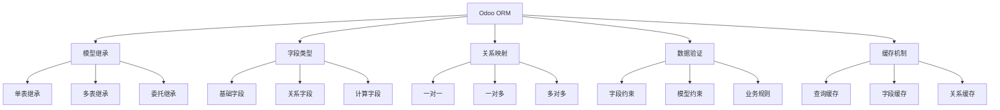

# ORM模型机制

## 🎯 学习目标
- 深入理解Odoo的ORM模型机制
- 掌握模型定义、字段类型和关系映射
- 学会使用ORM进行数据操作和查询

## 🏗️ ORM基础概念

### 什么是ORM
ORM (Object-Relational Mapping) 是对象关系映射，它将数据库表映射为Python对象，使开发者可以用面向对象的方式操作数据库。

### Odoo ORM特点


## 📋 模型定义

### 基础模型定义
```python
from odoo import models, fields, api
from odoo.exceptions import ValidationError

class MyModel(models.Model):
    _name = 'my.model'                    # 模型名称
    _description = '我的模型'              # 模型描述
    _table = 'my_model'                   # 数据库表名
    _order = 'name desc'                  # 默认排序
    _rec_name = 'name'                    # 记录显示名称
    _inherit = ['mail.thread']            # 继承的模型
    
    # 字段定义
    name = fields.Char('名称', required=True)
    description = fields.Text('描述')
    active = fields.Boolean('激活', default=True)
    
    # 约束定义
    _sql_constraints = [
        ('name_uniq', 'UNIQUE(name)', '名称必须唯一'),
    ]
```

### 模型属性详解
| 属性 | 说明 | 示例 |
|------|------|------|
| _name | 模型唯一标识 | 'sale.order' |
| _description | 模型描述 | '销售订单' |
| _table | 数据库表名 | 'sale_order' |
| _order | 默认排序 | 'date_order desc' |
| _rec_name | 记录显示名称 | 'name' |
| _inherit | 继承的模型 | ['mail.thread'] |
| _sql_constraints | 数据库约束 | [('name_uniq', 'UNIQUE(name)', '名称唯一')] |

## 🔧 字段类型详解

### 基础字段类型
```python
class FieldTypes(models.Model):
    _name = 'field.types'
    
    # 文本字段
    char_field = fields.Char('字符字段', size=64, required=True)
    text_field = fields.Text('文本字段')
    html_field = fields.Html('HTML字段')
    
    # 数值字段
    integer_field = fields.Integer('整数字段')
    float_field = fields.Float('浮点字段', digits=(16, 2))
    monetary_field = fields.Monetary('货币字段', currency_field='currency_id')
    
    # 日期字段
    date_field = fields.Date('日期字段')
    datetime_field = fields.Datetime('日期时间字段')
    
    # 布尔字段
    boolean_field = fields.Boolean('布尔字段', default=True)
    
    # 选择字段
    selection_field = fields.Selection([
        ('option1', '选项1'),
        ('option2', '选项2'),
    ], string='选择字段', default='option1')
    
    # 二进制字段
    binary_field = fields.Binary('二进制字段')
    
    # 关联字段
    currency_id = fields.Many2one('res.currency', string='货币')
```

### 关系字段类型
```python
class RelationFields(models.Model):
    _name = 'relation.fields'
    
    # 多对一关系
    partner_id = fields.Many2one('res.partner', string='客户', required=True)
    
    # 一对多关系
    line_ids = fields.One2many('relation.fields.line', 'parent_id', string='明细行')
    
    # 多对多关系
    tag_ids = fields.Many2many('relation.fields.tag', string='标签')
    
    # 反向关系
    related_ids = fields.Many2many('relation.fields', 'relation_fields_rel', 
                                  'field1_id', 'field2_id', string='相关记录')
```

### 计算字段
```python
class ComputedFields(models.Model):
    _name = 'computed.fields'
    
    # 基础字段
    amount1 = fields.Float('金额1')
    amount2 = fields.Float('金额2')
    quantity = fields.Integer('数量')
    
    # 计算字段
    @api.depends('amount1', 'amount2')
    def _compute_total(self):
        for record in self:
            record.total = record.amount1 + record.amount2
    
    total = fields.Float('总计', compute='_compute_total', store=True)
    
    # 反向计算字段
    @api.depends('total', 'quantity')
    def _compute_unit_price(self):
        for record in self:
            if record.quantity > 0:
                record.unit_price = record.total / record.quantity
            else:
                record.unit_price = 0
    
    unit_price = fields.Float('单价', compute='_compute_unit_price', store=True)
    
    # 相关字段计算
    @api.depends('line_ids.amount')
    def _compute_lines_total(self):
        for record in self:
            record.lines_total = sum(record.line_ids.mapped('amount'))
    
    lines_total = fields.Float('明细总计', compute='_compute_lines_total', store=True)
```

## 🔗 关系映射

### 一对一关系
```python
class OneToOne(models.Model):
    _name = 'one.to.one'
    
    name = fields.Char('名称')
    detail_id = fields.Many2one('one.to.one.detail', string='详情')

class OneToOneDetail(models.Model):
    _name = 'one.to.one.detail'
    
    name = fields.Char('名称')
    parent_id = fields.One2many('one.to.one', 'detail_id', string='父记录')
```

### 一对多关系
```python
class OneToMany(models.Model):
    _name = 'one.to.many'
    
    name = fields.Char('名称')
    line_ids = fields.One2many('one.to.many.line', 'parent_id', string='明细行')

class OneToManyLine(models.Model):
    _name = 'one.to.many.line'
    
    name = fields.Char('名称')
    amount = fields.Float('金额')
    parent_id = fields.Many2one('one.to.many', string='父记录', required=True, ondelete='cascade')
```

### 多对多关系
```python
class ManyToMany(models.Model):
    _name = 'many.to.many'
    
    name = fields.Char('名称')
    tag_ids = fields.Many2many('many.to.many.tag', string='标签')

class ManyToManyTag(models.Model):
    _name = 'many.to.many.tag'
    
    name = fields.Char('名称')
    model_ids = fields.Many2many('many.to.many', string='模型')
```

## 🔍 数据查询

### 基础查询方法
```python
class QueryExamples(models.Model):
    _name = 'query.examples'
    
    name = fields.Char('名称')
    amount = fields.Float('金额')
    date = fields.Date('日期')
    state = fields.Selection([
        ('draft', '草稿'),
        ('confirmed', '已确认'),
        ('done', '完成'),
    ], string='状态')
    
    # 查询方法示例
    def query_examples(self):
        # 获取所有记录
        all_records = self.search([])
        
        # 条件查询
        draft_records = self.search([('state', '=', 'draft')])
        
        # 多条件查询
        confirmed_records = self.search([
            ('state', '=', 'confirmed'),
            ('amount', '>', 1000)
        ])
        
        # 排序查询
        sorted_records = self.search([], order='amount desc')
        
        # 限制数量
        limited_records = self.search([], limit=10)
        
        # 偏移查询
        offset_records = self.search([], offset=10, limit=10)
        
        # 计数查询
        count = self.search_count([('state', '=', 'draft')])
        
        # 读取字段
        values = self.read(['name', 'amount'])
        
        # 获取字段值
        names = self.mapped('name')
        amounts = self.mapped('amount')
        
        # 过滤记录
        filtered_records = self.filtered(lambda r: r.amount > 1000)
        
        # 排序记录
        sorted_records = self.sorted(lambda r: r.amount, reverse=True)
```

### 高级查询技巧
```python
class AdvancedQuery(models.Model):
    _name = 'advanced.query'
    
    def advanced_queries(self):
        # 复杂条件查询
        complex_records = self.search([
            '|',  # OR条件
            ('state', '=', 'draft'),
            '&',  # AND条件
            ('state', '=', 'confirmed'),
            ('amount', '>', 1000)
        ])
        
        # 模糊查询
        fuzzy_records = self.search([
            ('name', 'ilike', '%test%')
        ])
        
        # 范围查询
        range_records = self.search([
            ('amount', '>=', 100),
            ('amount', '<=', 1000)
        ])
        
        # 空值查询
        null_records = self.search([
            ('name', '=', False)
        ])
        
        # 非空查询
        not_null_records = self.search([
            ('name', '!=', False)
        ])
        
        # 包含查询
        in_records = self.search([
            ('state', 'in', ['draft', 'confirmed'])
        ])
        
        # 不包含查询
        not_in_records = self.search([
            ('state', 'not in', ['done'])
        ])
```

## ⚡ 性能优化

### 查询优化
```python
class QueryOptimization(models.Model):
    _name = 'query.optimization'
    
    def optimized_queries(self):
        # 使用read_group进行分组查询
        grouped_data = self.read_group(
            domain=[('state', '=', 'confirmed')],
            fields=['amount:sum', 'state'],
            groupby=['state']
        )
        
        # 批量操作
        records = self.search([('state', '=', 'draft')])
        records.write({'state': 'confirmed'})
        
        # 使用browse避免重复查询
        record_ids = [1, 2, 3, 4, 5]
        records = self.browse(record_ids)
        
        # 预加载关联字段
        records = self.search([])
        records.mapped('partner_id.name')  # 预加载partner信息
        
        # 使用exists检查存在性
        if self.search([('name', '=', 'test')], limit=1):
            # 记录存在
            pass
```

### 缓存机制
```python
class CacheOptimization(models.Model):
    _name = 'cache.optimization'
    
    # 使用@api.depends优化计算字段
    @api.depends('line_ids.amount')
    def _compute_total(self):
        for record in self:
            record.total = sum(record.line_ids.mapped('amount'))
    
    total = fields.Float('总计', compute='_compute_total', store=True)
    
    # 使用@api.model_cached优化模型方法
    @api.model
    def get_cached_data(self):
        # 缓存数据获取逻辑
        pass
    
    # 使用@api.returns优化返回值
    @api.returns('self')
    def copy(self, default=None):
        # 复制记录
        return super().copy(default)
```

## 🔒 数据验证

### 字段约束
```python
class DataValidation(models.Model):
    _name = 'data.validation'
    
    name = fields.Char('名称', required=True)
    amount = fields.Float('金额')
    email = fields.Char('邮箱')
    
    # 字段约束
    @api.constrains('amount')
    def _check_amount(self):
        for record in self:
            if record.amount < 0:
                raise ValidationError('金额不能为负数')
    
    @api.constrains('email')
    def _check_email(self):
        for record in self:
            if record.email and '@' not in record.email:
                raise ValidationError('邮箱格式不正确')
    
    # 模型约束
    _sql_constraints = [
        ('name_uniq', 'UNIQUE(name)', '名称必须唯一'),
        ('amount_positive', 'CHECK(amount >= 0)', '金额必须大于等于0'),
    ]
```

### 业务规则验证
```python
class BusinessRules(models.Model):
    _name = 'business.rules'
    
    state = fields.Selection([
        ('draft', '草稿'),
        ('confirmed', '已确认'),
        ('done', '完成'),
    ], string='状态')
    
    amount = fields.Float('金额')
    line_ids = fields.One2many('business.rules.line', 'parent_id', string='明细行')
    
    @api.constrains('state', 'amount')
    def _check_business_rules(self):
        for record in self:
            if record.state == 'confirmed' and record.amount <= 0:
                raise ValidationError('已确认状态的记录金额必须大于0')
    
    @api.constrains('line_ids')
    def _check_lines(self):
        for record in self:
            if len(record.line_ids) == 0:
                raise ValidationError('必须至少有一条明细行')
```

## 🔗 相关链接

### 下一步学习
- [[字段类型详解]] - 深入了解字段类型
- [[关系映射机制]] - 掌握关系映射
- [[数据操作技巧]] - 学习数据操作

### 实践建议
- 多练习模型定义
- 熟悉各种字段类型
- 掌握查询优化技巧

## 📝 思考题

### 基础理解
1. ORM模型的基本结构是什么？
2. 如何定义计算字段？
3. 关系字段的类型有哪些？

### 深入思考
1. 如何优化ORM查询性能？
2. 数据验证的最佳实践是什么？
3. 如何设计高效的模型关系？

---

**学习进度**: ✅ 已完成  
**下一步**: [[字段类型详解]]

