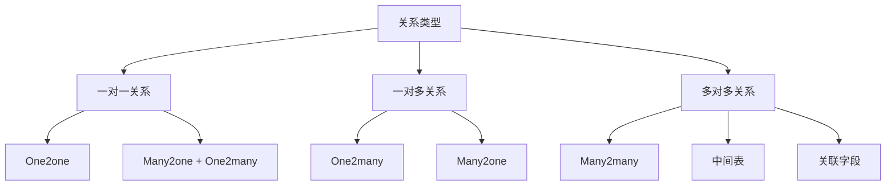

# 关系映射机制

## 🎯 学习目标
- 深入理解Odoo中关系字段的映射机制
- 掌握一对一、一对多、多对多关系的实现
- 学会优化关系字段的性能和查询

## 🔗 关系类型概览

### 关系类型层次


## 👥 一对一关系

### 实现方式一：One2one字段
```python
class OneToOneModel1(models.Model):
    _name = 'one.to.one.model1'
    
    name = fields.Char('名称')
    detail_id = fields.Many2one('one.to.one.model2', string='详情')

class OneToOneModel2(models.Model):
    _name = 'one.to.one.model2'
    
    name = fields.Char('名称')
    parent_id = fields.One2many('one.to.one.model1', 'detail_id', string='父记录')
```

### 实现方式二：双向Many2one
```python
class OneToOneModel3(models.Model):
    _name = 'one.to.one.model3'
    
    name = fields.Char('名称')
    partner_id = fields.Many2one('one.to.one.model4', string='伙伴')

class OneToOneModel4(models.Model):
    _name = 'one.to.one.model4'
    
    name = fields.Char('名称')
    partner_id = fields.Many2one('one.to.one.model3', string='伙伴')
    
    @api.constrains('partner_id')
    def _check_partner(self):
        for record in self:
            if record.partner_id and record.partner_id.partner_id != record:
                raise ValidationError('伙伴关系必须是一对一的')
```

### 一对一关系示例
```python
class Employee(models.Model):
    _name = 'employee'
    
    name = fields.Char('姓名')
    employee_id = fields.Char('工号')
    profile_id = fields.Many2one('employee.profile', string='档案')

class EmployeeProfile(models.Model):
    _name = 'employee.profile'
    
    name = fields.Char('档案名称')
    employee_id = fields.One2many('employee', 'profile_id', string='员工')
    
    # 确保一对一关系
    @api.constrains('employee_id')
    def _check_employee_count(self):
        for record in self:
            if len(record.employee_id) > 1:
                raise ValidationError('一个档案只能对应一个员工')
```

## 👨‍👩‍👧‍👦 一对多关系

### 标准一对多关系
```python
class ParentModel(models.Model):
    _name = 'parent.model'
    
    name = fields.Char('名称')
    line_ids = fields.One2many('child.model', 'parent_id', string='子记录')

class ChildModel(models.Model):
    _name = 'child.model'
    
    name = fields.Char('名称')
    amount = fields.Float('金额')
    parent_id = fields.Many2one('parent.model', string='父记录', required=True, ondelete='cascade')
```

### 一对多关系示例
```python
class SaleOrder(models.Model):
    _name = 'sale.order'
    
    name = fields.Char('订单号')
    partner_id = fields.Many2one('res.partner', string='客户')
    order_line_ids = fields.One2many('sale.order.line', 'order_id', string='订单行')
    
    # 计算总金额
    @api.depends('order_line_ids.price_subtotal')
    def _compute_amount_total(self):
        for order in self:
            order.amount_total = sum(order.order_line_ids.mapped('price_subtotal'))
    
    amount_total = fields.Monetary('总金额', compute='_compute_amount_total', store=True)

class SaleOrderLine(models.Model):
    _name = 'sale.order.line'
    
    order_id = fields.Many2one('sale.order', string='订单', required=True, ondelete='cascade')
    product_id = fields.Many2one('product.product', string='产品')
    quantity = fields.Float('数量')
    price_unit = fields.Float('单价')
    
    @api.depends('quantity', 'price_unit')
    def _compute_price_subtotal(self):
        for line in self:
            line.price_subtotal = line.quantity * line.price_unit
    
    price_subtotal = fields.Monetary('小计', compute='_compute_price_subtotal', store=True)
```

### 一对多关系优化
```python
class OptimizedParent(models.Model):
    _name = 'optimized.parent'
    
    name = fields.Char('名称')
    line_ids = fields.One2many('optimized.child', 'parent_id', string='子记录')
    
    # 批量操作优化
    def action_process_lines(self):
        for parent in self:
            # 批量更新子记录
            parent.line_ids.write({'state': 'processed'})
            
            # 批量创建子记录
            vals_list = []
            for i in range(10):
                vals_list.append({
                    'name': f'子记录{i}',
                    'parent_id': parent.id,
                })
            self.env['optimized.child'].create(vals_list)

class OptimizedChild(models.Model):
    _name = 'optimized.child'
    
    name = fields.Char('名称')
    parent_id = fields.Many2one('optimized.parent', string='父记录', required=True, ondelete='cascade')
    state = fields.Selection([('draft', '草稿'), ('processed', '已处理')], default='draft')
```

## 🔄 多对多关系

### 标准多对多关系
```python
class ManyToManyModel1(models.Model):
    _name = 'many2many.model1'
    
    name = fields.Char('名称')
    tag_ids = fields.Many2many('many2many.model2', string='标签')

class ManyToManyModel2(models.Model):
    _name = 'many2many.model2'
    
    name = fields.Char('名称')
    model_ids = fields.Many2many('many2many.model1', string='模型')
```

### 自定义多对多关系
```python
class CustomManyToMany1(models.Model):
    _name = 'custom.many2many1'
    
    name = fields.Char('名称')
    tag_ids = fields.Many2many('custom.many2many2', 'custom_many2many_rel', 
                              'model1_id', 'model2_id', string='标签')

class CustomManyToMany2(models.Model):
    _name = 'custom.many2many2'
    
    name = fields.Char('名称')
    model_ids = fields.Many2many('custom.many2many1', 'custom_many2many_rel', 
                                'model2_id', 'model1_id', string='模型')
```

### 多对多关系示例
```python
class Project(models.Model):
    _name = 'project'
    
    name = fields.Char('项目名称')
    description = fields.Text('描述')
    member_ids = fields.Many2many('res.users', string='成员')
    tag_ids = fields.Many2many('project.tag', string='标签')
    
    # 计算成员数量
    @api.depends('member_ids')
    def _compute_member_count(self):
        for project in self:
            project.member_count = len(project.member_ids)
    
    member_count = fields.Integer('成员数量', compute='_compute_member_count', store=True)

class ProjectTag(models.Model):
    _name = 'project.tag'
    
    name = fields.Char('标签名称')
    color = fields.Integer('颜色')
    project_ids = fields.Many2many('project', string='项目')
    
    # 计算项目数量
    @api.depends('project_ids')
    def _compute_project_count(self):
        for tag in self:
            tag.project_count = len(tag.project_ids)
    
    project_count = fields.Integer('项目数量', compute='_compute_project_count', store=True)
```

### 多对多关系优化
```python
class OptimizedManyToMany(models.Model):
    _name = 'optimized.many2many'
    
    name = fields.Char('名称')
    tag_ids = fields.Many2many('optimized.tag', string='标签')
    
    # 批量操作优化
    def action_add_tags(self):
        # 获取所有标签
        all_tags = self.env['optimized.tag'].search([])
        
        # 批量添加标签
        for record in self:
            record.tag_ids = [(6, 0, all_tags.ids)]
    
    def action_remove_tags(self):
        # 批量移除标签
        for record in self:
            record.tag_ids = [(5, 0, 0)]

class OptimizedTag(models.Model):
    _name = 'optimized.tag'
    
    name = fields.Char('标签名称')
    model_ids = fields.Many2many('optimized.many2many', string='模型')
```

## 🔍 关系查询优化

### 预加载优化
```python
class QueryOptimization(models.Model):
    _name = 'query.optimization'
    
    name = fields.Char('名称')
    partner_id = fields.Many2one('res.partner', string='客户')
    line_ids = fields.One2many('query.optimization.line', 'parent_id', string='明细行')
    tag_ids = fields.Many2many('query.optimization.tag', string='标签')
    
    def optimized_queries(self):
        # 预加载关联字段
        records = self.search([])
        
        # 预加载partner信息
        records.mapped('partner_id.name')
        
        # 预加载明细行信息
        records.mapped('line_ids.name')
        
        # 预加载标签信息
        records.mapped('tag_ids.name')
        
        # 使用read_group进行分组查询
        grouped_data = self.read_group(
            domain=[],
            fields=['name', 'partner_id'],
            groupby=['partner_id']
        )
        
        return grouped_data

class QueryOptimizationLine(models.Model):
    _name = 'query.optimization.line'
    
    name = fields.Char('名称')
    amount = fields.Float('金额')
    parent_id = fields.Many2one('query.optimization', string='父记录', required=True, ondelete='cascade')

class QueryOptimizationTag(models.Model):
    _name = 'query.optimization.tag'
    
    name = fields.Char('标签名称')
    model_ids = fields.Many2many('query.optimization', string='模型')
```

### 关系字段性能优化
```python
class PerformanceOptimization(models.Model):
    _name = 'performance.optimization'
    
    name = fields.Char('名称')
    partner_id = fields.Many2one('res.partner', string='客户', index=True)
    line_ids = fields.One2many('performance.optimization.line', 'parent_id', string='明细行')
    
    # 使用@api.model_cached优化查询
    @api.model_cached
    def get_partner_data(self, partner_id):
        partner = self.env['res.partner'].browse(partner_id)
        return {
            'name': partner.name,
            'email': partner.email,
            'phone': partner.phone,
        }
    
    # 批量操作优化
    def batch_update_lines(self):
        for record in self:
            # 批量更新明细行
            record.line_ids.write({'state': 'updated'})
            
            # 批量创建明细行
            vals_list = []
            for i in range(5):
                vals_list.append({
                    'name': f'明细行{i}',
                    'parent_id': record.id,
                })
            self.env['performance.optimization.line'].create(vals_list)

class PerformanceOptimizationLine(models.Model):
    _name = 'performance.optimization.line'
    
    name = fields.Char('名称')
    amount = fields.Float('金额')
    state = fields.Selection([('draft', '草稿'), ('updated', '已更新')], default='draft')
    parent_id = fields.Many2one('performance.optimization', string='父记录', required=True, ondelete='cascade')
```

## 🎯 关系字段高级特性

### 动态关系字段
```python
class DynamicRelation(models.Model):
    _name = 'dynamic.relation'
    
    name = fields.Char('名称')
    model_type = fields.Selection([
        ('partner', '客户'),
        ('product', '产品'),
        ('user', '用户'),
    ], string='模型类型')
    
    # 动态关系字段
    ref_id = fields.Reference('_get_reference_models', string='参考记录')
    
    @api.model
    def _get_reference_models(self):
        return [
            ('res.partner', '客户'),
            ('product.product', '产品'),
            ('res.users', '用户'),
        ]
    
    @api.depends('model_type')
    def _compute_ref_id(self):
        for record in self:
            if record.model_type == 'partner':
                record.ref_id = 'res.partner,1'
            elif record.model_type == 'product':
                record.ref_id = 'product.product,1'
            elif record.model_type == 'user':
                record.ref_id = 'res.users,1'
    
    ref_id = fields.Reference('_get_reference_models', string='参考记录', compute='_compute_ref_id')
```

### 关系字段约束
```python
class RelationConstraints(models.Model):
    _name = 'relation.constraints'
    
    name = fields.Char('名称')
    partner_id = fields.Many2one('res.partner', string='客户')
    line_ids = fields.One2many('relation.constraints.line', 'parent_id', string='明细行')
    
    @api.constrains('partner_id')
    def _check_partner(self):
        for record in self:
            if record.partner_id and not record.partner_id.is_company:
                raise ValidationError('只能选择公司类型的客户')
    
    @api.constrains('line_ids')
    def _check_lines(self):
        for record in self:
            if len(record.line_ids) == 0:
                raise ValidationError('必须至少有一条明细行')
            
            # 检查明细行金额
            total_amount = sum(record.line_ids.mapped('amount'))
            if total_amount <= 0:
                raise ValidationError('明细行总金额必须大于0')

class RelationConstraintsLine(models.Model):
    _name = 'relation.constraints.line'
    
    name = fields.Char('名称')
    amount = fields.Float('金额')
    parent_id = fields.Many2one('relation.constraints', string='父记录', required=True, ondelete='cascade')
    
    @api.constrains('amount')
    def _check_amount(self):
        for line in self:
            if line.amount < 0:
                raise ValidationError('金额不能为负数')
```

## 🔗 相关链接

### 下一步学习
- [[计算字段机制]] - 深入理解计算字段
- [[字段验证机制]] - 学习字段验证
- [[数据操作技巧]] - 掌握数据操作

### 实践建议
- 多练习关系字段设计
- 熟悉关系查询优化
- 掌握关系约束设置

## 📝 思考题

### 基础理解
1. 各种关系类型的特点是什么？
2. 如何设计高效的关系字段？
3. 关系字段的性能优化方法有哪些？

### 深入思考
1. 如何设计复杂的关系映射？
2. 关系字段的约束如何设置？
3. 如何优化关系查询性能？

---

**学习进度**: ✅ 已完成  
**下一步**: [[计算字段机制]]
