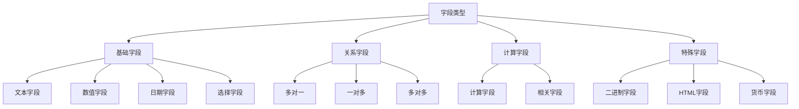

# 字段类型详解

## 🎯 学习目标
- 深入理解Odoo中各种字段类型的特点和用法
- 掌握字段属性的配置和优化
- 学会选择合适的字段类型和属性

## 📋 字段类型分类

### 字段类型层次结构


## 📝 文本字段类型

### Char字段
```python
class CharFields(models.Model):
    _name = 'char.fields'
    
    # 基础Char字段
    name = fields.Char('名称', required=True, size=64)
    
    # 带默认值的Char字段
    code = fields.Char('编码', default='AUTO', help='自动生成的编码')
    
    # 带索引的Char字段
    reference = fields.Char('参考', index=True)
    
    # 带翻译的Char字段
    title = fields.Char('标题', translate=True)
    
    # 只读Char字段
    computed_name = fields.Char('计算名称', compute='_compute_name', store=True)
    
    @api.depends('name', 'code')
    def _compute_name(self):
        for record in self:
            record.computed_name = f"{record.code} - {record.name}"
```

### Text字段
```python
class TextFields(models.Model):
    _name = 'text.fields'
    
    # 基础Text字段
    description = fields.Text('描述')
    
    # 带翻译的Text字段
    notes = fields.Text('备注', translate=True)
    
    # 带帮助文本的Text字段
    instructions = fields.Text('说明', help='详细的操作说明')
    
    # 只读Text字段
    summary = fields.Text('摘要', compute='_compute_summary')
    
    @api.depends('description')
    def _compute_summary(self):
        for record in self:
            if record.description:
                record.summary = record.description[:100] + '...'
            else:
                record.summary = ''
```

### Html字段
```python
class HtmlFields(models.Model):
    _name = 'html.fields'
    
    # 基础HTML字段
    content = fields.Html('内容')
    
    # 带翻译的HTML字段
    description = fields.Html('描述', translate=True)
    
    # 带默认值的HTML字段
    template = fields.Html('模板', default='<p>默认内容</p>')
    
    # 只读HTML字段
    formatted_content = fields.Html('格式化内容', compute='_compute_formatted_content')
    
    @api.depends('content')
    def _compute_formatted_content(self):
        for record in self:
            if record.content:
                record.formatted_content = f"<div class='custom-style'>{record.content}</div>"
            else:
                record.formatted_content = '<p>暂无内容</p>'
```

## 🔢 数值字段类型

### Integer字段
```python
class IntegerFields(models.Model):
    _name = 'integer.fields'
    
    # 基础Integer字段
    quantity = fields.Integer('数量')
    
    # 带默认值的Integer字段
    sequence = fields.Integer('序列', default=10)
    
    # 带约束的Integer字段
    age = fields.Integer('年龄', help='年龄必须在0-150之间')
    
    # 只读Integer字段
    total_count = fields.Integer('总数量', compute='_compute_total_count', store=True)
    
    @api.constrains('age')
    def _check_age(self):
        for record in self:
            if record.age < 0 or record.age > 150:
                raise ValidationError('年龄必须在0-150之间')
    
    @api.depends('quantity')
    def _compute_total_count(self):
        for record in self:
            record.total_count = record.quantity * 2
```

### Float字段
```python
class FloatFields(models.Model):
    _name = 'float.fields'
    
    # 基础Float字段
    amount = fields.Float('金额')
    
    # 带精度的Float字段
    price = fields.Float('价格', digits=(16, 2))
    
    # 带默认值的Float字段
    rate = fields.Float('费率', default=0.0)
    
    # 带约束的Float字段
    percentage = fields.Float('百分比', help='百分比必须在0-100之间')
    
    # 只读Float字段
    total_amount = fields.Float('总金额', compute='_compute_total_amount', store=True)
    
    @api.constrains('percentage')
    def _check_percentage(self):
        for record in self:
            if record.percentage < 0 or record.percentage > 100:
                raise ValidationError('百分比必须在0-100之间')
    
    @api.depends('amount', 'rate')
    def _compute_total_amount(self):
        for record in self:
            record.total_amount = record.amount * (1 + record.rate)
```

### Monetary字段
```python
class MonetaryFields(models.Model):
    _name = 'monetary.fields'
    
    # 基础Monetary字段
    amount = fields.Monetary('金额', currency_field='currency_id')
    
    # 带默认货币的Monetary字段
    price = fields.Monetary('价格', currency_field='currency_id', default=0.0)
    
    # 货币字段
    currency_id = fields.Many2one('res.currency', string='货币', default=lambda self: self.env.company.currency_id)
    
    # 只读Monetary字段
    total_amount = fields.Monetary('总金额', currency_field='currency_id', compute='_compute_total_amount')
    
    @api.depends('amount')
    def _compute_total_amount(self):
        for record in self:
            record.total_amount = record.amount * 1.1  # 加10%
```

## 📅 日期字段类型

### Date字段
```python
class DateFields(models.Model):
    _name = 'date.fields'
    
    # 基础Date字段
    date = fields.Date('日期')
    
    # 带默认值的Date字段
    start_date = fields.Date('开始日期', default=fields.Date.today)
    
    # 带约束的Date字段
    end_date = fields.Date('结束日期')
    
    # 只读Date字段
    days_diff = fields.Integer('天数差', compute='_compute_days_diff')
    
    @api.constrains('start_date', 'end_date')
    def _check_dates(self):
        for record in self:
            if record.start_date and record.end_date and record.start_date > record.end_date:
                raise ValidationError('开始日期不能晚于结束日期')
    
    @api.depends('start_date', 'end_date')
    def _compute_days_diff(self):
        for record in self:
            if record.start_date and record.end_date:
                record.days_diff = (record.end_date - record.start_date).days
            else:
                record.days_diff = 0
```

### Datetime字段
```python
class DatetimeFields(models.Model):
    _name = 'datetime.fields'
    
    # 基础Datetime字段
    datetime = fields.Datetime('日期时间')
    
    # 带默认值的Datetime字段
    create_time = fields.Datetime('创建时间', default=fields.Datetime.now)
    
    # 只读Datetime字段
    time_diff = fields.Float('时间差(小时)', compute='_compute_time_diff')
    
    @api.depends('create_time', 'datetime')
    def _compute_time_diff(self):
        for record in self:
            if record.create_time and record.datetime:
                diff = record.datetime - record.create_time
                record.time_diff = diff.total_seconds() / 3600
            else:
                record.time_diff = 0
```

## ✅ 布尔字段类型

### Boolean字段
```python
class BooleanFields(models.Model):
    _name = 'boolean.fields'
    
    # 基础Boolean字段
    active = fields.Boolean('激活', default=True)
    
    # 带默认值的Boolean字段
    is_public = fields.Boolean('公开', default=False)
    
    # 只读Boolean字段
    is_valid = fields.Boolean('有效', compute='_compute_is_valid')
    
    # 相关字段
    name = fields.Char('名称')
    amount = fields.Float('金额')
    
    @api.depends('name', 'amount')
    def _compute_is_valid(self):
        for record in self:
            record.is_valid = bool(record.name and record.amount > 0)
```

## 🎯 选择字段类型

### Selection字段
```python
class SelectionFields(models.Model):
    _name = 'selection.fields'
    
    # 基础Selection字段
    state = fields.Selection([
        ('draft', '草稿'),
        ('confirmed', '已确认'),
        ('done', '完成'),
        ('cancelled', '已取消'),
    ], string='状态', default='draft')
    
    # 动态Selection字段
    priority = fields.Selection('_get_priority_selection', string='优先级')
    
    # 带默认值的Selection字段
    type = fields.Selection([
        ('type1', '类型1'),
        ('type2', '类型2'),
    ], string='类型', default='type1')
    
    # 只读Selection字段
    computed_state = fields.Selection([
        ('active', '活跃'),
        ('inactive', '非活跃'),
    ], string='计算状态', compute='_compute_state')
    
    @api.model
    def _get_priority_selection(self):
        return [
            ('low', '低'),
            ('medium', '中'),
            ('high', '高'),
        ]
    
    @api.depends('state')
    def _compute_state(self):
        for record in self:
            if record.state in ['draft', 'confirmed']:
                record.computed_state = 'active'
            else:
                record.computed_state = 'inactive'
```

## 🔗 关系字段类型

### Many2one字段
```python
class Many2oneFields(models.Model):
    _name = 'many2one.fields'
    
    # 基础Many2one字段
    partner_id = fields.Many2one('res.partner', string='客户')
    
    # 带默认值的Many2one字段
    company_id = fields.Many2one('res.company', string='公司', default=lambda self: self.env.company)
    
    # 带约束的Many2one字段
    user_id = fields.Many2one('res.users', string='用户', required=True)
    
    # 带域过滤的Many2one字段
    category_id = fields.Many2one('res.partner.category', string='类别', domain=[('active', '=', True)])
    
    # 只读Many2one字段
    computed_partner = fields.Many2one('res.partner', string='计算客户', compute='_compute_partner')
    
    @api.depends('user_id')
    def _compute_partner(self):
        for record in self:
            if record.user_id and record.user_id.partner_id:
                record.computed_partner = record.user_id.partner_id
            else:
                record.computed_partner = False
```

### One2many字段
```python
class One2manyFields(models.Model):
    _name = 'one2many.fields'
    
    # 基础One2many字段
    line_ids = fields.One2many('one2many.fields.line', 'parent_id', string='明细行')
    
    # 带默认值的One2many字段
    tag_ids = fields.One2many('one2many.fields.tag', 'parent_id', string='标签')
    
    # 只读One2many字段
    computed_lines = fields.One2many('one2many.fields.line', 'parent_id', string='计算明细', compute='_compute_lines')
    
    @api.depends('line_ids')
    def _compute_lines(self):
        for record in self:
            # 过滤出金额大于0的明细行
            record.computed_lines = record.line_ids.filtered(lambda l: l.amount > 0)

class One2manyFieldsLine(models.Model):
    _name = 'one2many.fields.line'
    
    name = fields.Char('名称')
    amount = fields.Float('金额')
    parent_id = fields.Many2one('one2many.fields', string='父记录', required=True, ondelete='cascade')

class One2manyFieldsTag(models.Model):
    _name = 'one2many.fields.tag'
    
    name = fields.Char('名称')
    color = fields.Integer('颜色')
    parent_id = fields.Many2one('one2many.fields', string='父记录', required=True, ondelete='cascade')
```

### Many2many字段
```python
class Many2manyFields(models.Model):
    _name = 'many2many.fields'
    
    # 基础Many2many字段
    tag_ids = fields.Many2many('many2many.fields.tag', string='标签')
    
    # 带默认值的Many2many字段
    category_ids = fields.Many2many('many2many.fields.category', string='类别')
    
    # 带域过滤的Many2many字段
    user_ids = fields.Many2many('res.users', string='用户', domain=[('active', '=', True)])
    
    # 只读Many2many字段
    computed_tags = fields.Many2many('many2many.fields.tag', string='计算标签', compute='_compute_tags')
    
    @api.depends('tag_ids')
    def _compute_tags(self):
        for record in self:
            # 只显示激活的标签
            record.computed_tags = record.tag_ids.filtered(lambda t: t.active)

class Many2manyFieldsTag(models.Model):
    _name = 'many2many.fields.tag'
    
    name = fields.Char('名称')
    active = fields.Boolean('激活', default=True)
    model_ids = fields.Many2many('many2many.fields', string='模型')

class Many2manyFieldsCategory(models.Model):
    _name = 'many2many.fields.category'
    
    name = fields.Char('名称')
    description = fields.Text('描述')
    model_ids = fields.Many2many('many2many.fields', string='模型')
```

## 📁 特殊字段类型

### Binary字段
```python
class BinaryFields(models.Model):
    _name = 'binary.fields'
    
    # 基础Binary字段
    attachment = fields.Binary('附件')
    
    # 带文件名的Binary字段
    document = fields.Binary('文档', attachment=True)
    
    # 只读Binary字段
    computed_file = fields.Binary('计算文件', compute='_compute_file')
    
    @api.depends('attachment')
    def _compute_file(self):
        for record in self:
            if record.attachment:
                # 处理文件内容
                record.computed_file = record.attachment
            else:
                record.computed_file = False
```

### Reference字段
```python
class ReferenceFields(models.Model):
    _name = 'reference.fields'
    
    # 基础Reference字段
    ref_model = fields.Reference([
        ('res.partner', '客户'),
        ('res.users', '用户'),
        ('product.product', '产品'),
    ], string='参考模型')
    
    # 动态Reference字段
    dynamic_ref = fields.Reference('_get_reference_models', string='动态参考')
    
    @api.model
    def _get_reference_models(self):
        return [
            ('res.partner', '客户'),
            ('res.users', '用户'),
            ('product.product', '产品'),
        ]
```

## ⚙️ 字段属性详解

### 通用属性
| 属性 | 说明 | 示例 |
|------|------|------|
| string | 字段标签 | '客户名称' |
| help | 帮助文本 | '请输入客户名称' |
| required | 是否必填 | True |
| readonly | 是否只读 | True |
| invisible | 是否隐藏 | True |
| default | 默认值 | '默认值' |
| index | 是否建索引 | True |
| store | 是否存储 | True |
| copy | 是否可复制 | True |
| translate | 是否可翻译 | True |

### 关系字段属性
| 属性 | 说明 | 示例 |
|------|------|------|
| domain | 域过滤 | [('active', '=', True)] |
| context | 上下文 | {'default_state': 'draft'} |
| ondelete | 删除行为 | 'cascade' |
| comodel_name | 关联模型 | 'res.partner' |
| relation | 关联表名 | 'model_rel' |
| column1 | 关联字段1 | 'field1_id' |
| column2 | 关联字段2 | 'field2_id' |

### 计算字段属性
| 属性 | 说明 | 示例 |
|------|------|------|
| compute | 计算方法 | '_compute_total' |
| inverse | 反向方法 | '_inverse_total' |
| search | 搜索方法 | '_search_total' |
| depends | 依赖字段 | ['field1', 'field2'] |
| store | 是否存储 | True |
| precompute | 预计算 | True |

## 🔗 相关链接

### 下一步学习
- [[关系映射机制]] - 深入理解关系字段
- [[计算字段机制]] - 掌握计算字段
- [[字段验证机制]] - 学习字段验证

### 实践建议
- 多练习不同字段类型
- 熟悉字段属性配置
- 掌握字段优化技巧

## 📝 思考题

### 基础理解
1. 各种字段类型的特点是什么？
2. 如何选择合适的字段类型？
3. 字段属性的作用是什么？

### 深入思考
1. 如何优化字段性能？
2. 计算字段的最佳实践是什么？
3. 如何设计高效的字段关系？

---

**学习进度**: ✅ 已完成  
**下一步**: [[关系映射机制]]

