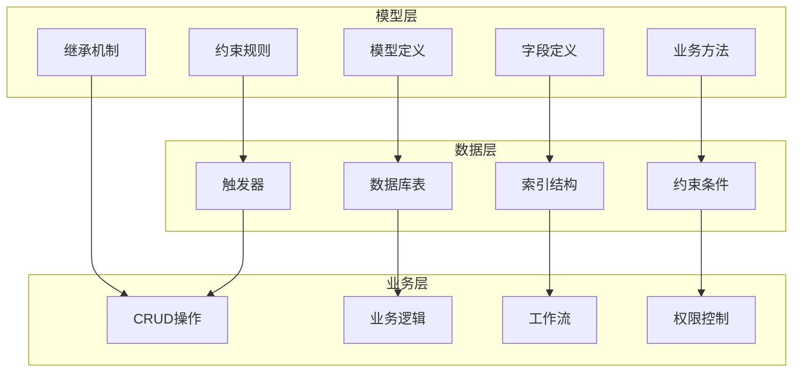
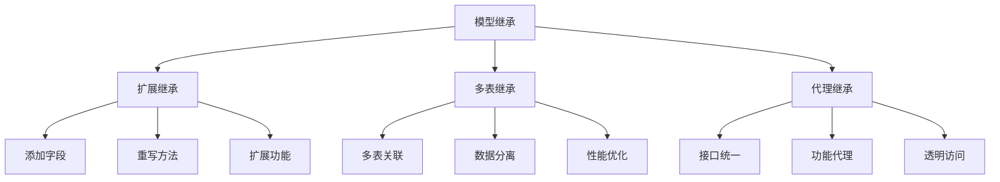

# 模型(Model)详解

## 模型概述

模型是Odoo的核心概念，定义了数据结构、业务规则和操作方法。每个模型对应数据库中的一张表，封装了数据的完整生命周期。

### 模型架构图


## 模型定义

### 基础模型定义
```python
from odoo import models, fields, api

class ResPartner(models.Model):
    _name = 'res.partner'           # 模型名称
    _description = 'Partner'        # 模型描述
    _table = 'res_partner'          # 数据库表名
    _order = 'name'                 # 默认排序
    _rec_name = 'name'              # 记录显示名称
    
    # 字段定义
    name = fields.Char('Name', required=True)
    email = fields.Char('Email')
    phone = fields.Char('Phone')
    
    # 业务方法
    @api.model
    def create(self, vals):
        return super().create(vals)
```

### 模型属性
| 属性 | 描述 | 示例 |
|------|------|------|
| **_name** | 模型唯一标识 | `'res.partner'` |
| **_description** | 模型描述 | `'Partner'` |
| **_table** | 数据库表名 | `'res_partner'` |
| **_order** | 默认排序 | `'name, create_date desc'` |
| **_rec_name** | 记录显示名称 | `'name'` |
| **_inherit** | 继承的模型 | `'res.partner'` |
| **_inherits** | 多表继承 | `{'res.partner': 'partner_id'}` |

## 字段类型详解

### 基础字段类型
```python
class MyModel(models.Model):
    _name = 'my.model'
    
    # 文本字段
    name = fields.Char('Name', size=100, required=True)
    description = fields.Text('Description')
    
    # 数值字段
    quantity = fields.Integer('Quantity', default=0)
    price = fields.Float('Price', digits=(16, 2))
    rate = fields.Monetary('Rate', currency_field='currency_id')
    
    # 日期时间字段
    date = fields.Date('Date', default=fields.Date.today)
    datetime = fields.Datetime('DateTime', default=fields.Datetime.now)
    
    # 布尔字段
    active = fields.Boolean('Active', default=True)
    
    # 选择字段
    state = fields.Selection([
        ('draft', 'Draft'),
        ('confirmed', 'Confirmed'),
        ('done', 'Done')
    ], 'State', default='draft')
    
    # 二进制字段
    image = fields.Binary('Image')
    attachment = fields.Binary('Attachment')
```

### 关系字段类型
```python
class MyModel(models.Model):
    _name = 'my.model'
    
    # Many2one 多对一
    partner_id = fields.Many2one('res.partner', 'Partner', required=True)
    
    # One2many 一对多
    line_ids = fields.One2many('my.model.line', 'model_id', 'Lines')
    
    # Many2many 多对多
    tag_ids = fields.Many2many('my.tag', 'my_model_tag_rel', 
                              'model_id', 'tag_id', 'Tags')
    
    # 计算字段
    total_amount = fields.Float('Total Amount', compute='_compute_total')
    
    @api.depends('line_ids.amount')
    def _compute_total(self):
        for record in self:
            record.total_amount = sum(record.line_ids.mapped('amount'))
```

### 字段属性
| 属性 | 描述 | 示例 |
|------|------|------|
| **string** | 字段标签 | `'Name'` |
| **required** | 是否必填 | `True` |
| **readonly** | 是否只读 | `True` |
| **default** | 默认值 | `fields.Date.today` |
| **help** | 帮助文本 | `'Enter the name'` |
| **index** | 是否建索引 | `True` |
| **store** | 是否存储 | `False` (计算字段) |
| **compute** | 计算方法 | `'_compute_total'` |
| **inverse** | 反向方法 | `'_inverse_total'` |

## 业务方法

### CRUD操作
```python
class MyModel(models.Model):
    _name = 'my.model'
    
    @api.model
    def create(self, vals):
        # 创建前处理
        if 'name' not in vals:
            vals['name'] = self._generate_name()
        
        # 调用父类方法
        result = super().create(vals)
        
        # 创建后处理
        result._post_create()
        
        return result
    
    def write(self, vals):
        # 更新前处理
        self._pre_write(vals)
        
        # 调用父类方法
        result = super().write(vals)
        
        # 更新后处理
        self._post_write()
        
        return result
    
    def unlink(self):
        # 删除前检查
        if not self._can_unlink():
            raise UserError('Cannot delete this record')
        
        # 调用父类方法
        return super().unlink()
```

### 业务逻辑方法
```python
class MyModel(models.Model):
    _name = 'my.model'
    
    def action_confirm(self):
        """确认操作"""
        for record in self:
            if record.state != 'draft':
                continue
            
            # 业务逻辑
            record._validate_data()
            record._create_related_records()
            
            # 更新状态
            record.write({'state': 'confirmed'})
    
    def action_cancel(self):
        """取消操作"""
        for record in self:
            if record.state in ['done', 'cancelled']:
                continue
            
            # 清理相关数据
            record._cleanup_related_data()
            
            # 更新状态
            record.write({'state': 'cancelled'})
    
    def _validate_data(self):
        """数据验证"""
        if not self.name:
            raise ValidationError('Name is required')
    
    def _create_related_records(self):
        """创建相关记录"""
        # 创建相关记录的逻辑
        pass
```

## 约束和验证

### 约束类型
```python
class MyModel(models.Model):
    _name = 'my.model'
    
    name = fields.Char('Name', required=True)
    email = fields.Char('Email')
    quantity = fields.Integer('Quantity')
    price = fields.Float('Price')
    
    @api.constrains('email')
    def _check_email(self):
        """邮箱格式验证"""
        for record in self:
            if record.email and '@' not in record.email:
                raise ValidationError('Invalid email format')
    
    @api.constrains('quantity', 'price')
    def _check_quantity_price(self):
        """数量和价格验证"""
        for record in self:
            if record.quantity < 0:
                raise ValidationError('Quantity cannot be negative')
            if record.price < 0:
                raise ValidationError('Price cannot be negative')
    
    _sql_constraints = [
        ('name_uniq', 'unique(name)', 'Name must be unique!'),
        ('quantity_positive', 'check(quantity >= 0)', 'Quantity must be positive!'),
    ]
```

### 验证机制
| 验证类型 | 实现方式 | 触发时机 |
|----------|----------|----------|
| **字段验证** | 字段属性 | 字段赋值时 |
| **模型验证** | @api.constrains | 记录保存时 |
| **SQL约束** | _sql_constraints | 数据库层面 |
| **业务验证** | 自定义方法 | 业务操作时 |

## 继承机制

### 模型继承
```python
# 基础模型
class BaseModel(models.Model):
    _name = 'base.model'
    
    name = fields.Char('Name')
    
    def base_method(self):
        return 'base'

# 继承模型
class InheritedModel(models.Model):
    _inherit = 'base.model'
    
    # 添加新字段
    description = fields.Text('Description')
    
    # 重写方法
    def base_method(self):
        result = super().base_method()
        return result + ' inherited'
    
    # 添加新方法
    def new_method(self):
        return 'new'
```

### 继承类型


## 计算字段和存储

### 计算字段
```python
class MyModel(models.Model):
    _name = 'my.model'
    
    line_ids = fields.One2many('my.model.line', 'model_id', 'Lines')
    
    # 计算字段
    total_amount = fields.Float('Total Amount', compute='_compute_total', store=True)
    line_count = fields.Integer('Line Count', compute='_compute_line_count')
    
    @api.depends('line_ids.amount')
    def _compute_total(self):
        for record in self:
            record.total_amount = sum(record.line_ids.mapped('amount'))
    
    @api.depends('line_ids')
    def _compute_line_count(self):
        for record in self:
            record.line_count = len(record.line_ids)
    
    # 反向计算
    @api.depends('total_amount')
    def _inverse_total(self):
        for record in self:
            # 反向计算逻辑
            pass
```

### 存储策略
| 存储类型 | 特点 | 适用场景 |
|----------|------|----------|
| **存储计算字段** | 存储到数据库 | 频繁查询、复杂计算 |
| **非存储计算字段** | 实时计算 | 简单计算、不常查询 |
| **相关字段** | 关联查询 | 关联数据展示 |

## 模型元数据

### 元数据管理
```python
class MyModel(models.Model):
    _name = 'my.model'
    
    # 模型信息
    _description = 'My Model'
    _table = 'my_model'
    _order = 'name, create_date desc'
    _rec_name = 'name'
    
    # 权限控制
    _check_company_auto = True
    
    # 字段定义
    name = fields.Char('Name')
    company_id = fields.Many2one('res.company', 'Company')
    
    # 权限检查
    def _check_company(self):
        for record in self:
            if not record.company_id:
                continue
            if not self.env.user.company_ids.filtered(
                lambda c: c.id == record.company_id.id
            ):
                raise AccessError('You cannot access this record')
```

## 最佳实践

### 模型设计原则
1. **单一职责**：每个模型专注一个业务领域
2. **命名规范**：使用清晰的命名约定
3. **字段设计**：合理选择字段类型和属性
4. **约束完整**：确保数据完整性
5. **性能优化**：考虑查询性能

### 代码组织
```python
class MyModel(models.Model):
    _name = 'my.model'
    _description = 'My Model'
    
    # 1. 字段定义
    name = fields.Char('Name')
    
    # 2. 约束方法
    @api.constrains('name')
    def _check_name(self):
        pass
    
    # 3. 计算方法
    @api.depends('field1', 'field2')
    def _compute_field(self):
        pass
    
    # 4. 业务方法
    def action_method(self):
        pass
    
    # 5. 私有方法
    def _private_method(self):
        pass
```

## 学习建议

### 理解重点
1. **模型概念**：理解模型与数据库表的关系
2. **字段类型**：掌握各种字段类型的使用
3. **业务方法**：学会编写业务逻辑方法
4. **继承机制**：理解模型继承的原理

### 实践建议
- 从简单模型开始练习
- 理解字段类型的选择原则
- 掌握约束和验证的方法
- 学会使用继承扩展功能

## 相关链接
- [[字段类型与约束]] - 详细字段类型
- [[关系字段设计]] - 关系字段详解
- [[ORM数据访问层]] - ORM系统理解
- [[业务逻辑实现]] - 业务方法实践
