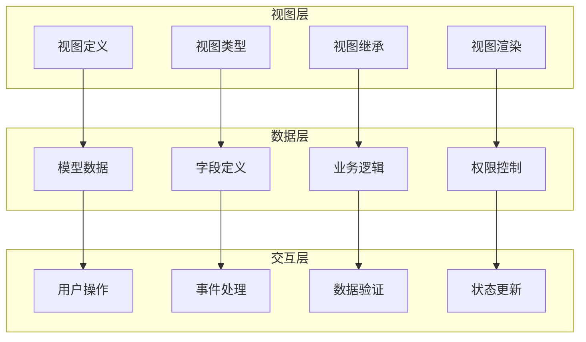
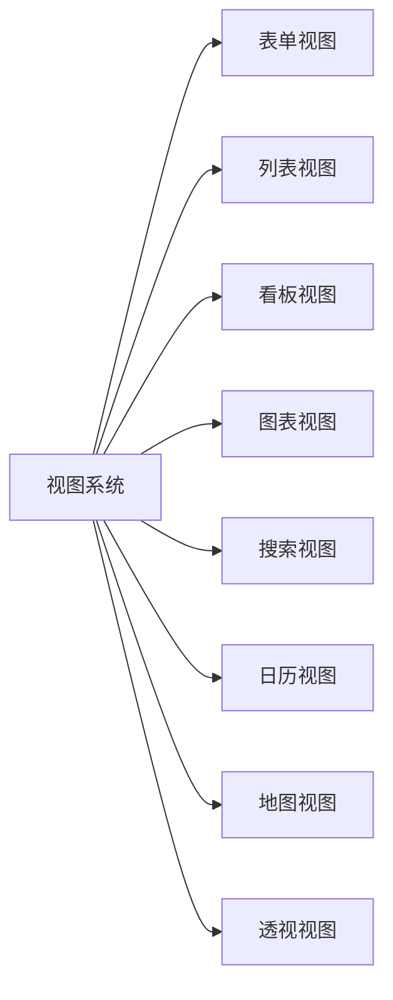
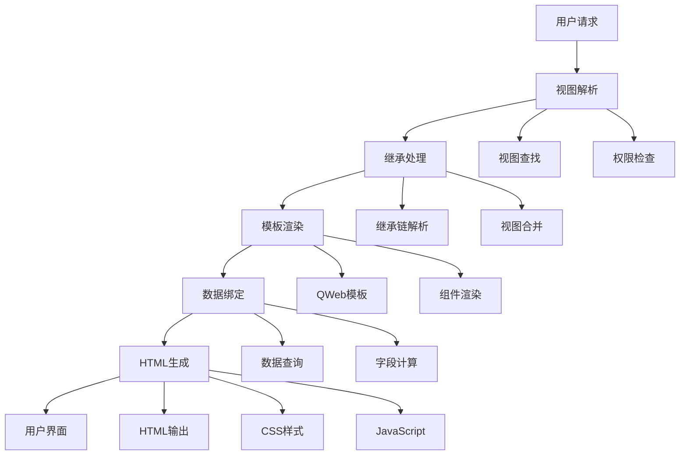

# 视图(View)系统

## 视图系统概述

视图系统是Odoo用户界面的核心，负责数据展示和用户交互。通过XML定义，支持多种视图类型，提供灵活的用户界面。

### 视图系统架构


## 视图类型详解

### 主要视图类型


### 表单视图 (Form View)
```xml
<record id="view_partner_form" model="ir.ui.view">
    <field name="name">res.partner.form</field>
    <field name="model">res.partner</field>
    <field name="arch" type="xml">
        <form>
            <header>
                <button name="action_confirm" type="object" string="Confirm"/>
                <button name="action_cancel" type="object" string="Cancel"/>
                <field name="state" widget="statusbar"/>
            </header>
            <sheet>
                <div class="oe_button_box" name="button_box">
                    <button name="action_view_orders" type="object" class="oe_stat_button">
                        <field name="order_count" widget="statinfo" string="Orders"/>
                    </button>
                </div>
                <group>
                    <group>
                        <field name="name" required="1"/>
                        <field name="email"/>
                        <field name="phone"/>
                    </group>
                    <group>
                        <field name="is_company"/>
                        <field name="category_id" widget="many2many_tags"/>
                        <field name="user_id"/>
                    </group>
                </group>
                <notebook>
                    <page string="Contacts">
                        <field name="child_ids">
                            <tree editable="bottom">
                                <field name="name"/>
                                <field name="email"/>
                                <field name="phone"/>
                            </tree>
                        </field>
                    </page>
                </notebook>
            </sheet>
        </form>
    </field>
</record>
```

### 列表视图 (Tree View)
```xml
<record id="view_partner_tree" model="ir.ui.view">
    <field name="name">res.partner.tree</field>
    <field name="model">res.partner</field>
    <field name="arch" type="xml">
        <tree string="Partners" decoration-info="is_company==True" 
              decoration-muted="active==False" editable="top">
            <field name="name"/>
            <field name="email"/>
            <field name="phone"/>
            <field name="is_company"/>
            <field name="category_id" widget="many2many_tags"/>
            <field name="state" invisible="1"/>
        </tree>
    </field>
</record>
```

### 看板视图 (Kanban View)
```xml
<record id="view_partner_kanban" model="ir.ui.view">
    <field name="name">res.partner.kanban</field>
    <field name="model">res.partner</field>
    <field name="arch" type="xml">
        <kanban default_group_by="category_id">
            <field name="name"/>
            <field name="email"/>
            <field name="phone"/>
            <field name="category_id"/>
            <templates>
                <t t-name="kanban-box">
                    <div class="oe_kanban_card oe_kanban_global_click">
                        <div class="oe_kanban_content">
                            <div class="o_kanban_record_top">
                                <div class="o_kanban_record_headings">
                                    <strong class="o_kanban_record_title">
                                        <field name="name"/>
                                    </strong>
                                </div>
                            </div>
                            <div class="o_kanban_record_body">
                                <field name="email"/>
                                <field name="phone"/>
                            </div>
                        </div>
                    </div>
                </t>
            </templates>
        </kanban>
    </field>
</record>
```

### 图表视图 (Graph View)
```xml
<record id="view_partner_graph" model="ir.ui.view">
    <field name="name">res.partner.graph</field>
    <field name="model">res.partner</field>
    <field name="arch" type="xml">
        <graph string="Partners Analysis" type="bar">
            <field name="category_id" type="row"/>
            <field name="order_count" type="measure"/>
        </graph>
    </field>
</record>
```

### 搜索视图 (Search View)
```xml
<record id="view_partner_search" model="ir.ui.view">
    <field name="name">res.partner.search</field>
    <field name="model">res.partner</field>
    <field name="arch" type="xml">
        <search string="Partners">
            <field name="name" string="Name" filter_domain="[('name','ilike',self)]"/>
            <field name="email" string="Email"/>
            <field name="phone" string="Phone"/>
            <field name="category_id" string="Tags"/>
            
            <filter string="Companies" name="companies" domain="[('is_company','=',True)]"/>
            <filter string="Individuals" name="individuals" domain="[('is_company','=',False)]"/>
            <filter string="Active" name="active" domain="[('active','=',True)]"/>
            <filter string="Inactive" name="inactive" domain="[('active','=',False)]"/>
            
            <separator/>
            <filter string="My Partners" name="my_partners" domain="[('user_id','=',uid)]"/>
            <filter string="Recent" name="recent" domain="[('create_date','>=',(context_today()-datetime.timedelta(days=30)).strftime('%Y-%m-%d'))]"/>
            
            <group expand="0" string="Group By">
                <filter string="Category" name="category" context="{'group_by':'category_id'}"/>
                <filter string="User" name="user" context="{'group_by':'user_id'}"/>
                <filter string="Country" name="country" context="{'group_by':'country_id'}"/>
            </group>
        </search>
    </field>
</record>
```

## 视图组件详解

### 表单组件
| 组件 | 描述 | 示例 |
|------|------|------|
| **header** | 表单头部 | 按钮、状态栏 |
| **sheet** | 表单主体 | 字段布局 |
| **group** | 字段分组 | 左右分栏 |
| **notebook** | 标签页 | 多页面内容 |
| **button_box** | 按钮框 | 统计按钮 |
| **field** | 字段显示 | 数据输入 |

### 列表组件
| 组件 | 描述 | 示例 |
|------|------|------|
| **tree** | 列表容器 | 数据表格 |
| **field** | 列定义 | 数据列 |
| **button** | 行按钮 | 操作按钮 |
| **decoration** | 行样式 | 条件样式 |

### 看板组件
| 组件 | 描述 | 示例 |
|------|------|------|
| **kanban** | 看板容器 | 卡片布局 |
| **templates** | 模板定义 | 卡片模板 |
| **kanban-box** | 卡片模板 | 单个卡片 |
| **field** | 字段显示 | 卡片内容 |

## 视图继承机制

### 继承语法
```xml
<!-- 继承表单视图 -->
<record id="view_partner_form_inherit" model="ir.ui.view">
    <field name="name">res.partner.form.inherit</field>
    <field name="model">res.partner</field>
    <field name="inherit_id" ref="base.view_partner_form"/>
    <field name="arch" type="xml">
        <!-- 在email字段后添加新字段 -->
        <field name="email" position="after">
            <field name="custom_field"/>
        </field>
        
        <!-- 在group中添加新字段 -->
        <group name="group1" position="inside">
            <field name="new_field"/>
        </group>
        
        <!-- 替换现有字段 -->
        <field name="phone" position="replace">
            <field name="mobile"/>
        </field>
        
        <!-- 在notebook中添加新页面 -->
        <notebook position="inside">
            <page string="Custom Info">
                <field name="custom_info"/>
            </page>
        </notebook>
    </field>
</record>
```

### 继承位置
| 位置 | 描述 | 示例 |
|------|------|------|
| **after** | 在元素后添加 | `<field name="email" position="after">` |
| **before** | 在元素前添加 | `<field name="email" position="before">` |
| **inside** | 在元素内添加 | `<group position="inside">` |
| **replace** | 替换元素 | `<field name="phone" position="replace">` |
| **attributes** | 修改属性 | `<field name="name" position="attributes">` |

## 视图渲染机制

### 渲染流程


### 数据绑定
```python
# 视图数据绑定
class ResPartner(models.Model):
    _name = 'res.partner'
    
    # 计算字段用于视图显示
    order_count = fields.Integer('Order Count', compute='_compute_order_count')
    
    @api.depends('sale_order_ids')
    def _compute_order_count(self):
        for partner in self:
            partner.order_count = len(partner.sale_order_ids)
    
    # 方法用于按钮操作
    def action_view_orders(self):
        action = self.env.ref('sale.action_orders').read()[0]
        action['domain'] = [('partner_id', '=', self.id)]
        return action
```

## 视图优化技巧

### 性能优化
```xml
<!-- 延迟加载 -->
<field name="line_ids" widget="one2many" options="{'no_create': True}"/>

<!-- 批量操作 -->
<tree multi_edit="1" editable="top">
    <field name="name"/>
    <field name="price"/>
</tree>

<!-- 条件显示 -->
<field name="advanced_field" invisible="not context.get('show_advanced')"/>

<!-- 分组显示 -->
<group name="basic_info" string="Basic Information">
    <field name="name"/>
    <field name="email"/>
</group>
```

### 用户体验优化
```xml
<!-- 智能默认值 -->
<field name="date" default_focus="1"/>

<!-- 字段验证 -->
<field name="email" placeholder="Enter email address"/>

<!-- 帮助文本 -->
<field name="phone" help="Enter phone number with country code"/>

<!-- 字段分组 -->
<group name="contact_info" string="Contact Information">
    <field name="email"/>
    <field name="phone"/>
    <field name="mobile"/>
</group>
```

## 自定义视图组件

### 自定义字段组件
```javascript
// 自定义字段组件
odoo.define('my_module.custom_field', function (require) {
    'use strict';
    
    var AbstractField = require('web.AbstractField');
    var fieldRegistry = require('web.field_registry');
    
    var CustomField = AbstractField.extend({
        template: 'my_module.CustomField',
        
        init: function () {
            this._super.apply(this, arguments);
        },
        
        _render: function () {
            this.$el.html('Custom Field Content');
        }
    });
    
    fieldRegistry.add('custom_field', CustomField);
    return CustomField;
});
```

### 自定义视图组件
```xml
<!-- 自定义视图模板 -->
<template id="CustomField" name="Custom Field">
    <div class="custom_field">
        <span class="custom_label">Custom Label:</span>
        <span class="custom_value">Custom Value</span>
    </div>
</template>
```

## 视图调试技巧

### 调试方法
```xml
<!-- 调试信息显示 -->
<field name="debug_info" invisible="1" attrs="{'invisible': [('state', '!=', 'debug')]}"/>

<!-- 条件断点 -->
<field name="breakpoint" invisible="1" attrs="{'invisible': [('id', '=', False)]}"/>
```

### 常见问题排查
| 问题 | 原因 | 解决方案 |
|------|------|----------|
| **视图不显示** | 权限问题 | 检查用户权限 |
| **字段不显示** | 字段不存在 | 检查字段定义 |
| **继承失败** | 继承ID错误 | 检查inherit_id |
| **样式问题** | CSS冲突 | 检查样式定义 |

## 最佳实践

### 视图设计原则
1. **用户友好**：界面简洁、操作直观
2. **性能优化**：减少查询、优化渲染
3. **响应式设计**：适配不同设备
4. **一致性**：保持界面风格统一

### 代码组织
```xml
<!-- 视图文件组织 -->
<odoo>
    <!-- 1. 基础视图 -->
    <record id="view_model_form" model="ir.ui.view">
        <!-- 表单视图定义 -->
    </record>
    
    <!-- 2. 继承视图 -->
    <record id="view_model_form_inherit" model="ir.ui.view">
        <!-- 继承视图定义 -->
    </record>
    
    <!-- 3. 动作定义 -->
    <record id="action_model" model="ir.actions.act_window">
        <!-- 动作定义 -->
    </record>
    
    <!-- 4. 菜单定义 -->
    <menuitem id="menu_model" action="action_model" parent="menu_parent"/>
</odoo>
```

## 学习建议

### 理解重点
1. **视图概念**：理解视图与模型的关系
2. **视图类型**：掌握各种视图类型的特点
3. **继承机制**：学会使用继承扩展视图
4. **渲染机制**：理解视图的渲染过程

### 实践建议
- 从简单视图开始练习
- 理解视图继承的原理
- 掌握视图优化的技巧
- 学会调试视图问题

## 相关链接
- [[表单视图设计]] - 表单视图详解
- [[列表视图配置]] - 列表视图配置
- [[看板视图开发]] - 看板视图开发
- [[图表视图制作]] - 图表视图制作
